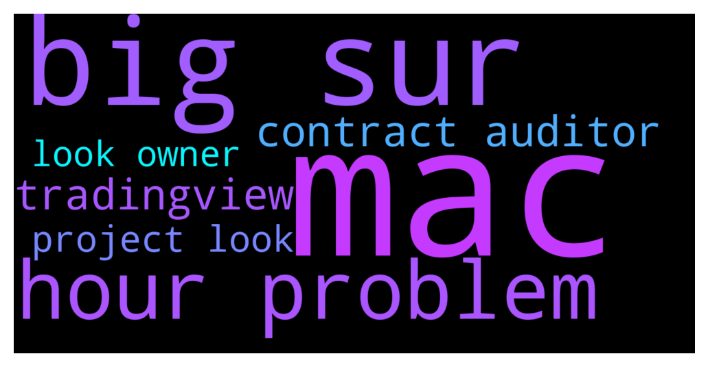

# **@DEXToolsCommunity**
 ## Analysis for **2021-11-30** - **2021-12-02**.

---

## 📊 **Basic Stats**

**n_messages_sent**: 935

---

---

## 🔝 **Top keywords and related messages**

1. **mac**

    @mixedbymallen --- *Does anyone have a proble with Dextools loading tradingview chart on Big Sur for Mac* **--->** [TG Discussion](https://t.me/DEXToolsCommunity/307630)

    @napascual --- *I think you have an older version of the app, could you try to hard refresh the page? Cmd + Shift + R on Mac* **--->** [TG Discussion](https://t.me/DEXToolsCommunity/307640)

    @napascual --- *Big Sur Mac here, no issues with the charts* **--->** [TG Discussion](https://t.me/DEXToolsCommunity/307632)

    @mixedbymallen --- *Anyone using dextools on mac Big Sur and are having problems with tradingview not opening* **--->** [TG Discussion](https://t.me/DEXToolsCommunity/308023)

    @napascual --- *We'll check that, thankfully we have Macs around to test it* **--->** [TG Discussion](https://t.me/DEXToolsCommunity/308040)

2. **big sur**

    @mixedbymallen --- *Does anyone have a proble with Dextools loading tradingview chart on Big Sur for Mac* **--->** [TG Discussion](https://t.me/DEXToolsCommunity/307630)

    @napascual --- *Big Sur Mac here, no issues with the charts* **--->** [TG Discussion](https://t.me/DEXToolsCommunity/307632)

    @FredericDEXT --- *2 big DEXes coming soon* **--->** [TG Discussion](https://t.me/DEXToolsCommunity/307084)

    @mixedbymallen --- *Anyone using dextools on mac Big Sur and are having problems with tradingview not opening* **--->** [TG Discussion](https://t.me/DEXToolsCommunity/308023)

    @DennisDDC --- *Would you do me a big favor and look at the transaction? Just for my peace of mind* **--->** [TG Discussion](https://t.me/DEXToolsCommunity/306049)

3. **hour problem**

    @Lucky Star --- *3dog/eth price on UNI has been stuck for 3-4 hours. Is there some problem with the pricefeed for this pool?* **--->** [TG Discussion](https://t.me/DEXToolsCommunity/307701)

    @mixedbymallen --- *Anyone using dextools on mac Big Sur and are having problems with tradingview not opening* **--->** [TG Discussion](https://t.me/DEXToolsCommunity/308023)

    @kiss98 --- *Can you solve some of the coins on HOT PAIRS , they don't have much trading volume. But every day has been on top of HOT PAIRS , numerous days, they have been HOT PAIRS, is there a problem with the algorithm?* **--->** [TG Discussion](https://t.me/DEXToolsCommunity/307731)

    @Frdm11 --- *Your bot is not allowing me to post 6 hours* **--->** [TG Discussion](https://t.me/DEXToolsCommunity/307851)

    @solidask --- *Hi, After 48 hours from listing the CMC still doesn't appear* **--->** [TG Discussion](https://t.me/DEXToolsCommunity/305824)

    @nate102 --- *How long does this grab contracts for? I’m looking at the BSC telegram bot. E.g, if I make a token, but don’t upload LP untill days later will it still show there? Or does it only fetch created in  past 24 hours etc?* **--->** [TG Discussion](https://t.me/DEXToolsCommunity/306779)

4. **tradingview**

    @mixedbymallen --- *Does anyone have a proble with Dextools loading tradingview chart on Big Sur for Mac* **--->** [TG Discussion](https://t.me/DEXToolsCommunity/307630)

    @DannyTradeMe --- *Hello. After iOS 15 update dextools chart is an empty box now. It may be a tradingview issue. There are several threads on Reddit with complaints that TV app freezes on ios15. I have the same issue too.   @napascual do you know about this?  Dextools chart doesn’t work now on ios15.* **--->** [TG Discussion](https://t.me/DEXToolsCommunity/308039)

    @mixedbymallen --- *Anyone using dextools on mac Big Sur and are having problems with tradingview not opening* **--->** [TG Discussion](https://t.me/DEXToolsCommunity/308023)

    @Crypt0Consul --- *I think you can set custom timeframes with our Tradingview charts, on Tradingview you need a pro account for this I believe* **--->** [TG Discussion](https://t.me/DEXToolsCommunity/306712)

    @yoojei88 --- *How can I get the pairs that are DEXtools ported into my tradingview account? I want to set alerts and have all the tools available, that are not available on DEXtools and other websites that use TradingView.* **--->** [TG Discussion](https://t.me/DEXToolsCommunity/305897)

    @jamesattehwatercooler --- *same problem here, I cleared cookies in my browser today and suddenly the DEXT chart doesn't work anymore (it's fine on tradingview, poocoin, coinhall however)* **--->** [TG Discussion](https://t.me/DEXToolsCommunity/307898)

5. **contract auditor**

    @stanes --- *You have to buy the number of DEXT required:  DEXT PANCAKESWAP PAIR Chart and trade: https://www.dextools.io/app/pancakeswap/pair-explorer/0x4b729d5d871057f3a9c424792729217cde72410d Contract: 0xe91a8d2c584ca93c7405f15c22cdfe53c29896e3  Then you send them to the address the app gives you.* **--->** [TG Discussion](https://t.me/DEXToolsCommunity/306439)

    @stanes --- *Your contract is not verified on bscscan.* **--->** [TG Discussion](https://t.me/DEXToolsCommunity/308192)

    @stanes --- *Which exchange? You can give me the contract address.* **--->** [TG Discussion](https://t.me/DEXToolsCommunity/308370)

    @stanes --- *Give me the contract address, I will ask the devs to update the audit.* **--->** [TG Discussion](https://t.me/DEXToolsCommunity/307369)

    @stanes --- *Not possible. "Contract Details" is an audit of the contract.* **--->** [TG Discussion](https://t.me/DEXToolsCommunity/307323)

    @stanes --- *There is very very likely a tax on this token (not from Dextools, from the token contract).* **--->** [TG Discussion](https://t.me/DEXToolsCommunity/305642)

6. **project look**

    @savasfaraz --- *Hey I want to promote my project by ads* **--->** [TG Discussion](https://t.me/DEXToolsCommunity/306055)

    @stanes --- *I see. I will ask the devs to have a look. Thanks for reporting.* **--->** [TG Discussion](https://t.me/DEXToolsCommunity/306724)

    @JollyBZ --- *Our projects mcap is reading wrong* **--->** [TG Discussion](https://t.me/DEXToolsCommunity/307162)

    @Bokim88 --- *Whenever i or anyone looking at our token goes to dextools and types in flokigold or floki gold it comes up with a dead project* **--->** [TG Discussion](https://t.me/DEXToolsCommunity/306722)

    @JollyBZ --- *our projects logo just appeared on dextools. does that pull from somewhere?* **--->** [TG Discussion](https://t.me/DEXToolsCommunity/307747)

    @irahuljadhav --- *Hello, in the contract details section of my newly launched BSC project, it shows "Looks like owner can set a high fee" message.  Contract has been audited and I showed it to the auditor and he said there's no such function in the contract and asked me to check with your team to see why that might be happening. Please help* **--->** [TG Discussion](https://t.me/DEXToolsCommunity/308033)

7. **look owner**

    @stanes --- *I see. I will ask the devs to have a look. Thanks for reporting.* **--->** [TG Discussion](https://t.me/DEXToolsCommunity/306724)

    @irahuljadhav --- *Hello, in the contract details section of my newly launched BSC project, it shows "Looks like owner can set a high fee" message.  Contract has been audited and I showed it to the auditor and he said there's no such function in the contract and asked me to check with your team to see why that might be happening. Please help* **--->** [TG Discussion](https://t.me/DEXToolsCommunity/308033)

    @irahuljadhav --- *Hello admins, in the contract details section of my newly launched BSC project, it shows "Looks like owner can set a high fee" message.  Contract has been audited and I showed it to the auditor and he said there's no such function in the contract and asked me to get it resolved with DexTools team. Please help* **--->** [TG Discussion](https://t.me/DEXToolsCommunity/307737)

    @stanes --- *Reported, devs will have a look asap. Thanks.* **--->** [TG Discussion](https://t.me/DEXToolsCommunity/307705)

    @napascual --- *Dm the pair, I'll take a look* **--->** [TG Discussion](https://t.me/DEXToolsCommunity/306340)

    @hmk18990 --- *you should ask it to token owners. if token is available in one of the known bridges answer is yes. you can exchange them between networks via bridge.* **--->** [TG Discussion](https://t.me/DEXToolsCommunity/305531)

