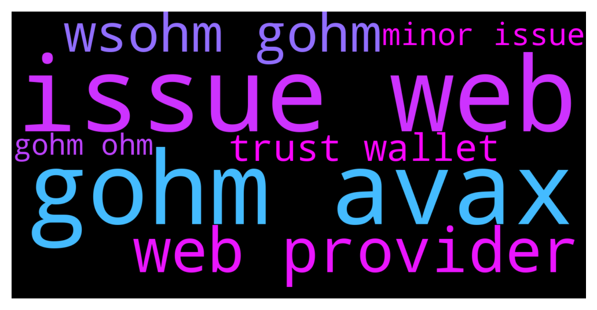

# **@OlympusTG**
 ## Analysis for **2021-12-01** - **2021-12-02**.

---

## 📊 **Basic Stats**

**n_messages_sent**: 2704

---

---

## 🔝 **Top keywords and related messages**

1. **issue web**

    @Ap0l1o --- *The website has some small issues with the web3 provider, at the moment Metamask is a better option.* **--->** [TG Discussion](https://t.me/OlympusTG/101557)

    @AMA_RILDO --- *Guys doesn’t make sense talk about more investments in OHM when almost all the people that staked can’t see their balance anymore. They said about an issue, well nobody can says what is really going to happen and it’s pretty hard to talk even about “trust” until I’ll not able to the what I just invested so far. Just a logic though.* **--->** [TG Discussion](https://t.me/OlympusTG/102535)

    @EasternCircumcision --- *any issue with the site? showing error connecting wallet and not showing staked balance* **--->** [TG Discussion](https://t.me/OlympusTG/100837)

    @glitterboy_r --- *Any issues with the website today? Metrics aren’t showing staking values etc - looks like it is stuck on loading* **--->** [TG Discussion](https://t.me/OlympusTG/101450)

    @dinpriya --- *Any admin is here to solve this. We can’t keep complaining very day that website is keep on telling error or some other issue* **--->** [TG Discussion](https://t.me/OlympusTG/100859)

    @Drew --- *Anyone having issues with the app? None of my balances are showing!* **--->** [TG Discussion](https://t.me/OlympusTG/101725)

2. **gohm avax**

    @CrypticFrank --- *Woah. Ok thats why the rebases are baked into the index. So as the index goes up for the network, my gOHM increases in value regardless of where I keep it? So I could hodl and just keep gOHM in my wallet and I’ll still collect rebases? Or does it need to be staked somewhere to be able to collect the rebases?* **--->** [TG Discussion](https://t.me/OlympusTG/100158)

    @ParamedicOne --- *Yeah but you need to convert your sOHM into gOHM for V2* **--->** [TG Discussion](https://t.me/OlympusTG/100122)

    @Miguel_ecu --- *gOHM is wsOHM but new contract* **--->** [TG Discussion](https://t.me/OlympusTG/100106)

    @LaurensVKA --- *Because when you have your OHM in gohm, you will still get the rebases on top of the extra 15%* **--->** [TG Discussion](https://t.me/OlympusTG/100148)

    @Jaime799 --- *Wen gohm* **--->** [TG Discussion](https://t.me/OlympusTG/98813)

    @fairwinds --- *Leave sOHM as it is for now. If you want to buy gOHM just buy it with AVAX. Let your sOHM continue* **--->** [TG Discussion](https://t.me/OlympusTG/101836)

3. **web provider**

    @Ap0l1o --- *The website has some small issues with the web3 provider, at the moment Metamask is a better option.* **--->** [TG Discussion](https://t.me/OlympusTG/101557)

    @Ap0l1o --- *we have some website issues with our web3 provider, we are working on a fix* **--->** [TG Discussion](https://t.me/OlympusTG/101216)

    @wagmicrypto --- *It looks like our website has a minor issue with a web3 provider so for now, use Metamask as opposed to Trust Wallet. We are hard at work to provide a fix. If you face with any other errors on the website, feel free to report it to our mods.* **--->** [TG Discussion](https://t.me/OlympusTG/100997)

    @FLankarooo --- *I am having issues with the web app since 5 days now relax 🤙  It’s a front end thingy 😅* **--->** [TG Discussion](https://t.me/OlympusTG/100555)

    @FLankarooo --- *Guyz the web app is a mess 🙈* **--->** [TG Discussion](https://t.me/OlympusTG/99896)

    @FLankarooo --- *Web app is working fine since this morning 🥳* **--->** [TG Discussion](https://t.me/OlympusTG/102487)

4. **wsohm gohm**

    @CrypticFrank --- *Woah. Ok thats why the rebases are baked into the index. So as the index goes up for the network, my gOHM increases in value regardless of where I keep it? So I could hodl and just keep gOHM in my wallet and I’ll still collect rebases? Or does it need to be staked somewhere to be able to collect the rebases?* **--->** [TG Discussion](https://t.me/OlympusTG/100158)

    @ParamedicOne --- *Yeah but you need to convert your sOHM into gOHM for V2* **--->** [TG Discussion](https://t.me/OlympusTG/100122)

    @Miguel_ecu --- *gOHM is wsOHM but new contract* **--->** [TG Discussion](https://t.me/OlympusTG/100106)

    @LaurensVKA --- *Because when you have your OHM in gohm, you will still get the rebases on top of the extra 15%* **--->** [TG Discussion](https://t.me/OlympusTG/100148)

    @Jaime799 --- *Wen gohm* **--->** [TG Discussion](https://t.me/OlympusTG/98813)

    @fairwinds --- *Leave sOHM as it is for now. If you want to buy gOHM just buy it with AVAX. Let your sOHM continue* **--->** [TG Discussion](https://t.me/OlympusTG/101836)

5. **trust wallet**

    @CrypticFrank --- *Woah. Ok thats why the rebases are baked into the index. So as the index goes up for the network, my gOHM increases in value regardless of where I keep it? So I could hodl and just keep gOHM in my wallet and I’ll still collect rebases? Or does it need to be staked somewhere to be able to collect the rebases?* **--->** [TG Discussion](https://t.me/OlympusTG/100158)

    @ParamedicOne --- *So will I be able to connect my wallet to the Avalanche networks? I’m trying to figure out where it says that. I read the gOHM but how do I get gOHM if I have sOHM?* **--->** [TG Discussion](https://t.me/OlympusTG/99290)

    @Tim --- *Hi Roy, I disconnected my MM wallet, resigned in, disconnected a couple of times. But my OHM balance and other metrics still show blank. Its super-strange* **--->** [TG Discussion](https://t.me/OlympusTG/98960)

    @AMA_RILDO --- *Guys doesn’t make sense talk about more investments in OHM when almost all the people that staked can’t see their balance anymore. They said about an issue, well nobody can says what is really going to happen and it’s pretty hard to talk even about “trust” until I’ll not able to the what I just invested so far. Just a logic though.* **--->** [TG Discussion](https://t.me/OlympusTG/102535)

    @eleftherioshatzsouk --- *haha thanks harry... will the gOHM still show in my avax wallet* **--->** [TG Discussion](https://t.me/OlympusTG/102427)

    @Kai --- *So if I have sOhm already in MM, I need to unstake, send to hard wallet and stake again from there?  I can’t send sOhm to hard wallet directly?* **--->** [TG Discussion](https://t.me/OlympusTG/99477)

6. **minor issue**

    @Ap0l1o --- *The website has some small issues with the web3 provider, at the moment Metamask is a better option.* **--->** [TG Discussion](https://t.me/OlympusTG/101557)

    @AMA_RILDO --- *Guys doesn’t make sense talk about more investments in OHM when almost all the people that staked can’t see their balance anymore. They said about an issue, well nobody can says what is really going to happen and it’s pretty hard to talk even about “trust” until I’ll not able to the what I just invested so far. Just a logic though.* **--->** [TG Discussion](https://t.me/OlympusTG/102535)

    @EasternCircumcision --- *any issue with the site? showing error connecting wallet and not showing staked balance* **--->** [TG Discussion](https://t.me/OlympusTG/100837)

    @glitterboy_r --- *Any issues with the website today? Metrics aren’t showing staking values etc - looks like it is stuck on loading* **--->** [TG Discussion](https://t.me/OlympusTG/101450)

    @dinpriya --- *Any admin is here to solve this. We can’t keep complaining very day that website is keep on telling error or some other issue* **--->** [TG Discussion](https://t.me/OlympusTG/100859)

    @Drew --- *Anyone having issues with the app? None of my balances are showing!* **--->** [TG Discussion](https://t.me/OlympusTG/101725)

7. **gohm ohm**

    @CrypticFrank --- *Woah. Ok thats why the rebases are baked into the index. So as the index goes up for the network, my gOHM increases in value regardless of where I keep it? So I could hodl and just keep gOHM in my wallet and I’ll still collect rebases? Or does it need to be staked somewhere to be able to collect the rebases?* **--->** [TG Discussion](https://t.me/OlympusTG/100158)

    @ParamedicOne --- *Yeah but you need to convert your sOHM into gOHM for V2* **--->** [TG Discussion](https://t.me/OlympusTG/100122)

    @Miguel_ecu --- *gOHM is wsOHM but new contract* **--->** [TG Discussion](https://t.me/OlympusTG/100106)

    @LaurensVKA --- *Because when you have your OHM in gohm, you will still get the rebases on top of the extra 15%* **--->** [TG Discussion](https://t.me/OlympusTG/100148)

    @Jaime799 --- *Wen gohm* **--->** [TG Discussion](https://t.me/OlympusTG/98813)

    @fairwinds --- *Leave sOHM as it is for now. If you want to buy gOHM just buy it with AVAX. Let your sOHM continue* **--->** [TG Discussion](https://t.me/OlympusTG/101836)

