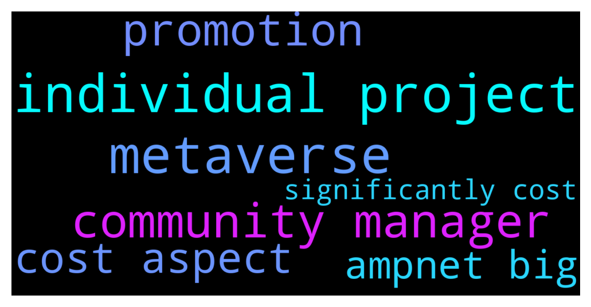

# **@ampnetapxchat**
 ## Analysis for **2021-11-25** - **2021-12-02**.

---

## 📊 **Basic Stats**

**n_messages_sent**: 166

---

---

## 🔝 **Top keywords and related messages**

1. **individual project**

    @mislavjavor --- *Since we’ve been having a lot of questions on the state of the project, here is a small update (after the FAQ):   * The Fundraising platform is still being actively upgraded with new features, but we consider it to be functionally complete. There will be a minor UX/UI overhaul and an addition of a so-called “Instant Invest” flow - where our service bots perform the invest transaction for people paying with credit cards and bank transfers. This will enable the “set and forget” invest modes * New clients, which were briefly mentioned on the screenshot - are being onboarded, with a couple of others coming soon. The investors will be notified when they launch - unlike pure DeFi protocols, for RWAs onboarding new assets usually takes a few months.  * PontoonDAO is currently at the most active stage of R&D. We’re looking to integrate with other tokenization platforms, equity crowdfunding platforms and similar to create “branded” indexes.  * Our team has expanded a bit and we’re activelly working on sales and development. We are re-evaluing the sales model as the last few clients were unsucessful in raising campaigns. We are trying to work with large companies to implement our tech in their stack, this will take quite some time, but it’s the best way to achieve long term profitability * The AMPnet company is fully funded and operational to survive a potential bear market * PontoonDAO might have a new token, this is still not 100% - if it does, AAPX holders will “farm” the new token, by staking AAPX for a period of a couple of months. This will be the only way to get the PontoonDAO token, except for farming it direclty by providing liqudity to PontoonDAO indexes (meaning - PontoonDAO will *not* have it’s own token sale) * We are in negotiations with a CEX for a possible listing, however - it might require a reevaluation of our buyback model for a staking/yield-farming model.  And to address a mentioned point - AMPnet has launched AAPX token in March because we had a deal prepared with Greenpeace and $40M of projects live on the platform. It was just as much a surprise to us that Greenpeace underperformed so spectacularily.   However, all future developements and even potential pivots will use AAPX as the base - so the holders will be rewarded, no matter how AMPnet starts making money.* **--->** [TG Discussion](https://t.me/ampnetapxchat/35378)

    @IncogSen --- *And they have no metaverse projects released* **--->** [TG Discussion](https://t.me/ampnetapxchat/35414)

    @runex_x1 --- *indeed, this was one of the ideas I had when they launched ampnet a long time ago. That the stakers would verify projects and these projects would be promoted with an ampnet-label. I still think this is the way forward as it creates a pool/community of projects. Now, the pontoondao may more or less do this with the baskets. The liquidity-pools/token per basket seems a good way forward and makes entry easier. However, I still think they should promote and create communities around individual projects. There is not so much value in paint, but what you do with the paint.* **--->** [TG Discussion](https://t.me/ampnetapxchat/35439)

    @ivankardum --- *Here's to answering this question, which I see dragging on for a while. We will not promote individual projects - neither now nor later. There are several reasons for this, but here are the most important ones. In order to promote some individual projects you need to have a team of people in the background who will make an due diligence of the project and the company itself (because you don’t want to promote any project), whether the project is good or not, what the company is like, what the promotion will be like... All this together, when taken into account, significantly increases the cost aspect of the company, in this case AMPnet... and there is a big fraud risk factor - what if we as AMPnet promote a project and it turns out to be a scam or not fulfilling what was promised, what will investors in that project say first? - "AMPnet recommended it to us"* **--->** [TG Discussion](https://t.me/ampnetapxchat/35445)

    @ivankardum --- *And as for marketing and promotion in general, it will be, but in a different way. Partnerships with large companies that integrate AMPnet technology will be promoted, and we aim to be those companies / organizations that already have projects and will have them, but also have investors, and our technology allows them to optimize the investment flow. This is something where we as AMPnet see a space for us, as a real whitelabel platform, especially when we add a new service - Pontoon DAO* **--->** [TG Discussion](https://t.me/ampnetapxchat/35447)

    @popovici --- *News , update on project ??!* **--->** [TG Discussion](https://t.me/ampnetapxchat/35067)

2. **metaverse**

    @IncogSen --- *And they have no metaverse projects released* **--->** [TG Discussion](https://t.me/ampnetapxchat/35414)

    @IncogSen --- *Look at metaverse plays* **--->** [TG Discussion](https://t.me/ampnetapxchat/35409)

    @lukasucic --- *they just own the “manufacturer” of metaverses* **--->** [TG Discussion](https://t.me/ampnetapxchat/35416)

3. **community manager**

    @<UNK> --- *Please keep the price discussion in the trading group.  https://t.me/aapxtrading  As for the price action , the team is determined to play the long game , as was always communicated with the community* **--->** [TG Discussion](https://t.me/ampnetapxchat/35165)

    @IncogSen --- *Hire a PROPER community manager* **--->** [TG Discussion](https://t.me/ampnetapxchat/35425)

    @runex_x1 --- *indeed, this was one of the ideas I had when they launched ampnet a long time ago. That the stakers would verify projects and these projects would be promoted with an ampnet-label. I still think this is the way forward as it creates a pool/community of projects. Now, the pontoondao may more or less do this with the baskets. The liquidity-pools/token per basket seems a good way forward and makes entry easier. However, I still think they should promote and create communities around individual projects. There is not so much value in paint, but what you do with the paint.* **--->** [TG Discussion](https://t.me/ampnetapxchat/35439)

    @<UNK> --- *For those that didnt saw me here, I'm Zvone new community manager and I'll replace Vuk* **--->** [TG Discussion](https://t.me/ampnetapxchat/35437)

    @<UNK> --- *With new community manager we'll start with content creation and market exposure, I just started here few weeks ago* **--->** [TG Discussion](https://t.me/ampnetapxchat/35429)

    @IncogSen --- *Hi zvone, I'm looking forward to uou creating a vibrant community* **--->** [TG Discussion](https://t.me/ampnetapxchat/35442)

4. **promotion**

    @ivankardum --- *Here's to answering this question, which I see dragging on for a while. We will not promote individual projects - neither now nor later. There are several reasons for this, but here are the most important ones. In order to promote some individual projects you need to have a team of people in the background who will make an due diligence of the project and the company itself (because you don’t want to promote any project), whether the project is good or not, what the company is like, what the promotion will be like... All this together, when taken into account, significantly increases the cost aspect of the company, in this case AMPnet... and there is a big fraud risk factor - what if we as AMPnet promote a project and it turns out to be a scam or not fulfilling what was promised, what will investors in that project say first? - "AMPnet recommended it to us"* **--->** [TG Discussion](https://t.me/ampnetapxchat/35445)

    @ivankardum --- *And as for marketing and promotion in general, it will be, but in a different way. Partnerships with large companies that integrate AMPnet technology will be promoted, and we aim to be those companies / organizations that already have projects and will have them, but also have investors, and our technology allows them to optimize the investment flow. This is something where we as AMPnet see a space for us, as a real whitelabel platform, especially when we add a new service - Pontoon DAO* **--->** [TG Discussion](https://t.me/ampnetapxchat/35447)

    @ivankardum --- *The other thing that was mentioned is that AMPnet itself uses its own technology and does fundraising for others (ico, crowdfunding…) - the same will not happen. The reason for this is to take on a large *legal* and *regulatory* burden on ourselves, which significantly affects the cost aspect, different margins, existing high competition, etc. But with PontoonDAO we could turn things around by subtly promoting AMPnet’s solution that provides liquidity solution for investors, and also for the owners of the project, but as we are still working on the details of the model itself, so the promotion itself will come when it is finalized* **--->** [TG Discussion](https://t.me/ampnetapxchat/35446)

5. **cost aspect**

    @ivankardum --- *Here's to answering this question, which I see dragging on for a while. We will not promote individual projects - neither now nor later. There are several reasons for this, but here are the most important ones. In order to promote some individual projects you need to have a team of people in the background who will make an due diligence of the project and the company itself (because you don’t want to promote any project), whether the project is good or not, what the company is like, what the promotion will be like... All this together, when taken into account, significantly increases the cost aspect of the company, in this case AMPnet... and there is a big fraud risk factor - what if we as AMPnet promote a project and it turns out to be a scam or not fulfilling what was promised, what will investors in that project say first? - "AMPnet recommended it to us"* **--->** [TG Discussion](https://t.me/ampnetapxchat/35445)

    @ivankardum --- *The other thing that was mentioned is that AMPnet itself uses its own technology and does fundraising for others (ico, crowdfunding…) - the same will not happen. The reason for this is to take on a large *legal* and *regulatory* burden on ourselves, which significantly affects the cost aspect, different margins, existing high competition, etc. But with PontoonDAO we could turn things around by subtly promoting AMPnet’s solution that provides liquidity solution for investors, and also for the owners of the project, but as we are still working on the details of the model itself, so the promotion itself will come when it is finalized* **--->** [TG Discussion](https://t.me/ampnetapxchat/35446)

    @<UNK> --- *Polygon blockchain is just L2 solution which adds scalability to ethereum network, thus reducing the gas fees and lowering cost of transactions  😁* **--->** [TG Discussion](https://t.me/ampnetapxchat/35225)

6. **ampnet big**

    @mislavjavor --- *Since we’ve been having a lot of questions on the state of the project, here is a small update (after the FAQ):   * The Fundraising platform is still being actively upgraded with new features, but we consider it to be functionally complete. There will be a minor UX/UI overhaul and an addition of a so-called “Instant Invest” flow - where our service bots perform the invest transaction for people paying with credit cards and bank transfers. This will enable the “set and forget” invest modes * New clients, which were briefly mentioned on the screenshot - are being onboarded, with a couple of others coming soon. The investors will be notified when they launch - unlike pure DeFi protocols, for RWAs onboarding new assets usually takes a few months.  * PontoonDAO is currently at the most active stage of R&D. We’re looking to integrate with other tokenization platforms, equity crowdfunding platforms and similar to create “branded” indexes.  * Our team has expanded a bit and we’re activelly working on sales and development. We are re-evaluing the sales model as the last few clients were unsucessful in raising campaigns. We are trying to work with large companies to implement our tech in their stack, this will take quite some time, but it’s the best way to achieve long term profitability * The AMPnet company is fully funded and operational to survive a potential bear market * PontoonDAO might have a new token, this is still not 100% - if it does, AAPX holders will “farm” the new token, by staking AAPX for a period of a couple of months. This will be the only way to get the PontoonDAO token, except for farming it direclty by providing liqudity to PontoonDAO indexes (meaning - PontoonDAO will *not* have it’s own token sale) * We are in negotiations with a CEX for a possible listing, however - it might require a reevaluation of our buyback model for a staking/yield-farming model.  And to address a mentioned point - AMPnet has launched AAPX token in March because we had a deal prepared with Greenpeace and $40M of projects live on the platform. It was just as much a surprise to us that Greenpeace underperformed so spectacularily.   However, all future developements and even potential pivots will use AAPX as the base - so the holders will be rewarded, no matter how AMPnet starts making money.* **--->** [TG Discussion](https://t.me/ampnetapxchat/35378)

    @runex_x1 --- *indeed, this was one of the ideas I had when they launched ampnet a long time ago. That the stakers would verify projects and these projects would be promoted with an ampnet-label. I still think this is the way forward as it creates a pool/community of projects. Now, the pontoondao may more or less do this with the baskets. The liquidity-pools/token per basket seems a good way forward and makes entry easier. However, I still think they should promote and create communities around individual projects. There is not so much value in paint, but what you do with the paint.* **--->** [TG Discussion](https://t.me/ampnetapxchat/35439)

    @ivankardum --- *Here's to answering this question, which I see dragging on for a while. We will not promote individual projects - neither now nor later. There are several reasons for this, but here are the most important ones. In order to promote some individual projects you need to have a team of people in the background who will make an due diligence of the project and the company itself (because you don’t want to promote any project), whether the project is good or not, what the company is like, what the promotion will be like... All this together, when taken into account, significantly increases the cost aspect of the company, in this case AMPnet... and there is a big fraud risk factor - what if we as AMPnet promote a project and it turns out to be a scam or not fulfilling what was promised, what will investors in that project say first? - "AMPnet recommended it to us"* **--->** [TG Discussion](https://t.me/ampnetapxchat/35445)

    @ivankardum --- *And as for marketing and promotion in general, it will be, but in a different way. Partnerships with large companies that integrate AMPnet technology will be promoted, and we aim to be those companies / organizations that already have projects and will have them, but also have investors, and our technology allows them to optimize the investment flow. This is something where we as AMPnet see a space for us, as a real whitelabel platform, especially when we add a new service - Pontoon DAO* **--->** [TG Discussion](https://t.me/ampnetapxchat/35447)

    @KonradCapital --- *Yea, I been telling @mislavjavor for a while they need to market there ISO’s and ICO’s and can’t rely on the client to do the marketing. Once AMPNET is bigger they can chill on the marketing and let client do it.* **--->** [TG Discussion](https://t.me/ampnetapxchat/35420)

    @StoryofanEye --- *That's before Mislav got skemmed by Nigerian prince and then bought a big bag nearly at the top with remaining funds 🤣* **--->** [TG Discussion](https://t.me/ampnetapxchat/35081)

7. **significantly cost**

    @ivankardum --- *Here's to answering this question, which I see dragging on for a while. We will not promote individual projects - neither now nor later. There are several reasons for this, but here are the most important ones. In order to promote some individual projects you need to have a team of people in the background who will make an due diligence of the project and the company itself (because you don’t want to promote any project), whether the project is good or not, what the company is like, what the promotion will be like... All this together, when taken into account, significantly increases the cost aspect of the company, in this case AMPnet... and there is a big fraud risk factor - what if we as AMPnet promote a project and it turns out to be a scam or not fulfilling what was promised, what will investors in that project say first? - "AMPnet recommended it to us"* **--->** [TG Discussion](https://t.me/ampnetapxchat/35445)

    @ivankardum --- *The other thing that was mentioned is that AMPnet itself uses its own technology and does fundraising for others (ico, crowdfunding…) - the same will not happen. The reason for this is to take on a large *legal* and *regulatory* burden on ourselves, which significantly affects the cost aspect, different margins, existing high competition, etc. But with PontoonDAO we could turn things around by subtly promoting AMPnet’s solution that provides liquidity solution for investors, and also for the owners of the project, but as we are still working on the details of the model itself, so the promotion itself will come when it is finalized* **--->** [TG Discussion](https://t.me/ampnetapxchat/35446)

    @<UNK> --- *Polygon blockchain is just L2 solution which adds scalability to ethereum network, thus reducing the gas fees and lowering cost of transactions  😁* **--->** [TG Discussion](https://t.me/ampnetapxchat/35225)

