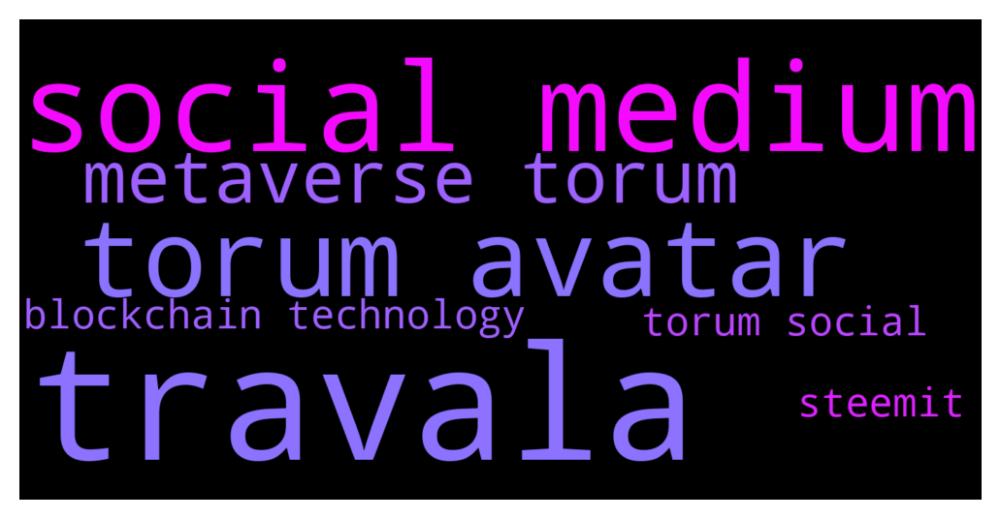

# **@defisearchpublic**
 ## Analysis for **2021-11-30** - **2021-12-02**.

---

## 📊 **Basic Stats**

**n_messages_sent**: 187

---

---

## 🔝 **Top keywords and related messages**

1. **travala**

    @Josh --- *Nope. Is Travala AVA. :)* **--->** [TG Discussion](https://t.me/defisearchpublic/239645)

    @Josh --- *Travala has the best price guaranteed in the market* **--->** [TG Discussion](https://t.me/defisearchpublic/239652)

    @Landon --- *What travala?* **--->** [TG Discussion](https://t.me/defisearchpublic/239646)

2. **social medium**

    @NiEcil --- *Torum is making itself the first crypto-focused social media platform.* **--->** [TG Discussion](https://t.me/defisearchpublic/239584)

    @Inessa --- *web3.0 ecosystem has a lot to do with social media platform as it's core* **--->** [TG Discussion](https://t.me/defisearchpublic/239563)

    @Fabi --- *you mentioned NFT and metaverse so there is a marketplace on the said social media?* **--->** [TG Discussion](https://t.me/defisearchpublic/239593)

    @NiEcil --- *yes mate, that's how social finance works* **--->** [TG Discussion](https://t.me/defisearchpublic/239590)

    @NiEcil --- *The four main features of Torum are the Social Platform itself, DeFi, NFT, and metaverse.* **--->** [TG Discussion](https://t.me/defisearchpublic/239592)

    @NiEcil --- *Torum  take the wheel and build a one-stop Social Metaverse by launching Torum Avatar NFTs, the world’s first social-integrated PFP NFTs.* **--->** [TG Discussion](https://t.me/defisearchpublic/239597)

3. **torum avatar**

    @Inessa --- *may I know who backed up Torum?* **--->** [TG Discussion](https://t.me/defisearchpublic/239600)

    @NiEcil --- *Torum is making itself the first crypto-focused social media platform.* **--->** [TG Discussion](https://t.me/defisearchpublic/239584)

    @Fabi --- *What are the features of torum?* **--->** [TG Discussion](https://t.me/defisearchpublic/239591)

    @NiEcil --- *with Torum users are rewarded with XTM for their time and content.* **--->** [TG Discussion](https://t.me/defisearchpublic/239588)

    @Inessa --- *how, and what is Torum by the way?* **--->** [TG Discussion](https://t.me/defisearchpublic/239567)

    @NiEcil --- *yes they just launched their avatar nft marketplace* **--->** [TG Discussion](https://t.me/defisearchpublic/239594)

4. **metaverse torum**

    @Inessa --- *may I know who backed up Torum?* **--->** [TG Discussion](https://t.me/defisearchpublic/239600)

    @NiEcil --- *Torum is making itself the first crypto-focused social media platform.* **--->** [TG Discussion](https://t.me/defisearchpublic/239584)

    @Fabi --- *What are the features of torum?* **--->** [TG Discussion](https://t.me/defisearchpublic/239591)

    @NiEcil --- *with Torum users are rewarded with XTM for their time and content.* **--->** [TG Discussion](https://t.me/defisearchpublic/239588)

    @Inessa --- *how, and what is Torum by the way?* **--->** [TG Discussion](https://t.me/defisearchpublic/239567)

    @NiEcil --- *then you should involve yourself now with Torum and become an early adapter of socialfi metaverse* **--->** [TG Discussion](https://t.me/defisearchpublic/239566)

5. **blockchain technology**

    @Josh --- *Travala,The world’s leading blockchain-based travel booking platform* **--->** [TG Discussion](https://t.me/defisearchpublic/239648)

    @NiEcil --- *We have already seen several social media platforms built on blockchain technology, such as Synereo, Hive, and Steemit.* **--->** [TG Discussion](https://t.me/defisearchpublic/239575)

    @NiEcil --- *They are focusing more on blockchain technology and cryptocurrency itself, and as such, they are forming a community primarily made up of crypto users. They are implementing many crypto-focused features on their platform.* **--->** [TG Discussion](https://t.me/defisearchpublic/239587)

    @carajulierey01 --- *Also, Legends of Mitra (LoM) is a Strategy Defense game being built on the Wax, Algorand, Binance chain and Ethereum blockchains.* **--->** [TG Discussion](https://t.me/defisearchpublic/239693)

6. **steemit**

    @NiEcil --- *We have already seen several social media platforms built on blockchain technology, such as Synereo, Hive, and Steemit.* **--->** [TG Discussion](https://t.me/defisearchpublic/239575)

    @Inessa --- *I was a user of Steemit before.* **--->** [TG Discussion](https://t.me/defisearchpublic/239576)

7. **torum social**

    @Inessa --- *may I know who backed up Torum?* **--->** [TG Discussion](https://t.me/defisearchpublic/239600)

    @NiEcil --- *Torum is making itself the first crypto-focused social media platform.* **--->** [TG Discussion](https://t.me/defisearchpublic/239584)

    @Fabi --- *What are the features of torum?* **--->** [TG Discussion](https://t.me/defisearchpublic/239591)

    @NiEcil --- *with Torum users are rewarded with XTM for their time and content.* **--->** [TG Discussion](https://t.me/defisearchpublic/239588)

    @Inessa --- *how, and what is Torum by the way?* **--->** [TG Discussion](https://t.me/defisearchpublic/239567)

    @Inessa --- *web3.0 ecosystem has a lot to do with social media platform as it's core* **--->** [TG Discussion](https://t.me/defisearchpublic/239563)

