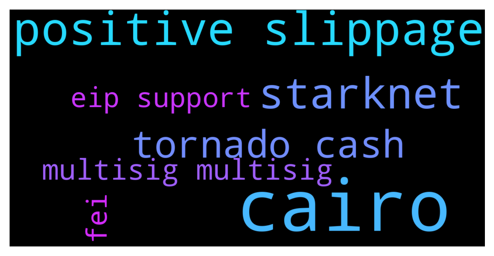

# **@lobsters_chat**
 ## Analysis for **2021-12-01** - **2021-12-02**.

---

## 📊 **Basic Stats**

**n_messages_sent**: 782

---

---

## 🔝 **Top keywords and related messages**

1. **cairo**

    @raoufbenhar --- *What do you guys think of StarkNet? Been playing around with Cairo* **--->** [TG Discussion](https://t.me/lobsters_chat/304221)

    @mdzor --- *currently, I'm following the Cairo tutorial, started 1week ago* **--->** [TG Discussion](https://t.me/lobsters_chat/304282)

    @GuthL --- *Note that StarkNet Cairo is a simplified version of Cairo. It looks like a smart contract language (no more hints)* **--->** [TG Discussion](https://t.me/lobsters_chat/304277)

    @mdzor --- *I can relate, the learning curve for Cairo is quite steep in my opinion. Altho I enjoy the learning journey. I think when they add EVM support it will help with adoption* **--->** [TG Discussion](https://t.me/lobsters_chat/304244)

    @Edward_F --- *The Railgun team looked at Cairo closely when designing the initial zk privacy system. This was back in January I think when the docs were only a few days old.  Looked great for a lot of purposes, in the end not ideal for the privacy systems (SNARKS were more efficient than STARKS for this) but very impressive tech nonetheless - and looks very effective for these scaling systems.* **--->** [TG Discussion](https://t.me/lobsters_chat/304292)

2. **positive slippage**

    @blockminded --- *they keep positive slippage is one way* **--->** [TG Discussion](https://t.me/lobsters_chat/304409)

    @sneg55 --- *but they are taking positive slippage, aren't they? Same as paraswap* **--->** [TG Discussion](https://t.me/lobsters_chat/304416)

    @anisopteran --- *As you say, asking for 0.3% of the tokens of the DAO sounds reasonable. The tweet you're replying to talks about "$3.5M one-time fee" as though they are going to dump them on the market immediately and somehow get that amount without slippage* **--->** [TG Discussion](https://t.me/lobsters_chat/304182)

    @sneg55 --- *well, convo probably would be better and less heated if we'll speak about the dex aggregators market in general instead of finger-pointing at each other:   - 1inch and Paraswap cut out the positive slippage from your trades.   - Matcha/0x and certain products built on 0x API don't. It is possible to enable positive slippage cut with 0x API though.    - Slingshot exists only on Polygon and Arbitrum but also doesn't cut a positive slippage.   Probably all of them also make some cash flow from private market makers.* **--->** [TG Discussion](https://t.me/lobsters_chat/304426)

3. **starknet**

    @raoufbenhar --- *What do you guys think of StarkNet? Been playing around with Cairo* **--->** [TG Discussion](https://t.me/lobsters_chat/304221)

    @khanHamzah --- *How about a dash of “stateless” recursive starknets..* **--->** [TG Discussion](https://t.me/lobsters_chat/304309)

    @amazongirl2 --- *Thanks! On ZigZag you can trade on zkRollups mainnet and Starknet testnet, with Starknet mainnet live in a few days. 😃* **--->** [TG Discussion](https://t.me/lobsters_chat/304338)

    @GuthL --- *Note that StarkNet Cairo is a simplified version of Cairo. It looks like a smart contract language (no more hints)* **--->** [TG Discussion](https://t.me/lobsters_chat/304277)

    @GuthL --- *Not sure why you say that. But you are right that StarkNet is not Zero Knowledge right now. But anyone can build any arbitrary privacy solution on top* **--->** [TG Discussion](https://t.me/lobsters_chat/304296)

    @amazongirl2 --- *The trade completed so fast on Starknet that update to display took longer than the trade itself.* **--->** [TG Discussion](https://t.me/lobsters_chat/304340)

4. **tornado cash**

    @ruyiren --- *HELP - MonoX attacker is moving funds through tornado cash* **--->** [TG Discussion](https://t.me/lobsters_chat/304232)

    @tufuntu --- *If someone sends eth to my binance account through tornado cash then what happened? Will Binance frozen my account?* **--->** [TG Discussion](https://t.me/lobsters_chat/304364)

    @coine_r --- *"why?" would be my question. I couldn't care less whether one dev or 20 were responsible for deploying the contracts that make up tornado.cash (dare I say I'd prefer the former).  And if you're worried about regulation, you'd arguably be better off striving to be like Liquity than any sort of dao hoop-jumping* **--->** [TG Discussion](https://t.me/lobsters_chat/304176)

    @sneg55 --- *I think it could be flattened down to: "someone" on the internet deployed a smart contract with the wallet that has been funded thru the tornado. I was thinking about provable way to deploy a smart contract, without trust required assumptions.* **--->** [TG Discussion](https://t.me/lobsters_chat/304169)

    @Julien --- *Is there an equivalent of tornado cash on fantom?* **--->** [TG Discussion](https://t.me/lobsters_chat/304260)

    @FiveBoroughs --- *Have you seen how tornado cash does their deployments?* **--->** [TG Discussion](https://t.me/lobsters_chat/304155)

5. **multisig multisig**

    @drinkius --- *For the interested - Solana multisig workshop is about to start:  https://www.youtube.com/watch?v=PKRC88PWpGw* **--->** [TG Discussion](https://t.me/lobsters_chat/304251)

    @TLink_9 --- *0xhabitat had their multisig hacked. Anyone care to take a look?  exploiter wallet: https://etherscan.io/address/0x26a76f4fe7a21160274d060acb209f515f35429c  exploit tx transfer: https://etherscan.io/tx/0xac9e668f48cb934de459ee4adc9bf8ec2ce2829ace6ffb8cf761746a6a8628f5* **--->** [TG Discussion](https://t.me/lobsters_chat/304369)

    @Rderaul --- *well... if token deployer is executed from a multisig instead of a (most prob anon?) single eoa you can arguably say that the founding decision making of releasing the token was decentralized (it will come to the point to see how many ppl took part on that, etc.)* **--->** [TG Discussion](https://t.me/lobsters_chat/304265)

    @coine_r --- *That doesn't really follow.  Whether it's a me, myself, and I multisig or a generic address, there is little to no substance in talking about "decentralization" here.* **--->** [TG Discussion](https://t.me/lobsters_chat/304289)

    @ivangbi --- *No armchair legal here. Don’t trouble your mind with their retarded shit. Is a multisig 10/20 of semi-anons in DAO a general partnership? Who knows. But well if you have 0 admin signatures and true governor alpha like compound / aave - likely then is really NOT.* **--->** [TG Discussion](https://t.me/lobsters_chat/304321)

    @blockminded --- *Ok so multisig was not exploited, multisig signatories were - calling it a multisig exploit would imply to me gnosis safe was compromised* **--->** [TG Discussion](https://t.me/lobsters_chat/304404)

6. **fei**

    @ivangbi --- *-> Fei Labs core members and advisors have a 5-year vesting schedule. We’ll need to discuss Rari members/founders/advisors possibly doing the same (this has been discussed somewhat internally by Fei Labs core members, and I’m surprised it wasn’t at all in the proposal)* **--->** [TG Discussion](https://t.me/lobsters_chat/304357)

    @vPEPO --- *that's the Fei guy* **--->** [TG Discussion](https://t.me/lobsters_chat/304358)

7. **eip support**

    @zhongfu --- *eip1559 support for TT now merged into master https://github.com/MetaMask/metamask-extension/pull/12627* **--->** [TG Discussion](https://t.me/lobsters_chat/304225)

    @eduardjt --- *A proof is shared by thousands of tx, DYDX currently packing up to 13k tx in one proof, with (zk) rollups at scale the gas costs should be sustainable. Keep in mind more infra is being optimized for it, EIP 4488 allegedly will reduce costs for rollups by 5x: https://notes.ethereum.org/@vbuterin/data_sharding_roadmap* **--->** [TG Discussion](https://t.me/lobsters_chat/304013)

    @mdzor --- *I can relate, the learning curve for Cairo is quite steep in my opinion. Altho I enjoy the learning journey. I think when they add EVM support it will help with adoption* **--->** [TG Discussion](https://t.me/lobsters_chat/304244)

    @joe3200823 --- *is there any open source DEX chart aggregators like dextools? Our token is live on 7 EVM compatible networks. dextools doesn't support all the networks, I'm not sure if any aggregator does, so we'd like to build upon something that already exists.* **--->** [TG Discussion](https://t.me/lobsters_chat/304211)

    @zhongfu --- *(also tt eip712/signTypedData support coming too -- already in master, probably available in the next fw release)* **--->** [TG Discussion](https://t.me/lobsters_chat/304228)

    @sir_integra_hellsing --- *Doesn't ERC777 support this and they are already compatible with ERC20 iirc?* **--->** [TG Discussion](https://t.me/lobsters_chat/304494)

