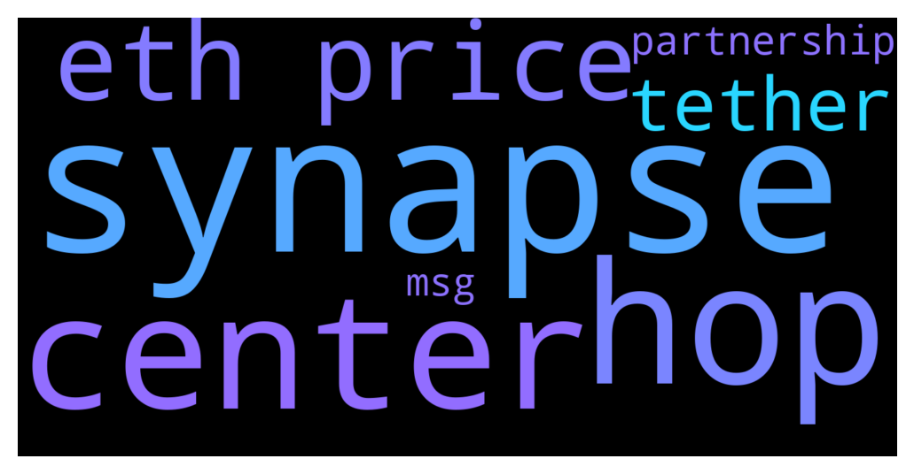

# **@lobsters_chat**
 ## Analysis for **2021-12-02** - **2021-12-03**.

---

## 📊 **Basic Stats**

**n_messages_sent**: 617

---

---

## 🔝 **Top keywords and related messages**

1. **synapse**

    @robzerizi --- *synapse* **--->** [TG Discussion](https://t.me/lobsters_chat/304810)

    @danilserebryakov --- *hop, synapse, binance* **--->** [TG Discussion](https://t.me/lobsters_chat/304806)

    @ChiTimesChi --- *Ser, may I DM you? Someone claiming to be from DeFiYield reached out to me the other day to get some partnership info/workflow.   Next day they updated the telegram handle to mimic one of the Synapse admins. So if anyone contacted you with partnership offer, it might have been the scammer.* **--->** [TG Discussion](https://t.me/lobsters_chat/304837)

2. **hop**

    @batduck73 --- *hop.exchange* **--->** [TG Discussion](https://t.me/lobsters_chat/304807)

    @khoazany3 --- *Hop has LP* **--->** [TG Discussion](https://t.me/lobsters_chat/304816)

    @danilserebryakov --- *hop, synapse, binance* **--->** [TG Discussion](https://t.me/lobsters_chat/304806)

3. **center**

    @Xecor --- *Matching for Coin Center on Gitcoin is insane right now* **--->** [TG Discussion](https://t.me/lobsters_chat/304775)

    @Xecor --- *there is a pot of funds that gets distributed to projects based on the number of donors (quadratic funding). the weighting to coin center is very high. there’s some anti-sybil mechanisms in place for the matching.* **--->** [TG Discussion](https://t.me/lobsters_chat/304778)

4. **eth price**

    @anonymous_007555 --- *"1inch sold its tokens at a discounted price of $1.50 per token in the round, as The Block reported previously. The 1INCH token is currently trading at around $3.60. The firm said it sold the tokens at a discounted price as it wanted to bring visionary investors on board to help scale the Network."* **--->** [TG Discussion](https://t.me/lobsters_chat/304324)

    @julian152 --- *I see something very weird, still stuck can't explain, even I understand how AMM work and x*y=K formula.  As you can see, this token have price 0,05723026$, total sell  tx are 1million + 250k+40k +27k,  but buy tx are only 234k + 71k, how It pump price of token even higher when it was sold?? is 0,05770801$  can anyone give me keyword to research?* **--->** [TG Discussion](https://t.me/lobsters_chat/304819)

    @ruyiren --- *HELP - MonoX attacker just sent 0.15 ETH to the wallet that holds the funds https://etherscan.io/address/0x8f6a86f3ab015f4d03ddb13abb02710e6d7ab31b* **--->** [TG Discussion](https://t.me/lobsters_chat/304223)

    @pierreleroux2 --- *because it can be easily manipulated. but for some purposes, spot price is the only solution. if you're minting lp tokens for a uniswap pool which can be immediately redeemed, for example, it would be foolish to use anything else* **--->** [TG Discussion](https://t.me/lobsters_chat/304089)

    @juju1234534 --- *Does having no ETH in an address lead to the high gas fee „error“ in Metamask when interacting with a contract?* **--->** [TG Discussion](https://t.me/lobsters_chat/304302)

    @Cuter0x --- *Best way to get ETH out of Arbitrum without waiting a week?* **--->** [TG Discussion](https://t.me/lobsters_chat/304805)

5. **tether**

    @TLink_9 --- *Daniele is a part of Tether. Idk what you’d expect* **--->** [TG Discussion](https://t.me/lobsters_chat/304760)

    @Beepidibop --- *Dang, never knew it. Kinda weird that he's making MIM when he's with Tether* **--->** [TG Discussion](https://t.me/lobsters_chat/304764)

6. **partnership**

    @ivangbi --- *No armchair legal here. Don’t trouble your mind with their retarded shit. Is a multisig 10/20 of semi-anons in DAO a general partnership? Who knows. But well if you have 0 admin signatures and true governor alpha like compound / aave - likely then is really NOT.* **--->** [TG Discussion](https://t.me/lobsters_chat/304321)

    @ChiTimesChi --- *Ser, may I DM you? Someone claiming to be from DeFiYield reached out to me the other day to get some partnership info/workflow.   Next day they updated the telegram handle to mimic one of the Synapse admins. So if anyone contacted you with partnership offer, it might have been the scammer.* **--->** [TG Discussion](https://t.me/lobsters_chat/304837)

7. **msg**

    @Felix --- *But i want somehow know msg.value of the original tx* **--->** [TG Discussion](https://t.me/lobsters_chat/304792)

    @Felix --- *Hey guys, when my contract is called as internal call. Somehow possible to access original msg.value?* **--->** [TG Discussion](https://t.me/lobsters_chat/304789)

