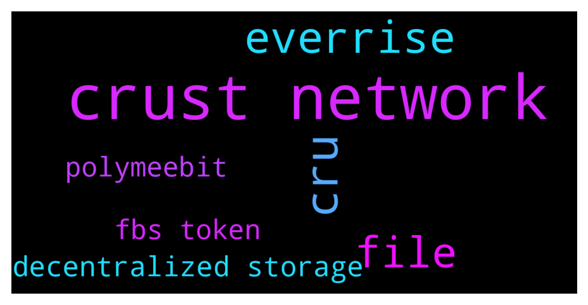

# **@polygonofficial**
 ## Analysis for **2021-11-30** - **2021-12-03**.

---

## 📊 **Basic Stats**

**n_messages_sent**: 3725

---

---

## 🔝 **Top keywords and related messages**

1. **crust network**

    @pascalmorsely --- *QUESTIONS  1. Only PCs are allowed to access the file site  Does crust network have mobile phone users in their plans?  2. What happens to users files stored for free when the 6 months of free storage elapses?  3. What plan does the crust network have in place to combat high network fees and to handle heavy traffics?   4. Will the crust network bring about NFT interoperability?  5. What type of wallet address and wallet does crust network use?  6. What happens to users files when there's a power failure at a particular node?  7. What other type of files can be stored on the crust network?  8. Can blogger or journalist use crust network to publish information?* **--->** [TG Discussion](https://t.me/polygonofficial/906096)

    @IndCryptoGeek --- *📢 Join us for an AMA with @CrustNetwork, an IPFS incentive layer protocol and a Substrate-based blockchain that builds a decentralized storage network for the Web3.0 ecosystem.   We'll be joined by Ludwig Trappe, Global Marketing Lead at Crust  🗓 2 Dec 2021, Thursday 🕖  5:30 PM IST | 12:00 PM UTC 📍 t.me/polygonofficial  Check out their website and social channels here:  Website: https://crust.network/ Twitter: https://twitter.com/CrustNetwork Telegram: https://t.me/CrustNetwork* **--->** [TG Discussion](https://t.me/polygonofficial/905042)

    @ludeclay --- *You only need Crust or Polygon wallet (i.e. Metamask), upload and mint the NFT you created (it’s for free, just get the gas from faucet!). Finally, reply the NFT content and mint identity badge under this tweet. https://twitter.com/CrustNetwork/status/1458700324252762118?s=20* **--->** [TG Discussion](https://t.me/polygonofficial/905941)

    @barodahoang --- *1. Due to the difficulty of using DEX and paying high network fees, how do you plan to bring people that are used to CEX to your platform? Our forbitspace platform currently offers the best price and optimizes fees for users. Forbitspace is a very user-friendly platform, even for new users. Moreover, we collect prices from various DEX exchanges currently presenting on the market, so it's easier for traders to use instead of having to switch to multiple websites* **--->** [TG Discussion](https://t.me/polygonofficial/906432)

    @p0xspiku --- *the network is not down, please submit a support ticket here:  https://support.polygon.technology/support/solutions* **--->** [TG Discussion](https://t.me/polygonofficial/898796)

    @ludeclay --- *For example we just build a Dropbox like storage application where you can login with your wallet and store your files on Crust Network. Feel free to try it: https://files.crustapps.net/ and it is totally free of charge right now for the Polygon community :)* **--->** [TG Discussion](https://t.me/polygonofficial/906026)

2. **cru**

    @ludeclay --- *The CRU token is a utility token and has several use cases within our ecosystem. For example CRU is used for staking to maintain the GPoS consensus of our network, it serves as collateral for nodes in order to provide resource services and it is being used as transaction fee when using Crust Network.* **--->** [TG Discussion](https://t.me/polygonofficial/905971)

    @ludeclay --- *Recently, Crust x Polygon also launched an event with a total reward of $3,000 in CRU and the event is still active right now.* **--->** [TG Discussion](https://t.me/polygonofficial/905928)

    @ludeclay --- *Next to that CRU is being used by users of our storage market to purchase storage services and also serves for the voting process of our on-chain governance mechanism. In future we will create even more utility for the CRU token.* **--->** [TG Discussion](https://t.me/polygonofficial/905972)

    @ludeclay --- *2) if 6 months run out than the storage providers full filled their service based on smart contract. This means nodes could delete the file without getting punished for it. But we built a feature where you can pay in CRU into an account from which automatic renewal costs will be paid with* **--->** [TG Discussion](https://t.me/polygonofficial/906114)

    @ludeclay --- *It is like a subscription and as long there is some CRU in your account the files will extend. You also will be able to prepay for a specif timeframe. Even 100s of years is possible* **--->** [TG Discussion](https://t.me/polygonofficial/906118)

    @ludeclay --- *Thanks to our highly efficient MPoW (Meaningful Proof of Work) mechanism there is no need for expensive and energy consuming GPUs or high-end CPUs. All you need is a reliable internet connection, a CPU with TEE functionality and some free storage. Currently there are around 13k CRU paid to miners (storage providers) on a daily basis.* **--->** [TG Discussion](https://t.me/polygonofficial/906053)

3. **everrise**

    @Andrei --- *hey guys ,check the everrise staking option ..* **--->** [TG Discussion](https://t.me/polygonofficial/903761)

    @TJChillin --- *Hi EverRise just came to Polygon. $RISE ❤️ POLY* **--->** [TG Discussion](https://t.me/polygonofficial/903787)

    @nEverKnown0x --- *who else listening to defi talks with cronos and polygon? hosted on everrise youtube* **--->** [TG Discussion](https://t.me/polygonofficial/907453)

    @nEverKnown0x --- *the everrise staking platform seems innovative* **--->** [TG Discussion](https://t.me/polygonofficial/903897)

    @nEverKnown0x --- *anyone here heard of everrise launching on poly? i heard the migration went well and was thinking of investing* **--->** [TG Discussion](https://t.me/polygonofficial/903746)

    @Hrdrok --- *You could trade some Matic and stake EverRise. It's a solid project, DYOR.* **--->** [TG Discussion](https://t.me/polygonofficial/904343)

4. **file**

    @pascalmorsely --- *QUESTIONS  1. Only PCs are allowed to access the file site  Does crust network have mobile phone users in their plans?  2. What happens to users files stored for free when the 6 months of free storage elapses?  3. What plan does the crust network have in place to combat high network fees and to handle heavy traffics?   4. Will the crust network bring about NFT interoperability?  5. What type of wallet address and wallet does crust network use?  6. What happens to users files when there's a power failure at a particular node?  7. What other type of files can be stored on the crust network?  8. Can blogger or journalist use crust network to publish information?* **--->** [TG Discussion](https://t.me/polygonofficial/906096)

    @ludeclay --- *For example we just build a Dropbox like storage application where you can login with your wallet and store your files on Crust Network. Feel free to try it: https://files.crustapps.net/ and it is totally free of charge right now for the Polygon community :)* **--->** [TG Discussion](https://t.me/polygonofficial/906026)

    @ludeclay --- *Now Polygon users can use Files to store their data FOR FREE! https://files.crustapps.net/* **--->** [TG Discussion](https://t.me/polygonofficial/905922)

    @ludeclay --- *1. For now Crust Files is only supported on desktop but we are working on cross-platform mobil application* **--->** [TG Discussion](https://t.me/polygonofficial/906106)

    @ludeclay --- *The use cases for Crust basically are endless. From storing data, hosting a website or dApp, file sharing, storing and minting NFTs or serving as infrastructure for the metaverse in a totally decentralized manner, Crust can offer all of this and will serve even more use cases in the future.* **--->** [TG Discussion](https://t.me/polygonofficial/906021)

    @ludeclay --- *8) Sure, you could host your blog on or any other website on Crust Network or share files totally secure with our file sharing service* **--->** [TG Discussion](https://t.me/polygonofficial/906123)

5. **decentralized storage**

    @pascalmorsely --- *QUESTIONS  1. Only PCs are allowed to access the file site  Does crust network have mobile phone users in their plans?  2. What happens to users files stored for free when the 6 months of free storage elapses?  3. What plan does the crust network have in place to combat high network fees and to handle heavy traffics?   4. Will the crust network bring about NFT interoperability?  5. What type of wallet address and wallet does crust network use?  6. What happens to users files when there's a power failure at a particular node?  7. What other type of files can be stored on the crust network?  8. Can blogger or journalist use crust network to publish information?* **--->** [TG Discussion](https://t.me/polygonofficial/906096)

    @IndCryptoGeek --- *📢 Join us for an AMA with @CrustNetwork, an IPFS incentive layer protocol and a Substrate-based blockchain that builds a decentralized storage network for the Web3.0 ecosystem.   We'll be joined by Ludwig Trappe, Global Marketing Lead at Crust  🗓 2 Dec 2021, Thursday 🕖  5:30 PM IST | 12:00 PM UTC 📍 t.me/polygonofficial  Check out their website and social channels here:  Website: https://crust.network/ Twitter: https://twitter.com/CrustNetwork Telegram: https://t.me/CrustNetwork* **--->** [TG Discussion](https://t.me/polygonofficial/905042)

    @IndCryptoGeek --- *📢 Join us for an AMA with @cortex_app, A decentralized notebook, web3 publishing tool and wallet in one. The ultimate tool for creating, collaborating and publishing on an open metaverse.   We'll be joined by Leonard Kish (CEO) and Josh Robinson (CTO) and Co-founders at Cortex.  🗓 30 Nov 2021, Tuesday 🕖  7:00 PM IST | 2:30 PM UTC 📍 t.me/polygonofficial  Check out their website and social channels here:  Website: https://www.crtx.app/ Twitter: https://twitter.com/app_cortex Discord: https://discord.gg/jNhy8PU3 Telegram: https://t.me/cortex_app* **--->** [TG Discussion](https://t.me/polygonofficial/901963)

    @barodahoang --- *forbitspace DEXs aggregator utilizes the power of blockchain to bring together trades across various decentralized finance platforms (DeFi) into one space, saving users time and increasing efficiency for cryptocurrency trades. We siphon the very best prices from DEXs, swap services, and liquidity pools into one place so that users can optimize their trades.* **--->** [TG Discussion](https://t.me/polygonofficial/906377)

    @ludeclay --- *For example we just build a Dropbox like storage application where you can login with your wallet and store your files on Crust Network. Feel free to try it: https://files.crustapps.net/ and it is totally free of charge right now for the Polygon community :)* **--->** [TG Discussion](https://t.me/polygonofficial/906026)

    @ludeclay --- *There even is video streaming platform build on Crust Network https://socbay.io that works like a decentralized Youtube.* **--->** [TG Discussion](https://t.me/polygonofficial/906033)

6. **polymeebit**

    @Polymeebitss --- *https://polymeebits.com  PolyMeebits is the first Meebits NFT on the Polygon Smart Chain, one of the fastest, safest, and most developed blockchains in the world!     PolyMeebits are a rare collection of 20000 unique 3D avatars that have 9 differing attributes!   The collection consists of: 5 Dissected, 10 Sandeep Naliwal (founder of polygon), 10 polymeebits (wearing Polygon and  outfits), 18 Visitor, 57 Skeleton, 72 Robot, 256 Elephant, 711 pigs, and 18862 Humans !   Minting a PolyMeebits costs only 75 Matic Coin (matic), where users will receive a random Meebit from the ones available.   The rarity of PolygonMeebits is determined by its attributes, description and type. Some of the 3D avatars are super rare!   PolyMeebits offers users the opportunity to receive a distributed part of the revenue by joining a pool!  5% for users who mint 40 PolyMeebits (up to 75000 Matic split between users) 10% for users who mint 120 BMeebits (up to 150000 Matic split between users)  The PolyMeebits platform works with the Metamask wallet, one of the most developed and easy-to-use wallet extensions!   Good luck and may the force be with you!* **--->** [TG Discussion](https://t.me/polygonofficial/903774)

7. **fbs token**

    @robby678 --- *Yes, we have this very exciting way to burn our token. we call it Social Engagement Burning!  We will burn our KOM token based on our social media engagement.  you can read the full report here https://medium.com/@kommunitas/kom-monthly-report-for-october-2021-40444e867f1e* **--->** [TG Discussion](https://t.me/polygonofficial/900827)

    @minutes11zeit --- *Our Ecosystem was build with the player in the center of everything. The ELVN Token, the Token Farming and the NFT Staking, everything in the Ecosystem will be supporting gamers all of the world. It is still a great investment for everyone else so, as everyone can buy the tickets and everyone can hold Tokens to build up a passive income source. We will also launch our games on iOS and Android with Ads put into them. The earnings from the Ads will go to the NFT holders. This way we want to ensure that everybody will earn for a long long time. You can read more about all this in our whitepaper at https://whitepaper.elevenminutes.io* **--->** [TG Discussion](https://t.me/polygonofficial/897232)

    @UnitsMu --- *Yes, we would like to highlight that we are in now the last 24 hours of the UNITS protocol token presale.   For the first time in #DeFi, your presale owned tokens are auto staked and start generating rewards immediately!  25% ROI+ rewards await the early bonders!  Bond NOW 👇 https://app.units.finance/#/bond* **--->** [TG Discussion](https://t.me/polygonofficial/898174)

    @Grraarrgghh --- *Swap it to XLM, Send it to one of the MATIC supporting exchanges listed in this video's description, trade it back to MATIC (or USDT, USDC or ETH if the exchange supports withdrawls on Polygon for that token as noted) and send it to Polygon directly https://www.youtube.com/watch?v=SuyrPmLRtZg* **--->** [TG Discussion](https://t.me/polygonofficial/898546)

    @Jfzde --- *i bridge my token here: https://wormholebridge.com/* **--->** [TG Discussion](https://t.me/polygonofficial/898444)

    @barodahoang --- *For the most part, forbitspace will expand into the metaverse and accommodate a variety of nonfungible tokens (NFTs). This upgrade will work in tandem with the platform's eventual multi-chain wallet to provide full-fledged entertainment and games to the platform's metaverse.* **--->** [TG Discussion](https://t.me/polygonofficial/906342)

