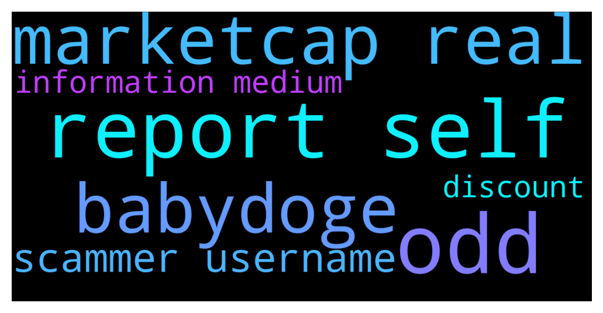

# **@DEXToolsCommunity**
 ## Analysis for **2021-12-04** - **2021-12-06**.

---

## 📊 **Basic Stats**

**n_messages_sent**: 721

---

---

## 🔝 **Top keywords and related messages**

1. **odd**

    @DanTheVizionary --- *But if it’s only for that pair, that’s odd* **--->** [TG Discussion](https://t.me/DEXToolsCommunity/309668)

    @DanTheVizionary --- *That is a little odd* **--->** [TG Discussion](https://t.me/DEXToolsCommunity/309649)

    @xbtwael --- *Sorry to hear that, that’s unfortunate and odd if you had the correct @FredericDEXT* **--->** [TG Discussion](https://t.me/DEXToolsCommunity/309403)

2. **report self**

    @Missionhelios.io (Will Never DM First ) --- *i want buy 1000 DEXT for standard account  no matter buy which one ? bsc or eth?  or each one is for self network?* **--->** [TG Discussion](https://t.me/DEXToolsCommunity/309807)

    @Ford_Probe1 --- *The MarketCap displayed on your page does not match. The amount is completely different, because you should calculate the real MarketCap with the Circulation Supply. Where can we adjust this? In the "Self-Report" section, we have already done that. We have also already filled out all the appropriate forms for this. We would be grateful for some good advice  We have seen other projects that had the problem with the total supply, but on your site their self report original market capitalization is displayed, on our site it was also displayed but it is gone again.* **--->** [TG Discussion](https://t.me/DEXToolsCommunity/309566)

3. **marketcap real**

    @stanes --- *I assure you it doesn't. The guy before gave you almost the same username but with a i capital letter instead of the second l 😬 Really tricky and hard to spot. The one I gave you is the real one, with two l.* **--->** [TG Discussion](https://t.me/DEXToolsCommunity/310068)

    @Ford_Probe1 --- *The MarketCap displayed on your page does not match. The amount is completely different, because you should calculate the real MarketCap with the Circulation Supply. Where can we adjust this? In the "Self-Report" section, we have already done that. We have also already filled out all the appropriate forms for this. We would be grateful for some good advice  We have seen other projects that had the problem with the total supply, but on your site their self report original market capitalization is displayed, on our site it was also displayed but it is gone again.* **--->** [TG Discussion](https://t.me/DEXToolsCommunity/309566)

    @stanes --- *Be careful, someone gave you the username of a scammer then deleted his message. It's not the real one, check the usernames, they are slightly different.* **--->** [TG Discussion](https://t.me/DEXToolsCommunity/309514)

    @guillermorodriguez78 --- *I am the real one* **--->** [TG Discussion](https://t.me/DEXToolsCommunity/309754)

    @stanes --- *You can contact @FredericDEXT but I am not sure there is a real need for that for the moment.* **--->** [TG Discussion](https://t.me/DEXToolsCommunity/310009)

    @prometheus0x --- *$weapon new txn are showing up thanks for fixing! However marketcap is still inaccurate* **--->** [TG Discussion](https://t.me/DEXToolsCommunity/307708)

4. **babydoge**

    @Jame --- *bsc Wbnb/babydoge* **--->** [TG Discussion](https://t.me/DEXToolsCommunity/309659)

    @Jame --- *I think only for babydoge* **--->** [TG Discussion](https://t.me/DEXToolsCommunity/309650)

    @Jame --- *Dextool freezed for babydoge* **--->** [TG Discussion](https://t.me/DEXToolsCommunity/309634)

5. **scammer username**

    @stanes --- *I assure you it doesn't. The guy before gave you almost the same username but with a i capital letter instead of the second l 😬 Really tricky and hard to spot. The one I gave you is the real one, with two l.* **--->** [TG Discussion](https://t.me/DEXToolsCommunity/310068)

    @GarrettGG --- *Also, I am sure a lot of people just DM'd you.  They're all scammers.  DEXT team will never DM first.* **--->** [TG Discussion](https://t.me/DEXToolsCommunity/309271)

    @stanes --- *We don't have any api available for now. For partnerships, please DM @guillermorodriguez78 he is the person-in-charge.  Be aware of scammers, HE WILL NEVER DM YOU FIRST.* **--->** [TG Discussion](https://t.me/DEXToolsCommunity/308282)

    @stanes --- *Please DM @guillermorodriguez78 he is the person-in-charge.  Be aware of scammers, HE WILL NEVER DM YOU FIRST.* **--->** [TG Discussion](https://t.me/DEXToolsCommunity/310053)

    @stanes --- *Be careful of scammers.* **--->** [TG Discussion](https://t.me/DEXToolsCommunity/308330)

    @stanes --- *No it wasn't. i just delete it.  Please always check, double check and triple check the username, and the admin tag.  Scammers usually create an account with really similar username (one letter difference).* **--->** [TG Discussion](https://t.me/DEXToolsCommunity/309419)

6. **information medium**

    @stanes --- *About social Information for your token, please update etherscan.io or bscscan.com or coingecko.com  We pull info from there.* **--->** [TG Discussion](https://t.me/DEXToolsCommunity/309421)

    @stanes --- *This information is confidential.* **--->** [TG Discussion](https://t.me/DEXToolsCommunity/310029)

    @Samuel --- *can't find information* **--->** [TG Discussion](https://t.me/DEXToolsCommunity/310021)

    @Frdm11 --- *Hi! For some reason I can not see the charts. All the other information is there and visible.* **--->** [TG Discussion](https://t.me/DEXToolsCommunity/307827)

    @mdgonzo --- *Hello admin, can you help me to find media kit for advertising of our project on dextools? The email is silent about it. Thank you.* **--->** [TG Discussion](https://t.me/DEXToolsCommunity/308883)

    @PlatasCrypto --- *Could you please send our information to your team to get it updated?* **--->** [TG Discussion](https://t.me/DEXToolsCommunity/308361)

7. **discount**

    @JoeyDieleman --- *The fee for txses are ate if I remember 0.3% on top of the fee of the swap(amm) platform, like uniswap. Standard membership on velox gives a 25% discount.   https://link.medium.com/b1aZn1ECKlb* **--->** [TG Discussion](https://t.me/DEXToolsCommunity/309817)

    @bastardganpunk --- *You get a discount if you are dext standard holder, for premium members it’s free* **--->** [TG Discussion](https://t.me/DEXToolsCommunity/309873)

    @Missionhelios.io (Will Never DM First ) --- *how much is it ?after discount* **--->** [TG Discussion](https://t.me/DEXToolsCommunity/309876)

