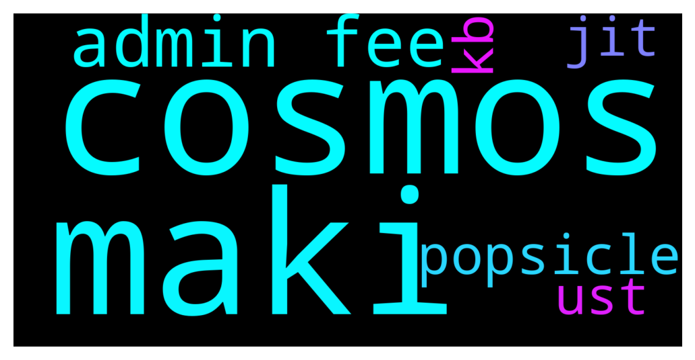

# **@lobsters_chat**
 ## Analysis for **2021-12-05** - **2021-12-06**.

---

## 📊 **Basic Stats**

**n_messages_sent**: 436

---

---

## 🔝 **Top keywords and related messages**

1. **cosmos**

    @apindy --- *Cosmos is rolling interchain security like Q1 22'* **--->** [TG Discussion](https://t.me/lobsters_chat/305436)

    @apindy --- *IS Vitalik casually saying Cosmos/IBC and Interchain security is the future of blockchains?* **--->** [TG Discussion](https://t.me/lobsters_chat/305430)

    @PeterMm --- *Is this what you are referring to correct: " Instead, they all top out at a few hundred transactions per second. We get a multi-rollup future for Ethereum - the Cosmos multi–chain vision, but on top of a base layer providing data availability and shared security."* **--->** [TG Discussion](https://t.me/lobsters_chat/305435)

    @olliten --- *I think he's saying that multichain will be the future. But I'm not getting that he's very bullish on Cosmos per se: "but on top of a base layer providing data availability and shared security", which is what Ethereum can provide.* **--->** [TG Discussion](https://t.me/lobsters_chat/305434)

    @musalbas --- *Cosmos will provide this thanks to Celestia* **--->** [TG Discussion](https://t.me/lobsters_chat/305466)

    @olliten --- *I'm not that familiar with Cosmos, but why would they be able to provide a security layer that's better than Ethereum?* **--->** [TG Discussion](https://t.me/lobsters_chat/305440)

2. **maki**

    @LilMoonLamboX3 --- *maki wants the smoke with joseph lets goooooo* **--->** [TG Discussion](https://t.me/lobsters_chat/305319)

    @kujo888 --- *Maki’s removal has opened up a whole can of worms* **--->** [TG Discussion](https://t.me/lobsters_chat/305044)

    @Ees3oo --- *Maki v tuba* **--->** [TG Discussion](https://t.me/lobsters_chat/305326)

    @crassigyrinus --- *I don't want Maki doing sushi stuff again, he needs to pump my TOKE bag* **--->** [TG Discussion](https://t.me/lobsters_chat/305328)

    @Solarcurve --- *maki's coming out of retirement faster than Kain did looks like* **--->** [TG Discussion](https://t.me/lobsters_chat/305317)

3. **admin fee**

    @FiveBoroughs --- *The non-popsicle LPs received less fees than they should have from posicle LPs rebalancing* **--->** [TG Discussion](https://t.me/lobsters_chat/305449)

    @engineerking --- *Wait was this good for popsicle or bad? Popsicle lost users fees?* **--->** [TG Discussion](https://t.me/lobsters_chat/305448)

    @michwill --- *Basically volatile pools take from profit when claim admin fee* **--->** [TG Discussion](https://t.me/lobsters_chat/305378)

    @FiveBoroughs --- *I don't quite understand, how could Popsicle LPs have  made fees from their own rebalance?* **--->** [TG Discussion](https://t.me/lobsters_chat/305470)

    @thashisin --- *so let's say I want to buy $ETH on FTM chain but I don't want to go through the hassle of setting up of metamask wallet, opening dex, selecting gas fee and then confirming my trade  I know about an exchange which does all these things for me and is custodial. I will just go there any select buy opyion for $ETH and that exchange will do all the above work on my behalf* **--->** [TG Discussion](https://t.me/lobsters_chat/304994)

    @tobaias --- *Seems like a way to get both compromises at the same time. You are now on a centralized platform without your keys + paying fees + "slow" confirmation, etc* **--->** [TG Discussion](https://t.me/lobsters_chat/305005)

4. **popsicle**

    @FiveBoroughs --- *The non-popsicle LPs received less fees than they should have from posicle LPs rebalancing* **--->** [TG Discussion](https://t.me/lobsters_chat/305449)

    @engineerking --- *Wait was this good for popsicle or bad? Popsicle lost users fees?* **--->** [TG Discussion](https://t.me/lobsters_chat/305448)

    @andrecronje --- *popsicle LPs** **--->** [TG Discussion](https://t.me/lobsters_chat/305450)

5. **kb**

    @FiveBoroughs --- *Consider a very small picture: 50kb 50 kb * 640,000 gas/kb * 150 gwei/gas * 4000 Eth/usd = $19200 to deploy  Versus just deploy the Hash on Ethereum and providing the image some other way. Users will still be able to verify the image is the correct one from the hash* **--->** [TG Discussion](https://t.me/lobsters_chat/305431)

6. **jit**

    @vPEPO --- *but they paid $36k to the JIT LP, not $100k* **--->** [TG Discussion](https://t.me/lobsters_chat/305473)

    @vPEPO --- *JIT liquidity is good for any kind of active swap behaviour* **--->** [TG Discussion](https://t.me/lobsters_chat/305476)

    @paikeseloojang --- *jit mev? doing anything on-chain is too dangerous and costly these days* **--->** [TG Discussion](https://t.me/lobsters_chat/305462)

7. **ust**

    @DeadMeatHK --- *As I understand it, UST is not a smart contract risk as much an algo-stable risk.* **--->** [TG Discussion](https://t.me/lobsters_chat/305347)

    @zhongfu --- *yeah but ust has a different set of risks on top of sc risk, that's what the dude's trying to say* **--->** [TG Discussion](https://t.me/lobsters_chat/305349)

    @DeadMeatHK --- *Not too bad only if you're OK with the risk profile of UST.* **--->** [TG Discussion](https://t.me/lobsters_chat/305344)

    @fomodan --- *Combine it with convex and you get for mim-ust for instance already 22%. Not too bad.* **--->** [TG Discussion](https://t.me/lobsters_chat/305340)

    @samkazemian --- *CMC also could do better but yes they perform best on stables prices. The main issue is most decentralized stablecoins (FRAX, FEI, DAI, UST etc) have 2-3 places where their core peg performance lies like DAI's PSM+Curve pools. For FRAX Curve+UniV3 ranges. Coingecko needs to track these esoteric metrics to report actually real peg prices. Just requires dedicated staff to track the unique peg places (like DAI PSM) of the top 10-15 stablecoins. There aren't many of them. It can't be that hard. Coingecko already tracks thousands of tokens. Just track the top 10-15 stablecoins a bit closer.* **--->** [TG Discussion](https://t.me/lobsters_chat/304945)

