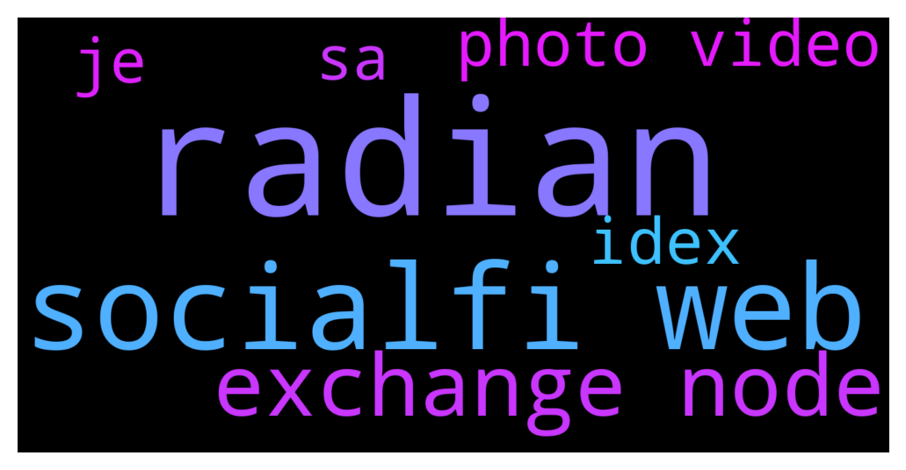

# **@polygonofficial**
 ## Analysis for **2021-12-03** - **2021-12-06**.

---

## 📊 **Basic Stats**

**n_messages_sent**: 4056

---

---

## 🔝 **Top keywords and related messages**

1. **radian**

    @RADIAN_Elvan --- *Speaking of community, we have started:  Website www.radian.community  Email info@radian.community  Telegram  https://t.me/RADIANCommunity  https://t.me/RADIANAnnouncement Medium  https://radiancommunity.medium.com/ Twitter  https://twitter.com/RADIANcommunity Instagram  https://www.instagram.com/radiancommunity/ Discord https://discord.gg/UHuYu3KW* **--->** [TG Discussion](https://t.me/polygonofficial/912914)

    @IndCryptoGeek --- *Hello Polygon community! Please welcome @RADIAN_Elvan from RADIAN for the AMA today 🚀* **--->** [TG Discussion](https://t.me/polygonofficial/912842)

    @IndCryptoGeek --- *For any project users are always having doubts about the safety, so what is your stance on safety, how should a user be safe, and how secure is RADIAN?* **--->** [TG Discussion](https://t.me/polygonofficial/912971)

    @RADIAN_Joanne --- *We see fandom, monaco, sosol, soldate and tinder are our competitors at the moment. However, RADIAN is the only platform that supports multi-chain and fully embracing web3.0.* **--->** [TG Discussion](https://t.me/polygonofficial/912874)

    @RADIAN_Elvan --- *As 3 of us, the co-founder of RADIAN, we build the foundation and the rest, we will leave it to our community* **--->** [TG Discussion](https://t.me/polygonofficial/913015)

    @RADIAN_Elvan --- *We have more features and it is too long for me to mention all of them here. Please check our website and whitepaper (www.RADIAN.community)* **--->** [TG Discussion](https://t.me/polygonofficial/912883)

2. **socialfi web**

    @IndCryptoGeek --- *📢 Join us for an AMA with @cortex_app, A decentralized notebook, web3 publishing tool and wallet in one. The ultimate tool for creating, collaborating and publishing on an open metaverse.   We'll be joined by Leonard Kish (CEO) and Josh Robinson (CTO) and Co-founders at Cortex.  🗓 30 Nov 2021, Tuesday 🕖  7:00 PM IST | 2:30 PM UTC 📍 t.me/polygonofficial  Check out their website and social channels here:  Website: https://www.crtx.app/ Twitter: https://twitter.com/app_cortex Discord: https://discord.gg/jNhy8PU3 Telegram: https://t.me/cortex_app* **--->** [TG Discussion](https://t.me/polygonofficial/901963)

    @IndCryptoGeek --- *📢 Join us for an AMA with @CrustNetwork, an IPFS incentive layer protocol and a Substrate-based blockchain that builds a decentralized storage network for the Web3.0 ecosystem.   We'll be joined by Ludwig Trappe, Global Marketing Lead at Crust  🗓 2 Dec 2021, Thursday 🕖  5:30 PM IST | 12:00 PM UTC 📍 t.me/polygonofficial  Check out their website and social channels here:  Website: https://crust.network/ Twitter: https://twitter.com/CrustNetwork Telegram: https://t.me/CrustNetwork* **--->** [TG Discussion](https://t.me/polygonofficial/905042)

    @RADIAN_Joanne --- *We see fandom, monaco, sosol, soldate and tinder are our competitors at the moment. However, RADIAN is the only platform that supports multi-chain and fully embracing web3.0.* **--->** [TG Discussion](https://t.me/polygonofficial/912874)

    @IndCryptoGeek --- *📢 Join us for an AMA with @RADIANCommunity, the Web3.0 SocialFi Ecosystem.  We'll be joined by Elvan Yau (CEO).  🗓 6 Dec 2021, Monday 🕖 6:00 PM IST | 12:30 PM UTC 📍 t.me/polygonofficial* **--->** [TG Discussion](https://t.me/polygonofficial/912413)

    @<UNK> --- *To this web, https://integrationsprotocol.org/* **--->** [TG Discussion](https://t.me/polygonofficial/899812)

    @RADIAN_Elvan --- *Comparing to other web3 and socialfi projects, I realised most of them focusing on being a crypto version of twitter and facebook. Different from them, we position ourselves as a dating driven social app as I believe there has to be a reason for users to remain sticky* **--->** [TG Discussion](https://t.me/polygonofficial/912940)

3. **exchange node**

    @pascalmorsely --- *QUESTIONS  1. Only PCs are allowed to access the file site  Does crust network have mobile phone users in their plans?  2. What happens to users files stored for free when the 6 months of free storage elapses?  3. What plan does the crust network have in place to combat high network fees and to handle heavy traffics?   4. Will the crust network bring about NFT interoperability?  5. What type of wallet address and wallet does crust network use?  6. What happens to users files when there's a power failure at a particular node?  7. What other type of files can be stored on the crust network?  8. Can blogger or journalist use crust network to publish information?* **--->** [TG Discussion](https://t.me/polygonofficial/906096)

    @barodahoang --- *We use Algorithm spaceflight smart orders routing through allows, crypto traders, to tap deep liquidity and receive better pricing low cost & efficient the most liquidity on Polygon to receive the best prices across native exchanges, such as Sushi, Quickswap, Jetswap, Dodocv2, Apeswap, Curve 2, ApeSwap, IronV2 Sushi, and more.* **--->** [TG Discussion](https://t.me/polygonofficial/906293)

    @OxBeerus --- *network is fixed, exchanges are broken, contact your exchange and ask them* **--->** [TG Discussion](https://t.me/polygonofficial/913276)

    @OxBeerus --- *Again depends on the exchange* **--->** [TG Discussion](https://t.me/polygonofficial/911421)

    @Matt_Blocks_United --- *Please consider staking directly with nodes, not at centralized exchanges. It's terrible for network security, prohibits you from voting on network proposals and disqualifies you from receiving future airdrops.* **--->** [TG Discussion](https://t.me/polygonofficial/908645)

    @Matt_Blocks_United --- *APY on our node is currently just over 12%. We charge a 5% commission. If no commission, then the current yield is 12.72%. You can check out the Polygon staking calculator here: https://wallet.polygon.technology/staking/rewards-calculator/* **--->** [TG Discussion](https://t.me/polygonofficial/909927)

4. **photo video**

    @barodahoang --- *You can know more about the routing speed of the algorithm that forbitspace creates via the video below:* **--->** [TG Discussion](https://t.me/polygonofficial/906384)

    @ludeclay --- *There even is video streaming platform build on Crust Network https://socbay.io that works like a decentralized Youtube.* **--->** [TG Discussion](https://t.me/polygonofficial/906033)

    @hypergraphi --- *We have a nice video on our website that explains a lot.  http://crtx.app* **--->** [TG Discussion](https://t.me/polygonofficial/902090)

    @Matt_Blocks_United --- *https://wallet.polygon.technology Just bear in mind that MATIC staking is on ethereum, so ETH fees must be considered.  We have a great staking tutorial on our blog, with video that walks you through the process from beginning to end. You can check it out here: https://blocksunited.com/how-to-stake-matic-tokens-on-the-polygon-network/* **--->** [TG Discussion](https://t.me/polygonofficial/908882)

    @Matt_Blocks_United --- *You're welcome to stake with our node at Blocks United. Current APY is just over 12%. @DannyAbs too.  You can stake directly within Frontier Wallet and Klevr Wallet, or by connecting Metamask, Coinbase Wallet or Trust Wallet to the Polygon dashboard here: https://wallet.polygon.technology/staking/  We have a great staking tutorial on our blog, with video that walks you through the process from beginning to end. You can check it out here: https://blocksunited.com/how-to-stake-matic-tokens-on-the-polygon-network/* **--->** [TG Discussion](https://t.me/polygonofficial/909920)

    @Matt_Blocks_United --- *You are welcome to stake with our node at Blocks United.   Staking is at https://wallet.polygon.technology  Stake by connecting Metamask, Coinbase wallet or Trust Wallet. You can also stake directly within Frontier Wallet and Klevr.   We have a great staking tutorial on our blog, with video that walks you through the process from beginning to end. You can check it out here: https://blocksunited.com/how-to-stake-matic-tokens-on-the-polygon-network/* **--->** [TG Discussion](https://t.me/polygonofficial/900412)

5. **idex**

    @Pxl_RS --- *i've submitted literally everything i had about idex so.. hope this would work* **--->** [TG Discussion](https://t.me/polygonofficial/913231)

    @Pxl_RS --- *i did use idex already bro,* **--->** [TG Discussion](https://t.me/polygonofficial/913118)

    @Pxl_RS --- *Hey guys. I've got a question about the latest Week 3 promotion. The idex exchange controls deposits on their own wallet so any swap there is not linked to my own wallet but for deposits and withdrawals along with approvals. but under 'My activity' tab I can find my swaps transactions but they are under the exchange address. so, the point is - what polygonscan transaction id should i provide?* **--->** [TG Discussion](https://t.me/polygonofficial/913099)

    @Buzz586 --- *How do I write IDex txid?* **--->** [TG Discussion](https://t.me/polygonofficial/913194)

6. **je**

    @Jerome --- *Comment ? Je comprend pas* **--->** [TG Discussion](https://t.me/polygonofficial/911212)

    @Runaway999_ --- *ils devrais etre sur ton Wallet je trouve sa bizarre   je met rarement de memo* **--->** [TG Discussion](https://t.me/polygonofficial/911203)

    @CryptoBabou --- *Bonjour. Je n'arrive pas à me connecter à Matic via MetaMask. C'est possible pour vous ?* **--->** [TG Discussion](https://t.me/polygonofficial/911237)

7. **sa**

    @IndCryptoGeek --- *📢 Join us for an AMA session with @forbitspace - the latest, neutral, powerful, and upgraded DEX super aggregator that supports multiple blockchains.  We'll be joined by Baroda Hoang (CEO & Founder) and Menard (Co-Founder) at Forbitspace  🗓 2 Dec 2021, Thursday 🕖 8:30 PM SA | 13:30 UTC | 7 PM IST 📍http://t.me/polygonofficial   Check out their website and social channels here:  Website: https://forbitspace.com/ Twitter: https://twitter.com/forbitspace Telegram: https://t.me/forbitspace, https://t.me/forbitspace_protocol Medium: https://forbitspace.medium.com/ Discord: https://discord.com/invite/forbitspace Github: https://github.com/forbitspace Reddit: https://www.reddit.com/r/forbitspace/ Youtube: https://www.youtube.com/channel/UCU9ejvfmL6p2Pdwp2-q163w* **--->** [TG Discussion](https://t.me/polygonofficial/905020)

    @Runaway999_ --- *ils devrais etre sur ton Wallet je trouve sa bizarre   je met rarement de memo* **--->** [TG Discussion](https://t.me/polygonofficial/911203)

    @Runaway999_ --- *Il ya une vingtaine de vraies admins javoue sa peut paraître stressant* **--->** [TG Discussion](https://t.me/polygonofficial/911197)

    @Runaway999_ --- *ouui sa peut être sur ce wallet ou tu les as envoyé* **--->** [TG Discussion](https://t.me/polygonofficial/911206)

    @Runaway999_ --- *Sa ma contacter en mp mdrr, mmh le portefeuille de crypto. Com et attendre une reponse de leur part aussi 😕* **--->** [TG Discussion](https://t.me/polygonofficial/911213)

