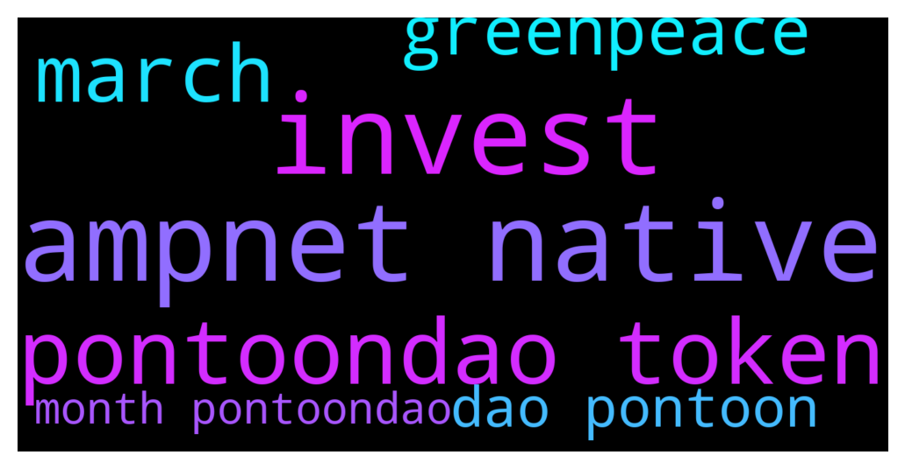

# **@ampnetapxchat**
 ## Analysis for **2021-12-03** - **2021-12-08**.

---

## 📊 **Basic Stats**

**n_messages_sent**: 101

---

---

## 🔝 **Top keywords and related messages**

1. **ampnet native**

    @mislavjavor --- *Since we’ve been having a lot of questions on the state of the project, here is a small update (after the FAQ):   * The Fundraising platform is still being actively upgraded with new features, but we consider it to be functionally complete. There will be a minor UX/UI overhaul and an addition of a so-called “Instant Invest” flow - where our service bots perform the invest transaction for people paying with credit cards and bank transfers. This will enable the “set and forget” invest modes * New clients, which were briefly mentioned on the screenshot - are being onboarded, with a couple of others coming soon. The investors will be notified when they launch - unlike pure DeFi protocols, for RWAs onboarding new assets usually takes a few months.  * PontoonDAO is currently at the most active stage of R&D. We’re looking to integrate with other tokenization platforms, equity crowdfunding platforms and similar to create “branded” indexes.  * Our team has expanded a bit and we’re activelly working on sales and development. We are re-evaluing the sales model as the last few clients were unsucessful in raising campaigns. We are trying to work with large companies to implement our tech in their stack, this will take quite some time, but it’s the best way to achieve long term profitability * The AMPnet company is fully funded and operational to survive a potential bear market * PontoonDAO might have a new token, this is still not 100% - if it does, AAPX holders will “farm” the new token, by staking AAPX for a period of a couple of months. This will be the only way to get the PontoonDAO token, except for farming it direclty by providing liqudity to PontoonDAO indexes (meaning - PontoonDAO will *not* have it’s own token sale) * We are in negotiations with a CEX for a possible listing, however - it might require a reevaluation of our buyback model for a staking/yield-farming model.  And to address a mentioned point - AMPnet has launched AAPX token in March because we had a deal prepared with Greenpeace and $40M of projects live on the platform. It was just as much a surprise to us that Greenpeace underperformed so spectacularily.   However, all future developements and even potential pivots will use AAPX as the base - so the holders will be rewarded, no matter how AMPnet starts making money.* **--->** [TG Discussion](https://t.me/ampnetapxchat/35378)

    @ivankardum --- *And as for marketing and promotion in general, it will be, but in a different way. Partnerships with large companies that integrate AMPnet technology will be promoted, and we aim to be those companies / organizations that already have projects and will have them, but also have investors, and our technology allows them to optimize the investment flow. This is something where we as AMPnet see a space for us, as a real whitelabel platform, especially when we add a new service - Pontoon DAO* **--->** [TG Discussion](https://t.me/ampnetapxchat/35447)

    @Domy177 --- *I haven't stopped by for some time and just now I'm seeing this Pontoon dao news. It looks like Pontoon dao will likely have it's own token and if that turns out to be the case, what will be utility of native ampnet token, what will be ones reason to buy native ampnet token?* **--->** [TG Discussion](https://t.me/ampnetapxchat/35541)

    @runex_x1 --- *indeed, this was one of the ideas I had when they launched ampnet a long time ago. That the stakers would verify projects and these projects would be promoted with an ampnet-label. I still think this is the way forward as it creates a pool/community of projects. Now, the pontoondao may more or less do this with the baskets. The liquidity-pools/token per basket seems a good way forward and makes entry easier. However, I still think they should promote and create communities around individual projects. There is not so much value in paint, but what you do with the paint.* **--->** [TG Discussion](https://t.me/ampnetapxchat/35439)

    @KonradCapital --- *Yea, I been telling @mislavjavor for a while they need to market there ISO’s and ICO’s and can’t rely on the client to do the marketing. Once AMPNET is bigger they can chill on the marketing and let client do it.* **--->** [TG Discussion](https://t.me/ampnetapxchat/35420)

    @ivankardum --- *Here's to answering this question, which I see dragging on for a while. We will not promote individual projects - neither now nor later. There are several reasons for this, but here are the most important ones. In order to promote some individual projects you need to have a team of people in the background who will make an due diligence of the project and the company itself (because you don’t want to promote any project), whether the project is good or not, what the company is like, what the promotion will be like... All this together, when taken into account, significantly increases the cost aspect of the company, in this case AMPnet... and there is a big fraud risk factor - what if we as AMPnet promote a project and it turns out to be a scam or not fulfilling what was promised, what will investors in that project say first? - "AMPnet recommended it to us"* **--->** [TG Discussion](https://t.me/ampnetapxchat/35445)

2. **invest**

    @mislavjavor --- *Since we’ve been having a lot of questions on the state of the project, here is a small update (after the FAQ):   * The Fundraising platform is still being actively upgraded with new features, but we consider it to be functionally complete. There will be a minor UX/UI overhaul and an addition of a so-called “Instant Invest” flow - where our service bots perform the invest transaction for people paying with credit cards and bank transfers. This will enable the “set and forget” invest modes * New clients, which were briefly mentioned on the screenshot - are being onboarded, with a couple of others coming soon. The investors will be notified when they launch - unlike pure DeFi protocols, for RWAs onboarding new assets usually takes a few months.  * PontoonDAO is currently at the most active stage of R&D. We’re looking to integrate with other tokenization platforms, equity crowdfunding platforms and similar to create “branded” indexes.  * Our team has expanded a bit and we’re activelly working on sales and development. We are re-evaluing the sales model as the last few clients were unsucessful in raising campaigns. We are trying to work with large companies to implement our tech in their stack, this will take quite some time, but it’s the best way to achieve long term profitability * The AMPnet company is fully funded and operational to survive a potential bear market * PontoonDAO might have a new token, this is still not 100% - if it does, AAPX holders will “farm” the new token, by staking AAPX for a period of a couple of months. This will be the only way to get the PontoonDAO token, except for farming it direclty by providing liqudity to PontoonDAO indexes (meaning - PontoonDAO will *not* have it’s own token sale) * We are in negotiations with a CEX for a possible listing, however - it might require a reevaluation of our buyback model for a staking/yield-farming model.  And to address a mentioned point - AMPnet has launched AAPX token in March because we had a deal prepared with Greenpeace and $40M of projects live on the platform. It was just as much a surprise to us that Greenpeace underperformed so spectacularily.   However, all future developements and even potential pivots will use AAPX as the base - so the holders will be rewarded, no matter how AMPnet starts making money.* **--->** [TG Discussion](https://t.me/ampnetapxchat/35378)

3. **pontoondao token**

    @mislavjavor --- *Since we’ve been having a lot of questions on the state of the project, here is a small update (after the FAQ):   * The Fundraising platform is still being actively upgraded with new features, but we consider it to be functionally complete. There will be a minor UX/UI overhaul and an addition of a so-called “Instant Invest” flow - where our service bots perform the invest transaction for people paying with credit cards and bank transfers. This will enable the “set and forget” invest modes * New clients, which were briefly mentioned on the screenshot - are being onboarded, with a couple of others coming soon. The investors will be notified when they launch - unlike pure DeFi protocols, for RWAs onboarding new assets usually takes a few months.  * PontoonDAO is currently at the most active stage of R&D. We’re looking to integrate with other tokenization platforms, equity crowdfunding platforms and similar to create “branded” indexes.  * Our team has expanded a bit and we’re activelly working on sales and development. We are re-evaluing the sales model as the last few clients were unsucessful in raising campaigns. We are trying to work with large companies to implement our tech in their stack, this will take quite some time, but it’s the best way to achieve long term profitability * The AMPnet company is fully funded and operational to survive a potential bear market * PontoonDAO might have a new token, this is still not 100% - if it does, AAPX holders will “farm” the new token, by staking AAPX for a period of a couple of months. This will be the only way to get the PontoonDAO token, except for farming it direclty by providing liqudity to PontoonDAO indexes (meaning - PontoonDAO will *not* have it’s own token sale) * We are in negotiations with a CEX for a possible listing, however - it might require a reevaluation of our buyback model for a staking/yield-farming model.  And to address a mentioned point - AMPnet has launched AAPX token in March because we had a deal prepared with Greenpeace and $40M of projects live on the platform. It was just as much a surprise to us that Greenpeace underperformed so spectacularily.   However, all future developements and even potential pivots will use AAPX as the base - so the holders will be rewarded, no matter how AMPnet starts making money.* **--->** [TG Discussion](https://t.me/ampnetapxchat/35378)

    @<UNK> --- *I have lots of tokens unclaimed from presale. If I want to earn pontoon tokens, do I have to claim them to stake or could there be a system that the locked tokens of presale are also a form of staking* **--->** [TG Discussion](https://t.me/ampnetapxchat/35386)

    @Domy177 --- *I haven't stopped by for some time and just now I'm seeing this Pontoon dao news. It looks like Pontoon dao will likely have it's own token and if that turns out to be the case, what will be utility of native ampnet token, what will be ones reason to buy native ampnet token?* **--->** [TG Discussion](https://t.me/ampnetapxchat/35541)

    @runex_x1 --- *indeed, this was one of the ideas I had when they launched ampnet a long time ago. That the stakers would verify projects and these projects would be promoted with an ampnet-label. I still think this is the way forward as it creates a pool/community of projects. Now, the pontoondao may more or less do this with the baskets. The liquidity-pools/token per basket seems a good way forward and makes entry easier. However, I still think they should promote and create communities around individual projects. There is not so much value in paint, but what you do with the paint.* **--->** [TG Discussion](https://t.me/ampnetapxchat/35439)

    @<UNK> --- *Glad to have you back!  more info about possible pontoonDAO token is here (last two points *)  https://t.me/ampnetapxchat/35378* **--->** [TG Discussion](https://t.me/ampnetapxchat/35542)

    @<UNK> --- *Exact mechanics will be announced if, together with our partners, we decide to move in the direction of having a separate PontoonDAO token* **--->** [TG Discussion](https://t.me/ampnetapxchat/35387)

4. **march**

    @mislavjavor --- *Since we’ve been having a lot of questions on the state of the project, here is a small update (after the FAQ):   * The Fundraising platform is still being actively upgraded with new features, but we consider it to be functionally complete. There will be a minor UX/UI overhaul and an addition of a so-called “Instant Invest” flow - where our service bots perform the invest transaction for people paying with credit cards and bank transfers. This will enable the “set and forget” invest modes * New clients, which were briefly mentioned on the screenshot - are being onboarded, with a couple of others coming soon. The investors will be notified when they launch - unlike pure DeFi protocols, for RWAs onboarding new assets usually takes a few months.  * PontoonDAO is currently at the most active stage of R&D. We’re looking to integrate with other tokenization platforms, equity crowdfunding platforms and similar to create “branded” indexes.  * Our team has expanded a bit and we’re activelly working on sales and development. We are re-evaluing the sales model as the last few clients were unsucessful in raising campaigns. We are trying to work with large companies to implement our tech in their stack, this will take quite some time, but it’s the best way to achieve long term profitability * The AMPnet company is fully funded and operational to survive a potential bear market * PontoonDAO might have a new token, this is still not 100% - if it does, AAPX holders will “farm” the new token, by staking AAPX for a period of a couple of months. This will be the only way to get the PontoonDAO token, except for farming it direclty by providing liqudity to PontoonDAO indexes (meaning - PontoonDAO will *not* have it’s own token sale) * We are in negotiations with a CEX for a possible listing, however - it might require a reevaluation of our buyback model for a staking/yield-farming model.  And to address a mentioned point - AMPnet has launched AAPX token in March because we had a deal prepared with Greenpeace and $40M of projects live on the platform. It was just as much a surprise to us that Greenpeace underperformed so spectacularily.   However, all future developements and even potential pivots will use AAPX as the base - so the holders will be rewarded, no matter how AMPnet starts making money.* **--->** [TG Discussion](https://t.me/ampnetapxchat/35378)

    @IncogSen --- *Unlucky guys, I can imagine it's been an uphill battle since March* **--->** [TG Discussion](https://t.me/ampnetapxchat/35393)

5. **greenpeace**

    @mislavjavor --- *Since we’ve been having a lot of questions on the state of the project, here is a small update (after the FAQ):   * The Fundraising platform is still being actively upgraded with new features, but we consider it to be functionally complete. There will be a minor UX/UI overhaul and an addition of a so-called “Instant Invest” flow - where our service bots perform the invest transaction for people paying with credit cards and bank transfers. This will enable the “set and forget” invest modes * New clients, which were briefly mentioned on the screenshot - are being onboarded, with a couple of others coming soon. The investors will be notified when they launch - unlike pure DeFi protocols, for RWAs onboarding new assets usually takes a few months.  * PontoonDAO is currently at the most active stage of R&D. We’re looking to integrate with other tokenization platforms, equity crowdfunding platforms and similar to create “branded” indexes.  * Our team has expanded a bit and we’re activelly working on sales and development. We are re-evaluing the sales model as the last few clients were unsucessful in raising campaigns. We are trying to work with large companies to implement our tech in their stack, this will take quite some time, but it’s the best way to achieve long term profitability * The AMPnet company is fully funded and operational to survive a potential bear market * PontoonDAO might have a new token, this is still not 100% - if it does, AAPX holders will “farm” the new token, by staking AAPX for a period of a couple of months. This will be the only way to get the PontoonDAO token, except for farming it direclty by providing liqudity to PontoonDAO indexes (meaning - PontoonDAO will *not* have it’s own token sale) * We are in negotiations with a CEX for a possible listing, however - it might require a reevaluation of our buyback model for a staking/yield-farming model.  And to address a mentioned point - AMPnet has launched AAPX token in March because we had a deal prepared with Greenpeace and $40M of projects live on the platform. It was just as much a surprise to us that Greenpeace underperformed so spectacularily.   However, all future developements and even potential pivots will use AAPX as the base - so the holders will be rewarded, no matter how AMPnet starts making money.* **--->** [TG Discussion](https://t.me/ampnetapxchat/35378)

6. **dao pontoon**

    @<UNK> --- *I have lots of tokens unclaimed from presale. If I want to earn pontoon tokens, do I have to claim them to stake or could there be a system that the locked tokens of presale are also a form of staking* **--->** [TG Discussion](https://t.me/ampnetapxchat/35386)

    @ivankardum --- *And as for marketing and promotion in general, it will be, but in a different way. Partnerships with large companies that integrate AMPnet technology will be promoted, and we aim to be those companies / organizations that already have projects and will have them, but also have investors, and our technology allows them to optimize the investment flow. This is something where we as AMPnet see a space for us, as a real whitelabel platform, especially when we add a new service - Pontoon DAO* **--->** [TG Discussion](https://t.me/ampnetapxchat/35447)

    @Domy177 --- *I haven't stopped by for some time and just now I'm seeing this Pontoon dao news. It looks like Pontoon dao will likely have it's own token and if that turns out to be the case, what will be utility of native ampnet token, what will be ones reason to buy native ampnet token?* **--->** [TG Discussion](https://t.me/ampnetapxchat/35541)

    @runex_x1 --- *Good luck to the team with pontoon. I really hope it takes off. Comparing it to klimadao (with illiquid carbon bonds), this has to be the way :). Just hope you also provide pool-liquidity on polygon somehow.* **--->** [TG Discussion](https://t.me/ampnetapxchat/35560)

    @IncogSen --- *Why don't u make the dao and extend the auditors to do that job* **--->** [TG Discussion](https://t.me/ampnetapxchat/35470)

7. **month pontoondao**

    @mislavjavor --- *Since we’ve been having a lot of questions on the state of the project, here is a small update (after the FAQ):   * The Fundraising platform is still being actively upgraded with new features, but we consider it to be functionally complete. There will be a minor UX/UI overhaul and an addition of a so-called “Instant Invest” flow - where our service bots perform the invest transaction for people paying with credit cards and bank transfers. This will enable the “set and forget” invest modes * New clients, which were briefly mentioned on the screenshot - are being onboarded, with a couple of others coming soon. The investors will be notified when they launch - unlike pure DeFi protocols, for RWAs onboarding new assets usually takes a few months.  * PontoonDAO is currently at the most active stage of R&D. We’re looking to integrate with other tokenization platforms, equity crowdfunding platforms and similar to create “branded” indexes.  * Our team has expanded a bit and we’re activelly working on sales and development. We are re-evaluing the sales model as the last few clients were unsucessful in raising campaigns. We are trying to work with large companies to implement our tech in their stack, this will take quite some time, but it’s the best way to achieve long term profitability * The AMPnet company is fully funded and operational to survive a potential bear market * PontoonDAO might have a new token, this is still not 100% - if it does, AAPX holders will “farm” the new token, by staking AAPX for a period of a couple of months. This will be the only way to get the PontoonDAO token, except for farming it direclty by providing liqudity to PontoonDAO indexes (meaning - PontoonDAO will *not* have it’s own token sale) * We are in negotiations with a CEX for a possible listing, however - it might require a reevaluation of our buyback model for a staking/yield-farming model.  And to address a mentioned point - AMPnet has launched AAPX token in March because we had a deal prepared with Greenpeace and $40M of projects live on the platform. It was just as much a surprise to us that Greenpeace underperformed so spectacularily.   However, all future developements and even potential pivots will use AAPX as the base - so the holders will be rewarded, no matter how AMPnet starts making money.* **--->** [TG Discussion](https://t.me/ampnetapxchat/35378)

    @runex_x1 --- *indeed, this was one of the ideas I had when they launched ampnet a long time ago. That the stakers would verify projects and these projects would be promoted with an ampnet-label. I still think this is the way forward as it creates a pool/community of projects. Now, the pontoondao may more or less do this with the baskets. The liquidity-pools/token per basket seems a good way forward and makes entry easier. However, I still think they should promote and create communities around individual projects. There is not so much value in paint, but what you do with the paint.* **--->** [TG Discussion](https://t.me/ampnetapxchat/35439)

    @<UNK> --- *Glad to have you back!  more info about possible pontoonDAO token is here (last two points *)  https://t.me/ampnetapxchat/35378* **--->** [TG Discussion](https://t.me/ampnetapxchat/35542)

    @IncogSen --- *Nahhh I asked this question 1 months ago after near. You don't need to market once the product is ready🤣🤣🤣🤣🤣🤣🤣* **--->** [TG Discussion](https://t.me/ampnetapxchat/35406)

    @IncogSen --- *You banned me for one month because I asked about marketing* **--->** [TG Discussion](https://t.me/ampnetapxchat/35398)

    @<UNK> --- *Exact mechanics will be announced if, together with our partners, we decide to move in the direction of having a separate PontoonDAO token* **--->** [TG Discussion](https://t.me/ampnetapxchat/35387)

