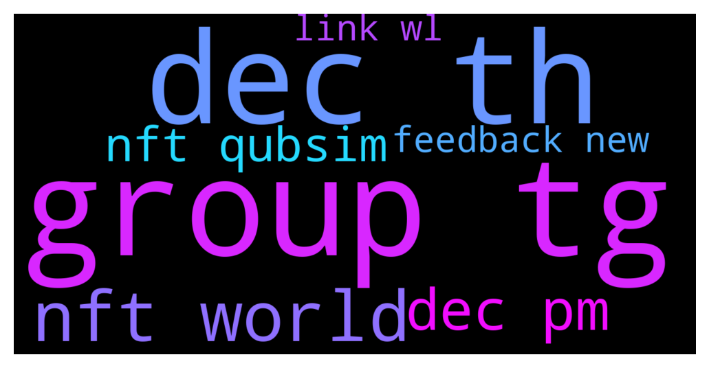

# **@de_fi**
 ## Analysis for **2021-12-07** - **2021-12-08**.

---

## 📊 **Basic Stats**

**n_messages_sent**: 24

---

---

## 🔝 **Top keywords and related messages**

1. **community growth**

    @abeosten --- *Hi folks, Abe here from Cap (cap.finance). We're looking for someone special to supercharge the Cap community's growth. All current contributors are engineers, so community growth is not exactly our area of expertise. 😄  Would you know anyone we can talk to who does this really well? Looking to hire top talent. Thanks!* **--->** [TG Discussion](https://t.me/de_fi/229967)

    @TheCartelX --- *GoldFinX  We're growing a community of disrupters in the artisanal gold mining industry. Join a group a people, like you, who want to change the world for the better and need the resources to do so. We're your resource, and together we can alter the course of our future for the better.  Join the GoldFinX movement, become an Ambassador today: https://goldfinx.com/ambassador/* **--->** [TG Discussion](https://t.me/de_fi/229957)

    @nvy0x --- *Hello everyone, Nic from DeFiSafety here. Firstly, thank you @dereksilva for allowing us to post in here, you’re awesome. Secondly, as you are all well aware, security (and lack thereof) is a major concern within the DeFi communities. This is why DeFiSafety has engineered a rating process that evaluates the safety of the most popular DeFi protocols based on their process quality and transparency. As this is accessible by anyone for free, we encourage you to use these tools as part of your DYOR. In addition, we would love to have discussions with you about the state of safety in DeFi. You can always @ me in here about certain topics or questions you may have, or head over to our website and join our various social media groups where we discuss these topics all day long. Also, feel free to post some review requests in our socials! Again, this is absolutely free. Thank you, and I hope you all have a great day. Stay safe out there!* **--->** [TG Discussion](https://t.me/de_fi/229822)

    @valentinabodro --- *Hi. We're doing research for the DeFi community for a new NFT project. I'm looking for participants who are willing to take part in a problem interview. It'll take around an hour. Particularly interested in those from US, West Europe, Saudi Arabia. Please message me, if u're up for this. Ur time may be rewarded.* **--->** [TG Discussion](https://t.me/de_fi/229791)

2. **contributor engineer**

    @abeosten --- *Hi folks, Abe here from Cap (cap.finance). We're looking for someone special to supercharge the Cap community's growth. All current contributors are engineers, so community growth is not exactly our area of expertise. 😄  Would you know anyone we can talk to who does this really well? Looking to hire top talent. Thanks!* **--->** [TG Discussion](https://t.me/de_fi/229967)

3. **away place**

    @ayoistimi18 --- *Okay will do that right away.* **--->** [TG Discussion](https://t.me/de_fi/230019)

    @ayoistimi18 --- *You're at the right place.* **--->** [TG Discussion](https://t.me/de_fi/230020)

4. **area expertise**

    @abeosten --- *Hi folks, Abe here from Cap (cap.finance). We're looking for someone special to supercharge the Cap community's growth. All current contributors are engineers, so community growth is not exactly our area of expertise. 😄  Would you know anyone we can talk to who does this really well? Looking to hire top talent. Thanks!* **--->** [TG Discussion](https://t.me/de_fi/229967)

5. **contributor current**

    @abeosten --- *Hi folks, Abe here from Cap (cap.finance). We're looking for someone special to supercharge the Cap community's growth. All current contributors are engineers, so community growth is not exactly our area of expertise. 😄  Would you know anyone we can talk to who does this really well? Looking to hire top talent. Thanks!* **--->** [TG Discussion](https://t.me/de_fi/229967)

    @Cryptogoldcoast --- *Hey can I promote a coin in here? It’s 30 days old. Devs are well known. Current Mcap 150k   Let me know if I’m allowed please. Thanks* **--->** [TG Discussion](https://t.me/de_fi/229760)

6. **account sir**

    @Akshayvdalvi --- *May i dm you sir?* **--->** [TG Discussion](https://t.me/de_fi/229770)

    @Akshayvdalvi --- *May i dm you Sir?* **--->** [TG Discussion](https://t.me/de_fi/229769)

7. **cap special**

    @abeosten --- *Hi folks, Abe here from Cap (cap.finance). We're looking for someone special to supercharge the Cap community's growth. All current contributors are engineers, so community growth is not exactly our area of expertise. 😄  Would you know anyone we can talk to who does this really well? Looking to hire top talent. Thanks!* **--->** [TG Discussion](https://t.me/de_fi/229967)

