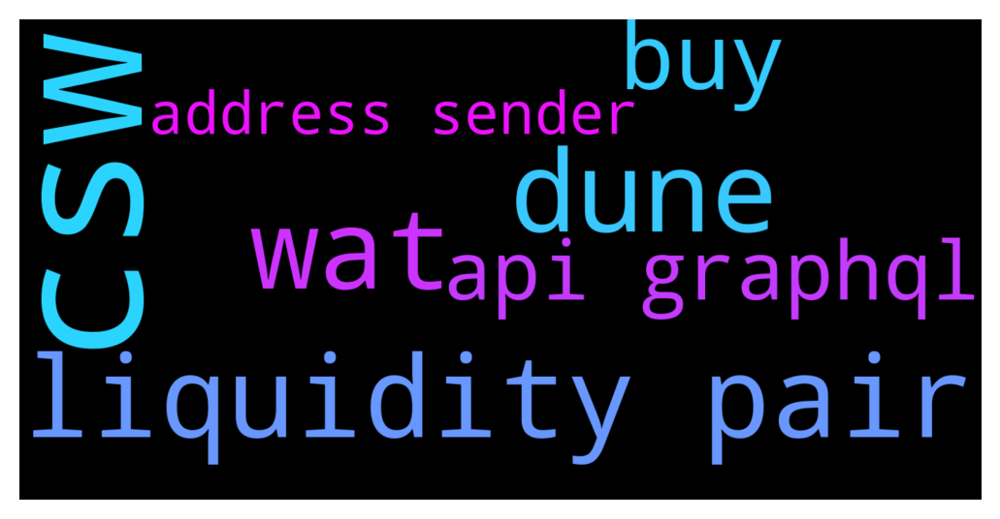

# **@lobsters_chat**
 ## Analysis for **2021-12-07** - **2021-12-08**.

---

## 📊 **Basic Stats**

**n_messages_sent**: 324

---

---

## 🔝 **Top keywords and related messages**

1. **csw**

    @LilMoonLamboX3 --- *and one of the guys backing them is a CSW diehard* **--->** [TG Discussion](https://t.me/lobsters_chat/305671)

    @ayyyytte --- *whats csw* **--->** [TG Discussion](https://t.me/lobsters_chat/305675)

2. **liquidity pair**

    @tatai_007 --- *Is there an easy and free way of getting all the buys and sells for a liquidity pair?* **--->** [TG Discussion](https://t.me/lobsters_chat/305785)

    @pupanadin --- *Lobster Daily #236– Daily Recap – December 6:  1. Questions on CRV voting📚 Link to discussion  Link to discussion   2. What do you do with stables: staking, farming or holding? 🤔 Link to discussion   3.SushiSwap CTO threatens to quit as infighting escalates Like  Link to discussion  Link to discussion   4. Vitalik's new article on how we can achieve a more decentralised and censorship resistant future  Link  Link to discussion   5. Are there any public api endpoints that access Ethereum state? Link to discussion   6. Just-in-Time Liquidity (JIT) MEV attacks on Uniswap: how they are performed and who’s suffers from?🦄🔫 Link  Link to discussion* **--->** [TG Discussion](https://t.me/lobsters_chat/305658)

    @zhongfu --- *but if it's something as simple as getting buys/sells on a single liquidity pair, then listening for Transfer() events emitted by the token address(es) with the LP address as the sender or recipient would be easy enough to do* **--->** [TG Discussion](https://t.me/lobsters_chat/305794)

    @vPEPO --- *JIT liquidity is good for any kind of active swap behaviour* **--->** [TG Discussion](https://t.me/lobsters_chat/305476)

    @M --- *I am interested in the liquidity fragmentation issue in DeFi. This is why I started to look into different "liquidity-as-a-service providers". Do you guys know any promising protocols - aside from Olympus and Tokemak?* **--->** [TG Discussion](https://t.me/lobsters_chat/305588)

3. **dune**

    @zhongfu --- *ah you'd need dune pro for that* **--->** [TG Discussion](https://t.me/lobsters_chat/305793)

    @zhongfu --- *or perhaps something like dune, etc* **--->** [TG Discussion](https://t.me/lobsters_chat/305790)

    @tatai_007 --- *Hmm doesn't seem like Dune has a consumable api endpoint* **--->** [TG Discussion](https://t.me/lobsters_chat/305792)

4. **wat**

    @hugeshoe --- *wat* **--->** [TG Discussion](https://t.me/lobsters_chat/305734)

    @omgwirjo --- *👀 wat is happenin here* **--->** [TG Discussion](https://t.me/lobsters_chat/305738)

5. **buy**

    @tatai_007 --- *Is there an easy and free way of getting all the buys and sells for a liquidity pair?* **--->** [TG Discussion](https://t.me/lobsters_chat/305785)

    @zhongfu --- *but if it's something as simple as getting buys/sells on a single liquidity pair, then listening for Transfer() events emitted by the token address(es) with the LP address as the sender or recipient would be easy enough to do* **--->** [TG Discussion](https://t.me/lobsters_chat/305794)

6. **api graphql**

    @pupanadin --- *Lobster Daily #236– Daily Recap – December 6:  1. Questions on CRV voting📚 Link to discussion  Link to discussion   2. What do you do with stables: staking, farming or holding? 🤔 Link to discussion   3.SushiSwap CTO threatens to quit as infighting escalates Like  Link to discussion  Link to discussion   4. Vitalik's new article on how we can achieve a more decentralised and censorship resistant future  Link  Link to discussion   5. Are there any public api endpoints that access Ethereum state? Link to discussion   6. Just-in-Time Liquidity (JIT) MEV attacks on Uniswap: how they are performed and who’s suffers from?🦄🔫 Link  Link to discussion* **--->** [TG Discussion](https://t.me/lobsters_chat/305658)

    @tatai_007 --- *Hmm doesn't seem like Dune has a consumable api endpoint* **--->** [TG Discussion](https://t.me/lobsters_chat/305792)

    @tatai_007 --- *Yeah. I was looking for an aggregator kind of api that would be easier to run on a server, but I guess I can just use web3.py or something similar to listen on events* **--->** [TG Discussion](https://t.me/lobsters_chat/305795)

    @tatai_007 --- *Currently using the defined.fi graphql api but don't think it's ideal* **--->** [TG Discussion](https://t.me/lobsters_chat/305787)

    @Alphamint --- *Q: are there any public api endpoints that access eth state? say im retarded and wanted to keep an image on the eth chain, is there something like cloudflare IPFS access point that would let me access it?* **--->** [TG Discussion](https://t.me/lobsters_chat/305425)

7. **address sender**

    @ivangbi --- *Public key != your address in most blockchains. In Ethereum for sure* **--->** [TG Discussion](https://t.me/lobsters_chat/305568)

    @Wrangler267 --- *Hey Guys I have one of the public key created from my ledger but when I reinstalled metamask and trying to find that public key in the list of addresses which comes up I am not able to pin point is there any way to directly search with the public key you have and add it again in metamask* **--->** [TG Discussion](https://t.me/lobsters_chat/305566)

    @tufuntu --- *let nonce_countp = await bscProvider.getTransactionCount(address, "pending");   There're tons of pending txs on this account and how can I flush them out?* **--->** [TG Discussion](https://t.me/lobsters_chat/305733)

    @zhongfu --- *listen to events emitted by that address* **--->** [TG Discussion](https://t.me/lobsters_chat/305786)

    @zhongfu --- *but if it's something as simple as getting buys/sells on a single liquidity pair, then listening for Transfer() events emitted by the token address(es) with the LP address as the sender or recipient would be easy enough to do* **--->** [TG Discussion](https://t.me/lobsters_chat/305794)

    @vasilysumanov --- *As I know the next version of Tornado cash will allow to send tokens to another address without exiting the contract where tokens are stored Additionally the 0.1/1/10/100 rule will be removed and users will be able to deposit and withdraw any amounts.* **--->** [TG Discussion](https://t.me/lobsters_chat/305506)

