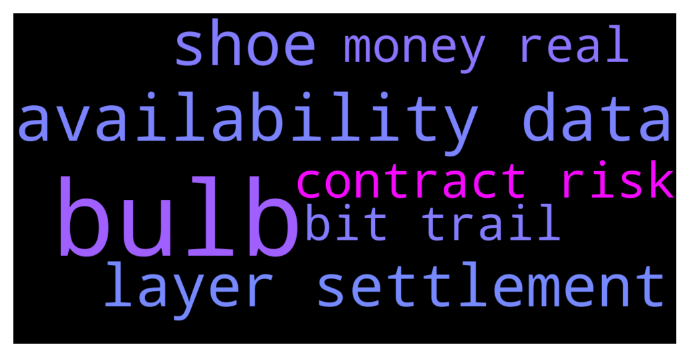

# **@lobsters_chat**
 ## Analysis for **2021-12-07** - **2021-12-08**.

---

## 📊 **Basic Stats**

**n_messages_sent**: 314

---

---

## 🔝 **Top keywords and related messages**

1. **bulb**

    @ivangbi --- *However, doing it by burning your bulb supply doesn’t really work - because even if your share of the light bulb supply increases you lose in the “real money” supply* **--->** [TG Discussion](https://t.me/lobsters_chat/305802)

    @ivangbi --- *And even if you love bulb lights and believe in their future, you still need “real money” to weather any storm, and to instill conviction in those who help w ur light bulbs* **--->** [TG Discussion](https://t.me/lobsters_chat/305803)

2. **availability data**

    @xecordoteth --- *Can anyone explain the difference between a data availability layer and a settlement layer in the modular blockchain discussion?* **--->** [TG Discussion](https://t.me/lobsters_chat/305771)

    @musalbas --- *Eth rollups use Eth both for settlement and data availability Validiums use Eth only for settlement but not data availability* **--->** [TG Discussion](https://t.me/lobsters_chat/305840)

    @musalbas --- *Data availability layer is where the rollup posts its block data to  Settlement layer is an execution layer/chain that the rollup has a trust-minimised bridge to, and can withdraw and deposit tokens to* **--->** [TG Discussion](https://t.me/lobsters_chat/305839)

3. **shoe**

    @LilMoonLamboX3 --- *What sane person ties shoes like this* **--->** [TG Discussion](https://t.me/lobsters_chat/305914)

    @suzumiyachan --- *i prefer to tie my shoes once, then simply slip my feet out and crush the back of my shoes putting my feet in so i don't have to tie them again* **--->** [TG Discussion](https://t.me/lobsters_chat/305919)

4. **layer settlement**

    @xecordoteth --- *Can anyone explain the difference between a data availability layer and a settlement layer in the modular blockchain discussion?* **--->** [TG Discussion](https://t.me/lobsters_chat/305771)

    @vladimirkonovalov --- *Tldr: dif functionality Settlement role — be secure, decentralized, resilient DA: order transactions (no execution) + make them available A bunch of good articles is available at celestia blog and polynya medium* **--->** [TG Discussion](https://t.me/lobsters_chat/305781)

    @musalbas --- *Eth rollups use Eth both for settlement and data availability Validiums use Eth only for settlement but not data availability* **--->** [TG Discussion](https://t.me/lobsters_chat/305840)

    @musalbas --- *Data availability layer is where the rollup posts its block data to  Settlement layer is an execution layer/chain that the rollup has a trust-minimised bridge to, and can withdraw and deposit tokens to* **--->** [TG Discussion](https://t.me/lobsters_chat/305839)

    @Q --- *Curious when will the need for Trusted Third party (TTP) the central premise of TradFi be seen as inappropriate with almost near time settlement on blockchain eliminates counterparty risks.   And the only solution to a bank run in fractional banking is a ability of a grand bank the Fed to add several zeros to the ledge stating the balance of assets and if there is trust something similar can be easily done with Crypto coins like $UST   If decentralization of web 2 ( TCP/IP, DNS, HTTP) worked at scale and attacks like DDOS have been mitigated there is much to learn from DeFi and much to change in TTP regulations of TradFi* **--->** [TG Discussion](https://t.me/lobsters_chat/305665)

    @xecordoteth --- *I mean in precise technical terms. There is a division of labor between DA layer and settlement layer if they are modular/complementary. People say you could have DA on Celestia + settlement on Ethereum + execution on StarkNet. How does this work?* **--->** [TG Discussion](https://t.me/lobsters_chat/305858)

5. **contract risk**

    @ImFluke --- *It's "no loss" lottery with multiple winning tiers. Each week the pool yields are distributed daily to random participants based on these tiers. The yield is from investing pool funds in yield platforms like compound and yEarn. I guess it can fall bellow 33% and has other risks so DYOR.* **--->** [TG Discussion](https://t.me/lobsters_chat/305844)

    @Q --- *Curious when will the need for Trusted Third party (TTP) the central premise of TradFi be seen as inappropriate with almost near time settlement on blockchain eliminates counterparty risks.   And the only solution to a bank run in fractional banking is a ability of a grand bank the Fed to add several zeros to the ledge stating the balance of assets and if there is trust something similar can be easily done with Crypto coins like $UST   If decentralization of web 2 ( TCP/IP, DNS, HTTP) worked at scale and attacks like DDOS have been mitigated there is much to learn from DeFi and much to change in TTP regulations of TradFi* **--->** [TG Discussion](https://t.me/lobsters_chat/305665)

    @wagyusec --- *Are there any tools that are available that can be used to find certain functions called in solidity smart contracts? @farm42* **--->** [TG Discussion](https://t.me/lobsters_chat/305709)

    @tufuntu --- *Is VSCode best IDE for smart contract development using Solidity?* **--->** [TG Discussion](https://t.me/lobsters_chat/305845)

    @vasilysumanov --- *As I know the next version of Tornado cash will allow to send tokens to another address without exiting the contract where tokens are stored Additionally the 0.1/1/10/100 rule will be removed and users will be able to deposit and withdraw any amounts.* **--->** [TG Discussion](https://t.me/lobsters_chat/305506)

    @nickbtts --- *no, it was a free tool that webbed out interacting wallets and contracts* **--->** [TG Discussion](https://t.me/lobsters_chat/305491)

6. **money real**

    @ivangbi --- *However, doing it by burning your bulb supply doesn’t really work - because even if your share of the light bulb supply increases you lose in the “real money” supply* **--->** [TG Discussion](https://t.me/lobsters_chat/305802)

    @ivangbi --- *And even if you love bulb lights and believe in their future, you still need “real money” to weather any storm, and to instill conviction in those who help w ur light bulbs* **--->** [TG Discussion](https://t.me/lobsters_chat/305803)

    @Steff_Bullishkid --- *So we let someone loose money by paying a fine instead of him earning money 🤓 Works until you realize that you cut the first 3 because nobody even wants to buy to Hodl anymore* **--->** [TG Discussion](https://t.me/lobsters_chat/305806)

    @ivangbi --- *So if we could fine trades in real money… but that means changing erc20 token standard as it is… and then you don’t know what constitutes a trade* **--->** [TG Discussion](https://t.me/lobsters_chat/305804)

    @phil_muhbags --- *Can we get more of this stuff instead of univ3 lps lose money* **--->** [TG Discussion](https://t.me/lobsters_chat/305484)

    @RobAnon --- *Still a great way to make money if you're a dev, still a great way to lose money if you're an ape* **--->** [TG Discussion](https://t.me/lobsters_chat/305656)

7. **bit trail**

    @AdrienDLT --- *A personal research on the leading AMMs and DEXes (across all chains). A little bit disapointing, much less projects than I anticipated. There is still a lot of work to be done!  Enjoy the read  https://twitter.com/AdrienBe_/status/1468540264616804354* **--->** [TG Discussion](https://t.me/lobsters_chat/305847)

    @StephanGoss --- *How come not Trail of Bits? Been hearing a lot of good stuff about them. Was actually planning on working with them on my project so curious for feedback* **--->** [TG Discussion](https://t.me/lobsters_chat/305861)

    @dlingzm --- *Aside from Trail of Bits, anyone trust / recommend any other audit firms?* **--->** [TG Discussion](https://t.me/lobsters_chat/305860)

    @michael_p3711 --- *thats a bit weird considering coinbase is having NFT marketplace...* **--->** [TG Discussion](https://t.me/lobsters_chat/305609)

    @Tasteoftruth --- *bit of both, has more to do with personality types (confrontational or agreeable). I believe an open space to share ideas is a good thing otherwise the group will be dominated by intimidation.* **--->** [TG Discussion](https://t.me/lobsters_chat/305885)

    @dlingzm --- *Oh as in Trail of Bits is great. What other audit firms perform at the same level as them?* **--->** [TG Discussion](https://t.me/lobsters_chat/305862)

