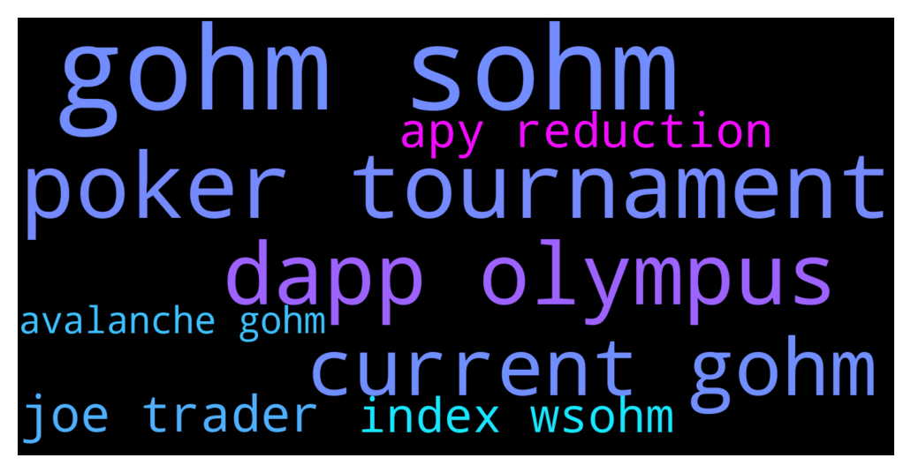

# **@OlympusTG**
 ## Analysis for **2021-12-08** - **2021-12-09**.

---

## 📊 **Basic Stats**

**n_messages_sent**: 1960

---

---

## 🔝 **Top keywords and related messages**

1. **gohm sohm**

    @C05232919 --- *Now, i have gOHM on avalanche..but stake on app olympusdao is not showing my gOHM for staking…anything else i need to do?* **--->** [TG Discussion](https://t.me/OlympusTG/111025)

    @FLankarooo --- *I really wish we could keep sOHM forever tbh but it looks like it will be gone also soon and only OHM & gOHM will remain* **--->** [TG Discussion](https://t.me/OlympusTG/111941)

    @Poopoo --- *https://docs.olympusdao.finance/main/using-the-website/staking#how-to-stake, no need to stake if you bought gOHM* **--->** [TG Discussion](https://t.me/OlympusTG/111452)

    @unclejimmmmmy --- *you can only buy gOHM on avalanche, the price of gOHM is the price of OHM x the index* **--->** [TG Discussion](https://t.me/OlympusTG/110892)

    @NaNaNaSa87 --- *So i am a bit lost here, if i wanted to swap AVAX so i can stake OHM, which one i need to buy ? WSohm or Gohm ?And why i can only add WSohm to my metamask but can't add Gohm?* **--->** [TG Discussion](https://t.me/OlympusTG/111677)

    @Niels --- *But what is the difference between gohm* **--->** [TG Discussion](https://t.me/OlympusTG/111994)

2. **poker tournament**

    @BenDemaj --- *Super excited to bring you the FOHMO 4 Agenda!  December 10 - 5:30 PM UTC:   - Poker tournament hosted by Fiskantes, Winner takes all prize pool of 3.3 OHM and a 1.1 OHM bounty for whoever is able to KO Fisk! - Music hosted by Audius Project with Live DJ sets and an off topic extravaganza!  December 12- 9:00 PM UTC: - Keynote by our strategos introducing all the latest and greatest project from the DAO - Dan Elitzer, Andre Cronje and Bored Elon talking about topics ranging from community to Olympus Pro and the State of Defi - Roundtable with Olympus Ecosystem partners  Hope to see you all there!* **--->** [TG Discussion](https://t.me/OlympusTG/110587)

    @Thomas --- *I don't get it, latest pinned days the 3,3 prize pool will ne win in a poker tournament. So how are those holders getting their rebases? Becoming quite confusing in this project.* **--->** [TG Discussion](https://t.me/OlympusTG/111506)

    @Julie_Ducharme --- *What poker tournament?* **--->** [TG Discussion](https://t.me/OlympusTG/110861)

    @H --- *What's the buy in for the poker tournament?* **--->** [TG Discussion](https://t.me/OlympusTG/110854)

    @Poopoo --- *where does it say it goes to the poker tournament? The poker tournament prize is separate as far as I know* **--->** [TG Discussion](https://t.me/OlympusTG/111507)

    @Johnny --- *How do I participate in the fohmo4 poker tournament?* **--->** [TG Discussion](https://t.me/OlympusTG/111368)

3. **dapp olympus**

    @Poopoo --- *I don't see any negatives, you can even see your sOHM equivalent on the Olympus dapp now, I have gOHM on Avax and when I went to the dapp on Avax, I can see the equivalent sOHM there, some people prefer to visualise the number in sOHM 😆* **--->** [TG Discussion](https://t.me/OlympusTG/109202)

    @Poopoo --- *What is gOHM: https://twitter.com/OlympusDAO/status/1465410905542385677  gOHM documentation: https://docs.olympusdao.finance/main/contracts/tokens#gohm  gohm does not increase, gohm x current index = sohm, current index increases every rebase, you can find current index on the dashboard of the olympus dapp, and check your equivalent number of sOHM when you access the Olympus dapp through the AVAX Network* **--->** [TG Discussion](https://t.me/OlympusTG/111678)

    @Poopoo --- *yes gOHM is already staked  What is gOHM: https://twitter.com/OlympusDAO/status/1465410905542385677  gOHM documentation: https://docs.olympusdao.finance/main/contracts/tokens#gohm  gohm does not increase, gohm x current index = sohm, current index increases every rebase, you can find current index on the dashboard of the olympus dapp, and check your equivalent number of sOHM when you access the Olympus dapp through the AVAX Network* **--->** [TG Discussion](https://t.me/OlympusTG/111607)

    @kvack --- *I read through all the documentation, treasury backing is a trust-based mechanics. If too many people sell, backing means nothing, sure APY would skyrocket, but other forks may prevent users to go back to the Olympus* **--->** [TG Discussion](https://t.me/OlympusTG/109314)

    @BenDemaj --- *Super excited to bring you the FOHMO 4 Agenda!  December 10 - 5:30 PM UTC:   - Poker tournament hosted by Fiskantes, Winner takes all prize pool of 3.3 OHM and a 1.1 OHM bounty for whoever is able to KO Fisk! - Music hosted by Audius Project with Live DJ sets and an off topic extravaganza!  December 12- 9:00 PM UTC: - Keynote by our strategos introducing all the latest and greatest project from the DAO - Dan Elitzer, Andre Cronje and Bored Elon talking about topics ranging from community to Olympus Pro and the State of Defi - Roundtable with Olympus Ecosystem partners  Hope to see you all there!* **--->** [TG Discussion](https://t.me/OlympusTG/110587)

    @Poopoo --- *why would you do that, you can buy gOHM on AVAX now, the liquidity is quite good.   Buy gOHM on trader joe (AVAX) gOHM contract address on AVAX: 0x321e7092a180bb43555132ec53aaa65a5bf84251  What is gOHM: https://twitter.com/OlympusDAO/status/1465410905542385677  gOHM documentation: https://docs.olympusdao.finance/main/contracts/tokens#gohm  gohm does not increase, gohm x current index = sohm, current index increases every rebase, you can find current index on the dashboard of the olympus dapp, and check your equivalent number of sOHM when you access the Olympus dapp through the AVAX Network* **--->** [TG Discussion](https://t.me/OlympusTG/109439)

4. **current gohm**

    @C05232919 --- *Now, i have gOHM on avalanche..but stake on app olympusdao is not showing my gOHM for staking…anything else i need to do?* **--->** [TG Discussion](https://t.me/OlympusTG/111025)

    @FLankarooo --- *I really wish we could keep sOHM forever tbh but it looks like it will be gone also soon and only OHM & gOHM will remain* **--->** [TG Discussion](https://t.me/OlympusTG/111941)

    @Poopoo --- *https://docs.olympusdao.finance/main/using-the-website/staking#how-to-stake, no need to stake if you bought gOHM* **--->** [TG Discussion](https://t.me/OlympusTG/111452)

    @unclejimmmmmy --- *you can only buy gOHM on avalanche, the price of gOHM is the price of OHM x the index* **--->** [TG Discussion](https://t.me/OlympusTG/110892)

    @NaNaNaSa87 --- *So i am a bit lost here, if i wanted to swap AVAX so i can stake OHM, which one i need to buy ? WSohm or Gohm ?And why i can only add WSohm to my metamask but can't add Gohm?* **--->** [TG Discussion](https://t.me/OlympusTG/111677)

    @Niels --- *But what is the difference between gohm* **--->** [TG Discussion](https://t.me/OlympusTG/111994)

5. **joe trader**

    @Miguel_ecu --- *You can buy gOHM on Avalanche with trader joe* **--->** [TG Discussion](https://t.me/OlympusTG/111244)

    @Poopoo --- *Figure out how to bridge from Polygon to Avax then buy gOHM on Avax   Buy gOHM on trader joe (AVAX) gOHM contract address on AVAX: 0x321e7092a180bb43555132ec53aaa65a5bf84251  What is gOHM: https://twitter.com/OlympusDAO/status/1465410905542385677  gOHM documentation: https://docs.olympusdao.finance/main/contracts/tokens#gohm* **--->** [TG Discussion](https://t.me/OlympusTG/109153)

    @Poopoo --- *https://docs.olympusdao.finance/main/using-the-website/staking#how-to-buy-ohm  Or buy gohm on AVAX with lower fees!  Buy gOHM on trader joe (AVAX) gOHM contract address on AVAX: 0x321e7092a180bb43555132ec53aaa65a5bf84251  What is gOHM: https://twitter.com/OlympusDAO/status/1465410905542385677  gOHM documentation: https://docs.olympusdao.finance/main/contracts/tokens#gohm* **--->** [TG Discussion](https://t.me/OlympusTG/109531)

    @Poopoo --- *Buy gOHM on trader joe (AVAX) gOHM contract address on AVAX: 0x321e7092a180bb43555132ec53aaa65a5bf84251  What is gOHM: https://twitter.com/OlympusDAO/status/1465410905542385677  gOHM documentation: https://docs.olympusdao.finance/main/contracts/tokens#gohm* **--->** [TG Discussion](https://t.me/OlympusTG/109860)

    @Poopoo --- *you can provide liquidity on trader joe, for gOHM - AVAX, not too sure about the details though, you can go on traderjoe to have a look* **--->** [TG Discussion](https://t.me/OlympusTG/109525)

    @Poopoo --- *why would you do that, you can buy gOHM on AVAX now, the liquidity is quite good.   Buy gOHM on trader joe (AVAX) gOHM contract address on AVAX: 0x321e7092a180bb43555132ec53aaa65a5bf84251  What is gOHM: https://twitter.com/OlympusDAO/status/1465410905542385677  gOHM documentation: https://docs.olympusdao.finance/main/contracts/tokens#gohm  gohm does not increase, gohm x current index = sohm, current index increases every rebase, you can find current index on the dashboard of the olympus dapp, and check your equivalent number of sOHM when you access the Olympus dapp through the AVAX Network* **--->** [TG Discussion](https://t.me/OlympusTG/109439)

6. **apy reduction**

    @vhaltot --- *I'm worried. If the market is still like this in Jan when we lower down our APY to 1k, how can we survive?* **--->** [TG Discussion](https://t.me/OlympusTG/111119)

    @kvack --- *I read through all the documentation, treasury backing is a trust-based mechanics. If too many people sell, backing means nothing, sure APY would skyrocket, but other forks may prevent users to go back to the Olympus* **--->** [TG Discussion](https://t.me/OlympusTG/109314)

    @Serg777 --- *Offer even 1000% apy to retail through cex would life changing, buy pressure would be through the roof.* **--->** [TG Discussion](https://t.me/OlympusTG/111882)

    @Poopoo --- *What is gOHM: https://twitter.com/OlympusDAO/status/1465410905542385677  gOHM documentation: https://docs.olympusdao.finance/main/contracts/tokens#gohm  gohm does not increase, gohm x current index = sohm, current index increases every rebase, you can find current index on the dashboard of the olympus dapp, and check your equivalent number of sOHM when you access the Olympus dapp through the AVAX Network  Let's say 1gOHM ($28,000) x 40 (Current Index) = 40 sOHM ($700 each), a few days later, when sOHM holders have 41 sOHM because of the APY, the current index will be 41. Assuming price of sOHM is still $700, price of 1gOHM will be approximately $28,700* **--->** [TG Discussion](https://t.me/OlympusTG/109256)

    @allenkor --- *They aren’t, every time we talked about lowering the apy this has happened. And right after the apy was lowered, we skyrocketed. Smart investors will take the advantage and buy as much ohm as they can and hold and wait for the next leg up. I’ve been here from almost the beginning. We have voted each time to lower and it’s has increased price action. Patience is key* **--->** [TG Discussion](https://t.me/OlympusTG/110327)

    @Daus_666 --- *It looks like new apy will kill OHM since everyone will sell and move to DAOs with higher APYs.* **--->** [TG Discussion](https://t.me/OlympusTG/111683)

7. **index wsohm**

    @unclejimmmmmy --- *you can only buy gOHM on avalanche, the price of gOHM is the price of OHM x the index* **--->** [TG Discussion](https://t.me/OlympusTG/110892)

    @NaNaNaSa87 --- *So i am a bit lost here, if i wanted to swap AVAX so i can stake OHM, which one i need to buy ? WSohm or Gohm ?And why i can only add WSohm to my metamask but can't add Gohm?* **--->** [TG Discussion](https://t.me/OlympusTG/111677)

    @Ap0l1o --- *Because gOhm = wsOhm* **--->** [TG Discussion](https://t.me/OlympusTG/109174)

    @Ap0l1o --- *so if ohm = 500$ and index is 50 Ohm, price of gOhm is 25k* **--->** [TG Discussion](https://t.me/OlympusTG/110921)

    @Vettyspaghetti --- *So what’s the difference between wsOHM and gOHM* **--->** [TG Discussion](https://t.me/OlympusTG/111609)

    @Serg777 --- *Gohm=wsohm* **--->** [TG Discussion](https://t.me/OlympusTG/110932)

8. **avalanche gohm**

    @C05232919 --- *Now, i have gOHM on avalanche..but stake on app olympusdao is not showing my gOHM for staking…anything else i need to do?* **--->** [TG Discussion](https://t.me/OlympusTG/111025)

    @FLankarooo --- *I really wish we could keep sOHM forever tbh but it looks like it will be gone also soon and only OHM & gOHM will remain* **--->** [TG Discussion](https://t.me/OlympusTG/111941)

    @Poopoo --- *https://docs.olympusdao.finance/main/using-the-website/staking#how-to-stake, no need to stake if you bought gOHM* **--->** [TG Discussion](https://t.me/OlympusTG/111452)

    @unclejimmmmmy --- *you can only buy gOHM on avalanche, the price of gOHM is the price of OHM x the index* **--->** [TG Discussion](https://t.me/OlympusTG/110892)

    @NaNaNaSa87 --- *So i am a bit lost here, if i wanted to swap AVAX so i can stake OHM, which one i need to buy ? WSohm or Gohm ?And why i can only add WSohm to my metamask but can't add Gohm?* **--->** [TG Discussion](https://t.me/OlympusTG/111677)

    @Niels --- *But what is the difference between gohm* **--->** [TG Discussion](https://t.me/OlympusTG/111994)

