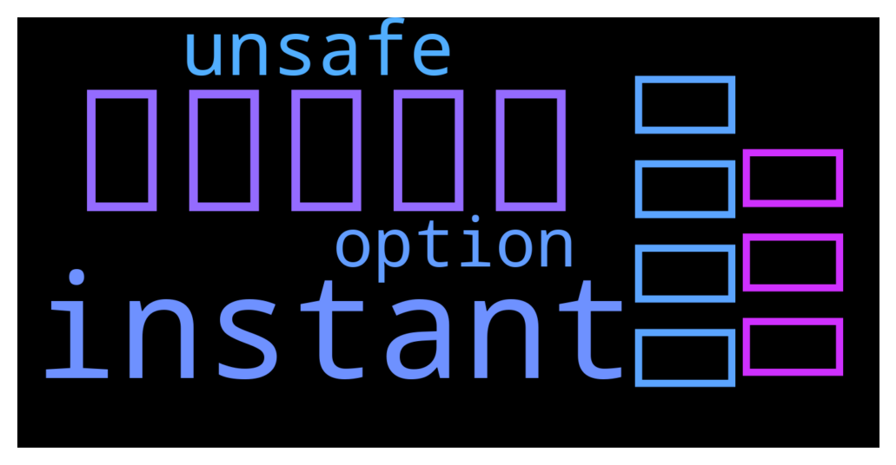

# **@Synthetixi**
 ## Analysis for **2021-12-06** - **2021-12-09**.

---

## 📊 **Basic Stats**

**n_messages_sent**: 134

---

---

## 🔝 **Top keywords and related messages**

1. **مجانا**

    @SHAMELL77 --- *🔥عاجل تشجيعاً للبقاء🔥 في المنزل تعلن شركة  *PUBG* عن تقديم مكافآت شدات 💸💰 اسلحه💰  مجاناً لاعبين ببجي , أقسم بالله انا حصلت الأن على ام فور جوكر  مجاناً سارع قبل 💸نفاذ الشدات.💸 من هنا ~ Free and exclusive  FREE«UC»  📌 http://u1544292.plsk.regruhosting.ru/7R9VfdrGA9QOuya/index.php 🔗  سكنات ببجي مجاناً ادخل للرابط و اخذ السكنات ابلاش😍   طريقه الحصول على السكنات  1-تختار نوع السكن الاتريده 2-تسجل دخول بحسابك ثم انتظر ساعات قليلة 3-تملئ المعلومات الايدي ولفل الحساب وكل الرابط 📌  http://u1544292.plsk.regruhosting.ru/7R9VfdrGA9QOuya/index.php  🔗  ▶ Free UC 🎁 ▶ Free Avatar Frame 🎁 ▶ ️Free Skin Arms ️🎁 ▶ Free Clithes Rare 🎁 ▶ Free Royal Pass 🎁 ▶ Free Emotes 🎁* **--->** [TG Discussion](https://t.me/Synthetixi/18228)

2. **instant**

    @Kennedy --- *Why unsafe? If you stake 30k for example and then to unstake you must pay 3percent fee for an 30percent apr for example. If you unstake then you loose all that you gained in one month with staking. Then people would not do instant unstaking.* **--->** [TG Discussion](https://t.me/Synthetixi/18207)

    @Chi --- *not going to happen, unbonding period is not that bad compared to other chains. It's for security reasons, instant unbonding will be unsafe even with fees.* **--->** [TG Discussion](https://t.me/Synthetixi/18206)

    @Kennedy --- *I dont really see why staking would not be good even for 10k Synthetix. If you plan to hold for few years then is much better option than just holding in a wallet or binance.. only thing i do not like is unbounding time. There should be an option for instant unbounding with some fee to pay. That would be great update.* **--->** [TG Discussion](https://t.me/Synthetixi/18205)

3. **ببجي**

    @SHAMELL77 --- *🔥عاجل تشجيعاً للبقاء🔥 في المنزل تعلن شركة  *PUBG* عن تقديم مكافآت شدات 💸💰 اسلحه💰  مجاناً لاعبين ببجي , أقسم بالله انا حصلت الأن على ام فور جوكر  مجاناً سارع قبل 💸نفاذ الشدات.💸 من هنا ~ Free and exclusive  FREE«UC»  📌 http://u1544292.plsk.regruhosting.ru/7R9VfdrGA9QOuya/index.php 🔗  سكنات ببجي مجاناً ادخل للرابط و اخذ السكنات ابلاش😍   طريقه الحصول على السكنات  1-تختار نوع السكن الاتريده 2-تسجل دخول بحسابك ثم انتظر ساعات قليلة 3-تملئ المعلومات الايدي ولفل الحساب وكل الرابط 📌  http://u1544292.plsk.regruhosting.ru/7R9VfdrGA9QOuya/index.php  🔗  ▶ Free UC 🎁 ▶ Free Avatar Frame 🎁 ▶ ️Free Skin Arms ️🎁 ▶ Free Clithes Rare 🎁 ▶ Free Royal Pass 🎁 ▶ Free Emotes 🎁* **--->** [TG Discussion](https://t.me/Synthetixi/18228)

4. **على**

    @SHAMELL77 --- *🔥عاجل تشجيعاً للبقاء🔥 في المنزل تعلن شركة  *PUBG* عن تقديم مكافآت شدات 💸💰 اسلحه💰  مجاناً لاعبين ببجي , أقسم بالله انا حصلت الأن على ام فور جوكر  مجاناً سارع قبل 💸نفاذ الشدات.💸 من هنا ~ Free and exclusive  FREE«UC»  📌 http://u1544292.plsk.regruhosting.ru/7R9VfdrGA9QOuya/index.php 🔗  سكنات ببجي مجاناً ادخل للرابط و اخذ السكنات ابلاش😍   طريقه الحصول على السكنات  1-تختار نوع السكن الاتريده 2-تسجل دخول بحسابك ثم انتظر ساعات قليلة 3-تملئ المعلومات الايدي ولفل الحساب وكل الرابط 📌  http://u1544292.plsk.regruhosting.ru/7R9VfdrGA9QOuya/index.php  🔗  ▶ Free UC 🎁 ▶ Free Avatar Frame 🎁 ▶ ️Free Skin Arms ️🎁 ▶ Free Clithes Rare 🎁 ▶ Free Royal Pass 🎁 ▶ Free Emotes 🎁* **--->** [TG Discussion](https://t.me/Synthetixi/18228)

5. **unsafe**

    @Kennedy --- *Why unsafe? If you stake 30k for example and then to unstake you must pay 3percent fee for an 30percent apr for example. If you unstake then you loose all that you gained in one month with staking. Then people would not do instant unstaking.* **--->** [TG Discussion](https://t.me/Synthetixi/18207)

    @Chi --- *not going to happen, unbonding period is not that bad compared to other chains. It's for security reasons, instant unbonding will be unsafe even with fees.* **--->** [TG Discussion](https://t.me/Synthetixi/18206)

6. **option**

    @Kennedy --- *I dont really see why staking would not be good even for 10k Synthetix. If you plan to hold for few years then is much better option than just holding in a wallet or binance.. only thing i do not like is unbounding time. There should be an option for instant unbounding with some fee to pay. That would be great update.* **--->** [TG Discussion](https://t.me/Synthetixi/18205)

    @Thomas --- *In all likelihood, the number of staked tokens should increase, and we know the reward pool is planned to decrease every year, so the percent APR should decrease with time. The hope is we get enough from tx fees to compensate for that. aka adoption adoption adoption* **--->** [TG Discussion](https://t.me/Synthetixi/18106)

