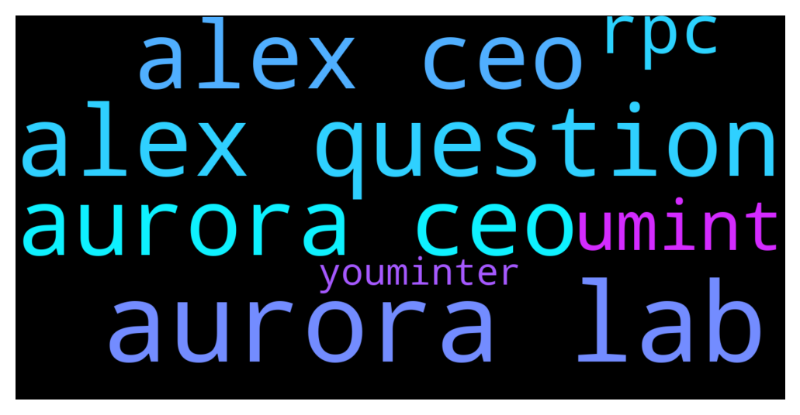

# **@cryptonear**
 ## Analysis for **2021-12-08** - **2021-12-09**.

---

## 📊 **Basic Stats**

**n_messages_sent**: 2172

---

---

## 🔝 **Top keywords and related messages**

1. **aurora lab**

    @larry_lang --- *🎙️ Aurora is an EVM built on the  NEAR Protocol that delivers a turn-key solution for developers to operate their apps.  Alex, the CEO of Aurora Labs will join us for a Telegram AMA hosted by the NEAR community on 12/9 at 2:00 PM UTC.   📍Venue: https://t.me/cryptonear 🎁 50 NEAR be rewarded to 10 selected winners who come in with thoughtful questions before or during the session.  See you!* **--->** [TG Discussion](https://t.me/cryptonear/229686)

    @Kripto_Raptor --- *🎙️ Aurora is an EVM built on the  NEAR Protocol that delivers a turn-key solution for developers to operate their apps.  Alex, the CEO of Aurora Labs will join us for a Telegram AMA hosted by the NEAR community on 12/9 at 2:00 PM UTC.   📍Venue: https://t.me/cryptonear 🎁 50 NEAR be rewarded to 10 selected winners who come in with thoughtful questions before or during the session.  See you!* **--->** [TG Discussion](https://t.me/cryptonear/230065)

    @avshevchenko --- *Thanks, that’s a nice question. Aurora RPC is only one of the options. You can set up your own RPC and send transactions. To see more, check out this: https://github.com/aurora-is-near/partner-relayer-deploy and the dependencies* **--->** [TG Discussion](https://t.me/cryptonear/230550)

    @avshevchenko --- *Stay tuned for the updates, we’re posting them in the Aurora blog: https://aurora.dev/blog* **--->** [TG Discussion](https://t.me/cryptonear/230579)

    @rimberjack --- *Hey NEARians! Have you heard of the partnership between New Order DAO and NEAR? New Order is a venture DAO that will be bringing a new era of DeFi onto Aurora  And we have them as guests as the FIRST EVER NEAR Telegram AMA guests!   at 3pm UTC (just over an hour later), RIGHT HERE, in this chat, New Order will take your Qs on what they do and how the NEAR community will benefit. Dont miss out🥳  https://twitter.com/NEARProtocol/status/1468203902667526145?s=20* **--->** [TG Discussion](https://t.me/cryptonear/228136)

    @larry_lang --- *And for further question feel free to ask us or on Aurora Channel https://t.me/auroraisnear* **--->** [TG Discussion](https://t.me/cryptonear/227233)

2. **alex question**

    @NearQuizMaster --- *📢 TELEGRAM NEAR COMMUNITY QUIZ!   Leaderboard after 10/10 rounds (ENDED):           TG@ + points CONGRATULATIONS TO THE TOP 10 PLAYERS IN THIS QUIZ. YOU WILL ALL BE REWARDED. 👏👏🏆  @cengizhantekin 90 @cuongdcc 80 @MyWalletSolutions 50 @Aflatoon123 40 @Vshashank 30 @levi_cryptoman 30 @TheGo1denBull 20 @iapehong 20 @pavelgordok 20 @Bcevmmbitgpssfbm 20  ----- CONGRATULATIONS ALSO TO ALL THE OTHERS WHO GOT POINTS💪💪 @Jezeus 10 @DeathBag 10 @wildfire007 10 @thanano46 10 @ivan_warrior 10 @luciferisnoob 10 @iaman38 10 @Abdelillah77 10 @NEARverse_xd 10 @andotran 10  +4 PARTICIPANTS CHOSEN RANDOMLY WILL WIN $ 100 EACH 🔥🔥  🌟 How it works:  🔹The quiz starts on Thursday 2nd December and will end on Wednesday 8th December (no questions during the weekend).  🔹The quiz takes place over 5 days, with 2 rounds per day. Be sure not to miss any! 🔹Questions will be posted at random times. We’ll try to ensure that all time zones have a chance to participate. 🔹The first person to correctly answer a question will get 10 points. NO EDITED ANSWER WILL BE ACCEPTED.   🔍The questions can relate to the following topics: NEAR Projects, NEAR Ecosystem, NEAR Tech.  🎁 Prizes in NEAR for the quiz: 1st place: $500 2nd place: $400  3rd place: $300  4th place: $200 5th place: $150 6th-10th place: $100 each + 4 random participants who attempted the quiz get a chance to win $100!  🏆 LEADERBOARD - it will be updated after each round: https://docs.google.com/spreadsheets/d/1KRPcFCt9CdkErM0Uyt561VLakL3DpHC4wrolA_Nq1-Y/edit?usp=sharing* **--->** [TG Discussion](https://t.me/cryptonear/228945)

    @larry_lang --- *🎙️ Aurora is an EVM built on the  NEAR Protocol that delivers a turn-key solution for developers to operate their apps.  Alex, the CEO of Aurora Labs will join us for a Telegram AMA hosted by the NEAR community on 12/9 at 2:00 PM UTC.   📍Venue: https://t.me/cryptonear 🎁 50 NEAR be rewarded to 10 selected winners who come in with thoughtful questions before or during the session.  See you!* **--->** [TG Discussion](https://t.me/cryptonear/229686)

    @NearQuizMaster --- *📢 TELEGRAM NEAR COMMUNITY QUIZ!   Leaderboard after 10/10 rounds (ENDED):           TG@ + points CONGRATULATIONS TO THE TOP 10 PLAYERS IN THIS QUIZ. YOU WILL ALL BE REWARDED. 👏👏🏆  @cengizhantekin 90 @cuongdcc 80 @MyWalletSolutions 50 @Aflatoon123 40 @Vshashank 30 @levi_cryptoman 30 @TheGo1denBull 20 @iapehong 20 @pavelgordok 20 @Bcevmmbitgpssfbm 20  ----- CONGRATULATIONS ALSO TO ALL THE OTHERS WHO GOT POINTS💪💪 @Jezeus 10 @DeathBag 10 @wildfire007 10 @thanano46 10 @ivan_warrior 10 @luciferisnoob 10 @iaman38 10 @Abdelillah77 10 @NEARverse_xd 10 @andotran 10  +4 PARTICIPANTS CHOSEN RANDONMLY WILL WIN $ 100 EACH 🔥🔥  🌟 How it works:  🔹The quiz starts on Thursday 2nd December and will end on Wednesday 8th December (no questions during the weekend).  🔹The quiz takes place over 5 days, with 2 rounds per day. Be sure not to miss any! 🔹Questions will be posted at random times. We’ll try to ensure that all time zones have a chance to participate. 🔹The first person to correctly answer a question will get 10 points. NO EDITED ANSWER WILL BE ACCEPTED.   🔍The questions can relate to the following topics: NEAR Projects, NEAR Ecosystem, NEAR Tech.  🎁 Prizes in NEAR for the quiz: 1st place: $500 2nd place: $400  3rd place: $300  4th place: $200 5th place: $150 6th-10th place: $100 each + 4 random participants who attempted the quiz get a chance to win $100!  🏆 LEADERBOARD - it will be updated after each round: https://docs.google.com/spreadsheets/d/1KRPcFCt9CdkErM0Uyt561VLakL3DpHC4wrolA_Nq1-Y/edit?usp=sharing* **--->** [TG Discussion](https://t.me/cryptonear/228105)

    @Kripto_Raptor --- *🎙️ Aurora is an EVM built on the  NEAR Protocol that delivers a turn-key solution for developers to operate their apps.  Alex, the CEO of Aurora Labs will join us for a Telegram AMA hosted by the NEAR community on 12/9 at 2:00 PM UTC.   📍Venue: https://t.me/cryptonear 🎁 50 NEAR be rewarded to 10 selected winners who come in with thoughtful questions before or during the session.  See you!* **--->** [TG Discussion](https://t.me/cryptonear/230065)

    @Kripto_Raptor --- *So you ready Alex? Just before we start, we want to thank you all for participating and get your questions coming in.* **--->** [TG Discussion](https://t.me/cryptonear/230079)

    @Kripto_Raptor --- *Only the first 5 questions that Alex choose to answer will be rewarded* **--->** [TG Discussion](https://t.me/cryptonear/230140)

3. **alex ceo**

    @larry_lang --- *🎙️ Aurora is an EVM built on the  NEAR Protocol that delivers a turn-key solution for developers to operate their apps.  Alex, the CEO of Aurora Labs will join us for a Telegram AMA hosted by the NEAR community on 12/9 at 2:00 PM UTC.   📍Venue: https://t.me/cryptonear 🎁 50 NEAR be rewarded to 10 selected winners who come in with thoughtful questions before or during the session.  See you!* **--->** [TG Discussion](https://t.me/cryptonear/229686)

    @Kripto_Raptor --- *🎙️ Aurora is an EVM built on the  NEAR Protocol that delivers a turn-key solution for developers to operate their apps.  Alex, the CEO of Aurora Labs will join us for a Telegram AMA hosted by the NEAR community on 12/9 at 2:00 PM UTC.   📍Venue: https://t.me/cryptonear 🎁 50 NEAR be rewarded to 10 selected winners who come in with thoughtful questions before or during the session.  See you!* **--->** [TG Discussion](https://t.me/cryptonear/230065)

    @Kripto_Raptor --- *So you ready Alex? Just before we start, we want to thank you all for participating and get your questions coming in.* **--->** [TG Discussion](https://t.me/cryptonear/230079)

    @Kripto_Raptor --- *one last question from me Alex* **--->** [TG Discussion](https://t.me/cryptonear/230569)

    @Kripto_Raptor --- *alright, Alex feel free to pick some questions from our community* **--->** [TG Discussion](https://t.me/cryptonear/230549)

    @Kripto_Raptor --- *Only the first 5 questions that Alex choose to answer will be rewarded* **--->** [TG Discussion](https://t.me/cryptonear/230140)

4. **aurora ceo**

    @larry_lang --- *🎙️ Aurora is an EVM built on the  NEAR Protocol that delivers a turn-key solution for developers to operate their apps.  Alex, the CEO of Aurora Labs will join us for a Telegram AMA hosted by the NEAR community on 12/9 at 2:00 PM UTC.   📍Venue: https://t.me/cryptonear 🎁 50 NEAR be rewarded to 10 selected winners who come in with thoughtful questions before or during the session.  See you!* **--->** [TG Discussion](https://t.me/cryptonear/229686)

    @Kripto_Raptor --- *🎙️ Aurora is an EVM built on the  NEAR Protocol that delivers a turn-key solution for developers to operate their apps.  Alex, the CEO of Aurora Labs will join us for a Telegram AMA hosted by the NEAR community on 12/9 at 2:00 PM UTC.   📍Venue: https://t.me/cryptonear 🎁 50 NEAR be rewarded to 10 selected winners who come in with thoughtful questions before or during the session.  See you!* **--->** [TG Discussion](https://t.me/cryptonear/230065)

    @avshevchenko --- *Thanks, that’s a nice question. Aurora RPC is only one of the options. You can set up your own RPC and send transactions. To see more, check out this: https://github.com/aurora-is-near/partner-relayer-deploy and the dependencies* **--->** [TG Discussion](https://t.me/cryptonear/230550)

    @avshevchenko --- *Stay tuned for the updates, we’re posting them in the Aurora blog: https://aurora.dev/blog* **--->** [TG Discussion](https://t.me/cryptonear/230579)

    @rimberjack --- *Hey NEARians! Have you heard of the partnership between New Order DAO and NEAR? New Order is a venture DAO that will be bringing a new era of DeFi onto Aurora  And we have them as guests as the FIRST EVER NEAR Telegram AMA guests!   at 3pm UTC (just over an hour later), RIGHT HERE, in this chat, New Order will take your Qs on what they do and how the NEAR community will benefit. Dont miss out🥳  https://twitter.com/NEARProtocol/status/1468203902667526145?s=20* **--->** [TG Discussion](https://t.me/cryptonear/228136)

    @larry_lang --- *And for further question feel free to ask us or on Aurora Channel https://t.me/auroraisnear* **--->** [TG Discussion](https://t.me/cryptonear/227233)

5. **umint**

    @larry_lang --- *in this case the youminter token i assume* **--->** [TG Discussion](https://t.me/cryptonear/229929)

    @larry_lang --- *oh the youminter one=)))* **--->** [TG Discussion](https://t.me/cryptonear/229836)

    @Khufwy --- *where and when is umint going to be listed? and i guess the pair will be umint/near?* **--->** [TG Discussion](https://t.me/cryptonear/229868)

    @Khufwy --- *purchased umint amount is changing real time, sorry its probably like that* **--->** [TG Discussion](https://t.me/cryptonear/229856)

    @Khufwy --- *for instance, youminter* **--->** [TG Discussion](https://t.me/cryptonear/229837)

    @Wojak_near --- *The official youminter telegroup is totally Russian one, I need an English group* **--->** [TG Discussion](https://t.me/cryptonear/229844)

6. **rpc**

    @avshevchenko --- *Thanks, that’s a nice question. Aurora RPC is only one of the options. You can set up your own RPC and send transactions. To see more, check out this: https://github.com/aurora-is-near/partner-relayer-deploy and the dependencies* **--->** [TG Discussion](https://t.me/cryptonear/230550)

    @ten10ten1011 --- *I was playing a bit with Aurora and was a bit confused with the RPC architecture. As I understand the Aurora architecture, the only way to submit the new blocks to the Aurora mainnet is by using the relay.aurora account. Will the Aurora be centralized around the main RPC that could only submit the new blocks?  Will it be possible to submit new @avshevchenko* **--->** [TG Discussion](https://t.me/cryptonear/230307)

    @avshevchenko --- *Yes, we expect the big wave of users and projects. In fact every week on Aurora we have at least 3 projects rolling out and the spiral only goes up.  The big amount of users result in higher load on the RPC servers, so we’re improving them as fast as possible. In fact we’re doing something that is yet unseen in the blockchain space. We’re changing the way how RPC works from the traditional approaches to the ‘message bus’, which is how Google is working at the moment. This stack of tech is one of the things that will enable Aurora to scale to billion users.  At the moment Aurora is capable of processing the amount of transactions close to what Ethereum is showing. In the short term we expect that the throughput will increase x10 due to various performance upgrades. Afterwards, the sharding of NEAR will come into play and enable the unprecidented scaling of EVM.* **--->** [TG Discussion](https://t.me/cryptonear/230100)

    @avshevchenko --- *This is decided by the RPC. At the moment the rate is 0. So Aurora users are paying 0 gas fees for the transactions. Amazing, huh?* **--->** [TG Discussion](https://t.me/cryptonear/230567)

7. **youminter**

    @larry_lang --- *in this case the youminter token i assume* **--->** [TG Discussion](https://t.me/cryptonear/229929)

    @larry_lang --- *oh the youminter one=)))* **--->** [TG Discussion](https://t.me/cryptonear/229836)

    @Khufwy --- *for instance, youminter* **--->** [TG Discussion](https://t.me/cryptonear/229837)

    @Wojak_near --- *The official youminter telegroup is totally Russian one, I need an English group* **--->** [TG Discussion](https://t.me/cryptonear/229844)

