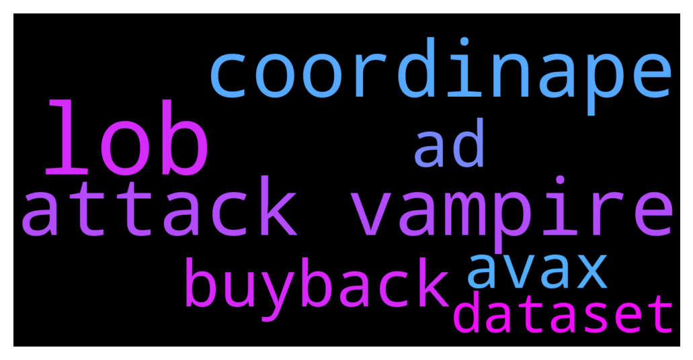

# **@lobsters_chat**
 ## Analysis for **2021-12-08** - **2021-12-09**.

---

## 📊 **Basic Stats**

**n_messages_sent**: 379

---

---

## 🔝 **Top keywords and related messages**

1. **lob**

    @ivangbi --- *Lobs list doesn’t account for 10+ txs, only the governance wallets - correct, @igimal?* **--->** [TG Discussion](https://t.me/lobsters_chat/306129)

    @ivangbi --- *Yes, I didn’t even think u did it for lobs. They are by default not bots haha* **--->** [TG Discussion](https://t.me/lobsters_chat/306141)

    @tech_digger --- *Using Lobs wallet only for governance is the case for many of us here.* **--->** [TG Discussion](https://t.me/lobsters_chat/306138)

    @Siimmoonn --- *any chance to get on the list with lobs in a wallet < 10 tx? ^^* **--->** [TG Discussion](https://t.me/lobsters_chat/306126)

    @ivangbi --- *Ye I am aware, I didn’t think the 10+ was a requirement for lobs. See, discussing with community already proves itself!* **--->** [TG Discussion](https://t.me/lobsters_chat/306139)

    @igimal --- *now it checks 10+ txs… but agree - we can remove this from LOBS holders, cause there are not bots. yeah?* **--->** [TG Discussion](https://t.me/lobsters_chat/306140)

2. **attack vampire**

    @laurence_e_day --- *to be fair i think most of us understand 'vampire attack' a bit better* **--->** [TG Discussion](https://t.me/lobsters_chat/306176)

    @SpikeSpiege1 --- *Don't you think using "Vampire Attack" as opposed to "Liquidity Migration event" to promote it was a call to war? You sell it as an attack and protocols treat it as one and things escalate.* **--->** [TG Discussion](https://t.me/lobsters_chat/306168)

    @DecentralizedPlanetarian --- *Vampire attack is understood, hence the word choice* **--->** [TG Discussion](https://t.me/lobsters_chat/306169)

    @Q --- *Curious when will the need for Trusted Third party (TTP) the central premise of TradFi be seen as inappropriate with almost near time settlement on blockchain eliminates counterparty risks.   And the only solution to a bank run in fractional banking is a ability of a grand bank the Fed to add several zeros to the ledge stating the balance of assets and if there is trust something similar can be easily done with Crypto coins like $UST   If decentralization of web 2 ( TCP/IP, DNS, HTTP) worked at scale and attacks like DDOS have been mitigated there is much to learn from DeFi and much to change in TTP regulations of TradFi* **--->** [TG Discussion](https://t.me/lobsters_chat/305665)

    @perpetual_losses --- *Has anyone heard about somekind of dusting attack related to the BitMart hack?* **--->** [TG Discussion](https://t.me/lobsters_chat/305705)

3. **coordinape**

    @FiveBoroughs --- *Coordinape* **--->** [TG Discussion](https://t.me/lobsters_chat/306020)

    @wloka --- *sushi’s also on coordinape tho* **--->** [TG Discussion](https://t.me/lobsters_chat/306028)

    @b0dhidharma --- *Yeah, I think coordinape has a lot to do with it - but it’s not only that. Probably the mindset that culture needs to be worked on, create frameworks for it.* **--->** [TG Discussion](https://t.me/lobsters_chat/306027)

4. **buyback**

    @ivangbi --- *what’s the tldr on buyback stuff?* **--->** [TG Discussion](https://t.me/lobsters_chat/306193)

    @wyxua --- *They’re doing a buyback to “solve” the wnxm discount by returning it to book value* **--->** [TG Discussion](https://t.me/lobsters_chat/306194)

5. **ad**

    @rasikhmorani --- *Metadata: "In the interest of the Sushi Community I am resigning as CTO effective immediately. I very much enjoyed the things that we built together and will look back positively on this moment. https://media3.giphy.com/media/CmfPKzD1Lreb8lhgfh/giphy.gif  I wish Sushi the best and am saddened that Sushi is so imperiled within and without. The chaos that is occurring now is unlikely to result in a resolution that will leave the DAO as much more of a shadow than it once was without a radical structural transformation. I highly recommend the installation of a C-suite from outside the DAO and give them the tools to effectively manage a team. Be wary of any self proclaimed leaders arising from the current core team.  Now in my opinion is the time to bring together the community and move towards an effective resolution together.  I am standing by to dutifully hand over any accounts or information necessary to the next leader that is selected.  I am now going to take a one month vacation with my wife and kids and go build my next project. Long live Sushi 🍣"* **--->** [TG Discussion](https://t.me/lobsters_chat/305999)

    @andrecronje --- *When paid for ads?* **--->** [TG Discussion](https://t.me/lobsters_chat/306109)

    @tesslerc --- *Ads should be paid for and go towards lobster dao.* **--->** [TG Discussion](https://t.me/lobsters_chat/306127)

    @sambacha --- *look at how linux kernel has been decimated by adoption of said code of conduct* **--->** [TG Discussion](https://t.me/lobsters_chat/305697)

    @DecentralizedPlanetarian --- *liquidity migrations help everyone progress faster by innovating more... instead piedao decides to blacklist addresses* **--->** [TG Discussion](https://t.me/lobsters_chat/306167)

    @michael_p3711 --- *source: ignore the advertising that is my username* **--->** [TG Discussion](https://t.me/lobsters_chat/306119)

6. **avax**

    @Singl3M --- *have u guys seen the rumors of this potential avax exploit where the dude can just take control of ur entire wallet by sending a fake avax coin? no clue if true but was wondering if anyone heard bout it* **--->** [TG Discussion](https://t.me/lobsters_chat/306113)

    @eth2enthusiast --- *you could try the hardhat template written for sharedtools.org here https://github.com/chimera-defi/hardhat-template it uses a hardhat-framework repo https://github.com/chimera-defi/hardhat-framework/blob/master/index.js#L153-L175 which should work for avax, matic, metis, fantom, moonbeam, bsc, eth  or you can go upstream and try boringCrypto's hardhat framework or the sushi one for cross chain deploys. feel free to make prs/open issues too* **--->** [TG Discussion](https://t.me/lobsters_chat/305972)

    @ChiTimesChi --- *Ser, a few notes on dex aggregators:  ParaSwap works on ETH/Polygon/BSC/Avax  Matcha works on ETH/Polygon/BSC/Avax/Fantom  For niche chains like Fantom, where the biggest aggregators aren't really there (and Matcha support for Fantom is quite limited tbh) you might want to review smaller aggregators like FireBird and OpenOcean.* **--->** [TG Discussion](https://t.me/lobsters_chat/305850)

    @Singl3M --- *oh no the username is a way i try to scam ppl in a comical way, also what do u think i am advertising by posting potential avax fud are u okay lmfao* **--->** [TG Discussion](https://t.me/lobsters_chat/306120)

7. **dataset**

    @capa1di --- *speaking of dataset on funds, i was wondering if there is a way to know the amount of each investment made by a VC? Say i would like to know the biggest check ever written by a16z?  i dont think they publish data like this, but still wanted to give it a try and hope some people have interesting VC stats tools.* **--->** [TG Discussion](https://t.me/lobsters_chat/306046)

    @deranzxc --- *Is there a dataset lying around on list of angels/funds as well as things liek  amount raised | seed | valuation at raise etcetc* **--->** [TG Discussion](https://t.me/lobsters_chat/306043)

