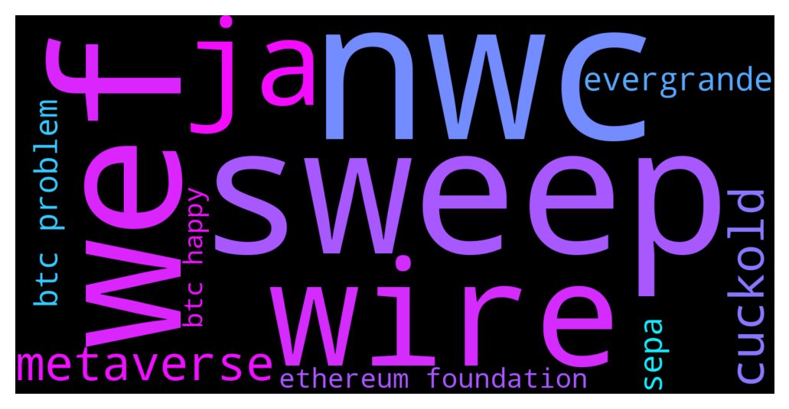

# **@whalepoolbtc**
 ## Analysis for **2021-12-08** - **2021-12-09**.

---

## 📊 **Basic Stats**

**n_messages_sent**: 1269

---

---

## 🔝 **Top keywords and related messages**

1. **nwc**

    @Horselorde --- *NWC is not top 5 which is what we talk about here* **--->** [TG Discussion](https://t.me/whalepoolbtc/4077610)

    @barlie30 --- *Go for long term token like Nwc, they're about to release something new* **--->** [TG Discussion](https://t.me/whalepoolbtc/4077541)

    @rogerredis --- *man, nwc is most shilled coin ever. There were here even before duo shill bots were invented 😀 Literall #1 shitcoin spam ever* **--->** [TG Discussion](https://t.me/whalepoolbtc/4077611)

2. **sweep**

    @rogerredis --- *Every single timeframe is trending down. Sweep 53k, fill the gap, annihilate all hopes then continue down. Full blown bear market calls guaranteed* **--->** [TG Discussion](https://t.me/whalepoolbtc/4077584)

    @Painbtc --- *sweep sweet sweet sweep* **--->** [TG Discussion](https://t.me/whalepoolbtc/4077522)

    @rogerredis --- *Or maybe find something from 5 years ago, cause that's all what you can do when you can't accept fact that bears can be right and they can also anticipate upcoming sweeps up* **--->** [TG Discussion](https://t.me/whalepoolbtc/4077592)

3. **wef**

    @MiLostUC --- *Sirs why isnt WEF against crypto* **--->** [TG Discussion](https://t.me/whalepoolbtc/4077448)

    @Kitty856 --- *WEF is on ethereum foundation board* **--->** [TG Discussion](https://t.me/whalepoolbtc/4077467)

    @rav1459 --- *What does wef do beside shilling Chainlink all day* **--->** [TG Discussion](https://t.me/whalepoolbtc/4077449)

4. **wire**

    @GenghisKhan276 --- *You could try wire* **--->** [TG Discussion](https://t.me/whalepoolbtc/4077256)

    @kakola1 --- *How to deposit a lot of usd?   FTX.US- 500usd limit BinanceUS - not available for Texas Coinbase - n/a for me Kraken - doesn't support ACH, only wire What else?* **--->** [TG Discussion](https://t.me/whalepoolbtc/4077253)

    @icherevkov --- *Send wire* **--->** [TG Discussion](https://t.me/whalepoolbtc/4077254)

5. **ja**

    @rocket_fuel --- *Money manager Jason Ader will submit plans on Dec. 10 for a casino in the New York area that features ‘the world’s largest cryptocurrency trading floor'  🔗 Learn more* **--->** [TG Discussion](https://t.me/whalepoolbtc/4076036)

    @nnxwat --- *DISCOVERY OF A FOURTH OMICRON VARIATION IN JAPAN. - TV ASAHI (FJ)* **--->** [TG Discussion](https://t.me/whalepoolbtc/4076313)

    @Kitty856 --- *ETH doing same as Jan 2018* **--->** [TG Discussion](https://t.me/whalepoolbtc/4077329)

    @Xuvinator --- *It's not, nobody locks down and force jabs for the flu* **--->** [TG Discussion](https://t.me/whalepoolbtc/4076323)

    @ApacheSJM --- *Making GIFs about saj throwing his bags, public rekting via x750 always long jackpot life crew with the odd threat of suicide.* **--->** [TG Discussion](https://t.me/whalepoolbtc/4077501)

    @IndianTonic --- *Ja ja ich bin ein Berliner* **--->** [TG Discussion](https://t.me/whalepoolbtc/4077437)

6. **metaverse**

    @Bortishere --- *Why is this metaverse shit happening now ... as well as NFTs crypto is gonna get even shitter* **--->** [TG Discussion](https://t.me/whalepoolbtc/4077100)

    @valhala911 --- *is metaverse still a thing in crypto* **--->** [TG Discussion](https://t.me/whalepoolbtc/4077259)

    @kane717 --- *Waiting for the metaverse announcement* **--->** [TG Discussion](https://t.me/whalepoolbtc/4077651)

    @alders123 --- *Don’t worry guys, you’re net worth in the metaverse is still at all time highs!* **--->** [TG Discussion](https://t.me/whalepoolbtc/4077460)

7. **cuckold**

    @SD107 --- *Lol little cuckold trying to be funny* **--->** [TG Discussion](https://t.me/whalepoolbtc/4077568)

    @SD107 --- *Haha cuckold together strong* **--->** [TG Discussion](https://t.me/whalepoolbtc/4077573)

8. **evergrande**

    @Saj_le_Great --- *youre safer buying evergrande paper* **--->** [TG Discussion](https://t.me/whalepoolbtc/4077284)

    @Tjernob --- *Is this evergrande shieeey again or another fud* **--->** [TG Discussion](https://t.me/whalepoolbtc/4077562)

    @nnxwat --- *BREAKING: Chinese property giant Evergrande has defaulted (SI)* **--->** [TG Discussion](https://t.me/whalepoolbtc/4077278)

    @Painbtc --- *Focus on why blackrock will be pulling them out of evergrande debt.* **--->** [TG Discussion](https://t.me/whalepoolbtc/4076487)

9. **sepa**

    @jjj1616 --- *loool... i answered to dude on ftx group why they don't have stable sepa banking and the reason is regulations and i was banned. Nice exchange. Many people complain about sepa transfers there* **--->** [TG Discussion](https://t.me/whalepoolbtc/4077402)

10. **btc problem**

    @pleb2king --- *Hey guys, I bought around 35 bitcoins a few years ago (2015) when it was around $280 USD each. I have never bought anything else, no icos, no shitcoins, just 1 purchase of 35 Bitcoins. I held through the 2017 bull run and 3 year bear market after that, nearly committed suicide for not selling. I don’t want to hold for another 3+ years bear market like the pleb I was not selling in 2017 and buying back cheaper. I am getting an itchy feeling that BTC is running out of steam, what do you guys think? Sell it all and wait for 2023 to buy back? Doing a 3x of 35 BTC to 105 BTC would be great for me if Bear market dumps 90% again.* **--->** [TG Discussion](https://t.me/whalepoolbtc/4077308)

    @Kitty856 --- *He set up a llc called Macrostrategy for holding BTC* **--->** [TG Discussion](https://t.me/whalepoolbtc/4077366)

    @Painbtc --- *remember templeOS and terry discovered BTC and bred a new era of Quant traders* **--->** [TG Discussion](https://t.me/whalepoolbtc/4077274)

    @arbullz --- *yea i can see that as a catalyst but my point is the fundamental picture hasnt changed, and btc is not grossly overvalued in relation to other assets yet* **--->** [TG Discussion](https://t.me/whalepoolbtc/4077654)

    @arbullz --- *i seriously wonder what is the bears fundamental analysis on why btc should drop 50% or more from here* **--->** [TG Discussion](https://t.me/whalepoolbtc/4077634)

    @W4SS4 --- *Protect your btc money in eth* **--->** [TG Discussion](https://t.me/whalepoolbtc/4077169)

11. **ethereum foundation**

    @Kitty856 --- *Check Ethereum foundation website* **--->** [TG Discussion](https://t.me/whalepoolbtc/4077468)

    @Kitty856 --- *WEF is on ethereum foundation board* **--->** [TG Discussion](https://t.me/whalepoolbtc/4077467)

    @Rogier_E --- *Lol whut, Ethereum is basically Amazon AWS* **--->** [TG Discussion](https://t.me/whalepoolbtc/4076978)

    @aejwj1 --- *“Ethereum is open to all of the futures, and does not have to commit to an opinion about which one will necessarily win.”  Translation: We don’t know how to make this shit work.* **--->** [TG Discussion](https://t.me/whalepoolbtc/4075889)

12. **btc happy**

    @pleb2king --- *Hey guys, I bought around 35 bitcoins a few years ago (2015) when it was around $280 USD each. I have never bought anything else, no icos, no shitcoins, just 1 purchase of 35 Bitcoins. I held through the 2017 bull run and 3 year bear market after that, nearly committed suicide for not selling. I don’t want to hold for another 3+ years bear market like the pleb I was not selling in 2017 and buying back cheaper. I am getting an itchy feeling that BTC is running out of steam, what do you guys think? Sell it all and wait for 2023 to buy back? Doing a 3x of 35 BTC to 105 BTC would be great for me if Bear market dumps 90% again.* **--->** [TG Discussion](https://t.me/whalepoolbtc/4077308)

    @Kitty856 --- *He set up a llc called Macrostrategy for holding BTC* **--->** [TG Discussion](https://t.me/whalepoolbtc/4077366)

    @Painbtc --- *remember templeOS and terry discovered BTC and bred a new era of Quant traders* **--->** [TG Discussion](https://t.me/whalepoolbtc/4077274)

    @arbullz --- *yea i can see that as a catalyst but my point is the fundamental picture hasnt changed, and btc is not grossly overvalued in relation to other assets yet* **--->** [TG Discussion](https://t.me/whalepoolbtc/4077654)

    @arbullz --- *i seriously wonder what is the bears fundamental analysis on why btc should drop 50% or more from here* **--->** [TG Discussion](https://t.me/whalepoolbtc/4077634)

    @W4SS4 --- *Protect your btc money in eth* **--->** [TG Discussion](https://t.me/whalepoolbtc/4077169)

