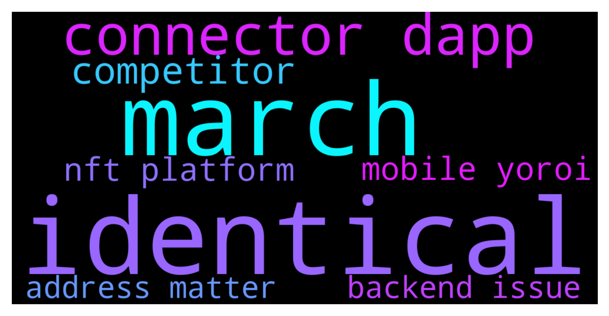

# **@Cardano**
 ## Analysis for **2021-12-09** - **2021-12-10**.

---

## 📊 **Basic Stats**

**n_messages_sent**: 104

---

---

## 🔝 **Top keywords and related messages**

1. **identical**

    @DimkaT --- *Telegram is a free platform. you can be identical to anyone you want. :)* **--->** [TG Discussion](https://t.me/Cardano/757030)

    @ratskim --- *man, new users must get so confused with the fake Fabian (Zyroxa) who has been here for months - his name and profile pic are almost identical* **--->** [TG Discussion](https://t.me/Cardano/757018)

2. **march**

    @daaviid0r --- *I own since march the actual price is getting close as march's...* **--->** [TG Discussion](https://t.me/Cardano/756974)

3. **connector dapp**

    @secureduser1 --- *It is been planned as AstarterPad ran their first transaction with the Yoroi Dapp connector. Stay tuned for more enticing projects coming into Cardano Ecosystem* **--->** [TG Discussion](https://t.me/Cardano/756968)

    @ratskim --- *'dAPP connector' makes me think of an extension for the desktop version of Yoroi - is it also for the mobile version?* **--->** [TG Discussion](https://t.me/Cardano/756982)

4. **competitor**

    @Deji --- *Hey everyone!  cardano's favorite centralized competitor just slowed to a crawl due to a distributed denial of service attack.  Don't cry.  Be strong.* **--->** [TG Discussion](https://t.me/Cardano/757165)

    @Lgbeano --- *I remember when people used to say Tron was Cardano's competitor* **--->** [TG Discussion](https://t.me/Cardano/757173)

5. **mobile yoroi**

    @secureduser1 --- *It is been planned as AstarterPad ran their first transaction with the Yoroi Dapp connector. Stay tuned for more enticing projects coming into Cardano Ecosystem* **--->** [TG Discussion](https://t.me/Cardano/756968)

    @apex_pool_spo --- *probably only for desktop, and it's not released yet (only in Yoroi Nightly).* **--->** [TG Discussion](https://t.me/Cardano/756984)

    @ratskim --- *'dAPP connector' makes me think of an extension for the desktop version of Yoroi - is it also for the mobile version?* **--->** [TG Discussion](https://t.me/Cardano/756982)

    @ratskim --- *is it planned for Yoroi mobile to be able to interact with dAPS in the near future? or will we need to migrate our funds/create a new wallet with a third party?* **--->** [TG Discussion](https://t.me/Cardano/756963)

    @Busssard --- *is there a reason why past transaction show a failed status after porting from daedaölus to yoroi?* **--->** [TG Discussion](https://t.me/Cardano/757072)

    @apex_pool_spo --- *Yoroi has an option "Send all assets". Yo can restore your wallet in Yoroi and do this.* **--->** [TG Discussion](https://t.me/Cardano/756609)

6. **nft platform**

    @DimkaT --- *Telegram is a free platform. you can be identical to anyone you want. :)* **--->** [TG Discussion](https://t.me/Cardano/757030)

    @adaantonwihardja --- *if it is already on the blockchain you dont need to move it ledger is only a "key" to access your nft* **--->** [TG Discussion](https://t.me/Cardano/756565)

    @DropLipTootsy --- *I got a wallet + a ledger wallet. Want to move my NFT’s from my regular wallet to the ledger wallet* **--->** [TG Discussion](https://t.me/Cardano/756585)

    @DropLipTootsy --- *I’m trying to send my NFT’s from Daedalus to ledger, is there a way where I can send them all at once?* **--->** [TG Discussion](https://t.me/Cardano/756561)

    @myyfreedom --- *hey guys any new platform for nft cardano* **--->** [TG Discussion](https://t.me/Cardano/757029)

7. **address matter**

    @BarracudaCrypto --- *If I undelegate and delegate to another pool, do I keep my wallet address or will it change? I'm wondering because there are multiple addresses for receiving ADA in Daedalus.* **--->** [TG Discussion](https://t.me/Cardano/756905)

    @apex_pool_spo --- *6 days ago, the address with more rewards had 130k. the rewards are from a period with 130k in the wallet.  with this transactions, 65k were sent to a different wallet:  https://cardanoscan.io/transaction/6f2dad17d35e568f5197e8e3f4a8aa072232337e2a6117b2f3fab0dca0588c49* **--->** [TG Discussion](https://t.me/Cardano/756754)

    @Zyroxa --- *This isnt possible. Do you have an address of each wallet to verify?* **--->** [TG Discussion](https://t.me/Cardano/756744)

    @glitch04 --- *Your stake address does not change unless you change wallets* **--->** [TG Discussion](https://t.me/Cardano/756910)

    @mojitostakepool --- *You can use any address , no matter the stake* **--->** [TG Discussion](https://t.me/Cardano/756909)

    @BarracudaCrypto --- *Does anyone know where I can find my wallet address which I used for staking in Daedalus?* **--->** [TG Discussion](https://t.me/Cardano/756903)

8. **backend issue**

    @apex_pool_spo --- *you don't need to do much, just refresh the page and have some patience until the backend issues are resolved.* **--->** [TG Discussion](https://t.me/Cardano/757091)

