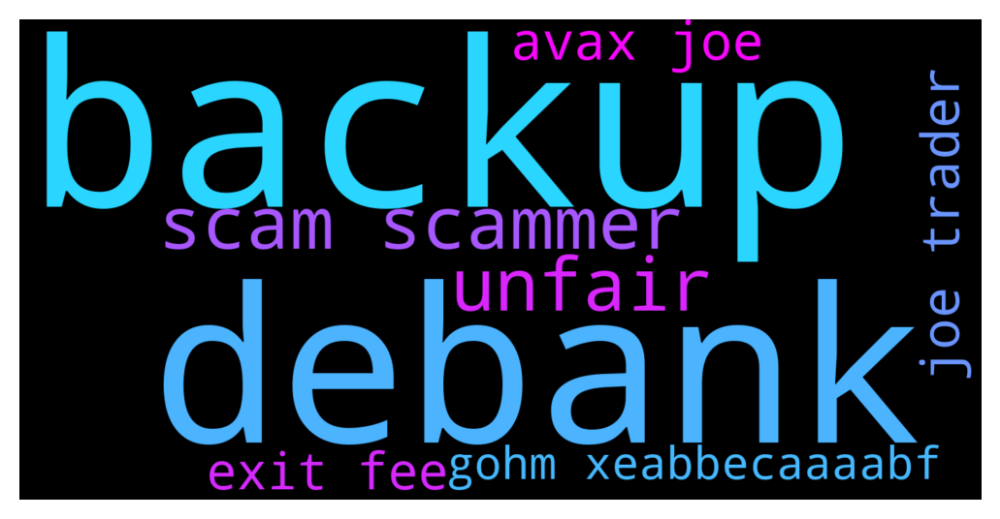

# **@OlympusTG**
 ## Analysis for **2021-12-09** - **2021-12-10**.

---

## 📊 **Basic Stats**

**n_messages_sent**: 1902

---

---

## 🔝 **Top keywords and related messages**

1. **backup**

    @Ap0l1o --- *If the primary site has issues, use one of the backup sites provided above* **--->** [TG Discussion](https://t.me/OlympusTG/112732)

    @cdp279 --- *#backup* **--->** [TG Discussion](https://t.me/OlympusTG/112490)

    @Poopoo --- *I think someone had the same issue backup site worked, so not too sure, might as well try* **--->** [TG Discussion](https://t.me/OlympusTG/111778)

    @Poopoo --- *if everything doesn't work try the backup sites* **--->** [TG Discussion](https://t.me/OlympusTG/111775)

    @Pierre --- *well, still no luck after restarting my computer, both the app and the backup sites still show 0 ohm staked.* **--->** [TG Discussion](https://t.me/OlympusTG/112550)

    @Pierre --- *Thanks but I got the same result with the backup link - 0 staked, I can see the transaction in etherscan though* **--->** [TG Discussion](https://t.me/OlympusTG/112492)

2. **debank**

    @Pierre --- *Ah, I see it at debank.com* **--->** [TG Discussion](https://t.me/OlympusTG/112541)

    @bike4peace --- *I usually use debank to see portfolio* **--->** [TG Discussion](https://t.me/OlympusTG/112533)

    @Poopoo --- *if it is showing in debank, then pretty sure it's an issue with Metamask* **--->** [TG Discussion](https://t.me/OlympusTG/112554)

    @Poopoo --- *if it is in debank then surely you still have it. Double check your metamask wallet address, maybe you have a second address? Double check you're on the real metamask* **--->** [TG Discussion](https://t.me/OlympusTG/112551)

    @cdp279 --- *Did you refresh cache? It usually works for me dude. Otherwise you can look at debank.* **--->** [TG Discussion](https://t.me/OlympusTG/112493)

    @Pierre --- *ok, I have deleted 30 days worth of cache and still same issue. I guess I'll try again another day. I do see it in debank, so that's fine. Thanks all for your help. I'll come back if it does not resolve itself in a few days. Much appreciated 😊* **--->** [TG Discussion](https://t.me/OlympusTG/112556)

3. **scam scammer**

    @Pierre --- *and someone DMed me https://olympus-dao.com/ - which I assume is a scam site?* **--->** [TG Discussion](https://t.me/OlympusTG/112534)

    @Edkamau --- *Is Olympus Bot a Scam because I just got DM by them* **--->** [TG Discussion](https://t.me/OlympusTG/112425)

    @Elliot --- *dont fall for dm scammers* **--->** [TG Discussion](https://t.me/OlympusTG/112326)

    @BROHMZ --- *Chains that have no advantage over other chains and are just home to shitcoins and scam projects* **--->** [TG Discussion](https://t.me/OlympusTG/111741)

    @bike4peace --- *It’s scam* **--->** [TG Discussion](https://t.me/OlympusTG/112508)

    @Poopoo --- *ok, I think there is a balance between the two, I don't want to just say trust me but you've got a point, too many scammers here. I am not the mod here but I am the mod of the official Chinese telegram so I promise I'm not a scammer 😆* **--->** [TG Discussion](https://t.me/OlympusTG/112606)

4. **unfair**

    @f. I. r --- *I can understand the need to upgrade but "forcing" us to pay for the crazy high fee is unfair* **--->** [TG Discussion](https://t.me/OlympusTG/112385)

    @f. I. r --- *I find that it's unfair for us to pay for gas fee.* **--->** [TG Discussion](https://t.me/OlympusTG/112382)

    @Poopoo --- *I don't see how it is unfair, when we entered the pool we were already aware that we would need to eventually withdraw it, it doesn't say it would automatically reenter each round but it does, which is already a plus for me. I personally left my sOHM in the 33T pool knowing that there won't be any rebase, because it's not worth it for me to remove it* **--->** [TG Discussion](https://t.me/OlympusTG/112386)

5. **avax joe**

    @NaNaNaSa87 --- *So i am a bit lost here, if i wanted to swap AVAX so i can stake OHM, which one i need to buy ? WSohm or Gohm ?And why i can only add WSohm to my metamask but can't add Gohm?* **--->** [TG Discussion](https://t.me/OlympusTG/111677)

    @Miguel_ecu --- *You can buy gOHM on Avalanche with trader joe* **--->** [TG Discussion](https://t.me/OlympusTG/111244)

    @ln_guy --- *You can swap wsOhm to gOhm on Trader Joe on Avax. I did it two days ago. Also, a lot of liquidity in now available for the AVAX-gOhm pair, it was over 8 miilion two days ago.* **--->** [TG Discussion](https://t.me/OlympusTG/112766)

    @Poopoo --- *you have to swap I believe, wsohm - AVAX, gOHM - AVAX* **--->** [TG Discussion](https://t.me/OlympusTG/112762)

    @Poopoo --- *Haha dont actually have to swap it yet but not too bad since gas is low now. I still have sohm but I also started buying gohm on avax* **--->** [TG Discussion](https://t.me/OlympusTG/111798)

    @Serg777 --- *If you buy gohm on avax you don't need to do anything.* **--->** [TG Discussion](https://t.me/OlympusTG/110928)

6. **joe trader**

    @Miguel_ecu --- *You can buy gOHM on Avalanche with trader joe* **--->** [TG Discussion](https://t.me/OlympusTG/111244)

    @ln_guy --- *You can swap wsOhm to gOhm on Trader Joe on Avax. I did it two days ago. Also, a lot of liquidity in now available for the AVAX-gOhm pair, it was over 8 miilion two days ago.* **--->** [TG Discussion](https://t.me/OlympusTG/112766)

    @Poopoo --- *Buy gOHM on trader joe (AVAX) gOHM contract address on AVAX: 0x321e7092a180bb43555132ec53aaa65a5bf84251  What is gOHM: https://twitter.com/OlympusDAO/status/1465410905542385677  gOHM documentation: https://docs.olympusdao.finance/main/contracts/tokens#gohm* **--->** [TG Discussion](https://t.me/OlympusTG/112586)

    @Poopoo --- *gohm on avax now  Buy gOHM on trader joe (AVAX) gOHM contract address on AVAX: 0x321e7092a180bb43555132ec53aaa65a5bf84251  What is gOHM: https://twitter.com/OlympusDAO/status/1465410905542385677  gOHM documentation: https://docs.olympusdao.finance/main/contracts/tokens#gohm* **--->** [TG Discussion](https://t.me/OlympusTG/112297)

    @Poopoo --- *Buy gOHM on trader joe (AVAX) gOHM contract address on AVAX: 0x321e7092a180bb43555132ec53aaa65a5bf84251  What is gOHM: https://twitter.com/OlympusDAO/status/1465410905542385677  gOHM documentation: https://docs.olympusdao.finance/main/contracts/tokens#gohm  gohm does not increase, gohm x current index = sohm, current index increases every rebase, you can find current index on the dashboard of the olympus dapp, and check your equivalent number of sOHM when you access the Olympus dapp through the AVAX Network  Let's say 1gOHM ($28,000) x 40 (Current Index) = 40 sOHM ($700 each), a few days later, when sOHM holders have 41 sOHM because of the APY, the current index will be 41. Assuming price of sOHM is still $700, price of 1gOHM will be approximately $28,700* **--->** [TG Discussion](https://t.me/OlympusTG/112728)

    @fairwinds --- *Pay day today, want to buy some additional OHM. Do I now buy gOHM instead ? If so, do I need to buy gOHM using AVAX and do it on trader joe ?* **--->** [TG Discussion](https://t.me/OlympusTG/112705)

7. **exit fee**

    @Crazeemonk --- *I currently have sOHM. If i want to buy more should i just buy gOHM? So i don’t have to pay those gas fees* **--->** [TG Discussion](https://t.me/OlympusTG/111786)

    @Aherion --- *Sooo how i SWAP my sohm into gohm for the lowest fee possible? I have my sohm on erc-20 chain btw* **--->** [TG Discussion](https://t.me/OlympusTG/111360)

    @Poopoo --- *That's what I did a few days ago, buying gOHM is quite easy on traderjoe, and cheap fee* **--->** [TG Discussion](https://t.me/OlympusTG/111792)

    @Kng3000 --- *Gohm can be used cross chain allow ohms to collect liquidity fee from different exchanges. Make sense to use this as governance* **--->** [TG Discussion](https://t.me/OlympusTG/111169)

    @Yanni --- *I'm looking to get into Olympus but can't afford the gas fees.  If I buy gOHM on Avalanche, is that worth it?* **--->** [TG Discussion](https://t.me/OlympusTG/112436)

    @Strudel96 --- *I'd read through DOC to understand the fundamentals. The fees come from using the Etherium network, but many of those fees come back into the protocol into the hands of stakers via swaps and what not.  https://docs.olympusdao.finance/main/* **--->** [TG Discussion](https://t.me/OlympusTG/111123)

8. **gohm xeabbecaaaabf**

    @C05232919 --- *Now, i have gOHM on avalanche..but stake on app olympusdao is not showing my gOHM for staking…anything else i need to do?* **--->** [TG Discussion](https://t.me/OlympusTG/111025)

    @unclejimmmmmy --- *you can only buy gOHM on avalanche, the price of gOHM is the price of OHM x the index* **--->** [TG Discussion](https://t.me/OlympusTG/110892)

    @FLankarooo --- *I really wish we could keep sOHM forever tbh but it looks like it will be gone also soon and only OHM & gOHM will remain* **--->** [TG Discussion](https://t.me/OlympusTG/111941)

    @Poopoo --- *https://docs.olympusdao.finance/main/using-the-website/staking#how-to-stake, no need to stake if you bought gOHM* **--->** [TG Discussion](https://t.me/OlympusTG/111452)

    @NaNaNaSa87 --- *So i am a bit lost here, if i wanted to swap AVAX so i can stake OHM, which one i need to buy ? WSohm or Gohm ?And why i can only add WSohm to my metamask but can't add Gohm?* **--->** [TG Discussion](https://t.me/OlympusTG/111677)

    @samurai_clown --- *So what’s the deadline to convert sOHM to gOHM?* **--->** [TG Discussion](https://t.me/OlympusTG/111954)

