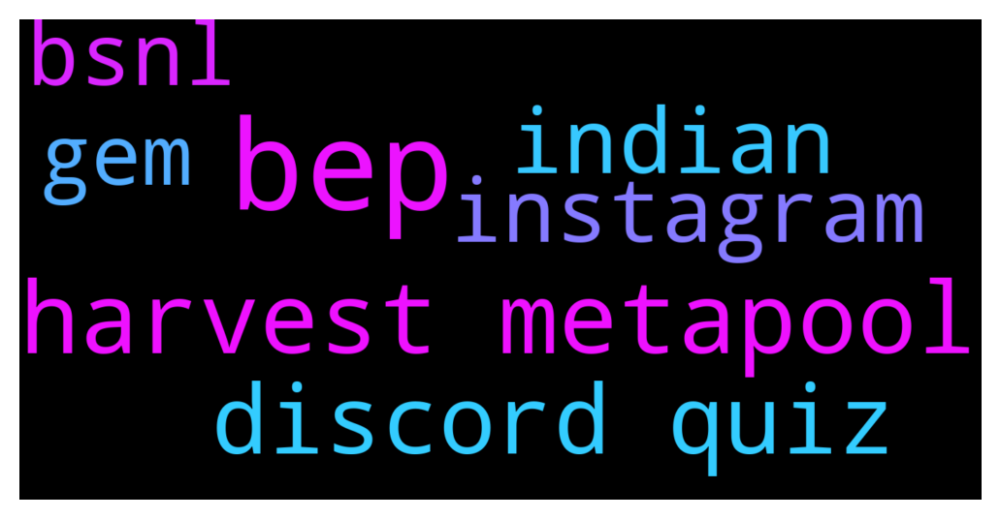

# **@cryptonear**
 ## Analysis for **2021-12-09** - **2021-12-10**.

---

## 📊 **Basic Stats**

**n_messages_sent**: 1362

---

---

## 🔝 **Top keywords and related messages**

1. **bep**

    @NEARverse_xd --- *Well yesterday i had contacted the binance team. Those people said that use the NEAR bep20 network🤣🤣* **--->** [TG Discussion](https://t.me/cryptonear/231809)

    @NEARverse_xd --- *No they can not deactivate it because users can send token using bep20 from binance to other CEX if CEX supports bep20* **--->** [TG Discussion](https://t.me/cryptonear/231818)

    @NEARverse_xd --- *Yeah he said use bep2 and bep20 both are active* **--->** [TG Discussion](https://t.me/cryptonear/231815)

    @Putin --- *hi sir, near current is doing great but i see it is missing 1 bridge connecting to bep20. do you have a plan for it? Please give me information not to find out?* **--->** [TG Discussion](https://t.me/cryptonear/231216)

    @GeorgePro1 --- *They can indicate “suspended “  Something like “not available “ will be good. We have seen users depositing to bep20 and complaining of fund not showing in their wallet.* **--->** [TG Discussion](https://t.me/cryptonear/231821)

    @NEARverse_xd --- *Yes some people have started using bep20 😶* **--->** [TG Discussion](https://t.me/cryptonear/231823)

2. **harvest metapool**

    @larry_lang --- *Here is the Metapool discord channel in case u want to ask further https://discord.gg/y8aMEwA2* **--->** [TG Discussion](https://t.me/cryptonear/231373)

    @rahulgoel007 --- *If u have stake some near token, go to harvest and u will see how many meta token u will get* **--->** [TG Discussion](https://t.me/cryptonear/229649)

    @FritzWagner --- *Yeah, on Harvest is to take out/be able to see the Meta or stNear in your wallet* **--->** [TG Discussion](https://t.me/cryptonear/231734)

    @FritzWagner --- *Yeah, you can check that on Metapool harvest as well, but not directly on your wallet.* **--->** [TG Discussion](https://t.me/cryptonear/231747)

    @Henry --- *I couldn't see the earned near on metapool harvest* **--->** [TG Discussion](https://t.me/cryptonear/231726)

    @rahulgoel007 --- *Harvest from it and it will be available in your near wallet* **--->** [TG Discussion](https://t.me/cryptonear/229650)

3. **discord quiz**

    @NearQuizMaster --- *📢 TELEGRAM NEAR COMMUNITY QUIZ!   Leaderboard after 10/10 rounds (ENDED):           TG@ + points CONGRATULATIONS TO THE TOP 10 PLAYERS IN THIS QUIZ. YOU WILL ALL BE REWARDED. 👏👏🏆  @cengizhantekin 90 @cuongdcc 80 @MyWalletSolutions 50 @Aflatoon123 40 @Vshashank 30 @levi_cryptoman 30 @TheGo1denBull 20 @iapehong 20 @pavelgordok 20 @Bcevmmbitgpssfbm 20  ----- CONGRATULATIONS ALSO TO ALL THE OTHERS WHO GOT POINTS💪💪 @Jezeus 10 @DeathBag 10 @wildfire007 10 @thanano46 10 @ivan_warrior 10 @luciferisnoob 10 @iaman38 10 @Abdelillah77 10 @NEARverse_xd 10 @andotran 10  +4 PARTICIPANTS CHOSEN RANDOMLY WILL WIN $ 100 EACH 🔥🔥  🌟 How it works:  🔹The quiz starts on Thursday 2nd December and will end on Wednesday 8th December (no questions during the weekend).  🔹The quiz takes place over 5 days, with 2 rounds per day. Be sure not to miss any! 🔹Questions will be posted at random times. We’ll try to ensure that all time zones have a chance to participate. 🔹The first person to correctly answer a question will get 10 points. NO EDITED ANSWER WILL BE ACCEPTED.   🔍The questions can relate to the following topics: NEAR Projects, NEAR Ecosystem, NEAR Tech.  🎁 Prizes in NEAR for the quiz: 1st place: $500 2nd place: $400  3rd place: $300  4th place: $200 5th place: $150 6th-10th place: $100 each + 4 random participants who attempted the quiz get a chance to win $100!  🏆 LEADERBOARD - it will be updated after each round: https://docs.google.com/spreadsheets/d/1KRPcFCt9CdkErM0Uyt561VLakL3DpHC4wrolA_Nq1-Y/edit?usp=sharing* **--->** [TG Discussion](https://t.me/cryptonear/228945)

    @larry_lang --- *Here is the Metapool discord channel in case u want to ask further https://discord.gg/y8aMEwA2* **--->** [TG Discussion](https://t.me/cryptonear/231373)

    @larry_lang --- *https://discord.gg/69eH4quc the AMA ended yesterday but we are having a quiz with reward right now, if u interested pls tune in with us* **--->** [TG Discussion](https://t.me/cryptonear/231583)

    @ChandreshPPatel --- *Hey All !!!  I am inviting you all to join our NEAR NFT CLUB discord server...   https://discord.gg/QvAMxdNYVT  Thank you* **--->** [TG Discussion](https://t.me/cryptonear/231480)

    @larry_lang --- *Yup that true, and if u want to ask more info u can check with the team on thier discord channel  @Acinony0x    https://discord.gg/DAYXvsap* **--->** [TG Discussion](https://t.me/cryptonear/229606)

    @vlhai --- *it is with great pleasure that we announce the first NEAR DISCORD QUIZ! https://discord.gg/nQUnpqWW  ❗️ Titled: How familiar are you with the NEAR ecosystem?  🗒 It is a quiz that will be carried out on Friday, December 10, at 14:00 UTC.  🔸 It will consist of a series of questions about the NEAR ecosystem in general, which all participants will be given a limited time to answer (it will be a very short time so you better be prepared .  🔸 As users answer the questions, points will be added if they answer correctly, and the one with the most points at the end of the questionnaire will be the winner!  🔸 Now a really interesting part: REWARDS There will be a total of 5 winners, and the rewards will be distributed like this:  1️⃣ st place: 10 $NEAR  2️⃣ nd place: 8 $NEAR  3️⃣ rd place: 6 $NEAR  4️⃣ th place: 4 $NEAR  5️⃣ th place: 2 $NEAR  So get prepared for the quiz!* **--->** [TG Discussion](https://t.me/cryptonear/231104)

4. **indian**

    @larry_lang --- *Hmm seem like the indian hour is not much different than mine=]]* **--->** [TG Discussion](https://t.me/cryptonear/231034)

    @rahulgoel007 --- *Not bullying anyone ser🥺🥺 It's just we Indian knows about it* **--->** [TG Discussion](https://t.me/cryptonear/231630)

    @Aflatoon123 --- *Indian 😅* **--->** [TG Discussion](https://t.me/cryptonear/228992)

    @butola_ravi --- *Yes we indian made a quite namenfor urself* **--->** [TG Discussion](https://t.me/cryptonear/231237)

    @zubairansari07 --- *Jai Bhole Ki ✨💥, I didn’t know you are Indian hehe😉* **--->** [TG Discussion](https://t.me/cryptonear/231242)

    @zubairansari07 --- *If @Ratatoesker knows him, then he is truly Indian 😛* **--->** [TG Discussion](https://t.me/cryptonear/231273)

5. **instagram**

    @zubairansari07 --- *Hi NEARians,  There's Vast Audience On Instagram That Stay Active All Day So I've started an Insta account to post NEAR News & Info on Instagram to gain mass traction from there to adopt NEAR ⚡  Give It A Follow To Get All NEARnews At One Place 😉  Here's The Link To The Page >> https://www.instagram.com/p/CXSpyxJPmUa/?utm_medium=copy_link* **--->** [TG Discussion](https://t.me/cryptonear/231198)

    @larry_lang --- *Hi NEARians,  There's Vast Audience On Instagram That Stay Active All Day So I've started an Insta account to post NEAR News & Info on Instagram to gain mass traction from there to adopt NEAR ⚡  Give It A Follow To Get All NEARnews At One Place 😉  Here's The Link To The Page >> https://www.instagram.com/p/CXSpyxJPmUa/?utm_medium=copy_link* **--->** [TG Discussion](https://t.me/cryptonear/231286)

    @elias --- *Is the team doing anything to market NEAR on instagram?* **--->** [TG Discussion](https://t.me/cryptonear/231281)

6. **bsnl**

    @rahulgoel007 --- *Larry might not know how bsnl works🤣🤣* **--->** [TG Discussion](https://t.me/cryptonear/231617)

    @larry_lang --- *But true no idea the bsnl is=]]* **--->** [TG Discussion](https://t.me/cryptonear/231631)

    @Aflatoon123 --- *Hmm. I am on bsnl internet ser.  Now u all can understand my case😂* **--->** [TG Discussion](https://t.me/cryptonear/231614)

7. **gem**

    @Kripto_Raptor --- *what you mean by that? Near itself is a gem* **--->** [TG Discussion](https://t.me/cryptonear/231008)

    @Julian1109 --- *what is a near gem?* **--->** [TG Discussion](https://t.me/cryptonear/231006)

    @Julian1109 --- *welcome, i mean like a near ecosystem gem* **--->** [TG Discussion](https://t.me/cryptonear/231053)

    @thanano46 --- *I have no powers right now..tony stark stole my gem stones 😷😷* **--->** [TG Discussion](https://t.me/cryptonear/231710)

    @avshevchenko --- *Well, I personally feel that Aurora is ‘a compatibility’ part of NEAR. NEAR as a gen3 blockchain allows many new cool things, like advanced accounts with keys management, async execution and sharding. But the ecosystem development would struggle if everything that has been developed within last 7 years of Ethereum existance won’t be compatible with NEAR, right? So, that’s what Aurora does: allows to run Ethereum dApps on NEAR, thus, simplifying and speeding up the development of the NEAR ecosystem.* **--->** [TG Discussion](https://t.me/cryptonear/230090)

