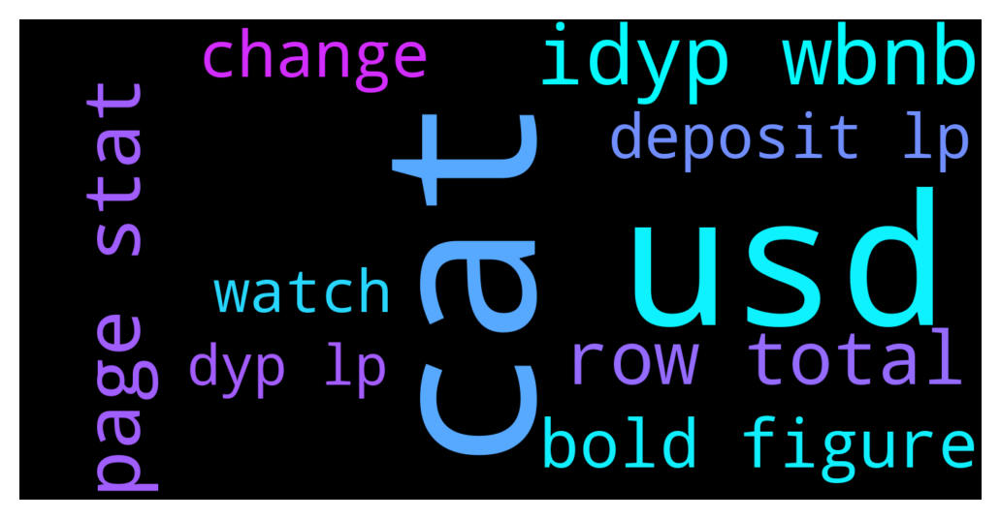

# **@dypfinance**
 ## Analysis for **2021-12-09** - **2021-12-10**.

---

## 📊 **Basic Stats**

**n_messages_sent**: 516

---

---

## 🔝 **Top keywords and related messages**

1. **cat**

    @timdyp --- *Who wants to adopt a cat that loves to collect watches? Our 10k unique collection of cats that collect watches will be ready soon to mint for the #Avalanche & #BinanceSmartChain users🐱⌚️  Subscribe to our Channel https://t.me/dypannouncements  #NFTs #NFTCommunity #nftcollector  https://twitter.com/dypfinance/status/1469266304452509697* **--->** [TG Discussion](https://t.me/dypfinance/228032)

    @timdyp --- *All the NFTs will have the same minting fee, BUT the rarity will be also based on the watch value. The cats' with more expensive watches will be rarer.* **--->** [TG Discussion](https://t.me/dypfinance/228052)

    @Alliveall --- *Is cat with casio watch cheaper than cat with Rolex?? 😁😁* **--->** [TG Discussion](https://t.me/dypfinance/228048)

    @DhoniMSD516 --- *Cat is cat always valuable 😬* **--->** [TG Discussion](https://t.me/dypfinance/228049)

    @Paul --- *OK.....so the APY on the current DYP staking are dynamic and can change at any time without notification?* **--->** [TG Discussion](https://t.me/dypfinance/227981)

2. **usd**

    @timdyp --- *We are excited to announce that the new pools for staking, buyback, and farming have been launched on #Avalanche  Join staking if you are holding #DYP or buyback & farming if you are holding #AVAX, USDC, USDT, WETH, #PNG, QI, DAI, XAVA, WBTC, LINK, or #iDYP and earn #AVAX as rewards https://dyp.finance/earnv2  Learn more about the new pools👇 https://link.medium.com/2nXyI0UkPlb  👉https://twitter.com/dypfinance/status/1468652091799482378?s=20* **--->** [TG Discussion](https://t.me/dypfinance/227235)

    @DhoniMSD516 --- *Hey we made these changes yesterday https://t.me/dypfinance/227799 You can see approx value in USD in Stats page https://app-bsc.dyp.finance/staking-stats* **--->** [TG Discussion](https://t.me/dypfinance/228114)

    @Brian --- *My balance no longer displays usd instead it shows idyp/Bnb and dyp.* **--->** [TG Discussion](https://t.me/dypfinance/227863)

    @timdyp --- *Check out the #Avalanche farming pools and earn up to 5000% APY! 16501 #AVAX worth $1,460,338 paid to the users!  Join farming by automatically adding liquidity if you are holding WAVAX, USDC.e, USDT.e, WETH.e, PNG, QI, XAVA, WBTC.e, LINK.e, or iDYP👇 https://dyp.finance/farmv2/avax  👉https://twitter.com/dypfinance/status/1469232212457447428* **--->** [TG Discussion](https://t.me/dypfinance/228000)

    @iamJubi --- *We are excited to announce that the new pools for staking, buyback, and farming have been launched on #Avalanche  Join staking if you are holding #DYP or buyback & farming if you are holding #AVAX, USDC, USDT, WETH, #PNG, QI, DAI, XAVA, WBTC, LINK, or #iDYP and earn #AVAX as rewards https://dyp.finance/earnv2  Learn more about the new pools👇 https://link.medium.com/2nXyI0UkPlb  👉https://twitter.com/dypfinance/status/1468652091799482378?s=20* **--->** [TG Discussion](https://t.me/dypfinance/227476)

    @Leonid --- *Hi Admins, the amount I can withdraw is now in iDYP/WBNB.  26 iDYP/WBNB is about 40 USD, right?* **--->** [TG Discussion](https://t.me/dypfinance/227770)

3. **idyp wbnb**

    @timdyp --- *We are excited to announce that the new pools for staking, buyback, and farming have been launched on #Avalanche  Join staking if you are holding #DYP or buyback & farming if you are holding #AVAX, USDC, USDT, WETH, #PNG, QI, DAI, XAVA, WBTC, LINK, or #iDYP and earn #AVAX as rewards https://dyp.finance/earnv2  Learn more about the new pools👇 https://link.medium.com/2nXyI0UkPlb  👉https://twitter.com/dypfinance/status/1468652091799482378?s=20* **--->** [TG Discussion](https://t.me/dypfinance/227235)

    @DhoniMSD516 --- *In farm you will be providing LP on which you earn WBNB/ETH or WAVAX/ETH rewards there will be Impermanent Loss here in Buyback your deposit is converted to iDYP and DYP on which you earn rewards in DYP there is no IL here https://link.medium.com/1qUnBdU0klb You can read here more about these both features* **--->** [TG Discussion](https://t.me/dypfinance/228085)

    @DhoniMSD516 --- *Trade iDYP tokens on PancakeSwap V2 https://pancakeswap.finance/swap?inputCurrency=0xBD100d061E120b2c67A24453CF6368E63f1Be056  Trade iDYP tokens on Pangolin DEX https://app.pangolin.exchange/#/swap?&outputCurrency=0xBD100d061E120b2c67A24453CF6368E63f1Be056* **--->** [TG Discussion](https://t.me/dypfinance/228017)

    @DhoniMSD516 --- *Your deposit value of iDYP/WBNB can be see in stats page, we made changes recently so please clear cache and cookies and try again  https://t.me/dypfinance/224309 https://app-bsc.dyp.finance/staking-stats* **--->** [TG Discussion](https://t.me/dypfinance/228006)

    @Brian --- *My balance no longer displays usd instead it shows idyp/Bnb and dyp.* **--->** [TG Discussion](https://t.me/dypfinance/227863)

    @timdyp --- *Check out the #Avalanche farming pools and earn up to 5000% APY! 16501 #AVAX worth $1,460,338 paid to the users!  Join farming by automatically adding liquidity if you are holding WAVAX, USDC.e, USDT.e, WETH.e, PNG, QI, XAVA, WBTC.e, LINK.e, or iDYP👇 https://dyp.finance/farmv2/avax  👉https://twitter.com/dypfinance/status/1469232212457447428* **--->** [TG Discussion](https://t.me/dypfinance/228000)

4. **page stat**

    @DhoniMSD516 --- *Hey we made these changes yesterday https://t.me/dypfinance/227799 You can see approx value in USD in Stats page https://app-bsc.dyp.finance/staking-stats* **--->** [TG Discussion](https://t.me/dypfinance/228114)

    @DhoniMSD516 --- *Not sure where you are checking here is link https://app-bsc.dyp.finance/staking-stats To see your farm stats* **--->** [TG Discussion](https://t.me/dypfinance/228102)

    @DhoniMSD516 --- *Your deposit value of iDYP/WBNB can be see in stats page, we made changes recently so please clear cache and cookies and try again  https://t.me/dypfinance/224309 https://app-bsc.dyp.finance/staking-stats* **--->** [TG Discussion](https://t.me/dypfinance/228006)

    @Can --- *but already found a way, when i click all stats everything is listed 👌* **--->** [TG Discussion](https://t.me/dypfinance/228071)

    @iamJubi --- *Yes and your current balance is what is shown as deposited LP and Deposited DYP on My Stats(view all) which you can also see the $ value as shown on the example shared. :)* **--->** [TG Discussion](https://t.me/dypfinance/227878)

    @timdyp --- *My LP deposit = The number of LP that you got after 75% of your deposit has been added to liquidity into iDYP-WBNB My DYP deposit = The 25% amount that you got in DYP after your deposit If you click to MY STATS, you will see the approx. value of your LP and DYP into US $.   Also, on WITHDRAW you see the LP amount and the DYP amount. Why have we done this update? Before this update, we converted the LP value + DYP value and displayed one single value in US $. But because of the network sometimes the total value displayed the value without the DYP value and some users complained about this.* **--->** [TG Discussion](https://t.me/dypfinance/227799)

5. **row total**

    @timdyp --- *My LP deposit = The number of LP that you got after 75% of your deposit has been added to liquidity into iDYP-WBNB My DYP deposit = The 25% amount that you got in DYP after your deposit If you click to MY STATS, you will see the approx. value of your LP and DYP into US $.   Also, on WITHDRAW you see the LP amount and the DYP amount. Why have we done this update? Before this update, we converted the LP value + DYP value and displayed one single value in US $. But because of the network sometimes the total value displayed the value without the DYP value and some users complained about this.* **--->** [TG Discussion](https://t.me/dypfinance/227799)

    @DhoniMSD516 --- *You can go to MY STATS and see the approx. value of your LP in US $, and you can convert the total value in US $ into the numbers of LP. By doing this you will have the approx. value of one LP in US $.* **--->** [TG Discussion](https://t.me/dypfinance/228072)

    @Brian --- *Its poorly laid out. You have to add rhe 2 bold figures. The total roq is useless. And i have been reinvesting rewards so i bet they are included already in that total* **--->** [TG Discussion](https://t.me/dypfinance/227894)

    @Brian --- *I just mean that if you look at deposited lp in the total row it does not equal the bold $figure above it but rather that bold figure plus the bold deposited dyp. That's a bad layout* **--->** [TG Discussion](https://t.me/dypfinance/227897)

    @iamJubi --- *Honestly I am lost with what you meant but as we can see on the image, The figures are clear and the total is right.* **--->** [TG Discussion](https://t.me/dypfinance/227900)

    @Brian --- *Where as yours adds the 2 lines and gives a total in row 3* **--->** [TG Discussion](https://t.me/dypfinance/227907)

6. **bold figure**

    @Brian --- *I only have 1 line of bold* **--->** [TG Discussion](https://t.me/dypfinance/227903)

    @Brian --- *Its poorly laid out. You have to add rhe 2 bold figures. The total roq is useless. And i have been reinvesting rewards so i bet they are included already in that total* **--->** [TG Discussion](https://t.me/dypfinance/227894)

    @Brian --- *I just mean that if you look at deposited lp in the total row it does not equal the bold $figure above it but rather that bold figure plus the bold deposited dyp. That's a bad layout* **--->** [TG Discussion](https://t.me/dypfinance/227897)

    @iamJubi --- *Honestly I am lost with what you meant but as we can see on the image, The figures are clear and the total is right.* **--->** [TG Discussion](https://t.me/dypfinance/227900)

    @Brian --- *Looking closer it looks like if i add the bold deposited lp to the bold deposited dyp it equals the 1st non bold figure  in the total row so really i have lost 600 not gained 800* **--->** [TG Discussion](https://t.me/dypfinance/227891)

7. **change**

    @DhoniMSD516 --- *Hey we made these changes yesterday https://t.me/dypfinance/227799 You can see approx value in USD in Stats page https://app-bsc.dyp.finance/staking-stats* **--->** [TG Discussion](https://t.me/dypfinance/228114)

    @DhoniMSD516 --- *Your deposit value of iDYP/WBNB can be see in stats page, we made changes recently so please clear cache and cookies and try again  https://t.me/dypfinance/224309 https://app-bsc.dyp.finance/staking-stats* **--->** [TG Discussion](https://t.me/dypfinance/228006)

    @DhoniMSD516 --- *Yes these are new changes* **--->** [TG Discussion](https://t.me/dypfinance/228070)

    @DhoniMSD516 --- *Hey if you are referring to APY changes yes this was informed* **--->** [TG Discussion](https://t.me/dypfinance/227977)

    @Mzupic --- *Hi. Thanks for reply. I have had thousands of dollars in various dyp lp's, never seen this before. Now it is already 10% drop in 15 minutes, what the heck is this No change in idyp price so drastic, avax is stable as well. There is no logical explanation for this* **--->** [TG Discussion](https://t.me/dypfinance/227340)

    @DhoniMSD516 --- *Yes because your deposited value is 25% converted to DYP and also the LP value changes base don market prices of paired tokens* **--->** [TG Discussion](https://t.me/dypfinance/228100)

8. **deposit lp**

    @DhoniMSD516 --- *In farm you will be providing LP on which you earn WBNB/ETH or WAVAX/ETH rewards there will be Impermanent Loss here in Buyback your deposit is converted to iDYP and DYP on which you earn rewards in DYP there is no IL here https://link.medium.com/1qUnBdU0klb You can read here more about these both features* **--->** [TG Discussion](https://t.me/dypfinance/228085)

    @DhoniMSD516 --- *Your deposit value of iDYP/WBNB can be see in stats page, we made changes recently so please clear cache and cookies and try again  https://t.me/dypfinance/224309 https://app-bsc.dyp.finance/staking-stats* **--->** [TG Discussion](https://t.me/dypfinance/228006)

    @timdyp --- *Please clear your cookies, this refers to the LP amount.* **--->** [TG Discussion](https://t.me/dypfinance/228066)

    @DhoniMSD516 --- *That depends on the LP value at the time of withdraw and this LP value depends on market prices of iDYP and WBNB* **--->** [TG Discussion](https://t.me/dypfinance/227954)

    @iamJubi --- *Yes and your current balance is what is shown as deposited LP and Deposited DYP on My Stats(view all) which you can also see the $ value as shown on the example shared. :)* **--->** [TG Discussion](https://t.me/dypfinance/227878)

    @timdyp --- *My LP deposit = The number of LP that you got after 75% of your deposit has been added to liquidity into iDYP-WBNB My DYP deposit = The 25% amount that you got in DYP after your deposit If you click to MY STATS, you will see the approx. value of your LP and DYP into US $.   Also, on WITHDRAW you see the LP amount and the DYP amount. Why have we done this update? Before this update, we converted the LP value + DYP value and displayed one single value in US $. But because of the network sometimes the total value displayed the value without the DYP value and some users complained about this.* **--->** [TG Discussion](https://t.me/dypfinance/227799)

9. **watch**

    @timdyp --- *Who wants to adopt a cat that loves to collect watches? Our 10k unique collection of cats that collect watches will be ready soon to mint for the #Avalanche & #BinanceSmartChain users🐱⌚️  Subscribe to our Channel https://t.me/dypannouncements  #NFTs #NFTCommunity #nftcollector  https://twitter.com/dypfinance/status/1469266304452509697* **--->** [TG Discussion](https://t.me/dypfinance/228032)

    @timdyp --- *All the NFTs will have the same minting fee, BUT the rarity will be also based on the watch value. The cats' with more expensive watches will be rarer.* **--->** [TG Discussion](https://t.me/dypfinance/228052)

    @Lena_Blonde --- *you didn't include sports watches too LOL* **--->** [TG Discussion](https://t.me/dypfinance/227820)

10. **dyp lp**

    @timdyp --- *We are excited to announce that the new pools for staking, buyback, and farming have been launched on #Avalanche  Join staking if you are holding #DYP or buyback & farming if you are holding #AVAX, USDC, USDT, WETH, #PNG, QI, DAI, XAVA, WBTC, LINK, or #iDYP and earn #AVAX as rewards https://dyp.finance/earnv2  Learn more about the new pools👇 https://link.medium.com/2nXyI0UkPlb  👉https://twitter.com/dypfinance/status/1468652091799482378?s=20* **--->** [TG Discussion](https://t.me/dypfinance/227235)

    @DhoniMSD516 --- *In farm you will be providing LP on which you earn WBNB/ETH or WAVAX/ETH rewards there will be Impermanent Loss here in Buyback your deposit is converted to iDYP and DYP on which you earn rewards in DYP there is no IL here https://link.medium.com/1qUnBdU0klb You can read here more about these both features* **--->** [TG Discussion](https://t.me/dypfinance/228085)

    @timdyp --- *Stake your #DYP tokens on #Avalanche and earn up to 215% APY! 🌟No Impermanent Loss🌟  The staking pools have the REINVEST function integrated, meaning that you can automatically add your daily rewards to the staking pool👇 https://dyp.finance/stakev2/avax  👉https://twitter.com/dypfinance/status/1468934932693090307* **--->** [TG Discussion](https://t.me/dypfinance/227611)

    @iamJubi --- *We are excited to announce that the new pools for staking, buyback, and farming have been launched on #Avalanche  Join staking if you are holding #DYP or buyback & farming if you are holding #AVAX, USDC, USDT, WETH, #PNG, QI, DAI, XAVA, WBTC, LINK, or #iDYP and earn #AVAX as rewards https://dyp.finance/earnv2  Learn more about the new pools👇 https://link.medium.com/2nXyI0UkPlb  👉https://twitter.com/dypfinance/status/1468652091799482378?s=20* **--->** [TG Discussion](https://t.me/dypfinance/227476)

    @iamJubi --- *Stake your #DYP tokens on #Avalanche and earn up to 215% APY! 🌟No Impermanent Loss🌟  The staking pools have the REINVEST function integrated, meaning that you can automatically add your daily rewards to the staking pool👇 https://dyp.finance/stakev2/avax  👉https://twitter.com/dypfinance/status/1468934932693090307* **--->** [TG Discussion](https://t.me/dypfinance/227972)

    @timdyp --- *Please clear your cookies, this refers to the LP amount.* **--->** [TG Discussion](https://t.me/dypfinance/228066)

