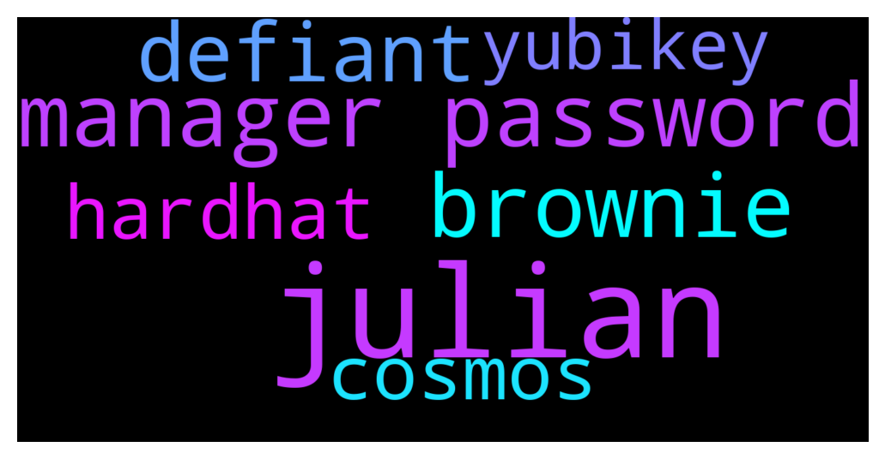

# **@lobsters_chat**
 ## Analysis for **2021-12-09** - **2021-12-10**.

---

## 📊 **Basic Stats**

**n_messages_sent**: 349

---

---

## 🔝 **Top keywords and related messages**

1. **julian**

    @coine_r --- *Julian Assange can be extradited to the US, court rules Article, Comments* **--->** [TG Discussion](https://t.me/lobsters_chat/306411)

    @Crypto_McKenna --- *Free Julian & Fund freedom of press projects* **--->** [TG Discussion](https://t.me/lobsters_chat/306418)

    @sambacha --- *julian tho doesnt purport to be a legitimate news piece* **--->** [TG Discussion](https://t.me/lobsters_chat/306319)

2. **manager password**

    @KD8877 --- *Hey guys, which password manager do you use and recommend?  Personally i used Dashlane, but it start to piss me off, 2FA with yubikey was disabled? im not sure, but i can connect my new mac and new iPhone without yubikey, just with main password. Also there no auto logout option, anyone who can have access to my mac can see all my passwords. For example if i leave it in hotel and person know somehow password for my mac.  I tried keeper password manager, it’s ok, but luck of security notes. In security notes i also keep important information. And have some strange problems, i already have paid account, and he continue advise me to upgrade to get function like dark web monitoring, which i already should have, and crash after that* **--->** [TG Discussion](https://t.me/lobsters_chat/306365)

    @zegdathetkan --- *I am very happy with gorilla password manager   https://github.com/zdia/gorilla/wiki* **--->** [TG Discussion](https://t.me/lobsters_chat/306395)

    @KD8877 --- *It's still better than one password on all exchanges. Thank you guys, I will follow your advices.* **--->** [TG Discussion](https://t.me/lobsters_chat/306377)

    @Spe3dyG --- *Keepass has auto logout option, it has a lot of settings that autolocks the app, closes the app with desired timeframe of inactivity. Not sure how can you trust your passwords  specially for exchanges or your capital to some centralized and closed source company.* **--->** [TG Discussion](https://t.me/lobsters_chat/306372)

    @Spe3dyG --- *One password is just suicidal lol, still better to have separate databases for different services I think. This is from my own experience I came to that conclusion recently.* **--->** [TG Discussion](https://t.me/lobsters_chat/306378)

3. **brownie**

    @sambacha --- *Brownie GUI is to be treated with gloves if your on OSX* **--->** [TG Discussion](https://t.me/lobsters_chat/306353)

    @reednaaxeelaa --- *Brownie can do it with:  brownie gui  It is a requirement that a 1:1 translation actually exists and it is not perfect.* **--->** [TG Discussion](https://t.me/lobsters_chat/306352)

    @gallodasballo --- *Anyone knows how to get the compiler warnings when using Brownie?* **--->** [TG Discussion](https://t.me/lobsters_chat/306415)

4. **defiant**

    @sambacha --- *Another hit piece by The Defiant: https://twitter.com/defiantnews/status/1469083464595034114?s=21* **--->** [TG Discussion](https://t.me/lobsters_chat/306308)

    @olliten --- *Well tbh mostly a few small tg groups im in that could evolve into DAOs that way. Well, Forefront would probably be a great candidate too. Bankless and Defiant as well perhaps.* **--->** [TG Discussion](https://t.me/lobsters_chat/306245)

    @sambacha --- *How hard is it to drop in on the community calls on discord? I saw plenty of ppl attending that have noteworthy handles, yet defiant or any other clickbait  crypto subscribeletter  cant be bothered to do some minimal due diligence* **--->** [TG Discussion](https://t.me/lobsters_chat/306314)

    @sambacha --- *i paid for your news and promoted to my friends the defiant.  I am outright disappointed with this lack of ownership and editorial process. Reminds me of when journalists were disparaging andre on some off handed comment he made about depression etc* **--->** [TG Discussion](https://t.me/lobsters_chat/306316)

5. **cosmos**

    @Siimmoonn --- *I have only built stuff for terra/cosmos ecosystem so I can't comment on it too much. The thing for cosmos is that smart contracts are not native to the cosmos sdk, all cosmos chains (to my knowledge) with smart contract ability are using the external CosmWasm module  which should be quite different compared to Solana/Polkadot* **--->** [TG Discussion](https://t.me/lobsters_chat/306339)

6. **hardhat**

    @eth2enthusiast --- *you could try the hardhat template written for sharedtools.org here https://github.com/chimera-defi/hardhat-template it uses a hardhat-framework repo https://github.com/chimera-defi/hardhat-framework/blob/master/index.js#L153-L175 which should work for avax, matic, metis, fantom, moonbeam, bsc, eth  or you can go upstream and try boringCrypto's hardhat framework or the sushi one for cross chain deploys. feel free to make prs/open issues too* **--->** [TG Discussion](https://t.me/lobsters_chat/305972)

    @william_s_4 --- *in the hardhat.config file set the blockGasLimit for the hh network to whatever you want, source: https://hardhat.org/hardhat-network/reference/#config* **--->** [TG Discussion](https://t.me/lobsters_chat/306343)

    @Alphamint --- *in 1559, abs(blockGasLimit - parentGasLimit) <= parentGasLimit // 1024  It's kinda up to the miners to move it if they want, in hardhat it's just a constant 30M* **--->** [TG Discussion](https://t.me/lobsters_chat/306354)

    @Alphamint --- *is there a way to make hardhat create blocks with random block gas limits?* **--->** [TG Discussion](https://t.me/lobsters_chat/306341)

7. **yubikey**

    @KD8877 --- *Hey guys, which password manager do you use and recommend?  Personally i used Dashlane, but it start to piss me off, 2FA with yubikey was disabled? im not sure, but i can connect my new mac and new iPhone without yubikey, just with main password. Also there no auto logout option, anyone who can have access to my mac can see all my passwords. For example if i leave it in hotel and person know somehow password for my mac.  I tried keeper password manager, it’s ok, but luck of security notes. In security notes i also keep important information. And have some strange problems, i already have paid account, and he continue advise me to upgrade to get function like dark web monitoring, which i already should have, and crash after that* **--->** [TG Discussion](https://t.me/lobsters_chat/306365)

