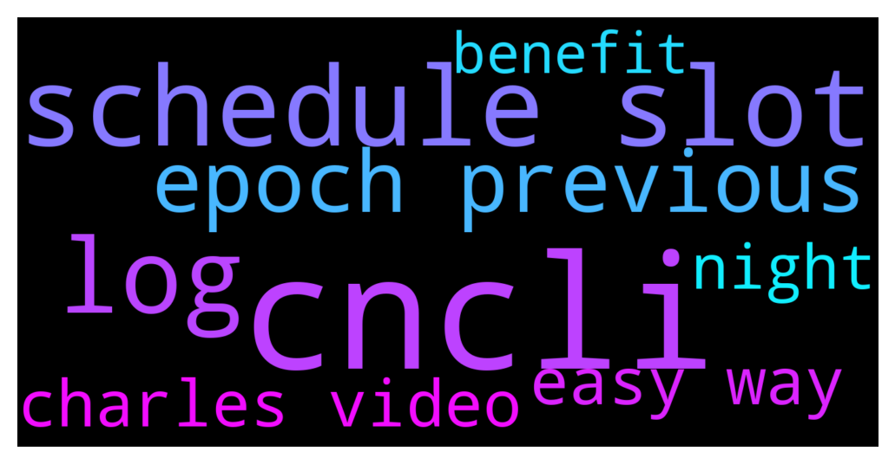

# **@Cardano**
 ## Analysis for **2021-12-10** - **2021-12-11**.

---

## 📊 **Basic Stats**

**n_messages_sent**: 109

---

---

## 🔝 **Top keywords and related messages**

1. **cncli**

    @icculp --- *I tried running cncli validate 173, and it still shows 0's* **--->** [TG Discussion](https://t.me/Cardano/757366)

    @icculp --- *leaderlog with cncli (cntools version) shows nothing* **--->** [TG Discussion](https://t.me/Cardano/757363)

    @glitch04 --- *Cncli if you are the operator* **--->** [TG Discussion](https://t.me/Cardano/757362)

2. **schedule slot**

    @glitch04 --- *Only pools can see their slot schedule you can see the production after with the explorers* **--->** [TG Discussion](https://t.me/Cardano/757357)

    @icculp --- *is there an easy way to see the scheduled slots for a previous epoch?* **--->** [TG Discussion](https://t.me/Cardano/757325)

    @icculp --- *is it possible to see the slot schedule for my pool for a previous epoch?* **--->** [TG Discussion](https://t.me/Cardano/757358)

3. **log**

    @glitch04 --- *check the logs for TraceNodeCannotForge / TPraosCannotForgeKeyNotUsableYet* **--->** [TG Discussion](https://t.me/Cardano/757380)

    @glitch04 --- *sounds like your issue check the logs for leader checks* **--->** [TG Discussion](https://t.me/Cardano/757368)

    @icculp --- *what should I be looking for in the logs?* **--->** [TG Discussion](https://t.me/Cardano/757371)

4. **epoch previous**

    @icculp --- *is there an easy way to see the scheduled slots for a previous epoch?* **--->** [TG Discussion](https://t.me/Cardano/757325)

    @icculp --- *is it possible to see the slot schedule for my pool for a previous epoch?* **--->** [TG Discussion](https://t.me/Cardano/757358)

    @icculp --- *for the entire epoch, but I minted 15 blocks throughout the epoch, but nothing in the last day* **--->** [TG Discussion](https://t.me/Cardano/757364)

5. **easy way**

    @icculp --- *is there an easy way to see the scheduled slots for a previous epoch?* **--->** [TG Discussion](https://t.me/Cardano/757325)

    @C --- *Sundae Swap is in testnet, why not give it a try…I’ve done it and it’s super easy. One way to contribute to the ecosystem 👍🏻* **--->** [TG Discussion](https://t.me/Cardano/757446)

6. **charles video**

    @yutazzz --- *Charles Video Article: Vasil Dabov, RIP: June's hard fork is named after him  https://forum.cardano.org/t/vasil-dabov-rip-6/88577  Charles Video Article: I'm taking a week of meditation leave and coming back stronger than ever! 🔥  https://forum.cardano.org/t/topic/88579* **--->** [TG Discussion](https://t.me/Cardano/757450)

    @AnimaValeska --- *just change to light wallet; charles even mentioned it in a speech lately that daedalus is a pain in the neck when your machine is not the fastest with the fastest internet connection ever 🙈 (not quoted^^)* **--->** [TG Discussion](https://t.me/Cardano/757289)

7. **night**

    @apex_pool_spo --- *probably only for desktop, and it's not released yet (only in Yoroi Nightly).* **--->** [TG Discussion](https://t.me/Cardano/756984)

    @icculp --- *I rotated the keys last night* **--->** [TG Discussion](https://t.me/Cardano/757367)

    @icculp --- *I started two pools on testnet, the first by hand with bp/relay on the same node, second with them separate. As an exercise I deregistered the second and migrated the first to the second's servers. This was last night* **--->** [TG Discussion](https://t.me/Cardano/757359)

8. **benefit**

    @NemFlppr --- *Ho all, can anyone please explain the benefits of the eutxo model cardano uses Vs it's other L1 competitors? I can't seem to find an explanation for it, also I see fees on cardano are still quite high Vs other L1 chains and TPS much lower so wanted to see if anyone can help me understand of any benefits this model has? Thank you* **--->** [TG Discussion](https://t.me/Cardano/757396)

