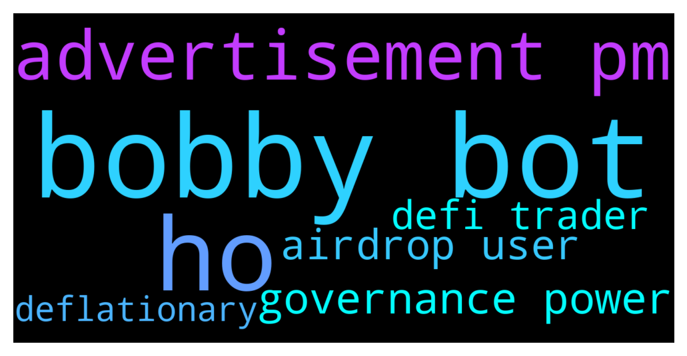

# **@DEXToolsCommunity**
 ## Analysis for **2021-12-09** - **2021-12-11**.

---

## 📊 **Basic Stats**

**n_messages_sent**: 494

---

---

## 🔝 **Top keywords and related messages**

1. **bobby bot**

    @bastardganpunk --- *what is bobby bot? we have a price bot and millions of people using it 😄* **--->** [TG Discussion](https://t.me/DEXToolsCommunity/311771)

    @Leadustosuccess --- *Will you provide a price bot like bobby bot. Lots of ppl asking* **--->** [TG Discussion](https://t.me/DEXToolsCommunity/311762)

    @napascual --- *I'm no expert on the bot, just follow the instructions* **--->** [TG Discussion](https://t.me/DEXToolsCommunity/311718)

    @Leadustosuccess --- *bobby buy bot shows when a buy from a particular pair happens.* **--->** [TG Discussion](https://t.me/DEXToolsCommunity/311830)

    @bastardganpunk --- *well,, dextools price bot has exactly that what youre showing 😉 you also have dext price alarm* **--->** [TG Discussion](https://t.me/DEXToolsCommunity/311839)

    @paubadz --- *How to add price bot* **--->** [TG Discussion](https://t.me/DEXToolsCommunity/311708)

2. **ho**

    @napascual --- *Ho ho ho* **--->** [TG Discussion](https://t.me/DEXToolsCommunity/311745)

    @VoidInvestor --- *Troubleshooting shouldn't be* **--->** [TG Discussion](https://t.me/DEXToolsCommunity/310797)

    @realryanj --- *Do you know how long it will take for the logo to get posted on trust wallet? The required 25k holders and 10k transactions* **--->** [TG Discussion](https://t.me/DEXToolsCommunity/311079)

    @No.One --- *No chart change :) And hot pairs !!!* **--->** [TG Discussion](https://t.me/DEXToolsCommunity/311931)

    @No.One --- *BSC Hot Pairs loading very slow* **--->** [TG Discussion](https://t.me/DEXToolsCommunity/311770)

    @ruganalman --- *Thought so, since I could not find it. I assume it uses web3 to listen for created events from the swap addresses? Either way, how do you rationalize closed source software for an industry/comunity that encourages transparency and decentralization, and discourages obfuscation and moderation? I know it sounds like a rude question, but I am honestly just curious as I too try to develop web3 daps in a largely web2 world.* **--->** [TG Discussion](https://t.me/DEXToolsCommunity/311486)

3. **advertisement pm**

    @D_consul --- *@guillermorodriguez78 check your pm for advertisement* **--->** [TG Discussion](https://t.me/DEXToolsCommunity/311606)

    @D_consul --- *@FredericDEXT ,  @JoeyDieleman check your pm for advertisement purposes. Thanks* **--->** [TG Discussion](https://t.me/DEXToolsCommunity/311608)

    @MadSlav --- *could I send you a screenshot in PM?* **--->** [TG Discussion](https://t.me/DEXToolsCommunity/311135)

    @zenoverseFans --- *Hello, i would like to add our token advertisement on the dex tool advertisement banner. Who should i contact ?* **--->** [TG Discussion](https://t.me/DEXToolsCommunity/310999)

4. **governance power**

    @stanes --- *No, DEXT is an utility token but doesn't have any governance power.* **--->** [TG Discussion](https://t.me/DEXToolsCommunity/312083)

    @broadgasorc --- *Hi to all You have governance token?* **--->** [TG Discussion](https://t.me/DEXToolsCommunity/312082)

    @stanes --- *But no governance power.* **--->** [TG Discussion](https://t.me/DEXToolsCommunity/312086)

5. **airdrop user**

    @Crypto4life2 --- *Contract:  0x27845cfff80407100481d2eef169e9887d641939  Polygonscan: https://polygonscan.com/token/0x27845cfff80407100481d2eef169e9887d641939    Very much interested in finding out more about banners on your site.  I use all the time and has many users.  Thank you!* **--->** [TG Discussion](https://t.me/DEXToolsCommunity/312189)

    @broadgasorc --- *Launch IDO section  Airdrop for users with  High volume trade by dextools Add to CEXs  Like : Mexc/gate/kucoin Launch stake section for DEXT* **--->** [TG Discussion](https://t.me/DEXToolsCommunity/312091)

    @broadgasorc --- *Dydx and paraswap are utility platform like dextools  But they use from airdrop for marketing* **--->** [TG Discussion](https://t.me/DEXToolsCommunity/312099)

    @bastardganpunk --- *We have presales. Free money is not planned atm, rather dextools aims to grow the platform and add more Utility for users. Cex integration is not the primary goal for a platform which offers tools for defi traders (defi traders are traders who trade on decentralised exchanges which is the complete opposite of centralised exchanges) 🙂* **--->** [TG Discussion](https://t.me/DEXToolsCommunity/312092)

    @broadgasorc --- *Launch section for sale best projects  And for marketing  Please You provide airdrop for users from dec Xtools with high volume and more TXs in dextools* **--->** [TG Discussion](https://t.me/DEXToolsCommunity/312088)

    @bastardganpunk --- *It’s not requested from dextools users to get notifications, you can see all trades in the trade history, which is much more useful 🙂* **--->** [TG Discussion](https://t.me/DEXToolsCommunity/311861)

6. **defi trader**

    @bastardganpunk --- *We have presales. Free money is not planned atm, rather dextools aims to grow the platform and add more Utility for users. Cex integration is not the primary goal for a platform which offers tools for defi traders (defi traders are traders who trade on decentralised exchanges which is the complete opposite of centralised exchanges) 🙂* **--->** [TG Discussion](https://t.me/DEXToolsCommunity/312092)

    @MaratCerby --- *Hello. We've changed symbol and token name on contract side. It has been updated everywhere already: cmc, cg, etherscan, bscscan, polygonscan.  The only place where it did not update is Dextools  I need the following values changed: 1) DEFT --> CERBY 2) Defi Factory Token --> Cerby Token  Is there support email or contact I can msg to?* **--->** [TG Discussion](https://t.me/DEXToolsCommunity/311052)

7. **deflationary**

    @pityok --- *This will, we hope, greatly increase the burning rate of DEXT and its 100% deflationary character. Not only do we not increase inflation with that 1M from the DEXTShare but we buy into the market and burn everything received.  do we not increase inflation with that 1M from the DEXTShare - As i understand, Dextshare won't increase supply. But are there any other ways for increaasing supply? Maybe some early birds, private-seed sales etc? Or in means that supply of DEXT tokens NEVER will be more that today (and can be only less by burning)?* **--->** [TG Discussion](https://t.me/DEXToolsCommunity/311666)

    @napascual --- *DEXT didn't have ICO or any ventures/launchpad program, it was self funded, it will be 100% deflationary. Also there's no possible minting* **--->** [TG Discussion](https://t.me/DEXToolsCommunity/311671)

