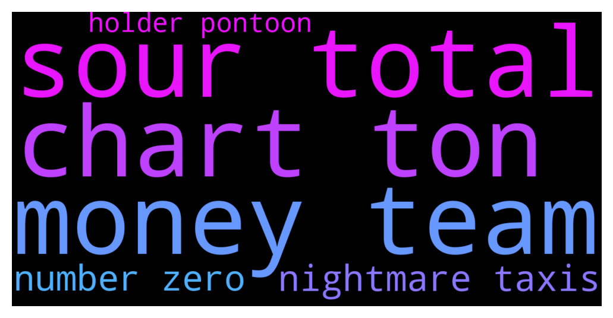

# **@ampnetapxchat**
 ## Analysis for **2021-12-06** - **2021-12-11**.

---

## 📊 **Basic Stats**

**n_messages_sent**: 33

---

---

## 🔝 **Top keywords and related messages**

1. **sour total**

    @PFCBLic --- *Sour what is your total loss on this? You cant beat me😂😛* **--->** [TG Discussion](https://t.me/ampnetapxchat/35615)

2. **chart ton**

    @E_Don --- *🙏.   It's been horrible watching aapx charts and loosing tons of money.   I'll  not stop believing but I hope the team markets the project more.* **--->** [TG Discussion](https://t.me/ampnetapxchat/35625)

3. **money team**

    @runex_x1 --- *Good luck to the team with pontoon. I really hope it takes off. Comparing it to klimadao (with illiquid carbon bonds), this has to be the way :). Just hope you also provide pool-liquidity on polygon somehow.* **--->** [TG Discussion](https://t.me/ampnetapxchat/35560)

    @E_Don --- *🙏.   It's been horrible watching aapx charts and loosing tons of money.   I'll  not stop believing but I hope the team markets the project more.* **--->** [TG Discussion](https://t.me/ampnetapxchat/35625)

4. **nightmare taxis**

    @sourmans --- *its gonna be a nightmare to fill taxes form if you guys dont do the freaking Etherscan price update* **--->** [TG Discussion](https://t.me/ampnetapxchat/35611)

5. **number zero**

    @Lukin_blackbulb --- *Just wait a little. You know, every number multiplied by zero is zero. It will be really simple then* **--->** [TG Discussion](https://t.me/ampnetapxchat/35613)

    @sourmans --- *zero hope tbh lmao but gotta try* **--->** [TG Discussion](https://t.me/ampnetapxchat/35612)

6. **holder pontoon**

    @Domy177 --- *I haven't stopped by for some time and just now I'm seeing this Pontoon dao news. It looks like Pontoon dao will likely have it's own token and if that turns out to be the case, what will be utility of native ampnet token, what will be ones reason to buy native ampnet token?* **--->** [TG Discussion](https://t.me/ampnetapxchat/35541)

    @E_Don --- *Will there be an airdrop of pontoon to AAPX holders?* **--->** [TG Discussion](https://t.me/ampnetapxchat/35623)

    @runex_x1 --- *Good luck to the team with pontoon. I really hope it takes off. Comparing it to klimadao (with illiquid carbon bonds), this has to be the way :). Just hope you also provide pool-liquidity on polygon somehow.* **--->** [TG Discussion](https://t.me/ampnetapxchat/35560)

    @<UNK> --- *We are still considering new token for DAO, but if there is one, it wont be airdropped, rather AAPX holders will stake the tokens to farm Pontoon token* **--->** [TG Discussion](https://t.me/ampnetapxchat/35624)

