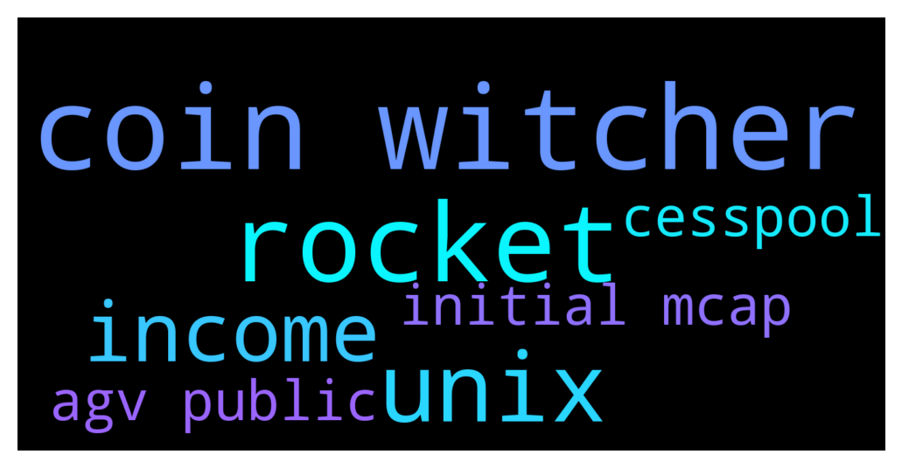

# **@de_fi**
 ## Analysis for **2021-12-10** - **2021-12-11**.

---

## 📊 **Basic Stats**

**n_messages_sent**: 83

---

---

## 🔝 **Top keywords and related messages**

1. **coin witcher**

    @george s --- *yeah I like meme coins, most of big money I made on them,* **--->** [TG Discussion](https://t.me/de_fi/230511)

    @Milva --- *⚔ Welcome to Witcher Coin!⚔   The first project based on the bestsellers books, epic game, Worldwide sensation and number 1 original Netflix series The Witcher.  17 December 2021 released of The NEW SEASON of THE WITCHER. 📈BIG PUMP INCOMING📈  🙆Big marketing already started.🙆 🙆Cosplayers cooperation(Check socials!)🙆  Token Details & Features: ✅- Token Name: Witcher Coin ✅- Token Symbol: $Witcher ✅- Token Type: BEP-20 (PancakeSwap V2) ✅- Contract Source Code Verified on BSCScan ✅- 100% Liquidity Locked ✅- OWNERSHIP RENOUNCED FOREVER  Tax Distribution (13% Total TX Fee) - 1% - Marketing Limitless promotion - 5% - Liquidity Sent to WITCHER/BNB LP - 7% - Redistribution - To all WITCHER hodlers as BUSD!  Contract: 0x8f01f176beb6f69964afb49d1e2a68d00a20e26e  Website: witcher-coin(dot)site Twitter: WitcherCoinBSC Instagram: witcher.coin Reddit: Witchercoin Telegram: witcher_coin* **--->** [TG Discussion](https://t.me/de_fi/230690)

2. **rocket**

    @cryptotrevv --- *$Rocket is on fire rn* **--->** [TG Discussion](https://t.me/de_fi/230595)

    @SB031519 --- *🔥NOW HAPPENING: AGV PUBLIC SALE🔥   Here's your complete guide on how to purchase during AGV's public sale.    Buy your AGVs now at www.astraguild.io    rocket Price: $0.2/token   rocket Network: ETH   rocket Initial MCap: $6,500,000* **--->** [TG Discussion](https://t.me/de_fi/230688)

    @cryptotrevv --- *Hey am I aloud to post a TG link in here? I don’t wanna spam but rocket is a fire defi project* **--->** [TG Discussion](https://t.me/de_fi/230603)

    @cryptotrevv --- *TG: TheRocketCoin* **--->** [TG Discussion](https://t.me/de_fi/230604)

3. **unix**

    @SB031519 --- *Guilds and their Market Cap.   ➡️ Yield Guild Games YGG - $552m (4,700 scholars) DAO gets 10% ➡️ Merit Circle MC - $417m (1,200 scholars) DAO gets 20% ➡️ Good Guild Games GGG - $19m (300 scholars?) DAO gets 20% ➡️ UniX Gaming UniX - $50m (600 scholars) UniX DAO gets 20% ➡️ 𝗔𝘀𝘁𝗿𝗮 𝗚𝘂𝗶𝗹𝗱 𝗩𝗲𝗻𝘁𝘂𝗿𝗲𝘀 𝗔𝗚𝗩  - $6m (2,035 scholars) AGV DAO gets 20%  YGG - 1B Token - $8 MC - 1B Token - $9 GGG - 100m Token - $12 UniX - 1B Token - $1.4  🇦 🇬 🇻  - 2B Token - $?? But in public sale on Dec. 1-23 it's only $0.2 Unbelievable!!! 🚀🚀🚀* **--->** [TG Discussion](https://t.me/de_fi/230461)

    @gudoooooo --- *Guild and their Market Cap.    ➡️ Yield Guild Games YGG - $552m (4,700 scholars) DAO gets 10%  ➡️ Merit Circle MC - $417m (1,200 scholars) DAO gets 20%  ➡️ Good Guild Games GGG - $19m (300 scholars?) DAO gets 20%  ➡️ UniX Gaming UniX - $40m (600 scholars) UniX DAO gets 20%  ➡️ Astra Guild Ventures AGV - $6m (2,035 scholars) AGV DAO gets 20%   YGG - 1B Token - $8  MC - 1B Token - $9  GGG - 100m Token - $12  UniX - 1B Token - $1.4  AGV - 2B Token - $??* **--->** [TG Discussion](https://t.me/de_fi/230635)

4. **income**

    @Mengyao567 --- *Do you know the Coinbase wallet? You can download it and participate in Defi liquidity mining. This is automatic income, just like bank deposit management.But it’s safer and can earn 500-1000 USD per day* **--->** [TG Discussion](https://t.me/de_fi/230605)

    @Mengyao567 --- *Put our own money in our own wallet, and we can get 2% income every day, without any risk* **--->** [TG Discussion](https://t.me/de_fi/230608)

    @hello1234p --- *💎💎 PUMP BTC💎💎  🔥 Earn reflections if you buy and hold $PUMP BTC  Join today and enjoy a passive income with BTC  💎 REWARD BTC 5%  🚀 FAIR LAUNCH !!! 🚀 5K$ initial mcaps !!! 🚀 Easy X1000 even more!!!  🚀BIG HUGE MARKETING😱  Contract :  0xbd54080b5f77d070098b0b38f15dbc3055a7ae2e  ✅ 5% ᴍᴀʀᴋᴇᴛɪɴɢ ᴡᴀʟʟᴇᴛ ✅ 2% ɢᴏᴇs ᴛᴏ ʟɪǫᴜɪᴅɪᴛʏ ᴘᴏᴏʟ ✅  100% SAFU  👀 TOTAL SUPPLY 21M 🔐 LP LOCKED 1 YEARS 🔥 BURN 40℅ 🔥 📱TG : pumpbtc_community* **--->** [TG Discussion](https://t.me/de_fi/230696)

5. **initial mcap**

    @SB031519 --- *🔥NOW HAPPENING: AGV PUBLIC SALE🔥   Here's your complete guide on how to purchase during AGV's public sale.    Buy your AGVs now at www.astraguild.io    rocket Price: $0.2/token   rocket Network: ETH   rocket Initial MCap: $6,500,000* **--->** [TG Discussion](https://t.me/de_fi/230688)

    @hello1234p --- *💎💎 PUMP BTC💎💎  🔥 Earn reflections if you buy and hold $PUMP BTC  Join today and enjoy a passive income with BTC  💎 REWARD BTC 5%  🚀 FAIR LAUNCH !!! 🚀 5K$ initial mcaps !!! 🚀 Easy X1000 even more!!!  🚀BIG HUGE MARKETING😱  Contract :  0xbd54080b5f77d070098b0b38f15dbc3055a7ae2e  ✅ 5% ᴍᴀʀᴋᴇᴛɪɴɢ ᴡᴀʟʟᴇᴛ ✅ 2% ɢᴏᴇs ᴛᴏ ʟɪǫᴜɪᴅɪᴛʏ ᴘᴏᴏʟ ✅  100% SAFU  👀 TOTAL SUPPLY 21M 🔐 LP LOCKED 1 YEARS 🔥 BURN 40℅ 🔥 📱TG : pumpbtc_community* **--->** [TG Discussion](https://t.me/de_fi/230696)

6. **cesspool**

    @andycess --- *CESSPOOL* **--->** [TG Discussion](https://t.me/de_fi/230691)

    @andycess --- *cesspool.company* **--->** [TG Discussion](https://t.me/de_fi/230692)

7. **agv public**

    @SB031519 --- *Guilds and their Market Cap.   ➡️ Yield Guild Games YGG - $552m (4,700 scholars) DAO gets 10% ➡️ Merit Circle MC - $417m (1,200 scholars) DAO gets 20% ➡️ Good Guild Games GGG - $19m (300 scholars?) DAO gets 20% ➡️ UniX Gaming UniX - $50m (600 scholars) UniX DAO gets 20% ➡️ 𝗔𝘀𝘁𝗿𝗮 𝗚𝘂𝗶𝗹𝗱 𝗩𝗲𝗻𝘁𝘂𝗿𝗲𝘀 𝗔𝗚𝗩  - $6m (2,035 scholars) AGV DAO gets 20%  YGG - 1B Token - $8 MC - 1B Token - $9 GGG - 100m Token - $12 UniX - 1B Token - $1.4  🇦 🇬 🇻  - 2B Token - $?? But in public sale on Dec. 1-23 it's only $0.2 Unbelievable!!! 🚀🚀🚀* **--->** [TG Discussion](https://t.me/de_fi/230461)

    @SB031519 --- *🔥NOW HAPPENING: AGV PUBLIC SALE🔥   Here's your complete guide on how to purchase during AGV's public sale.    Buy your AGVs now at www.astraguild.io    rocket Price: $0.2/token   rocket Network: ETH   rocket Initial MCap: $6,500,000* **--->** [TG Discussion](https://t.me/de_fi/230688)

    @gudoooooo --- *Guild and their Market Cap.    ➡️ Yield Guild Games YGG - $552m (4,700 scholars) DAO gets 10%  ➡️ Merit Circle MC - $417m (1,200 scholars) DAO gets 20%  ➡️ Good Guild Games GGG - $19m (300 scholars?) DAO gets 20%  ➡️ UniX Gaming UniX - $40m (600 scholars) UniX DAO gets 20%  ➡️ Astra Guild Ventures AGV - $6m (2,035 scholars) AGV DAO gets 20%   YGG - 1B Token - $8  MC - 1B Token - $9  GGG - 100m Token - $12  UniX - 1B Token - $1.4  AGV - 2B Token - $??* **--->** [TG Discussion](https://t.me/de_fi/230635)

