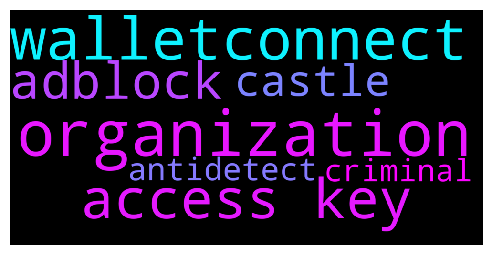

# **@lobsters_chat**
 ## Analysis for **2021-12-10** - **2021-12-11**.

---

## 📊 **Basic Stats**

**n_messages_sent**: 320

---

---

## 🔝 **Top keywords and related messages**

1. **organization**

    @xecordoteth --- *Organizations that exist more as "ideas" or "memes" that people sporadically contribute to in their own ways* **--->** [TG Discussion](https://t.me/lobsters_chat/306566)

    @StephanGoss --- *Feels like a tl;dr: as much as engineers hate executives and management, turns out they DO do something after all and turns out it’s necessary in organizations of more than 10 people, even if it’s a DAO. Who could have anticipated that!?* **--->** [TG Discussion](https://t.me/lobsters_chat/306536)

    @xecordoteth --- *that seems to be the hallmark of criminal organizations to me* **--->** [TG Discussion](https://t.me/lobsters_chat/306564)

    @RND332 --- *Well for me, if its what terrorists use for organization, than looks like its quiet good way to organization, so why dont use it for our needs?* **--->** [TG Discussion](https://t.me/lobsters_chat/306567)

    @farm42 --- *I think we should not forget that any good DAO is formed around an idea. And even chat rooms, or internet subcultures could be more DAOs than "official" DAOs if their idea is stronger, therefore, there will be more active reaction of community. The very occupation of this idea for people will be the very psychotherapy in a good sense of the word. It saves people from loneliness online. The community develops traditions, they form a social group.   If we are dealing with an official DAO in the bad sense of the word, of course you can't make people love you and artificially create an atmosphere in which they feel comfortable.   Idea > organization (DAO)  Just a couple of ideas. IMHO* **--->** [TG Discussion](https://t.me/lobsters_chat/306568)

    @warylow --- *Business is Business frenn, we are all organizations at the end of the day lol. Collective effort toward a goal. Time to do moar crimes >:)* **--->** [TG Discussion](https://t.me/lobsters_chat/306597)

2. **walletconnect**

    @Vlad --- *Good day.  I'm asking for help in supporting several types of wallets on the site.  In the current project we need to support: MetaMask, WalletConnect, CoinbaseWallet. On many sites I see that they work with all of these wallets. I get the impression that it should be easy since everyone has support for these wallets... The project will work with Binance Smart Chain.  I've worked with MetaMask before, no problems with it. But docking WalletConnect was not as easy as expected.  I use now ethersjs to interact with smart contracts. I found @walletconnect/web3-provider package, with which I hoped to solve the problem with WalletConnect support, i.e. create provider and throw it into ethersjs. But it requires infuraId parameter in constructor, and as I understand, this service works only in Ethereum network, and I need it to work in BSC.  Another question about WalletConnect was how to make balanceOf requests, in their documentation https://docs.walletconnect.com/json-rpc/ethereum basically only signatures and transactions. I suspect that's why they want infuraId parameter just for this case.  Can u give me an advise please on the best way to solve this problem?* **--->** [TG Discussion](https://t.me/lobsters_chat/306658)

3. **access key**

    @KD8877 --- *Hey guys, which password manager do you use and recommend?  Personally i used Dashlane, but it start to piss me off, 2FA with yubikey was disabled? im not sure, but i can connect my new mac and new iPhone without yubikey, just with main password. Also there no auto logout option, anyone who can have access to my mac can see all my passwords. For example if i leave it in hotel and person know somehow password for my mac.  I tried keeper password manager, it’s ok, but luck of security notes. In security notes i also keep important information. And have some strange problems, i already have paid account, and he continue advise me to upgrade to get function like dark web monitoring, which i already should have, and crash after that* **--->** [TG Discussion](https://t.me/lobsters_chat/306365)

    @nourharidy --- *great, so the key is l0bsters1000 and is redeemable for up to 1000 times only, first come first serve. It'll give you guys closed alpha access to the Station0x game at https://encounter.station0x.com (not an nft or token drop/sale, etc etc)* **--->** [TG Discussion](https://t.me/lobsters_chat/306610)

    @nourharidy --- *I got the lobsters an exclusive access key, if you wanna try it out* **--->** [TG Discussion](https://t.me/lobsters_chat/306602)

    @nourharidy --- *if that's ok I can paste the access key here, which is pretty rare honestly I'm sure most people here wouldn't mind it 😅* **--->** [TG Discussion](https://t.me/lobsters_chat/306607)

    @nourharidy --- *just wanna give you access keys so you can test the alpha release and give feedback* **--->** [TG Discussion](https://t.me/lobsters_chat/306606)

4. **adblock**

    @farm42 --- *Regarding ads, there is a investigation method (that could be used by possible kidnappers or so) that will make you more paranoid - ADINT https://twitter.com/officer_cia/status/1400074749762539527?s=21 that’s why you should always keep Adblock on.* **--->** [TG Discussion](https://t.me/lobsters_chat/306582)

    @farm42 --- *Oh yeah. But it proves that we always have to use adblocks to be safe. An adequate paranoia might save you.* **--->** [TG Discussion](https://t.me/lobsters_chat/306585)

    @farm42 --- *If speaking about basic needs, yes, any Adblock will help to protect from ADINT. If about pro needs, you should use antidetect browser like Linken Sphere ls.tenebris.cc and check each config at f.vision, or use custom antidetect set which will include all possible data, ie GPU fingerprints.* **--->** [TG Discussion](https://t.me/lobsters_chat/306588)

5. **castle**

    @RND332 --- *I dont think theres will be good internet in CASTLE* **--->** [TG Discussion](https://t.me/lobsters_chat/306639)

    @michael_p3711 --- *Starlink is coming sir, Elon will save our castle* **--->** [TG Discussion](https://t.me/lobsters_chat/306641)

    @NoNoMaan --- *and castles don’t have phones.* **--->** [TG Discussion](https://t.me/lobsters_chat/306640)

6. **antidetect**

    @farm42 --- *If speaking about basic needs, yes, any Adblock will help to protect from ADINT. If about pro needs, you should use antidetect browser like Linken Sphere ls.tenebris.cc and check each config at f.vision, or use custom antidetect set which will include all possible data, ie GPU fingerprints.* **--->** [TG Discussion](https://t.me/lobsters_chat/306588)

7. **criminal**

    @xecordoteth --- *Does anyone else feel like ... as DAOs scale out ... their org structure tends to resemble those of terrorist or criminal group org structures?* **--->** [TG Discussion](https://t.me/lobsters_chat/306558)

    @xecordoteth --- *that seems to be the hallmark of criminal organizations to me* **--->** [TG Discussion](https://t.me/lobsters_chat/306564)

    @xecordoteth --- *of course, that's not to say that DAOs are criminal orgs, obviously. just that they resemble them.* **--->** [TG Discussion](https://t.me/lobsters_chat/306565)

