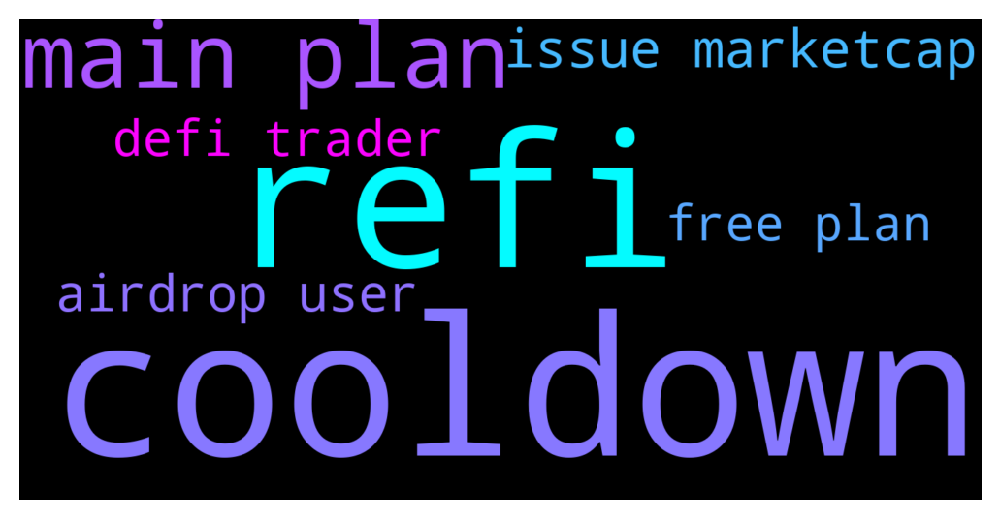

# **@DEXToolsCommunity**
 ## Analysis for **2021-12-10** - **2021-12-12**.

---

## 📊 **Basic Stats**

**n_messages_sent**: 412

---

---

## 🔝 **Top keywords and related messages**

1. **cooldown**

    @napascual --- *Cooldown of what?* **--->** [TG Discussion](https://t.me/DEXToolsCommunity/312228)

    @napascual --- *Looks like you can set the cooldown with /set_cooldown <chart number> <minutes>* **--->** [TG Discussion](https://t.me/DEXToolsCommunity/312238)

    @Madems8 --- *Hi!  Questions: -Cooldown is 3 mins min? -Can chart x-axis in time change?* **--->** [TG Discussion](https://t.me/DEXToolsCommunity/312226)

2. **refi**

    @cryptoavon --- *we are having an issue with marketcap display on dextools for our token $ReFi* **--->** [TG Discussion](https://t.me/DEXToolsCommunity/312015)

    @altcoingirl --- *Our dextool is messed up with wrong mcap. How do we fix it? Look us up $REFI (your channel doesnt allow links here_* **--->** [TG Discussion](https://t.me/DEXToolsCommunity/312306)

    @cryptoavon --- *Hey dextools what’s the update on our issue with the Marketcap for $ReFi? Contract address: 0xA808B22ffd2c472aD1278088F16D4010E6a54D5F* **--->** [TG Discussion](https://t.me/DEXToolsCommunity/312241)

3. **main plan**

    @bastardganpunk --- *how you get the free plan back? i dont understand* **--->** [TG Discussion](https://t.me/DEXToolsCommunity/312102)

    @melon_territory --- *My main PC is now on the free plan and I want to go back to the standard plan* **--->** [TG Discussion](https://t.me/DEXToolsCommunity/312103)

    @melon_territory --- *When I login to Dextool on my sub PC, I get the free plan on my main PC. I logged back in and it didn't change. How can I get it back?* **--->** [TG Discussion](https://t.me/DEXToolsCommunity/312100)

    @broadgasorc --- *You have plan for create token for dextools?* **--->** [TG Discussion](https://t.me/DEXToolsCommunity/312084)

    @melon_territory --- *Can you please confirm that you are on the standard plan so I can send you the address?* **--->** [TG Discussion](https://t.me/DEXToolsCommunity/312117)

    @bastardganpunk --- *i think you want to be on the standard plan!?* **--->** [TG Discussion](https://t.me/DEXToolsCommunity/312118)

4. **issue marketcap**

    @cryptoavon --- *we are having an issue with marketcap display on dextools for our token $ReFi* **--->** [TG Discussion](https://t.me/DEXToolsCommunity/312015)

    @cryptoavon --- *Hey dextools what’s the update on our issue with the Marketcap for $ReFi? Contract address: 0xA808B22ffd2c472aD1278088F16D4010E6a54D5F* **--->** [TG Discussion](https://t.me/DEXToolsCommunity/312241)

    @stanes --- *So obviously this Dextools doesn't find this pair. I am sending that to the devs, they will fix it asap. We are supposed to show all the pairs on Dfyn (Polygon side), if you find some other ones with an issue, please let us know. Thank you for reporting 👍* **--->** [TG Discussion](https://t.me/DEXToolsCommunity/311335)

    @stanes --- *What is your issue?* **--->** [TG Discussion](https://t.me/DEXToolsCommunity/312578)

    @FredericDEXT --- *Sorry I don't understand your issue* **--->** [TG Discussion](https://t.me/DEXToolsCommunity/311530)

    @bastardganpunk --- *which issue do you have?* **--->** [TG Discussion](https://t.me/DEXToolsCommunity/311927)

5. **airdrop user**

    @Crypto4life2 --- *Contract:  0x27845cfff80407100481d2eef169e9887d641939  Polygonscan: https://polygonscan.com/token/0x27845cfff80407100481d2eef169e9887d641939    Very much interested in finding out more about banners on your site.  I use all the time and has many users.  Thank you!* **--->** [TG Discussion](https://t.me/DEXToolsCommunity/312189)

    @broadgasorc --- *Launch IDO section  Airdrop for users with  High volume trade by dextools Add to CEXs  Like : Mexc/gate/kucoin Launch stake section for DEXT* **--->** [TG Discussion](https://t.me/DEXToolsCommunity/312091)

    @broadgasorc --- *Dydx and paraswap are utility platform like dextools  But they use from airdrop for marketing* **--->** [TG Discussion](https://t.me/DEXToolsCommunity/312099)

    @bastardganpunk --- *We have presales. Free money is not planned atm, rather dextools aims to grow the platform and add more Utility for users. Cex integration is not the primary goal for a platform which offers tools for defi traders (defi traders are traders who trade on decentralised exchanges which is the complete opposite of centralised exchanges) 🙂* **--->** [TG Discussion](https://t.me/DEXToolsCommunity/312092)

    @broadgasorc --- *Launch section for sale best projects  And for marketing  Please You provide airdrop for users from dec Xtools with high volume and more TXs in dextools* **--->** [TG Discussion](https://t.me/DEXToolsCommunity/312088)

    @bastardganpunk --- *It’s not requested from dextools users to get notifications, you can see all trades in the trade history, which is much more useful 🙂* **--->** [TG Discussion](https://t.me/DEXToolsCommunity/311861)

6. **defi trader**

    @bastardganpunk --- *We have presales. Free money is not planned atm, rather dextools aims to grow the platform and add more Utility for users. Cex integration is not the primary goal for a platform which offers tools for defi traders (defi traders are traders who trade on decentralised exchanges which is the complete opposite of centralised exchanges) 🙂* **--->** [TG Discussion](https://t.me/DEXToolsCommunity/312092)

7. **free plan**

    @napascual --- *I'd recommend coingecko api as it's free* **--->** [TG Discussion](https://t.me/DEXToolsCommunity/311958)

    @stanes --- *Hi Guys, we want to keep this chat for Dextools support, please.  Feel free to join this group for other discussion, thanks: https://t.me/DEXTtraderslounge* **--->** [TG Discussion](https://t.me/DEXToolsCommunity/311949)

    @bastardganpunk --- *We have presales. Free money is not planned atm, rather dextools aims to grow the platform and add more Utility for users. Cex integration is not the primary goal for a platform which offers tools for defi traders (defi traders are traders who trade on decentralised exchanges which is the complete opposite of centralised exchanges) 🙂* **--->** [TG Discussion](https://t.me/DEXToolsCommunity/312092)

    @bastardganpunk --- *how you get the free plan back? i dont understand* **--->** [TG Discussion](https://t.me/DEXToolsCommunity/312102)

    @melon_territory --- *My main PC is now on the free plan and I want to go back to the standard plan* **--->** [TG Discussion](https://t.me/DEXToolsCommunity/312103)

    @melon_territory --- *When I login to Dextool on my sub PC, I get the free plan on my main PC. I logged back in and it didn't change. How can I get it back?* **--->** [TG Discussion](https://t.me/DEXToolsCommunity/312100)

