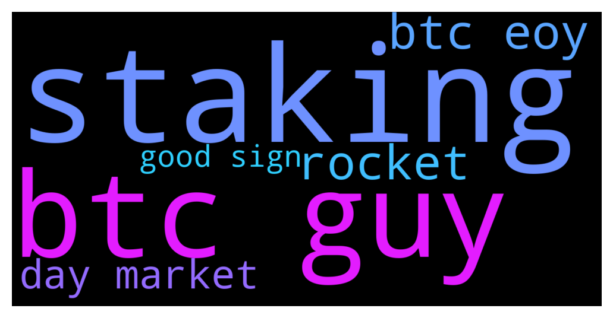

# **@balancer_officialchat**
 ## Analysis for **2021-12-10** - **2021-12-12**.

---

## 📊 **Basic Stats**

**n_messages_sent**: 481

---

---

## 🔝 **Top keywords and related messages**

1. **staking**

    @AdamNasution97 --- *Love the staking and the rewards!* **--->** [TG Discussion](https://t.me/balancer_officialchat/12763)

    @AdamNasution97 --- *Longterm the easiest and most lucrative way in opposition to trading for the majority is to just hold a coin / token. But most won’t even be able to do that as they will panic sell on the first market crash and never manage to hold until high gains.   Holding a token only for the price appreciation isn’t the smartest thing since DeFi, as your tokens can generate you an additional APY. That’s why staking is the best strategy for holders. The unbounding period prevents impulsive sell manoeuvres and helps to hodl longterm while generating also more tokens.  “Stake and forget” is just a saying for this principle as most check their wallets many times a day anyways.* **--->** [TG Discussion](https://t.me/balancer_officialchat/12750)

2. **btc guy**

    @Nicholas2835 --- *BAL is the best guys. Hold it for 2 years and you will see what will happen. Good luck to the whales of this masterpiece* **--->** [TG Discussion](https://t.me/balancer_officialchat/12795)

    @kennethfred --- *Nonetheless, the btc dip is a perfect entry point* **--->** [TG Discussion](https://t.me/balancer_officialchat/12697)

    @kennethfred --- *Most times btc dump affect other alt  coins positively* **--->** [TG Discussion](https://t.me/balancer_officialchat/12694)

    @GeertKuiper --- *The market is getting green woow let's keep accumulating  more BAL tokens from the promo sales and make the market more greener guys 🚀🚀🚀🚀🚀🚀* **--->** [TG Discussion](https://t.me/balancer_officialchat/12755)

    @elizabeth62627 --- *bZx is on its way to make a new ATH We need more people talking  about BAL Things are happening quickly with it. I believe BTC, ETH, ALGO, and many others will all coexist in the CrytpoUniverse BAL should definitely be somewhere in the top 10 now.* **--->** [TG Discussion](https://t.me/balancer_officialchat/12751)

    @louis9990 --- *BTC moving sideways 🤦 Can it just pick a direction and move  So we can adjust accordingly* **--->** [TG Discussion](https://t.me/balancer_officialchat/12524)

3. **btc eoy**

    @kennethfred --- *$20 - $25  EOY I think* **--->** [TG Discussion](https://t.me/balancer_officialchat/12700)

    @kennethfred --- *Nonetheless, the btc dip is a perfect entry point* **--->** [TG Discussion](https://t.me/balancer_officialchat/12697)

    @kennethfred --- *Most times btc dump affect other alt  coins positively* **--->** [TG Discussion](https://t.me/balancer_officialchat/12694)

    @elizabeth62627 --- *bZx is on its way to make a new ATH We need more people talking  about BAL Things are happening quickly with it. I believe BTC, ETH, ALGO, and many others will all coexist in the CrytpoUniverse BAL should definitely be somewhere in the top 10 now.* **--->** [TG Discussion](https://t.me/balancer_officialchat/12751)

    @louis9990 --- *BTC moving sideways 🤦 Can it just pick a direction and move  So we can adjust accordingly* **--->** [TG Discussion](https://t.me/balancer_officialchat/12524)

    @ThomasOConnor3 --- *Do you guys think BTC will reach 100k before EOY?* **--->** [TG Discussion](https://t.me/balancer_officialchat/12824)

4. **rocket**

    @GeertKuiper --- *This is whale manipulation to get BAL at lower prices, dont sell HODL for the next pump. up rocket* **--->** [TG Discussion](https://t.me/balancer_officialchat/12756)

    @AdamNasution97 --- *I'm the pilot. And I'm about to fly the rocket to the moon. Stay cool and always look at the pinned message for new announcement. We take off soon* **--->** [TG Discussion](https://t.me/balancer_officialchat/12789)

    @Baker --- *Let keep buying the pump now before the skyrocket this is ATH* **--->** [TG Discussion](https://t.me/balancer_officialchat/12262)

5. **day market**

    @GeertKuiper --- *I did my calculations the very first day I purchased from the promo sales and it was successful* **--->** [TG Discussion](https://t.me/balancer_officialchat/12776)

    @voltth63 --- *This is the period to accumulate and maintain a positive mindset  Some days the market is good, some days the market is bad. But everyday is an opportunity to get in and not miss out on Future Profit* **--->** [TG Discussion](https://t.me/balancer_officialchat/12775)

    @alanshawn399 --- *Weekend market is mainly volatile, but we can make arrangements in advance* **--->** [TG Discussion](https://t.me/balancer_officialchat/12823)

    @AdamNasution97 --- *Longterm the easiest and most lucrative way in opposition to trading for the majority is to just hold a coin / token. But most won’t even be able to do that as they will panic sell on the first market crash and never manage to hold until high gains.   Holding a token only for the price appreciation isn’t the smartest thing since DeFi, as your tokens can generate you an additional APY. That’s why staking is the best strategy for holders. The unbounding period prevents impulsive sell manoeuvres and helps to hodl longterm while generating also more tokens.  “Stake and forget” is just a saying for this principle as most check their wallets many times a day anyways.* **--->** [TG Discussion](https://t.me/balancer_officialchat/12750)

    @AdamNasution97 --- *That's the main reason I never lose hope because every dip comes along with a pump and every pump must surly come with a dip nothing last forever  the day I became a crypto Hodl I vow to Hodl till I make my family proud so aren't given up am happy I choose BAL* **--->** [TG Discussion](https://t.me/balancer_officialchat/12818)

    @GeertKuiper --- *Always Use a Trading Plan. Treat Trading Like a Business. Use Technology. Protect Your Trading Capital. Study the Markets. Risk Only What You Can Afford. Develop a Trading Methodology. Always Use a Stop Loss.* **--->** [TG Discussion](https://t.me/balancer_officialchat/12768)

6. **good sign**

    @kennethfred --- *With a good perspective on history, we can have a better understanding of the past and present, and thus a clear vision of the future of BAL A higher pump is coming soon Buy now  🤩🤩🤩* **--->** [TG Discussion](https://t.me/balancer_officialchat/12748)

    @voltth63 --- *This is the period to accumulate and maintain a positive mindset  Some days the market is good, some days the market is bad. But everyday is an opportunity to get in and not miss out on Future Profit* **--->** [TG Discussion](https://t.me/balancer_officialchat/12775)

    @AdamNasution97 --- *Longterm the easiest and most lucrative way in opposition to trading for the majority is to just hold a coin / token. But most won’t even be able to do that as they will panic sell on the first market crash and never manage to hold until high gains.   Holding a token only for the price appreciation isn’t the smartest thing since DeFi, as your tokens can generate you an additional APY. That’s why staking is the best strategy for holders. The unbounding period prevents impulsive sell manoeuvres and helps to hodl longterm while generating also more tokens.  “Stake and forget” is just a saying for this principle as most check their wallets many times a day anyways.* **--->** [TG Discussion](https://t.me/balancer_officialchat/12750)

    @Nicholas2835 --- *BAL is the best guys. Hold it for 2 years and you will see what will happen. Good luck to the whales of this masterpiece* **--->** [TG Discussion](https://t.me/balancer_officialchat/12795)

    @elizabeth62627 --- *The market is about to reopen in a few hours. I assure you that next week will be good and profitable for all of us.* **--->** [TG Discussion](https://t.me/balancer_officialchat/12822)

    @Aaron --- *I can see that so many moves are being made by the team and that's a good sign we're heading in the right direction 👍🏻🔥* **--->** [TG Discussion](https://t.me/balancer_officialchat/12765)

