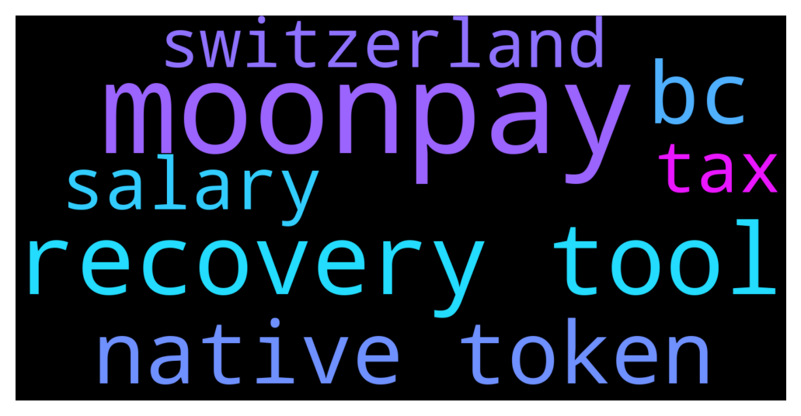

# **@cryptonear**
 ## Analysis for **2021-12-11** - **2021-12-12**.

---

## 📊 **Basic Stats**

**n_messages_sent**: 1624

---

---

## 🔝 **Top keywords and related messages**

1. **moonpay**

    @iamkemoo --- *wallet.near.org via moonpay or on 26 CEX https://coinmarketcap.com/currencies/near-protocol/markets/* **--->** [TG Discussion](https://t.me/cryptonear/234446)

    @larry_lang --- *Does moonpay available in the US? we do offer moonpay https://wallet.near.org/buy* **--->** [TG Discussion](https://t.me/cryptonear/233949)

    @bennychang --- *I used moonpay to buy some near* **--->** [TG Discussion](https://t.me/cryptonear/233811)

    @larry_lang --- *oh verified wallet was the moonpay or near wallet? since the near wallet dont have that verified stuff* **--->** [TG Discussion](https://t.me/cryptonear/234308)

    @DTodd --- *Get a Near Wallet and then buy through Moonpay? Is this the safest way to store it?* **--->** [TG Discussion](https://t.me/cryptonear/233954)

    @iamkemoo --- *and also via moonpay when you create your wallet on wallet.near.org* **--->** [TG Discussion](https://t.me/cryptonear/233763)

2. **recovery tool**

    @larry_lang --- *we dont have any projects that track near eco at the moment, but some analytic tool like sodaki.com can track your farming position https://sodaki.com/* **--->** [TG Discussion](https://t.me/cryptonear/232791)

    @Ben75 --- *Anyway. I am thinking just about the potential of a recovery tool. A lot of funds could be recovered.* **--->** [TG Discussion](https://t.me/cryptonear/234054)

    @Ben75 --- *Something like this. It’s kind of a wrapped token on an account that doesn’t exist. There might be a way if someone is smart enough (in the future) to create a recovery tool for that.* **--->** [TG Discussion](https://t.me/cryptonear/234061)

    @Ben75 --- *In fact, it shall be possible to invent a recovery tool for each pair. We have bridging already these days. In the case above you would need to emulate the targeted BSC address as a NEAR address and then bridge NEAR-BSC and automatically sent the coins through the bridge.* **--->** [TG Discussion](https://t.me/cryptonear/234049)

    @Ben75 --- *Keep it short: in the end those blockchains will win the battle which is the best in these categories: - performance (speed) - robustness (less/no downtimes and failures) - security (against hacks) - scalability - user (dev) friendliness (standards, tools and libraries) - costs (one-time and maintenance)* **--->** [TG Discussion](https://t.me/cryptonear/233723)

    @Ben75 --- *I think it’s really time for someone to invent a „Nirwana“ recovery tool. Can you imagine how much money has been lost and stuck by these wrong transactions. Crazy.* **--->** [TG Discussion](https://t.me/cryptonear/234038)

3. **native token**

    @TheGo1denBull --- *Welcome All NEARCOMERS! Here is a nice guide on the token, where to buy and where to store. If you want to stake I recommend making a wallet at wallet.near.org with your specialized username  https://near.org/tokens/* **--->** [TG Discussion](https://t.me/cryptonear/234717)

    @TheGo1denBull --- *Welcome All NEARCOMERS! Here is a nice guide on the token, where to buy and where to store. If you want to stake I recommended making a wallet at wallet.near.org with your specialized username  https://near.org/tokens/* **--->** [TG Discussion](https://t.me/cryptonear/233324)

    @TheGo1denBull --- *There is a recent beta test for Native NFTs...a bounty test 😶 https://gov.near.org/t/looking-for-beta-testers-for-nativo-nft-v2/10758* **--->** [TG Discussion](https://t.me/cryptonear/231938)

    @iamkemoo --- *true buddy, but he asked for native, bc he wanted to know if he can send his native NEAR around, and thats not the case, bc we need a L2 to wrap the token and send it to another chain* **--->** [TG Discussion](https://t.me/cryptonear/234497)

    @why --- *ah so i cant use native tokens on MM ?* **--->** [TG Discussion](https://t.me/cryptonear/234471)

    @kv9990 --- *So you want to bridge token while transferring and blockchain to automatically detect which Network it belongs from a bunch of blockchain out there 👀 A better solution would be to learn about things before going in! It's a line of information that don't try to send your tokens to different Network 🌝* **--->** [TG Discussion](https://t.me/cryptonear/234063)

4. **bc**

    @iamkemoo --- *true buddy, but he asked for native, bc he wanted to know if he can send his native NEAR around, and thats not the case, bc we need a L2 to wrap the token and send it to another chain* **--->** [TG Discussion](https://t.me/cryptonear/234497)

    @Purple --- *not sure what my account is supposed to be either bc the id number here did not work* **--->** [TG Discussion](https://t.me/cryptonear/232161)

    @iamkemoo --- *actually there is, bc the price of stNEAR is not the same as NEAR, so there is small difference and bc of that there is also IL* **--->** [TG Discussion](https://t.me/cryptonear/234257)

    @iamkemoo --- *bc you can use $NEAR on SushiSwap for DeFi* **--->** [TG Discussion](https://t.me/cryptonear/234426)

    @iamkemoo --- *sorry, took me a while to get things under control bc of a bot attack. the thing is, everyone can start an IDO there, so you will see scam projects there too if you dont enable "whitelist" only* **--->** [TG Discussion](https://t.me/cryptonear/234674)

    @iamkemoo --- *bc its a seperate blockchain* **--->** [TG Discussion](https://t.me/cryptonear/234464)

5. **salary**

    @Ben75 --- *That’s off-course true. You need a high salary to live here. Everything expensive* **--->** [TG Discussion](https://t.me/cryptonear/234085)

    @Aflatoon123 --- *Salary are also handsome out in Switzerland🤑* **--->** [TG Discussion](https://t.me/cryptonear/234081)

    @Ben75 --- *Average salary per month is around 6000 CHF (you can say 6000 USD). Off-course I earn far more than that but I wouldn’t call myself rich. Some bankers here earn 25k and more each month.* **--->** [TG Discussion](https://t.me/cryptonear/234102)

    @Aflatoon123 --- *Adding on this.  I am from a place where 2 to 3 dollar is a day salary (temporary) for many* **--->** [TG Discussion](https://t.me/cryptonear/234055)

    @Ben75 --- *We pay around 5-15% on income tax depending on salary. Our neighbor Germany pays max. 50%. 🤣* **--->** [TG Discussion](https://t.me/cryptonear/234111)

    @Aflatoon123 --- *The salary which i know as minimum wages are from usa and Australia aka 7.5$ and 15$ approx per hour.  Rest will have to take a glance at the reports* **--->** [TG Discussion](https://t.me/cryptonear/234087)

6. **tax**

    @Ben75 --- *We pay around 5-15% on income tax depending on salary. Our neighbor Germany pays max. 50%. 🤣* **--->** [TG Discussion](https://t.me/cryptonear/234111)

    @larry_lang --- *from where i came from the regulators havent seem to catch up with web3 yet=)) so no far no tax* **--->** [TG Discussion](https://t.me/cryptonear/234113)

    @larry_lang --- *no wonder the rich called it tax heaven=00* **--->** [TG Discussion](https://t.me/cryptonear/234109)

    @Ben75 --- *But the good thing: speculation on stocks and crypto are tax free! 🤣🤣🤣* **--->** [TG Discussion](https://t.me/cryptonear/234107)

    @Ben75 --- *Yeah, tax heaven* **--->** [TG Discussion](https://t.me/cryptonear/234110)

    @Ben75 --- *People from Germany are poor guys. They earn less, have higher taxes … and if you live nearby Munich you also have high living costs. Makes no sense. 🤣* **--->** [TG Discussion](https://t.me/cryptonear/234115)

7. **switzerland**

    @Aflatoon123 --- *Salary are also handsome out in Switzerland🤑* **--->** [TG Discussion](https://t.me/cryptonear/234081)

    @Ben75 --- *I would love it.  From Switzerland here. Maybe one of the most expensive countries in the world. 🤣* **--->** [TG Discussion](https://t.me/cryptonear/234074)

    @Aflatoon123 --- *Dang. Earn in Switzerland and go for holiday in other country😁* **--->** [TG Discussion](https://t.me/cryptonear/234150)

    @Ben75 --- *I used to live in Germany (Munich) 15 years ago and decided to move away. What does a nice city with some nice lakes offer me, when I earn only 30% net income comparing to Switzerland? 🤣* **--->** [TG Discussion](https://t.me/cryptonear/234117)

    @NEARverse_xd --- *No, switzerland is very expensive* **--->** [TG Discussion](https://t.me/cryptonear/234104)

