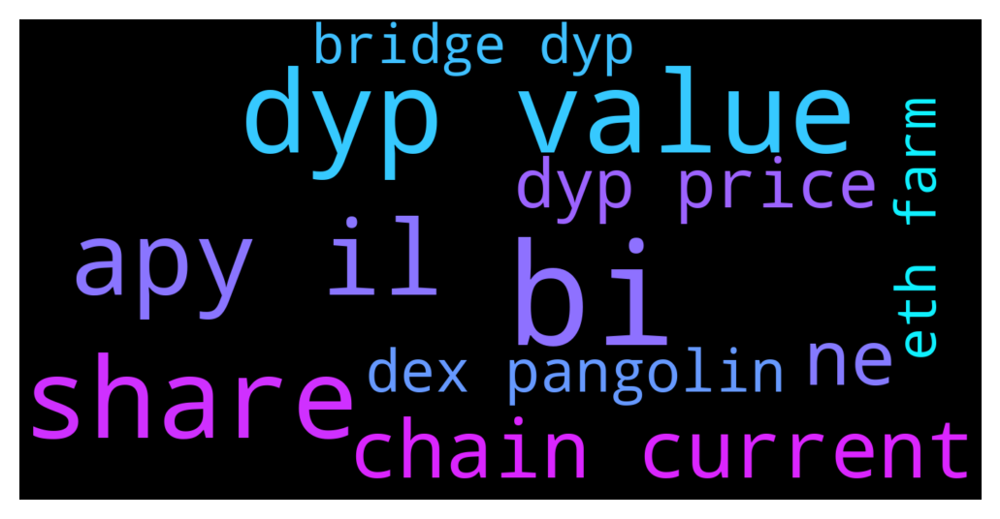

# **@dypfinance**
 ## Analysis for **2021-12-11** - **2021-12-12**.

---

## 📊 **Basic Stats**

**n_messages_sent**: 319

---

---

## 🔝 **Top keywords and related messages**

1. **bi**

    @iamJubi --- *Who wants to adopt a cat that loves to collect watches? Our 10k unique collection of cats that collect watches will be ready soon to mint for the #Avalanche & #BinanceSmartChain users🐱⌚️  Subscribe to our Channel https://t.me/dypannouncements  #NFTs #NFTCommunity #nftcollector  https://twitter.com/dypfinance/status/1469266304452509697* **--->** [TG Discussion](https://t.me/dypfinance/228290)

    @forjustcrypto --- *Öyle bi günde hiçbişeyden kazanamazsın* **--->** [TG Discussion](https://t.me/dypfinance/228601)

    @Onur --- *STAKE WAVAX YAPTIM DEPOZİTOSUZ 10 WAVAX GİBİ KÜÇÜK BİR MİKTAR DENEMEK İÇİN AYDA GETİRİSİ NE KADAR OLUYOR BİLGİN VARMI HOCAM* **--->** [TG Discussion](https://t.me/dypfinance/228609)

    @DhoniMSD516 --- *Ok will forward to devs and they can see the possibilities :) Thanks* **--->** [TG Discussion](https://t.me/dypfinance/228389)

    @Gabriel --- *Just check a little bit the market!When everything go down of course rewards are lower!Just hold and wait for market to recover!* **--->** [TG Discussion](https://t.me/dypfinance/228276)

    @SenorChito --- *I just buy avax from binance and send them to trustwallet* **--->** [TG Discussion](https://t.me/dypfinance/228645)

2. **dyp value**

    @timdyp --- *Let me share some info with you regarding our testing account on the new farming pools. So 21 days ago we deposited 0.3 BNB in each pool, that means a total of 1.5 BNB. I will attach a print screen with the deposits and another one with the current value as today.   Deposit value (21 days ago): $848.74 (1.5 BNB) Current value (As of today): $1389.24* **--->** [TG Discussion](https://t.me/dypfinance/228438)

    @iamJubi --- *Hello. SLR. Your deposit is converted into 75% LP(wbnb and idyp pair) which is subject to IL and 25% is DYP. at the end of lock period, the value of what you will be withdrawing will depend on the current price of WBNB+iDYP and DYP.   You can check on MY stat "VIEW ALL" the current value of your LP deposit and DYP.* **--->** [TG Discussion](https://t.me/dypfinance/228361)

    @Eugej --- *The value of my LP has gone down a lot..imagine checking in and seeing my investment gone down over 50% goodness even the claimable amount isn't encouraging...not happy* **--->** [TG Discussion](https://t.me/dypfinance/228350)

    @timdyp --- *Also, here are some stats regarding the AVAX farms, here we made a test deposit on 0 and 3 days pools, 1 day 21 hrs ago. Deposited a total of 2 AVAX worth $171.70, current value of the deposited assets is $183.82.* **--->** [TG Discussion](https://t.me/dypfinance/228443)

    @DhoniMSD516 --- *Hey please read these features we are currently offering DYP Farming DYP Staking DYP Vault DYP Buyback DYP NFT dApp DYP Tools DYP Governance Coming soon with DYP Launchpad Expansion to multiple chains https://t.me/dypfinance/152576 You can start reading about DYP here* **--->** [TG Discussion](https://t.me/dypfinance/228660)

    @prokarps --- *where invest be happy this market? not one at least we get rewarded from dyp dis days. all tokens down. can swap your money to usd if not like risk and reward.* **--->** [TG Discussion](https://t.me/dypfinance/228355)

3. **share**

    @DhoniMSD516 --- *Yes every day the iDYP is swapped for BNB/AVAX and sent to you depending on your share %* **--->** [TG Discussion](https://t.me/dypfinance/228411)

    @DhoniMSD516 --- *The rewards you get depends on your share% and apy without burn %* **--->** [TG Discussion](https://t.me/dypfinance/228318)

    @Vage --- *I thought you get shares on how many shares you staking not what the market value is . So if I have 90 accumulated now and the price drops my shares will drop also?* **--->** [TG Discussion](https://t.me/dypfinance/228692)

    @Vage --- *No it’s not in dollars it’s in shares* **--->** [TG Discussion](https://t.me/dypfinance/228689)

    @Vage --- *So in 7hrs staking I lost 1 share . Because the price dropped ?* **--->** [TG Discussion](https://t.me/dypfinance/228695)

4. **apy il**

    @DhoniMSD516 --- *As said the apy includes burn% and we never know whether the tokens will be burned or not this will be decided by governance proposal Please read through https://link.medium.com/2nXyI0UkPlb to understand how farming works* **--->** [TG Discussion](https://t.me/dypfinance/228320)

    @iamJubi --- *Hello. SLR. Your deposit is converted into 75% LP(wbnb and idyp pair) which is subject to IL and 25% is DYP. at the end of lock period, the value of what you will be withdrawing will depend on the current price of WBNB+iDYP and DYP.   You can check on MY stat "VIEW ALL" the current value of your LP deposit and DYP.* **--->** [TG Discussion](https://t.me/dypfinance/228361)

    @timdyp --- *Start Earning Today with #DeFiYieldProtocol  ▶️ 9077 ETH, 8927 BNB & 17010 AVAX paid to users ▶️ #YieldFarming with #BNB & #AVAX rewards 3802% APY ▶️ #Staking with NO IL 171% APY ▶️ #Buyback with NO IL 168% APY ▶️ #DYPTools, #NTFs and #ReferralProgram  👉https://dyp.finance  https://twitter.com/dypfinance/status/1469717699605504000* **--->** [TG Discussion](https://t.me/dypfinance/228460)

    @iamJubi --- *Start Earning Today with #DeFiYieldProtocol  ▶️ 9077 ETH, 8927 BNB & 17010 AVAX paid to users ▶️ #YieldFarming with #BNB & #AVAX rewards 3802% APY ▶️ #Staking with NO IL 171% APY ▶️ #Buyback with NO IL 168% APY ▶️ #DYPTools, #NTFs and #ReferralProgram  👉https://dyp.finance  https://twitter.com/dypfinance/status/1469717699605504000* **--->** [TG Discussion](https://t.me/dypfinance/228566)

    @DhoniMSD516 --- *The rewards you get depends on your share% and apy without burn %* **--->** [TG Discussion](https://t.me/dypfinance/228318)

    @RadiantPhoenix4 --- *About this... As i understand it, IL only affects me when I withdraw. What happens at the end of the lock period? What if the IL is really high?  Do I have the option to leave my tokens in the pool until there is no IL affecting the WBNB+iDYP pair?* **--->** [TG Discussion](https://t.me/dypfinance/228631)

5. **chain current**

    @timdyp --- *Let me share some info with you regarding our testing account on the new farming pools. So 21 days ago we deposited 0.3 BNB in each pool, that means a total of 1.5 BNB. I will attach a print screen with the deposits and another one with the current value as today.   Deposit value (21 days ago): $848.74 (1.5 BNB) Current value (As of today): $1389.24* **--->** [TG Discussion](https://t.me/dypfinance/228438)

    @iamJubi --- *Hello. SLR. Your deposit is converted into 75% LP(wbnb and idyp pair) which is subject to IL and 25% is DYP. at the end of lock period, the value of what you will be withdrawing will depend on the current price of WBNB+iDYP and DYP.   You can check on MY stat "VIEW ALL" the current value of your LP deposit and DYP.* **--->** [TG Discussion](https://t.me/dypfinance/228361)

    @timdyp --- *Also, here are some stats regarding the AVAX farms, here we made a test deposit on 0 and 3 days pools, 1 day 21 hrs ago. Deposited a total of 2 AVAX worth $171.70, current value of the deposited assets is $183.82.* **--->** [TG Discussion](https://t.me/dypfinance/228443)

    @DhoniMSD516 --- *Hey please read these features we are currently offering DYP Farming DYP Staking DYP Vault DYP Buyback DYP NFT dApp DYP Tools DYP Governance Coming soon with DYP Launchpad Expansion to multiple chains https://t.me/dypfinance/152576 You can start reading about DYP here* **--->** [TG Discussion](https://t.me/dypfinance/228660)

    @DhoniMSD516 --- *Hey this depends on which chain you use most current yield farming is available on BSC and AVAX chains* **--->** [TG Discussion](https://t.me/dypfinance/228638)

    @DhoniMSD516 --- *You can check these stats on website already :) Current TVL's AVAX chain Farm: $14,589,713 Buyback: $323,262 Staking: $730,700* **--->** [TG Discussion](https://t.me/dypfinance/228414)

6. **ne**

    @timdyp --- *Let me share some info with you regarding our testing account on the new farming pools. So 21 days ago we deposited 0.3 BNB in each pool, that means a total of 1.5 BNB. I will attach a print screen with the deposits and another one with the current value as today.   Deposit value (21 days ago): $848.74 (1.5 BNB) Current value (As of today): $1389.24* **--->** [TG Discussion](https://t.me/dypfinance/228438)

    @Eugej --- *The value of my LP has gone down a lot..imagine checking in and seeing my investment gone down over 50% goodness even the claimable amount isn't encouraging...not happy* **--->** [TG Discussion](https://t.me/dypfinance/228350)

    @iamJubi --- *Who wants to adopt a cat that loves to collect watches? Our 10k unique collection of cats that collect watches will be ready soon to mint for the #Avalanche & #BinanceSmartChain users🐱⌚️  Subscribe to our Channel https://t.me/dypannouncements  #NFTs #NFTCommunity #nftcollector  https://twitter.com/dypfinance/status/1469266304452509697* **--->** [TG Discussion](https://t.me/dypfinance/228290)

    @prokarps --- *where invest be happy this market? not one at least we get rewarded from dyp dis days. all tokens down. can swap your money to usd if not like risk and reward.* **--->** [TG Discussion](https://t.me/dypfinance/228355)

    @hemanrock --- *With these new strategies, we maximize the yield farming rewards for the users, minimize the impermanent loss.  please check more about how FARMS work.* **--->** [TG Discussion](https://t.me/dypfinance/228497)

    @YatraNode --- *Hello.   I have some question about the impermanent loss in farm   Lock4000 busd for 90 day in farm.   When I put I understand at the end of lock I have 75 of my investissement in busd (3000busd ) and 25% in dyp. Right?  Because I see today I have lp of idy wbnb.* **--->** [TG Discussion](https://t.me/dypfinance/228360)

7. **dyp price**

    @iamJubi --- *Hello. SLR. Your deposit is converted into 75% LP(wbnb and idyp pair) which is subject to IL and 25% is DYP. at the end of lock period, the value of what you will be withdrawing will depend on the current price of WBNB+iDYP and DYP.   You can check on MY stat "VIEW ALL" the current value of your LP deposit and DYP.* **--->** [TG Discussion](https://t.me/dypfinance/228361)

    @DhoniMSD516 --- *Hey please read these features we are currently offering DYP Farming DYP Staking DYP Vault DYP Buyback DYP NFT dApp DYP Tools DYP Governance Coming soon with DYP Launchpad Expansion to multiple chains https://t.me/dypfinance/152576 You can start reading about DYP here* **--->** [TG Discussion](https://t.me/dypfinance/228660)

    @prokarps --- *where invest be happy this market? not one at least we get rewarded from dyp dis days. all tokens down. can swap your money to usd if not like risk and reward.* **--->** [TG Discussion](https://t.me/dypfinance/228355)

    @DhoniMSD516 --- *So when you click claim the usd value is DYP market bought and sent to you as DYP rewards* **--->** [TG Discussion](https://t.me/dypfinance/228691)

    @DhoniMSD516 --- *Hey the value you get shown is usd, so it depends on market price of DYP* **--->** [TG Discussion](https://t.me/dypfinance/228688)

    @Alliveall --- *discuss bout the price on this https://t.me/dypprice* **--->** [TG Discussion](https://t.me/dypfinance/228433)

8. **dex pangolin**

    @hemanrock --- *For FARMS  If you deposit WAVAX worth $1000. the smart contract will split the WAVAX worth $1000 in two parts: WAVAX worth $750 is added to Pangolin AVAX/iDYP LP and WAVAX worth $250 is sent to DYP Staking with up to 140% APY.  https://dypfinance.medium.com/staking-farming-and-buyback-v2-is-live-on-avalanche-c0d16bf1961c  ex:  FARM video tutorial https://www.youtube.com/watch?v=TIC2UimE-50&t=2s* **--->** [TG Discussion](https://t.me/dypfinance/228489)

    @DhoniMSD516 --- *Yes you can check available pairs on Pangolin and Dmm https://dyp.finance/dex* **--->** [TG Discussion](https://t.me/dypfinance/228398)

    @promoter_no_1 --- *I am a  Promoter  We provide  Shilling... scraping...voting and adding...We also promote coin on Reddit and dex tool...message me for info* **--->** [TG Discussion](https://t.me/dypfinance/228669)

    @DhoniMSD516 --- *Hey you need to wrap the avax to farm, you can use pangolin to swap avax to wavax* **--->** [TG Discussion](https://t.me/dypfinance/228707)

    @hemanrock --- *hey, after you withdraw your LP from DYP. Please visit Pangolin site and you can simply click on (pool) in Pangolin. you will be able to see your existing LP pair.  https://app.pangolin.exchange/#/pool* **--->** [TG Discussion](https://t.me/dypfinance/228256)

    @DhoniMSD516 --- *Just head to pangolin dex* **--->** [TG Discussion](https://t.me/dypfinance/228710)

9. **eth farm**

    @timdyp --- *Start Earning Today with #DeFiYieldProtocol  ▶️ 9077 ETH, 8927 BNB & 17010 AVAX paid to users ▶️ #YieldFarming with #BNB & #AVAX rewards 3802% APY ▶️ #Staking with NO IL 171% APY ▶️ #Buyback with NO IL 168% APY ▶️ #DYPTools, #NTFs and #ReferralProgram  👉https://dyp.finance  https://twitter.com/dypfinance/status/1469717699605504000* **--->** [TG Discussion](https://t.me/dypfinance/228460)

    @iamJubi --- *Start Earning Today with #DeFiYieldProtocol  ▶️ 9077 ETH, 8927 BNB & 17010 AVAX paid to users ▶️ #YieldFarming with #BNB & #AVAX rewards 3802% APY ▶️ #Staking with NO IL 171% APY ▶️ #Buyback with NO IL 168% APY ▶️ #DYPTools, #NTFs and #ReferralProgram  👉https://dyp.finance  https://twitter.com/dypfinance/status/1469717699605504000* **--->** [TG Discussion](https://t.me/dypfinance/228566)

    @hemanrock --- *For FARMS  If you deposit WAVAX worth $1000. the smart contract will split the WAVAX worth $1000 in two parts: WAVAX worth $750 is added to Pangolin AVAX/iDYP LP and WAVAX worth $250 is sent to DYP Staking with up to 140% APY.  https://dypfinance.medium.com/staking-farming-and-buyback-v2-is-live-on-avalanche-c0d16bf1961c  ex:  FARM video tutorial https://www.youtube.com/watch?v=TIC2UimE-50&t=2s* **--->** [TG Discussion](https://t.me/dypfinance/228489)

    @timdyp --- *Also, here are some stats regarding the AVAX farms, here we made a test deposit on 0 and 3 days pools, 1 day 21 hrs ago. Deposited a total of 2 AVAX worth $171.70, current value of the deposited assets is $183.82.* **--->** [TG Discussion](https://t.me/dypfinance/228443)

    @DhoniMSD516 --- *Eth farms will be coming next week matic farms this month* **--->** [TG Discussion](https://t.me/dypfinance/228580)

    @Mrcgp_0 --- *Requesting link back to farms again from staking-stats page! cheers chaps!* **--->** [TG Discussion](https://t.me/dypfinance/228465)

10. **bridge dyp**

    @iamJubi --- *Hello. SLR. Your deposit is converted into 75% LP(wbnb and idyp pair) which is subject to IL and 25% is DYP. at the end of lock period, the value of what you will be withdrawing will depend on the current price of WBNB+iDYP and DYP.   You can check on MY stat "VIEW ALL" the current value of your LP deposit and DYP.* **--->** [TG Discussion](https://t.me/dypfinance/228361)

    @DhoniMSD516 --- *Hey please read these features we are currently offering DYP Farming DYP Staking DYP Vault DYP Buyback DYP NFT dApp DYP Tools DYP Governance Coming soon with DYP Launchpad Expansion to multiple chains https://t.me/dypfinance/152576 You can start reading about DYP here* **--->** [TG Discussion](https://t.me/dypfinance/228660)

    @prokarps --- *where invest be happy this market? not one at least we get rewarded from dyp dis days. all tokens down. can swap your money to usd if not like risk and reward.* **--->** [TG Discussion](https://t.me/dypfinance/228355)

    @DhoniMSD516 --- *So when you click claim the usd value is DYP market bought and sent to you as DYP rewards* **--->** [TG Discussion](https://t.me/dypfinance/228691)

    @DhoniMSD516 --- *Hey the value you get shown is usd, so it depends on market price of DYP* **--->** [TG Discussion](https://t.me/dypfinance/228688)

    @DhoniMSD516 --- *Hey you can start reading about DYP here https://t.me/dypfinance/152576* **--->** [TG Discussion](https://t.me/dypfinance/228593)

