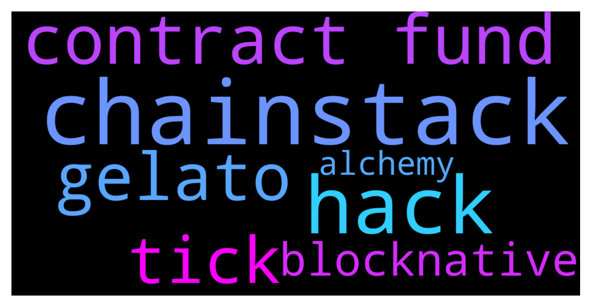

# **@lobsters_chat**
 ## Analysis for **2021-12-11** - **2021-12-12**.

---

## 📊 **Basic Stats**

**n_messages_sent**: 306

---

---

## 🔝 **Top keywords and related messages**

1. **chainstack**

    @Rrrrotten --- *quicknode, chainstack as far as I remember someone from chainstack team is in this chat* **--->** [TG Discussion](https://t.me/lobsters_chat/306865)

    @s0183 --- *Thanks, never heard of chainstack but they look good* **--->** [TG Discussion](https://t.me/lobsters_chat/306867)

2. **hack**

    @syLKf --- *This transaction was a whitehat hack, all good. More details to be released.* **--->** [TG Discussion](https://t.me/lobsters_chat/306767)

    @JellyF --- *Holy fuck, what's going on? Hack after hack after hack all over. Why?* **--->** [TG Discussion](https://t.me/lobsters_chat/306833)

    @FortisFortuna_89 --- *Allowance hack* **--->** [TG Discussion](https://t.me/lobsters_chat/306742)

    @Noyer_1k --- *Astrologers proclaim week of blackhats. Hacks gonna double* **--->** [TG Discussion](https://t.me/lobsters_chat/306483)

    @Jason_xiii --- *Whitehacker?* **--->** [TG Discussion](https://t.me/lobsters_chat/306771)

3. **contract fund**

    @lrevenant --- *it got the funds from an address gelato was minted to* **--->** [TG Discussion](https://t.me/lobsters_chat/306759)

    @freshaspect --- *Gelato has not been hacked. A potential exploit in a G-UNI contract was reported and the funds were moved to safety.* **--->** [TG Discussion](https://t.me/lobsters_chat/306791)

    @apoorvlathey --- *Make sure you don't have any token approval for their contracts, or your funds might still be at risk* **--->** [TG Discussion](https://t.me/lobsters_chat/306796)

    @Vlad --- *Good day.  I'm asking for help in supporting several types of wallets on the site.  In the current project we need to support: MetaMask, WalletConnect, CoinbaseWallet. On many sites I see that they work with all of these wallets. I get the impression that it should be easy since everyone has support for these wallets... The project will work with Binance Smart Chain.  I've worked with MetaMask before, no problems with it. But docking WalletConnect was not as easy as expected.  I use now ethersjs to interact with smart contracts. I found @walletconnect/web3-provider package, with which I hoped to solve the problem with WalletConnect support, i.e. create provider and throw it into ethersjs. But it requires infuraId parameter in constructor, and as I understand, this service works only in Ethereum network, and I need it to work in BSC.  Another question about WalletConnect was how to make balanceOf requests, in their documentation https://docs.walletconnect.com/json-rpc/ethereum basically only signatures and transactions. I suspect that's why they want infuraId parameter just for this case.  Can u give me an advise please on the best way to solve this problem?* **--->** [TG Discussion](https://t.me/lobsters_chat/306658)

    @sambacha --- *mistX offers its own routing contracts, openmev operates on the backend entirely* **--->** [TG Discussion](https://t.me/lobsters_chat/306708)

    @ilkali --- *Rabby also had a similar thing, it'd just simulate the transaction and show the changes in balances and tx outcome plus the some function details if it is a well known contract. But that required you to use their default RPC, I hope metamasks implementation will not require that.* **--->** [TG Discussion](https://t.me/lobsters_chat/306647)

4. **gelato**

    @FortisFortuna_89 --- *Just disapprove any Gelato / GUNI allowances https://etherscan.io/tokenapprovalchecker* **--->** [TG Discussion](https://t.me/lobsters_chat/306763)

    @lrevenant --- *I assume most ppl who got affected approved on gelato due to that* **--->** [TG Discussion](https://t.me/lobsters_chat/306789)

    @lrevenant --- *actually it looks like this prolly was gelato/frax* **--->** [TG Discussion](https://t.me/lobsters_chat/306733)

    @RickCrosschain --- *Damn guys, just went for beers and I saw that gelato got hacked. Am I safu ?* **--->** [TG Discussion](https://t.me/lobsters_chat/306782)

    @tobaias --- *It's gelato, yeah, with the G-UNI router* **--->** [TG Discussion](https://t.me/lobsters_chat/306753)

    @lrevenant --- *it got the funds from an address gelato was minted to* **--->** [TG Discussion](https://t.me/lobsters_chat/306759)

5. **tick**

    @Alchemy --- *What's the deal with some having blue tick some not?? I'm aware tick is verified but the link you sent is unverified with average .74 eth floor. Trying to make sense of the mess on opensea...* **--->** [TG Discussion](https://t.me/lobsters_chat/306821)

6. **blocknative**

    @FiveBoroughs --- *Easiest is your local node or infura, best with mempool scanning is blocknative* **--->** [TG Discussion](https://t.me/lobsters_chat/306871)

    @Cunhasdepedra --- *Blocknative provides node or just mempool explorer? Or both?* **--->** [TG Discussion](https://t.me/lobsters_chat/306881)

7. **alchemy**

    @farm42 --- *+ Alchemy also join @lobsterdao where we discuss only our Lobster NFT collection and DAO questions.* **--->** [TG Discussion](https://t.me/lobsters_chat/306809)

    @s0183 --- *What node providers do people here recommend? I tried both alchemy and infura and for a simple eth_call the latency is like 500ms-1s and for more complex stuff its multiple seconds. Is that normal?* **--->** [TG Discussion](https://t.me/lobsters_chat/306864)

