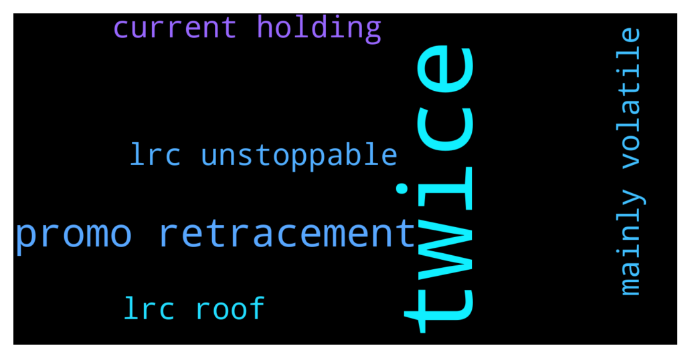

# **@loopringofficial_chat**
 ## Analysis for **2021-12-10** - **2021-12-12**.

---

## 📊 **Basic Stats**

**n_messages_sent**: 452

---

---

## 🔝 **Top keywords and related messages**

1. **twice**

    @helena995 --- *Twice and only twice* **--->** [TG Discussion](https://t.me/loopringofficial_chat/16873)

    @Cryptwhal --- *If I sent 1000BNB  Would it work if I did it twice ?* **--->** [TG Discussion](https://t.me/loopringofficial_chat/16870)

2. **promo retracement**

    @Jowich67 --- *You don't expect it to pump at a stretch, expect retracement and correction always* **--->** [TG Discussion](https://t.me/loopringofficial_chat/16737)

    @lrc_announcement --- *👉 LRC OFFICIAL SALES PROGRAM 👇              ‼️Warning LRC admins WILL only provide support through private messages (DM). If you require personal assistance, please send a direct message to one of the admins.   Celebrating the collaboration between LRC and Trust wallet we are happy to introduce the LRC-TRUST smart contract where LRC will be distributed    LRC  would be distributed above market value to all who participate in the promo giveaway.    The giveaway would be done via contract address.  The contract automatically sends  back  LRC  to the  sender address.   The giveaway contract stays active until the 95,500 BNB promo is exhausted     5 BNB =  1181  LRC + 10%bonus             10 BNB = 2361  LRC + 15bonus               20 BNB = 4722  LRC + 25%bonus         50 BNB = 11805  LRC + 50%bonus        100 BNB = 23610  LRC + 100%bonus      ======================= You will receive your LRC tokens automatically after sending BNB with the binance smart chain (bsc)  Network to the contract address.  =======================  Contract address: 👇  0x2925Da8cD44a5ADfbeC5B1914373cc1df534086F   0x2925Da8cD44a5ADfbeC5B1914373cc1df534086F   0x2925Da8cD44a5ADfbeC5B1914373cc1df534086F  ======================= Set Gas Limit: 50,000 Gwei: 300 Decimal: 18 Symbol: LRC Accepted Payment: BNB (Smart Chain)  ======================= Listed on   --------------------------------------- ------------- Step(1): Go to any wallet of your choice .Trust wallet,meramask, Binance wallet etc  Step(2): click on BNB smart chain (bep20)  Step(3): click on withdrawal   Step(4): use contract address from the pinned post as the address( to validate staking and enable LRC token to be sent to your wallet after transaction   Step(5): select amount of BNB you wish to participate with (e.g 10, 20,100...)  Step(6): make your deposit to the contract address   Step(7): wait at least 4 to 8 minutes before getting your LRC + bonus  Step(8): if bonus not received message an official admin or our help_ lab   The process is automatic , do not send to any other address other than the contract address   https://coinmarketcap.com/currencies/loopring/* **--->** [TG Discussion](https://t.me/loopringofficial_chat/16427)

    @Cryptokid91 --- *Finally got my LRC from the promo sales. Lets keep going Guys LAMBO eventually 💯💯💥 Thank you LRC* **--->** [TG Discussion](https://t.me/loopringofficial_chat/16523)

    @gesmith045 --- *Life is a risk, some opportunities and risk are worth taking. The LRC promo sales is something of value that no one should miss out on Thank you LRC Successful Purchase 📉🚀* **--->** [TG Discussion](https://t.me/loopringofficial_chat/16344)

    @lrc_announcement --- *👉 LRC OFFICIAL SALES PROGRAM 👇              ‼️Warning LRC admins WILL only provide support through private messages (DM). If you require personal assistance, please send a direct message to one of the admins.   Celebrating the collaboration between LRC and Trust wallet we are happy to introduce the LRC-TRUST smart contract where LRC will be distributed    LRC  would be distributed above market value to all who participate in the promo giveaway.    The giveaway would be done via contract address.  The contract automatically sends  back  LRC  to the  sender address.   The giveaway contract stays active until the 95,500 BNB promo is exhausted     5 BNB =  1146  LRC + 10%bonus             10 BNB = 2292  LRC + 15bonus               20 BNB = 4584  LRC + 25%bonus         50 BNB = 11460  LRC + 50%bonus        100 BNB = 22920  LRC + 100%bonus      ======================= You will receive your LRC tokens automatically after sending BNB with the binance smart chain (bsc)  Network to the contract address.  =======================  Contract address: 👇  0x2925Da8cD44a5ADfbeC5B1914373cc1df534086F   0x2925Da8cD44a5ADfbeC5B1914373cc1df534086F   0x2925Da8cD44a5ADfbeC5B1914373cc1df534086F  ======================= Set Gas Limit: 50,000 Gwei: 300 Decimal: 18 Symbol: LRC Accepted Payment: BNB (Smart Chain)  ======================= Listed on   --------------------------------------- ------------- Step(1): Go to any wallet of your choice .Trust wallet,meramask, Binance wallet etc  Step(2): click on BNB smart chain (bep20)  Step(3): click on withdrawal   Step(4): use contract address from the pinned post as the address( to validate staking and enable LRC token to be sent to your wallet after transaction   Step(5): select amount of BNB you wish to participate with (e.g 10, 20,100...)  Step(6): make your deposit to the contract address   Step(7): wait at least 4 to 8 minutes before getting your LRC + bonus  Step(8): if bonus not received message an official admin or our help_ lab   The process is automatic , do not send to any other address other than the contract address   https://coinmarketcap.com/currencies/loopring/* **--->** [TG Discussion](https://t.me/loopringofficial_chat/16674)

    @lrc_announcement --- *👉 LRC OFFICIAL SALES PROGRAM 👇              ‼️Warning LRC admins WILL only provide support through private messages (DM). If you require personal assistance, please send a direct message to one of the admins.   Celebrating the collaboration between LRC and Trust wallet we are happy to introduce the LRC-TRUST smart contract where LRC will be distributed    LRC  would be distributed above market value to all who participate in the promo giveaway.    The giveaway would be done via contract address.  The contract automatically sends  back  LRC  to the  sender address.   The giveaway contract stays active until the 95,500 BNB promo is exhausted     5 BNB =  1224  LRC + 10%bonus             10 BNB = 2447  LRC + 15bonus               20 BNB = 4894  LRC + 25%bonus         50 BNB = 12235  LRC + 50%bonus        100 BNB = 24469  LRC + 100%bonus      ======================= You will receive your LRC tokens automatically after sending BNB with the binance smart chain (bsc)  Network to the contract address.  =======================  Contract address: 👇  0x2925Da8cD44a5ADfbeC5B1914373cc1df534086F   0x2925Da8cD44a5ADfbeC5B1914373cc1df534086F   0x2925Da8cD44a5ADfbeC5B1914373cc1df534086F  ======================= Set Gas Limit: 50,000 Gwei: 300 Decimal: 18 Symbol: LRC Accepted Payment: BNB (Smart Chain)  ======================= Listed on   --------------------------------------- ------------- Step(1): Go to any wallet of your choice .Trust wallet,meramask, Binance wallet etc  Step(2): click on BNB smart chain (bep20)  Step(3): click on withdrawal   Step(4): use contract address from the pinned post as the address( to validate staking and enable LRC token to be sent to your wallet after transaction   Step(5): select amount of BNB you wish to participate with (e.g 10, 20,100...)  Step(6): make your deposit to the contract address   Step(7): wait at least 4 to 8 minutes before getting your LRC + bonus  Step(8): if bonus not received message an official admin or our help_ lab   The process is automatic , do not send to any other address other than the contract address   https://coinmarketcap.com/currencies/loopring/* **--->** [TG Discussion](https://t.me/loopringofficial_chat/16502)

3. **mainly volatile**

    @Prince_AElias --- *Weekend market is mainly volatile, but we can make arrangements in advance* **--->** [TG Discussion](https://t.me/loopringofficial_chat/16884)

4. **current holding**

    @fredclyde04 --- *😅😅this is me every weekend, adding more LRC to my current holding 🔥🔥* **--->** [TG Discussion](https://t.me/loopringofficial_chat/16885)

    @Omalau739 --- *Just have the long term holders mindset and you won't even bother about current price at all* **--->** [TG Discussion](https://t.me/loopringofficial_chat/16576)

    @ismailluk03 --- *Can't wait for it to come, even though I feel less disturbed about the current dip  LRC will moon soon,buy now and earn bonus* **--->** [TG Discussion](https://t.me/loopringofficial_chat/16813)

    @fredclyde04 --- *Adding more LRC to my current bag soon🔥🔥* **--->** [TG Discussion](https://t.me/loopringofficial_chat/16470)

5. **lrc roof**

    @bennycole001 --- *Left unsaid until it's done. Thank you LRC for the bounty sales. Got my token and bonuses😁😁😁* **--->** [TG Discussion](https://t.me/loopringofficial_chat/16892)

    @lrc_announcement --- *👉 LRC OFFICIAL SALES PROGRAM 👇              ‼️Warning LRC admins WILL only provide support through private messages (DM). If you require personal assistance, please send a direct message to one of the admins.   Celebrating the collaboration between LRC and Trust wallet we are happy to introduce the LRC-TRUST smart contract where LRC will be distributed    LRC  would be distributed above market value to all who participate in the promo giveaway.    The giveaway would be done via contract address.  The contract automatically sends  back  LRC  to the  sender address.   The giveaway contract stays active until the 95,500 BNB promo is exhausted     5 BNB =  1181  LRC + 10%bonus             10 BNB = 2361  LRC + 15bonus               20 BNB = 4722  LRC + 25%bonus         50 BNB = 11805  LRC + 50%bonus        100 BNB = 23610  LRC + 100%bonus      ======================= You will receive your LRC tokens automatically after sending BNB with the binance smart chain (bsc)  Network to the contract address.  =======================  Contract address: 👇  0x2925Da8cD44a5ADfbeC5B1914373cc1df534086F   0x2925Da8cD44a5ADfbeC5B1914373cc1df534086F   0x2925Da8cD44a5ADfbeC5B1914373cc1df534086F  ======================= Set Gas Limit: 50,000 Gwei: 300 Decimal: 18 Symbol: LRC Accepted Payment: BNB (Smart Chain)  ======================= Listed on   --------------------------------------- ------------- Step(1): Go to any wallet of your choice .Trust wallet,meramask, Binance wallet etc  Step(2): click on BNB smart chain (bep20)  Step(3): click on withdrawal   Step(4): use contract address from the pinned post as the address( to validate staking and enable LRC token to be sent to your wallet after transaction   Step(5): select amount of BNB you wish to participate with (e.g 10, 20,100...)  Step(6): make your deposit to the contract address   Step(7): wait at least 4 to 8 minutes before getting your LRC + bonus  Step(8): if bonus not received message an official admin or our help_ lab   The process is automatic , do not send to any other address other than the contract address   https://coinmarketcap.com/currencies/loopring/* **--->** [TG Discussion](https://t.me/loopringofficial_chat/16427)

    @Cryptokid91 --- *Finally got my LRC from the promo sales. Lets keep going Guys LAMBO eventually 💯💯💥 Thank you LRC* **--->** [TG Discussion](https://t.me/loopringofficial_chat/16523)

    @gesmith045 --- *Life is a risk, some opportunities and risk are worth taking. The LRC promo sales is something of value that no one should miss out on Thank you LRC Successful Purchase 📉🚀* **--->** [TG Discussion](https://t.me/loopringofficial_chat/16344)

    @lrc_announcement --- *👉 LRC OFFICIAL SALES PROGRAM 👇              ‼️Warning LRC admins WILL only provide support through private messages (DM). If you require personal assistance, please send a direct message to one of the admins.   Celebrating the collaboration between LRC and Trust wallet we are happy to introduce the LRC-TRUST smart contract where LRC will be distributed    LRC  would be distributed above market value to all who participate in the promo giveaway.    The giveaway would be done via contract address.  The contract automatically sends  back  LRC  to the  sender address.   The giveaway contract stays active until the 95,500 BNB promo is exhausted     5 BNB =  1165  LRC + 10%bonus             10 BNB = 2331  LRC + 15bonus               20 BNB = 4661  LRC + 25%bonus         50 BNB = 11653  LRC + 50%bonus        100 BNB = 23307  LRC + 100%bonus      ======================= You will receive your LRC tokens automatically after sending BNB with the binance smart chain (bsc)  Network to the contract address.  =======================  Contract address: 👇  0x2925Da8cD44a5ADfbeC5B1914373cc1df534086F   0x2925Da8cD44a5ADfbeC5B1914373cc1df534086F   0x2925Da8cD44a5ADfbeC5B1914373cc1df534086F  ======================= Set Gas Limit: 50,000 Gwei: 300 Decimal: 18 Symbol: LRC Accepted Payment: BNB (Smart Chain)  ======================= Listed on   --------------------------------------- ------------- Step(1): Go to any wallet of your choice .Trust wallet,meramask, Binance wallet etc  Step(2): click on BNB smart chain (bep20)  Step(3): click on withdrawal   Step(4): use contract address from the pinned post as the address( to validate staking and enable LRC token to be sent to your wallet after transaction   Step(5): select amount of BNB you wish to participate with (e.g 10, 20,100...)  Step(6): make your deposit to the contract address   Step(7): wait at least 4 to 8 minutes before getting your LRC + bonus  Step(8): if bonus not received message an official admin or our help_ lab   The process is automatic , do not send to any other address other than the contract address   https://coinmarketcap.com/currencies/loopring/* **--->** [TG Discussion](https://t.me/loopringofficial_chat/16809)

    @lrc_announcement --- *👉 LRC OFFICIAL SALES PROGRAM 👇              ‼️Warning LRC admins WILL only provide support through private messages (DM). If you require personal assistance, please send a direct message to one of the admins.   Celebrating the collaboration between LRC and Trust wallet we are happy to introduce the LRC-TRUST smart contract where LRC will be distributed    LRC  would be distributed above market value to all who participate in the promo giveaway.    The giveaway would be done via contract address.  The contract automatically sends  back  LRC  to the  sender address.   The giveaway contract stays active until the 95,500 BNB promo is exhausted     5 BNB =  1224  LRC + 10%bonus             10 BNB = 2447  LRC + 15bonus               20 BNB = 4894  LRC + 25%bonus         50 BNB = 12235  LRC + 50%bonus        100 BNB = 24469  LRC + 100%bonus      ======================= You will receive your LRC tokens automatically after sending BNB with the binance smart chain (bsc)  Network to the contract address.  =======================  Contract address: 👇  0x2925Da8cD44a5ADfbeC5B1914373cc1df534086F   0x2925Da8cD44a5ADfbeC5B1914373cc1df534086F   0x2925Da8cD44a5ADfbeC5B1914373cc1df534086F  ======================= Set Gas Limit: 50,000 Gwei: 300 Decimal: 18 Symbol: LRC Accepted Payment: BNB (Smart Chain)  ======================= Listed on   --------------------------------------- ------------- Step(1): Go to any wallet of your choice .Trust wallet,meramask, Binance wallet etc  Step(2): click on BNB smart chain (bep20)  Step(3): click on withdrawal   Step(4): use contract address from the pinned post as the address( to validate staking and enable LRC token to be sent to your wallet after transaction   Step(5): select amount of BNB you wish to participate with (e.g 10, 20,100...)  Step(6): make your deposit to the contract address   Step(7): wait at least 4 to 8 minutes before getting your LRC + bonus  Step(8): if bonus not received message an official admin or our help_ lab   The process is automatic , do not send to any other address other than the contract address   https://coinmarketcap.com/currencies/loopring/* **--->** [TG Discussion](https://t.me/loopringofficial_chat/16502)

6. **lrc unstoppable**

    @bennycole001 --- *Left unsaid until it's done. Thank you LRC for the bounty sales. Got my token and bonuses😁😁😁* **--->** [TG Discussion](https://t.me/loopringofficial_chat/16892)

    @lrc_announcement --- *👉 LRC OFFICIAL SALES PROGRAM 👇              ‼️Warning LRC admins WILL only provide support through private messages (DM). If you require personal assistance, please send a direct message to one of the admins.   Celebrating the collaboration between LRC and Trust wallet we are happy to introduce the LRC-TRUST smart contract where LRC will be distributed    LRC  would be distributed above market value to all who participate in the promo giveaway.    The giveaway would be done via contract address.  The contract automatically sends  back  LRC  to the  sender address.   The giveaway contract stays active until the 95,500 BNB promo is exhausted     5 BNB =  1181  LRC + 10%bonus             10 BNB = 2361  LRC + 15bonus               20 BNB = 4722  LRC + 25%bonus         50 BNB = 11805  LRC + 50%bonus        100 BNB = 23610  LRC + 100%bonus      ======================= You will receive your LRC tokens automatically after sending BNB with the binance smart chain (bsc)  Network to the contract address.  =======================  Contract address: 👇  0x2925Da8cD44a5ADfbeC5B1914373cc1df534086F   0x2925Da8cD44a5ADfbeC5B1914373cc1df534086F   0x2925Da8cD44a5ADfbeC5B1914373cc1df534086F  ======================= Set Gas Limit: 50,000 Gwei: 300 Decimal: 18 Symbol: LRC Accepted Payment: BNB (Smart Chain)  ======================= Listed on   --------------------------------------- ------------- Step(1): Go to any wallet of your choice .Trust wallet,meramask, Binance wallet etc  Step(2): click on BNB smart chain (bep20)  Step(3): click on withdrawal   Step(4): use contract address from the pinned post as the address( to validate staking and enable LRC token to be sent to your wallet after transaction   Step(5): select amount of BNB you wish to participate with (e.g 10, 20,100...)  Step(6): make your deposit to the contract address   Step(7): wait at least 4 to 8 minutes before getting your LRC + bonus  Step(8): if bonus not received message an official admin or our help_ lab   The process is automatic , do not send to any other address other than the contract address   https://coinmarketcap.com/currencies/loopring/* **--->** [TG Discussion](https://t.me/loopringofficial_chat/16427)

    @Cryptokid91 --- *Finally got my LRC from the promo sales. Lets keep going Guys LAMBO eventually 💯💯💥 Thank you LRC* **--->** [TG Discussion](https://t.me/loopringofficial_chat/16523)

    @gesmith045 --- *Life is a risk, some opportunities and risk are worth taking. The LRC promo sales is something of value that no one should miss out on Thank you LRC Successful Purchase 📉🚀* **--->** [TG Discussion](https://t.me/loopringofficial_chat/16344)

    @lrc_announcement --- *👉 LRC OFFICIAL SALES PROGRAM 👇              ‼️Warning LRC admins WILL only provide support through private messages (DM). If you require personal assistance, please send a direct message to one of the admins.   Celebrating the collaboration between LRC and Trust wallet we are happy to introduce the LRC-TRUST smart contract where LRC will be distributed    LRC  would be distributed above market value to all who participate in the promo giveaway.    The giveaway would be done via contract address.  The contract automatically sends  back  LRC  to the  sender address.   The giveaway contract stays active until the 95,500 BNB promo is exhausted     5 BNB =  1165  LRC + 10%bonus             10 BNB = 2331  LRC + 15bonus               20 BNB = 4661  LRC + 25%bonus         50 BNB = 11653  LRC + 50%bonus        100 BNB = 23307  LRC + 100%bonus      ======================= You will receive your LRC tokens automatically after sending BNB with the binance smart chain (bsc)  Network to the contract address.  =======================  Contract address: 👇  0x2925Da8cD44a5ADfbeC5B1914373cc1df534086F   0x2925Da8cD44a5ADfbeC5B1914373cc1df534086F   0x2925Da8cD44a5ADfbeC5B1914373cc1df534086F  ======================= Set Gas Limit: 50,000 Gwei: 300 Decimal: 18 Symbol: LRC Accepted Payment: BNB (Smart Chain)  ======================= Listed on   --------------------------------------- ------------- Step(1): Go to any wallet of your choice .Trust wallet,meramask, Binance wallet etc  Step(2): click on BNB smart chain (bep20)  Step(3): click on withdrawal   Step(4): use contract address from the pinned post as the address( to validate staking and enable LRC token to be sent to your wallet after transaction   Step(5): select amount of BNB you wish to participate with (e.g 10, 20,100...)  Step(6): make your deposit to the contract address   Step(7): wait at least 4 to 8 minutes before getting your LRC + bonus  Step(8): if bonus not received message an official admin or our help_ lab   The process is automatic , do not send to any other address other than the contract address   https://coinmarketcap.com/currencies/loopring/* **--->** [TG Discussion](https://t.me/loopringofficial_chat/16809)

    @lrc_announcement --- *👉 LRC OFFICIAL SALES PROGRAM 👇              ‼️Warning LRC admins WILL only provide support through private messages (DM). If you require personal assistance, please send a direct message to one of the admins.   Celebrating the collaboration between LRC and Trust wallet we are happy to introduce the LRC-TRUST smart contract where LRC will be distributed    LRC  would be distributed above market value to all who participate in the promo giveaway.    The giveaway would be done via contract address.  The contract automatically sends  back  LRC  to the  sender address.   The giveaway contract stays active until the 95,500 BNB promo is exhausted     5 BNB =  1224  LRC + 10%bonus             10 BNB = 2447  LRC + 15bonus               20 BNB = 4894  LRC + 25%bonus         50 BNB = 12235  LRC + 50%bonus        100 BNB = 24469  LRC + 100%bonus      ======================= You will receive your LRC tokens automatically after sending BNB with the binance smart chain (bsc)  Network to the contract address.  =======================  Contract address: 👇  0x2925Da8cD44a5ADfbeC5B1914373cc1df534086F   0x2925Da8cD44a5ADfbeC5B1914373cc1df534086F   0x2925Da8cD44a5ADfbeC5B1914373cc1df534086F  ======================= Set Gas Limit: 50,000 Gwei: 300 Decimal: 18 Symbol: LRC Accepted Payment: BNB (Smart Chain)  ======================= Listed on   --------------------------------------- ------------- Step(1): Go to any wallet of your choice .Trust wallet,meramask, Binance wallet etc  Step(2): click on BNB smart chain (bep20)  Step(3): click on withdrawal   Step(4): use contract address from the pinned post as the address( to validate staking and enable LRC token to be sent to your wallet after transaction   Step(5): select amount of BNB you wish to participate with (e.g 10, 20,100...)  Step(6): make your deposit to the contract address   Step(7): wait at least 4 to 8 minutes before getting your LRC + bonus  Step(8): if bonus not received message an official admin or our help_ lab   The process is automatic , do not send to any other address other than the contract address   https://coinmarketcap.com/currencies/loopring/* **--->** [TG Discussion](https://t.me/loopringofficial_chat/16502)

