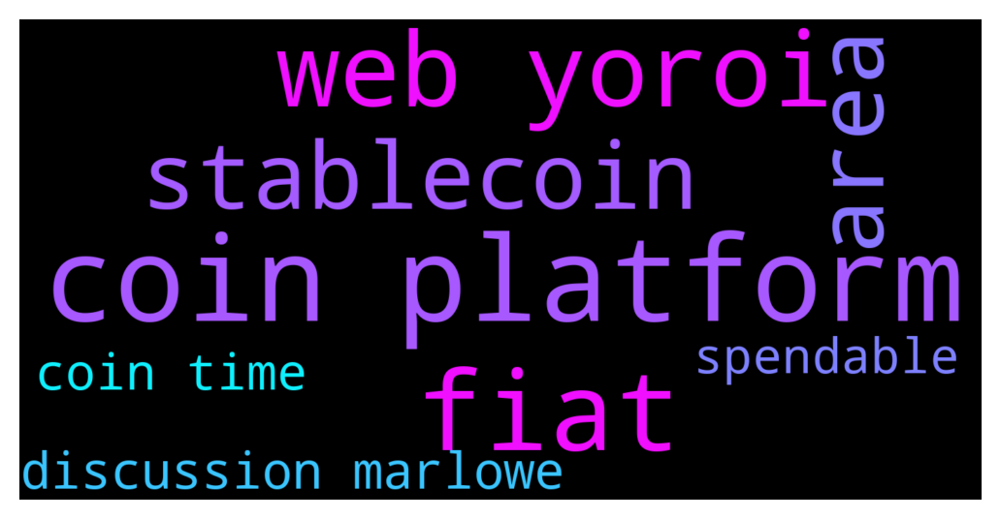

# **@Cardano**
 ## Analysis for **2021-12-12** - **2021-12-13**.

---

## 📊 **Basic Stats**

**n_messages_sent**: 147

---

---

## 🔝 **Top keywords and related messages**

1. **coin platform**

    @Juanlot --- *https://www.cardanocube.io/ here you can see the other stable coins* **--->** [TG Discussion](https://t.me/Cardano/758444)

    @hahmed812 --- *So I have a general question, is cardano in its current state able to match Ethereum as a "world computer". Like from a solidity developers perspective are their any restrictions on the cardano platform that could prevent us from coding in slightly data intensive smart contracts such as whitelisting STO etc* **--->** [TG Discussion](https://t.me/Cardano/758309)

    @apex_pool_spo --- *you are actually not staking, you are lending your coins to that platform for the time your coins are locked, and they are doing what they want with your coins. after the lock period passes, they are giving you back your coins + interest.* **--->** [TG Discussion](https://t.me/Cardano/758330)

    @glitch04 --- *This is not a place for pool advertisement so the best place would be check in #marketplace or use other social platforms to gather a list* **--->** [TG Discussion](https://t.me/Cardano/757703)

    @apex_pool_spo --- *that is not Cardano delegating, when you have to keep the coins in their platform. that is something specific to that platform.* **--->** [TG Discussion](https://t.me/Cardano/758328)

    @Dread_Poet_Sobriety --- *There is no ETH killer. These platforms will co-exist.  It is a layer 1 platform. Polygon is a layer 2.* **--->** [TG Discussion](https://t.me/Cardano/758019)

2. **fiat**

    @Mads --- *Thanks, but that doesn't really answer my question. It seems that all those stablecoins are pegged to fiat.* **--->** [TG Discussion](https://t.me/Cardano/758445)

    @Mads --- *Does a stablecoin like Djed need to be pegged to a fiat currency? Or could you peg it to something in the natural world fx. Number of rainy days in Germany or size of forest in Brazil?* **--->** [TG Discussion](https://t.me/Cardano/758443)

    @jaypatelEarthling --- *You can mostly sell with service Yoroi provide via third party but i recommend using which is local and famous so it can get directly to your bank account in fiat* **--->** [TG Discussion](https://t.me/Cardano/758225)

3. **web yoroi**

    @jaypatelEarthling --- *Login Yoroi from web* **--->** [TG Discussion](https://t.me/Cardano/758227)

    @Zyroxa --- *Yeah you can also restore the wallet via Yoroi or adalite. The only thing you need is your seedphrase.* **--->** [TG Discussion](https://t.me/Cardano/758319)

    @jaypatelEarthling --- *You can mostly sell with service Yoroi provide via third party but i recommend using which is local and famous so it can get directly to your bank account in fiat* **--->** [TG Discussion](https://t.me/Cardano/758225)

    @jaypatelEarthling --- *Directly through Yoroi Web app using credit card* **--->** [TG Discussion](https://t.me/Cardano/758222)

    @glitch04 --- *if you check the Yoroi option box there are 2 options for 15 only* **--->** [TG Discussion](https://t.me/Cardano/758100)

    @Rythem78 --- *So sick of Daedalus.. any one know if I stop using it and restore my seed to Yoroi if I’d lose any special functionality ?* **--->** [TG Discussion](https://t.me/Cardano/758176)

4. **area**

    @glitch04 --- *You may want to ask dev/technical questions in one of the areas below:   @IOHK_Marlowe - For Marlowe related discussions  @CardanoDevelopersOfficial - For other Developer related discussions  IOG Discord - For IOG hosted community forum  Link - Community Reddit for Developers  Link - Developer talk area on Cardano Forum* **--->** [TG Discussion](https://t.me/Cardano/758220)

5. **stablecoin**

    @Mads --- *Thanks, but that doesn't really answer my question. It seems that all those stablecoins are pegged to fiat.* **--->** [TG Discussion](https://t.me/Cardano/758445)

    @Mads --- *Does a stablecoin like Djed need to be pegged to a fiat currency? Or could you peg it to something in the natural world fx. Number of rainy days in Germany or size of forest in Brazil?* **--->** [TG Discussion](https://t.me/Cardano/758443)

6. **discussion marlowe**

    @glitch04 --- *You may want to ask dev/technical questions in one of the areas below:   @IOHK_Marlowe - For Marlowe related discussions  @CardanoDevelopersOfficial - For other Developer related discussions  IOG Discord - For IOG hosted community forum  Link - Community Reddit for Developers  Link - Developer talk area on Cardano Forum* **--->** [TG Discussion](https://t.me/Cardano/758220)

    @Shadowanthrop --- *When CH has been occupied to open market in Africa, his team missed a big opportunity to work on Asia market, CZ (bnb) has started a discussion with the owner of the biggest bank in Indonesia to have business in Indonesia* **--->** [TG Discussion](https://t.me/Cardano/757795)

7. **coin time**

    @Juanlot --- *https://www.cardanocube.io/ here you can see the other stable coins* **--->** [TG Discussion](https://t.me/Cardano/758444)

    @You --- *Hello hello I am wondering if there is a quicker way to see what stake pools are doing with rewards (charity, interesting projects, etc), than going to each ones website and searching it out.  Is there some kind of categorizer in action somewhere? There are too many to be worth spending all that time.   If my only interest is returns, than it doesn’t matter, but if Im more interested in what its contributing to, then its more important.   Is there a quicker way?* **--->** [TG Discussion](https://t.me/Cardano/757823)

    @glitch04 --- *it's actually better to move the funds directly to the new wallet you still have 2 pending epochs in your original by that time the new wallet would be returning the full rewards and you miss no rewards by having an extended delay* **--->** [TG Discussion](https://t.me/Cardano/758186)

    @apex_pool_spo --- *you are actually not staking, you are lending your coins to that platform for the time your coins are locked, and they are doing what they want with your coins. after the lock period passes, they are giving you back your coins + interest.* **--->** [TG Discussion](https://t.me/Cardano/758330)

    @apex_pool_spo --- *that is not Cardano delegating, when you have to keep the coins in their platform. that is something specific to that platform.* **--->** [TG Discussion](https://t.me/Cardano/758328)

    @Katsumot0 --- *Hence the long synch times, sometimes. But it Depends though, if you have a relatively new pc with 16+gb ram then it shouldn’t be too bad.* **--->** [TG Discussion](https://t.me/Cardano/757971)

8. **spendable**

    @glitch04 --- *That's how you "claim" the rewards to make them spendable* **--->** [TG Discussion](https://t.me/Cardano/758198)

