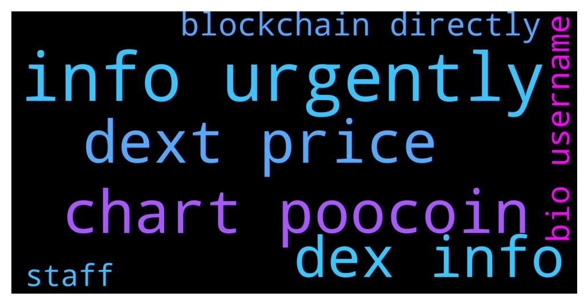

# **@DEXToolsCommunity**
 ## Analysis for **2021-12-11** - **2021-12-13**.

---

## 📊 **Basic Stats**

**n_messages_sent**: 402

---

---

## 🔝 **Top keywords and related messages**

1. **info urgently**

    @prep_mb --- *they want this to be done urgently.* **--->** [TG Discussion](https://t.me/DEXToolsCommunity/312675)

    @prep_mb --- *my friend wants to add token info urgently* **--->** [TG Discussion](https://t.me/DEXToolsCommunity/312673)

    @robin_set_b --- *hello admin please help me with info about Dextool adds* **--->** [TG Discussion](https://t.me/DEXToolsCommunity/312652)

    @Ms4crypto --- *another question, its been about a week that i have this for bsc wallet info. Any idea why?* **--->** [TG Discussion](https://t.me/DEXToolsCommunity/312891)

    @prep_mb --- *dex tools already showing token pair and trading volumes and chart. but it only shows etherscan contract link, I wanna add social links for token info.* **--->** [TG Discussion](https://t.me/DEXToolsCommunity/312669)

    @gumbercules --- *List all info on etherscan/poly/fantom, coingecko, and add liquidity for your pair* **--->** [TG Discussion](https://t.me/DEXToolsCommunity/311472)

2. **chart poocoin**

    @stanes --- *DEXT UNISWAP PAIR Chart and trade: https://www.dextools.io/app/uniswap/pair-explorer/0xa29fe6ef9592b5d408cca961d0fb9b1faf497d6d Contract: 0xfb7b4564402e5500db5bb6d63ae671302777c75a  DEXT PANCAKESWAP PAIR Chart and trade: https://www.dextools.io/app/pancakeswap/pair-explorer/0x4b729d5d871057f3a9c424792729217cde72410d Contract: 0xe91a8d2c584ca93c7405f15c22cdfe53c29896e3* **--->** [TG Discussion](https://t.me/DEXToolsCommunity/312890)

    @PghStairwayto7 --- *Is dextools having chart issues?* **--->** [TG Discussion](https://t.me/DEXToolsCommunity/312755)

    @IAMYellowCake --- *Hey, just wondering if there was another update again. Last time, I was able to help a stuck chart by clearing the cache and refreshing the page. This time it's not helping, any sugestions?* **--->** [TG Discussion](https://t.me/DEXToolsCommunity/312614)

    @napascual --- *Looks like you can set the cooldown with /set_cooldown <chart number> <minutes>* **--->** [TG Discussion](https://t.me/DEXToolsCommunity/312238)

    @napascual --- *that's trading view chart default functionally, you can travel through the history on the chart or change the candle resolution* **--->** [TG Discussion](https://t.me/DEXToolsCommunity/312230)

    @bastardganpunk --- *Which chart got stuck?* **--->** [TG Discussion](https://t.me/DEXToolsCommunity/312615)

3. **dext price**

    @pityok --- *This will, we hope, greatly increase the burning rate of DEXT and its 100% deflationary character. Not only do we not increase inflation with that 1M from the DEXTShare but we buy into the market and burn everything received.  do we not increase inflation with that 1M from the DEXTShare - As i understand, Dextshare won't increase supply. But are there any other ways for increaasing supply? Maybe some early birds, private-seed sales etc? Or in means that supply of DEXT tokens NEVER will be more that today (and can be only less by burning)?* **--->** [TG Discussion](https://t.me/DEXToolsCommunity/311666)

    @stanes --- *For the monthly subscription it's 100$ paid in DEXT. So today the price of DEXT is 0.5$ then you need to send 200 DEXT. If next month when you want to renew the price is 1$ then you will have to send 100 DEXT. For the holding, it's 1k DEXT whatever the price of DEXT is. And we don't deduct anything from anyone wallet.* **--->** [TG Discussion](https://t.me/DEXToolsCommunity/312901)

    @stanes --- *DEXT UNISWAP PAIR Chart and trade: https://www.dextools.io/app/uniswap/pair-explorer/0xa29fe6ef9592b5d408cca961d0fb9b1faf497d6d Contract: 0xfb7b4564402e5500db5bb6d63ae671302777c75a  DEXT PANCAKESWAP PAIR Chart and trade: https://www.dextools.io/app/pancakeswap/pair-explorer/0x4b729d5d871057f3a9c424792729217cde72410d Contract: 0xe91a8d2c584ca93c7405f15c22cdfe53c29896e3* **--->** [TG Discussion](https://t.me/DEXToolsCommunity/312890)

    @stanes --- *No, DEXT is an utility token but doesn't have any governance power.* **--->** [TG Discussion](https://t.me/DEXToolsCommunity/312083)

    @broadgasorc --- *Launch IDO section  Airdrop for users with  High volume trade by dextools Add to CEXs  Like : Mexc/gate/kucoin Launch stake section for DEXT* **--->** [TG Discussion](https://t.me/DEXToolsCommunity/312091)

    @Madems8 --- *Wait. Let me be more specific.🤦‍♂  I am asking about the DexTools Price bot.* **--->** [TG Discussion](https://t.me/DEXToolsCommunity/312233)

4. **dex info**

    @prep_mb --- *my friend wants to add token info urgently* **--->** [TG Discussion](https://t.me/DEXToolsCommunity/312673)

    @robin_set_b --- *hello admin please help me with info about Dextool adds* **--->** [TG Discussion](https://t.me/DEXToolsCommunity/312652)

    @Ms4crypto --- *another question, its been about a week that i have this for bsc wallet info. Any idea why?* **--->** [TG Discussion](https://t.me/DEXToolsCommunity/312891)

    @prep_mb --- *dex tools already showing token pair and trading volumes and chart. but it only shows etherscan contract link, I wanna add social links for token info.* **--->** [TG Discussion](https://t.me/DEXToolsCommunity/312669)

    @gumbercules --- *List all info on etherscan/poly/fantom, coingecko, and add liquidity for your pair* **--->** [TG Discussion](https://t.me/DEXToolsCommunity/311472)

    @cosmoburn --- *The token I’m trying to fetch info for is no on coingecko unfortunately.* **--->** [TG Discussion](https://t.me/DEXToolsCommunity/312163)

5. **blockchain directly**

    @napascual --- *We read blockchain in real time, not an api* **--->** [TG Discussion](https://t.me/DEXToolsCommunity/312337)

    @stanes --- *Dextools is providing data and tools to exploit this data.  We don't list anything but index all the pairs directly from the blockchain. We don't decide what is on the blockchain, always DYOR.* **--->** [TG Discussion](https://t.me/DEXToolsCommunity/312471)

    @bastardganpunk --- *as stated above, dextools fetches information from blockchain explorers and cmc and cg* **--->** [TG Discussion](https://t.me/DEXToolsCommunity/312676)

    @jackytools --- *O think everything seems to come through directly from blockchain* **--->** [TG Discussion](https://t.me/DEXToolsCommunity/312480)

    @ProfessionalApe --- *but cant go directly through dext?* **--->** [TG Discussion](https://t.me/DEXToolsCommunity/311550)

    @Crispy_Crypt0 --- *I figured so haha. Is there anyone I should message directly regarding advertisements?* **--->** [TG Discussion](https://t.me/DEXToolsCommunity/312311)

6. **bio username**

    @JoeyDieleman --- *Yes so username in the bio, not the real username. And we will never ask for funds for support.* **--->** [TG Discussion](https://t.me/DEXToolsCommunity/312720)

    @JoeyDieleman --- *If he dm'ed you know, watch out for the same username in the bio* **--->** [TG Discussion](https://t.me/DEXToolsCommunity/312711)

7. **staff**

    @henriquesmbc --- *I tried to contact the official DEXTools staff and this scammer took my funds, how can I talk to real ? someone from the team?* **--->** [TG Discussion](https://t.me/DEXToolsCommunity/312724)

    @henriquesmbc --- *I tried to contact the staff and one of those sent me a msg even took my bnb* **--->** [TG Discussion](https://t.me/DEXToolsCommunity/312716)

