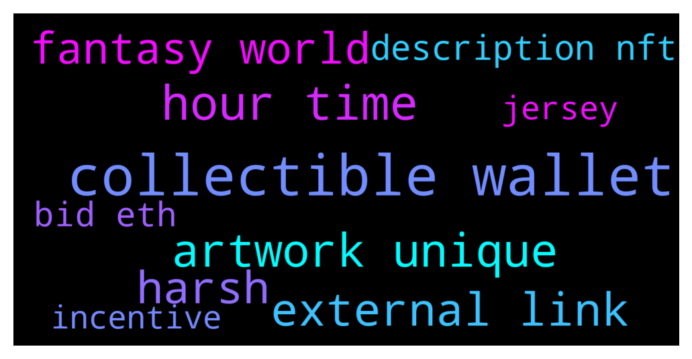

# **@binancenfts**
 ## Analysis for **2021-12-12** - **2021-12-13**.

---

## 📊 **Basic Stats**

**n_messages_sent**: 351

---

---

## 🔝 **Top keywords and related messages**

1. **collectible wallet**

    @Jacques_Lecrois --- *if you decide to buy the nfts on their marketplace, you need to use the metamask wallet.. and connect on your pc’s desktop* **--->** [TG Discussion](https://t.me/binancenfts/408262)

    @ChibiMaya_bnb --- *yes, you can withdraw any NFT, only it depend on which one it can take long to arrive or appear on your wallet.* **--->** [TG Discussion](https://t.me/binancenfts/408087)

    @northamericas --- *Is something going on with TRUST Wallet? I had NFT’s in there but now none appear* **--->** [TG Discussion](https://t.me/binancenfts/407991)

    @DarwiN_81 --- *Hi how can i sell this? I have 1 in my trust wallet* **--->** [TG Discussion](https://t.me/binancenfts/407672)

    @infoNFT --- *This is a very rare and exclusive NFT from Binance that was released in conjunction with TRUST WALLET, if anyone is interested, it's already on the marketplace.* **--->** [TG Discussion](https://t.me/binancenfts/407510)

    @northamericas --- *I transferred about 55 NFT from Binance to Trust Wallet, maybe that has something to do with it?* **--->** [TG Discussion](https://t.me/binancenfts/407999)

2. **hour time**

    @NftCollector09 --- *Time Remaining 21 Hours Description NFT - City Night Life. A collection of semi abstract art that resembles a fantasy world. Each artwork is unique and has its own beauty.  current highest bid 0.73 $ETH* **--->** [TG Discussion](https://t.me/binancenfts/408146)

    @ericoverlina --- *Pls help my withdrawal 1x48 hours no receive 🙈🙈 pls check sir* **--->** [TG Discussion](https://t.me/binancenfts/408206)

    @XXLnoob --- *wish that was true, 10 drops in a row sold out in fractions of a second, not enough time to even click and opened it up 2 hours in advance lol* **--->** [TG Discussion](https://t.me/binancenfts/408207)

    @NftCollector09 --- *Time Remaining 22 Hours Description NFT - City Night Life. A collection of semi abstract art that resembles a fantasy world. Each artwork is unique and has its own beauty.  current highest bid 0.73 $ETH* **--->** [TG Discussion](https://t.me/binancenfts/408126)

    @ericoverlina --- *Pls help me my withdrawal no procces , still pending 1x48 hours* **--->** [TG Discussion](https://t.me/binancenfts/408294)

    @rastoltcevanna --- *Hi, guys! 👻 I've been here for a long time, but this is my first time writing! I'm doing Art Photography! Is anyone else here like this? 😅* **--->** [TG Discussion](https://t.me/binancenfts/408350)

3. **artwork unique**

    @NftCollector09 --- *Time Remaining 21 Hours Description NFT - City Night Life. A collection of semi abstract art that resembles a fantasy world. Each artwork is unique and has its own beauty.  current highest bid 0.73 $ETH* **--->** [TG Discussion](https://t.me/binancenfts/408146)

    @Semeerkvv --- *Bulloids Club #8 Unique NFT* **--->** [TG Discussion](https://t.me/binancenfts/408145)

    @NftCollector09 --- *Time Remaining 22 Hours Description NFT - City Night Life. A collection of semi abstract art that resembles a fantasy world. Each artwork is unique and has its own beauty.  current highest bid 0.73 $ETH* **--->** [TG Discussion](https://t.me/binancenfts/408126)

    @sen1976 --- *Tigers Deluxe has arrived, and Tiger is definitely the King of all animal Cryptos! There are 3000 algorithmically generated tigers. Each Tiger is unique and generated from over 100+ possible traits, and all art drawn by hand.  Traits: background:autumn back:samurai sword3 skin:C body:camouflage earring:samurai2 mouth:golden teeth necklace:stone balls glasses:scar headwear:none Lucky value:27* **--->** [TG Discussion](https://t.me/binancenfts/407870)

    @me_sweetheart --- *It's unique* **--->** [TG Discussion](https://t.me/binancenfts/407474)

4. **external link**

    @ChibiMaya_bnb --- *!warn no external links or info, here is binance nfts, thank you!* **--->** [TG Discussion](https://t.me/binancenfts/408186)

    @ChibiMaya_bnb --- *!warn no external links, only from binance please.* **--->** [TG Discussion](https://t.me/binancenfts/408149)

    @ChibiMaya_bnb --- *!warn no external webs allowed here, only screenshots from binance nfts.* **--->** [TG Discussion](https://t.me/binancenfts/407732)

    @ExtraRare --- *Cheapest you can find! Floor price :) DM me for link!* **--->** [TG Discussion](https://t.me/binancenfts/408273)

5. **harsh**

    @jerome20 --- *yes, but the more harsh, the more opportunities* **--->** [TG Discussion](https://t.me/binancenfts/408121)

    @Aflatoon123 --- *Till when ser? I feel china is too harsh on crypto* **--->** [TG Discussion](https://t.me/binancenfts/408120)

6. **fantasy world**

    @peach_colours --- *“BitCats around the world” 🔥* **--->** [TG Discussion](https://t.me/binancenfts/408181)

    @NftCollector09 --- *Time Remaining 21 Hours Description NFT - City Night Life. A collection of semi abstract art that resembles a fantasy world. Each artwork is unique and has its own beauty.  current highest bid 0.73 $ETH* **--->** [TG Discussion](https://t.me/binancenfts/408146)

    @NftCollector09 --- *Time Remaining 22 Hours Description NFT - City Night Life. A collection of semi abstract art that resembles a fantasy world. Each artwork is unique and has its own beauty.  current highest bid 0.73 $ETH* **--->** [TG Discussion](https://t.me/binancenfts/408126)

    @aregaro --- *Hey guys! Someone need X world games?* **--->** [TG Discussion](https://t.me/binancenfts/407634)

7. **description nft**

    @ChibiMaya_bnb --- *For Russian you have Binance NFT https://t.me/BinanceNFTRU* **--->** [TG Discussion](https://t.me/binancenfts/408219)

    @Faisal --- *is Binance NFT marketplace another app* **--->** [TG Discussion](https://t.me/binancenfts/407538)

    @Shmelyov --- *Selling this Elfin SR Nfts I* **--->** [TG Discussion](https://t.me/binancenfts/407610)

    @XXLnoob --- *buying NFTS on binance is now officially pointless, literally no point in even trying* **--->** [TG Discussion](https://t.me/binancenfts/408189)

    @Jay_0203 --- *SSR NFT WICHITA LEGENDARY LOW PRICE* **--->** [TG Discussion](https://t.me/binancenfts/408020)

    @Faisal --- *where do you buy NFT's on binance* **--->** [TG Discussion](https://t.me/binancenfts/407536)

8. **bid eth**

    @NftCollector09 --- *Time Remaining 21 Hours Description NFT - City Night Life. A collection of semi abstract art that resembles a fantasy world. Each artwork is unique and has its own beauty.  current highest bid 0.73 $ETH* **--->** [TG Discussion](https://t.me/binancenfts/408146)

    @Semeerkvv --- *Bid already Started Cheap price 60$ . If Anyone interested to place bid Search 👇 Crazy Head* **--->** [TG Discussion](https://t.me/binancenfts/407598)

    @Semeerkvv --- *Bid Started 60$ Cheapest Price . Place you’re Bid   Search 👇 Crazy Head  25 minutes Left End Auctions* **--->** [TG Discussion](https://t.me/binancenfts/407817)

    @Semeerkvv --- *Bid Started 60$ Cheapest Price . Place you’re Bid   Search 👇 Crazy Head  3 hrs Left End Auctions* **--->** [TG Discussion](https://t.me/binancenfts/407718)

    @NftCollector09 --- *Time Remaining 22 Hours Description NFT - City Night Life. A collection of semi abstract art that resembles a fantasy world. Each artwork is unique and has its own beauty.  current highest bid 0.73 $ETH* **--->** [TG Discussion](https://t.me/binancenfts/408126)

    @northamericas --- *In Trust Wallet, when I click collectibles > receive, it says it’s for ETH.  How do I change it to BSC?* **--->** [TG Discussion](https://t.me/binancenfts/407996)

9. **jersey**

    @scesmeli --- *😀Because Maradona wore this jersey in Napoli, they decided to make it part of a new collection called gold edition by exsports.* **--->** [TG Discussion](https://t.me/binancenfts/408245)

    @Jacques_Lecrois --- *woow, that's cool, the napoli's jersey hahaa* **--->** [TG Discussion](https://t.me/binancenfts/408244)

10. **incentive**

    @S0T0SHI --- *Hello guys.  I was thinking about creating an NFT and selling it at a cheap price on the market, like $20... and then I thought of giving an incentive to buy my nft... for example, if the person buys my nft , he gets back about $10 in some other cryptocurrency like polygon, avalanche, cardano... what do you think?  Do you think it would be a good incentive?  It would be like a cashback. Do you think it's a good idea?* **--->** [TG Discussion](https://t.me/binancenfts/408222)

