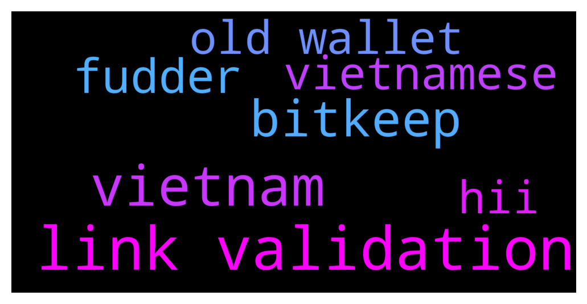

# **@cryptonear**
 ## Analysis for **2021-12-12** - **2021-12-13**.

---

## 📊 **Basic Stats**

**n_messages_sent**: 1571

---

---

## 🔝 **Top keywords and related messages**

1. **link validation**

    @NEARverse_xd --- *I am just joking with @bailey_12. I meant airdropping in community is better than login in validation link🤣* **--->** [TG Discussion](https://t.me/cryptonear/236073)

    @Kripto_Raptor --- *I see most users still not following our official Announcements channel. Let me drop the link here https://t.me/nearprotocolnews* **--->** [TG Discussion](https://t.me/cryptonear/233788)

    @iamkemoo --- *🚨Event Alert: End of Year Town Hall  📅THURSDAY, DEC 16, 2021 ⏰3pm CET / 9am EST / 6am PST 📍https://endofyeartownhall.splashthat.com  Agenda ⚡️Deadmau5 and Mintbase debrief on the recent Platinum NFT launch ⚡️Exciting updates from Ecosystem Partners to be shared ⚡️Metabuidl II Hackathon  ⚡️NEAR Foundation Update  ℹ️The Town Hall will be live streamed onto YouTube, and we will share the link over email and on social media.  See you soon!* **--->** [TG Discussion](https://t.me/cryptonear/234695)

    @rahulgoel007 --- *They are sharing validation link today. Airdrop is old.* **--->** [TG Discussion](https://t.me/cryptonear/236066)

    @Ben75 --- *https://academy.binance.com/en/articles/how-to-recover-crypto-transferred-to-the-wrong-network-on-binance.amp  Seems like it’s somehow possible to retrieve the coins when it’s going out of Binance. Read through the Binance academy link. It’s about ERC20 and BSC here, but should be similar with other networks like NEAR.* **--->** [TG Discussion](https://t.me/cryptonear/234021)

    @FritzWagner --- *https://mobile.twitter.com/CypherpunkGuild  Here a link to the privacy focused community on Near* **--->** [TG Discussion](https://t.me/cryptonear/235013)

2. **vietnam**

    @kv9990 --- *@bailey_12 and @vlhai are from Vietnam 👀 it's working for them all right ser ✌️* **--->** [TG Discussion](https://t.me/cryptonear/236187)

    @larry_lang --- *sir im afraid that the +84 VietNam region is not supported by the Near wallet team anymore, so would u mind raising a ticket at Zendesk so they can manually turn it down:  https://nearhelp.zendesk.com/hc/en-us/requests/new?ticket_form_id=1500000226481* **--->** [TG Discussion](https://t.me/cryptonear/233918)

    @vlhai --- *our network in Vietnam not allow to send crypto message, so they block near wallet sms.* **--->** [TG Discussion](https://t.me/cryptonear/236134)

    @bailey_12 --- *Haha I based in UK so I don’t know what’s things in Vietnam but just check Vnese channel. Nothing happened much* **--->** [TG Discussion](https://t.me/cryptonear/236188)

    @near_guru --- *so basically no one in vietnam use near* **--->** [TG Discussion](https://t.me/cryptonear/236189)

    @vlhai --- *you mean you can't disable 2fa in vietnam, right bro?* **--->** [TG Discussion](https://t.me/cryptonear/236203)

3. **bitkeep**

    @Phyra19 --- *What network i will put in gleam airdrop? Because theres many NEAR address in bitkeep, ETH ,BEP20 or MAIN??* **--->** [TG Discussion](https://t.me/cryptonear/236147)

    @Phyra19 --- *Bitkeep* **--->** [TG Discussion](https://t.me/cryptonear/236140)

    @Bkiller8 --- *for eligible airdrop we need to swap near on bitkeep ?* **--->** [TG Discussion](https://t.me/cryptonear/235318)

4. **fudder**

    @bailey_12 --- *Lol dude, I am here long enough to acknowledge you are a fudder* **--->** [TG Discussion](https://t.me/cryptonear/236183)

    @Kripto_Raptor --- *you gotta be blind or a fudder to miss huge network growth* **--->** [TG Discussion](https://t.me/cryptonear/236214)

    @bailey_12 --- *But anyways, he is a fudder, so I don’t want to reply to him much* **--->** [TG Discussion](https://t.me/cryptonear/236193)

5. **old wallet**

    @iamkemoo --- *wallet.near.org via moonpay or on 26 CEX https://coinmarketcap.com/currencies/near-protocol/markets/* **--->** [TG Discussion](https://t.me/cryptonear/234446)

    @haohoa1080 --- *Hello admin, I have a problem when I sent NEAR from wallet to Binance by BEP2. After that, the Near wallet notified successfully, but in Binance, I didn't receive anything. Could you help me to resolve it. Thank you* **--->** [TG Discussion](https://t.me/cryptonear/234011)

    @larry_lang --- *sir im afraid that the +84 VietNam region is not supported by the Near wallet team anymore, so would u mind raising a ticket at Zendesk so they can manually turn it down:  https://nearhelp.zendesk.com/hc/en-us/requests/new?ticket_form_id=1500000226481* **--->** [TG Discussion](https://t.me/cryptonear/233918)

    @kv9990 --- *This is the process to convert ! https://t.me/cryptonear/180843  Generally Kucoin customer service won't be having access to Kucoin wallet where you deposited  so they can't convert it back and send since it was your mistake 😓 sorry for your loss! If it was a big amount you can tell them it's wrapped near and process to convert and they might help 👀* **--->** [TG Discussion](https://t.me/cryptonear/234230)

    @vlhai --- *yes, buy near on near wallet and stake it there, convenient for you. https://wallet.near.org/staking* **--->** [TG Discussion](https://t.me/cryptonear/235203)

    @vlhai --- *our network in Vietnam not allow to send crypto message, so they block near wallet sms.* **--->** [TG Discussion](https://t.me/cryptonear/236134)

6. **vietnamese**

    @vlhai --- *I'm Vietnamese and can work with fire fox* **--->** [TG Discussion](https://t.me/cryptonear/236178)

    @near_guru --- *it does not work for all vietnameses people* **--->** [TG Discussion](https://t.me/cryptonear/236155)

    @quangvinh152 --- *Is there a group for Vietnamese people?* **--->** [TG Discussion](https://t.me/cryptonear/235226)

    @NEARverse_xd --- *Actually vietnamese are facing the same issue* **--->** [TG Discussion](https://t.me/cryptonear/236175)

    @Kripto_Raptor --- *if you have any data share with us, instead I see many vietnamese use Near. and it's one of most active Near communities* **--->** [TG Discussion](https://t.me/cryptonear/236202)

7. **hii**

    @Candrapay --- *Hii* **--->** [TG Discussion](https://t.me/cryptonear/235871)

    @aarimasu --- *hii allll* **--->** [TG Discussion](https://t.me/cryptonear/235845)

    @mhmd_irvannurhakim --- *Hii* **--->** [TG Discussion](https://t.me/cryptonear/235453)

    @IshaaqZiyanOfficial --- *hii* **--->** [TG Discussion](https://t.me/cryptonear/235362)

    @thanano46 --- *Hii ... Am fine and I'm not a bot. What about u?* **--->** [TG Discussion](https://t.me/cryptonear/234726)

