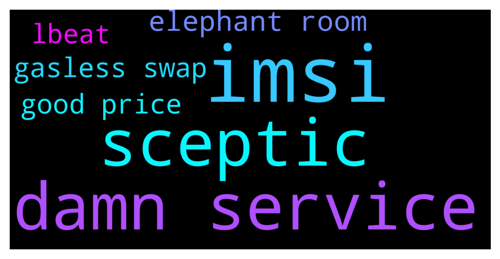

# **@lobsters_chat**
 ## Analysis for **2021-12-12** - **2021-12-13**.

---

## 📊 **Basic Stats**

**n_messages_sent**: 264

---


---


## 🔝 **Top keywords and related messages**

1. **imsi**

    @farm42 --- *Suggest reading https://joelgsamuel.medium.com/how-to-keep-your-smartphone-safe-from-spying-d7d50fbed817 , the best option for IMEI/IMSI change is a rooted (!) cellphone or even physical upgrade. To my mind you can change IMEI (but not IMSI) in engineermode, as well as other CDS info…* **--->** [TG Discussion](https://t.me/lobsters_chat/307034)

    @iced_lime --- *f.vision has no https available :c do you know of any way to remove the IMEI & IMSI from a phone so that it can actually be used? Graphene OS is nice for privacy, but does not include that capability* **--->** [TG Discussion](https://t.me/lobsters_chat/307033)

2. **damn service**

    @tatai_007 --- *What's throwing me off is the lack of a pricing page for their Hosted Service* **--->** [TG Discussion](https://t.me/lobsters_chat/306929)

    @sambacha --- *because we connect to both flashbots, edennetwork and our own mining pool partners. We also offer additional use cases ontop of flashbots. Its an aggregator service, like 1inch for MEV in that respect* **--->** [TG Discussion](https://t.me/lobsters_chat/306719)

    @Cryptographic --- *Agreed but how long will it be slightly different for? The issue is in reality flashbots is the infrastructure provider by choosing to directly offer services to dex’s and users there is no longer any need for middlemen we saw that with alchemist and flashbots and both are closely aligned* **--->** [TG Discussion](https://t.me/lobsters_chat/306704)

    @vPEPO --- *afaik, the only one currently running on the decentralized service is Uniswap (maybe PoolTogether as well)* **--->** [TG Discussion](https://t.me/lobsters_chat/306943)

    @tatai_007 --- *Damn, I guess it's free lunch from VCs.* **--->** [TG Discussion](https://t.me/lobsters_chat/306941)

    @vPEPO --- *the hosted service at some point will go down, for now its just free until they go full decentralized* **--->** [TG Discussion](https://t.me/lobsters_chat/306942)

3. **sceptic**

    @GuthL --- *We need sceptic but we need L2beat type of sceptics* **--->** [TG Discussion](https://t.me/lobsters_chat/307060)

4. **elephant room**

    @farm42 --- *We are starting our first broadcast, ask your questions in the chat room @lobsterdao. We're waiting for your questions!  https://twitter.com/10b57e6da0/status/1470423768409337857?s=21* **--->** [TG Discussion](https://t.me/lobsters_chat/307046)

    @GuthL --- *The funny story is that he does not even notice the actual elephant in the room which is that Optimism does not have a fraud proof system today* **--->** [TG Discussion](https://t.me/lobsters_chat/307069)

    @jrFFFF1 --- *``` Hey @everyone !  We've noticed an uptick in bots gaming the Polygon questing experience and we wanted to give out some transparency / reassurance.  Addressing the "elephant in the room" - many of you are hopeful that the questing experience will result in an airdrop. While I can't say we will or will not do one, I can say with 100% certainty that if we ever did an airdrop, any bots that game the system WILL NOT get any rewards. ``` zapper discord* **--->** [TG Discussion](https://t.me/lobsters_chat/307042)

5. **gasless swap**

    @khanHamzah --- *How do they achieve gasless swaps?* **--->** [TG Discussion](https://t.me/lobsters_chat/306955)

    @apeir99n --- *price is defined for each pool separately. then anyone can use uniswap routing contracts to find best prices for swap* **--->** [TG Discussion](https://t.me/lobsters_chat/307013)

    @benchodd --- *Not gasless, but up to 90%* **--->** [TG Discussion](https://t.me/lobsters_chat/306982)

    @Alchemy --- *Will offer gasless swaps on sushi, there was chat about it in here the other day the Dev even popped in and chatted with a few of us.* **--->** [TG Discussion](https://t.me/lobsters_chat/306950)

6. **good price**

    @farm42 --- *Suggest reading https://joelgsamuel.medium.com/how-to-keep-your-smartphone-safe-from-spying-d7d50fbed817 , the best option for IMEI/IMSI change is a rooted (!) cellphone or even physical upgrade. To my mind you can change IMEI (but not IMSI) in engineermode, as well as other CDS info…* **--->** [TG Discussion](https://t.me/lobsters_chat/307034)

    @apeir99n --- *price is defined for each pool separately. then anyone can use uniswap routing contracts to find best prices for swap* **--->** [TG Discussion](https://t.me/lobsters_chat/307013)

    @FiveBoroughs --- *Easiest is your local node or infura, best with mempool scanning is blocknative* **--->** [TG Discussion](https://t.me/lobsters_chat/306871)

    @syLKf --- *This transaction was a whitehat hack, all good. More details to be released.* **--->** [TG Discussion](https://t.me/lobsters_chat/306767)

    @tatai_007 --- *Since there are multiple pools on uniswap v3, how is the market price of an asset calculated?* **--->** [TG Discussion](https://t.me/lobsters_chat/307011)

    @defiteller_guru --- *Has anyone here noticed the Luna price oracle hole on Terra? We want to break the news to a larger audience. If you have any ideas or are willing to help, feel free to DM.  https://twitter.com/defiteller/status/1470112668094717957* **--->** [TG Discussion](https://t.me/lobsters_chat/306895)

7. **lbeat**

    @GuthL --- *We need sceptic but we need L2beat type of sceptics* **--->** [TG Discussion](https://t.me/lobsters_chat/307060)

    @GuthL --- *L2beat does that very well without all the alarming shit* **--->** [TG Discussion](https://t.me/lobsters_chat/307067)

