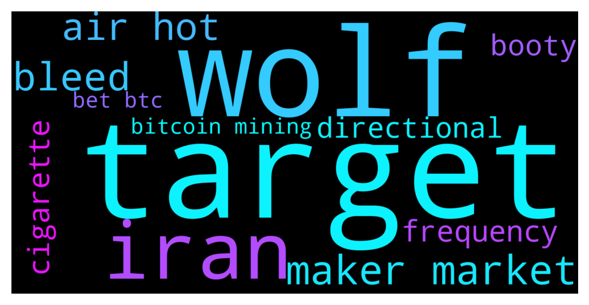

# **@whalepoolbtc**
 ## Analysis for **2021-12-12** - **2021-12-13**.

---

## 📊 **Basic Stats**

**n_messages_sent**: 709

---

---

## 🔝 **Top keywords and related messages**

1. **target**

    @HunakauTrader --- *Our targets* **--->** [TG Discussion](https://t.me/whalepoolbtc/4079886)

    @katana --- *NKN  / USDT :  LONG NOW  Leverage x25  Target :  TARGET 1  : 0.376$ TARGET 2  : 0.390$ TARGET 3  : 0.401$ TARGET 4  : 0.411$  STOP : 0.365$* **--->** [TG Discussion](https://t.me/whalepoolbtc/4080254)

    @Xuvinator --- *yes, but I’m just curious about your amazing TA work. Could you please give some insight into your breakout targets?* **--->** [TG Discussion](https://t.me/whalepoolbtc/4079875)

2. **wolf**

    @ApacheSJM --- *A childs fable. Everyday the boy cried that there was a wolf. When the wolf finally came no one believed him and the wolf ate handsomely.* **--->** [TG Discussion](https://t.me/whalepoolbtc/4080228)

    @ApacheSJM --- *Are you familiar with the boy that cried wolf? Less frequency and more accuracy would help your cause.* **--->** [TG Discussion](https://t.me/whalepoolbtc/4080226)

3. **iran**

    @Hmmmdrop --- *imagine what happens when Iran has more BTC than Isreal.  rekt* **--->** [TG Discussion](https://t.me/whalepoolbtc/4080097)

    @Hmmmdrop --- *isn't Iran mining Bitcoin ?  If they want to destroy Isreal, this is how it's done* **--->** [TG Discussion](https://t.me/whalepoolbtc/4080096)

    @Hmmmdrop --- *these cuck market makers need to be strung up in Iran* **--->** [TG Discussion](https://t.me/whalepoolbtc/4080093)

4. **maker market**

    @Hmmmdrop --- *these cuck market makers need to be strung up in Iran* **--->** [TG Discussion](https://t.me/whalepoolbtc/4080093)

    @Deathbal1 --- *it does look like now with etherium dumping the whole market is going to get dragged down* **--->** [TG Discussion](https://t.me/whalepoolbtc/4080328)

    @Hmmmdrop --- *The reason BTC is in squanders is because our new market makers are dumb bucks.* **--->** [TG Discussion](https://t.me/whalepoolbtc/4080037)

    @MasterOfCoin90 --- *Welcome to official bear market 2021/2022. Hope you enjoy it* **--->** [TG Discussion](https://t.me/whalepoolbtc/4080324)

    @Deathbal1 --- *I wouldn't be surprised if we see a crypto market wide discount for christmas this year* **--->** [TG Discussion](https://t.me/whalepoolbtc/4080169)

    @IamNomad --- *Oh when subtract from market cap* **--->** [TG Discussion](https://t.me/whalepoolbtc/4079944)

5. **bleed**

    @Cretanicious --- *6 more bleeding minutes* **--->** [TG Discussion](https://t.me/whalepoolbtc/4080374)

    @Cretanicious --- *10 more minutes until bleed stops* **--->** [TG Discussion](https://t.me/whalepoolbtc/4080358)

    @oldmanlogan2021 --- *Yeah it’s just a slow and painful bleed…* **--->** [TG Discussion](https://t.me/whalepoolbtc/4080273)

    @Gregoranus --- *No doubt, holidays are often slow bleeds and sideways. Being over weekends though means back to the trend sooner IMO.* **--->** [TG Discussion](https://t.me/whalepoolbtc/4080180)

6. **air hot**

    @MiLostUC --- *So hot air is going up endlessly?* **--->** [TG Discussion](https://t.me/whalepoolbtc/4080454)

    @MiLostUC --- *Buying hot air didnt work out?* **--->** [TG Discussion](https://t.me/whalepoolbtc/4080442)

7. **frequency**

    @ApacheSJM --- *Are you familiar with the boy that cried wolf? Less frequency and more accuracy would help your cause.* **--->** [TG Discussion](https://t.me/whalepoolbtc/4080226)

    @TrollsToolsTelegram --- *Ya it's all high frequency arbitrage* **--->** [TG Discussion](https://t.me/whalepoolbtc/4080363)

8. **cigarette**

    @therealmasterofpain --- *Cigarette after cigarette 🚬* **--->** [TG Discussion](https://t.me/whalepoolbtc/4080415)

9. **booty**

    @Horselorde --- *Your moms booty* **--->** [TG Discussion](https://t.me/whalepoolbtc/4080113)

    @nomadi_c --- *Not an old moon like your moms booty* **--->** [TG Discussion](https://t.me/whalepoolbtc/4080115)

10. **directional**

    @Hmmmdrop --- *They pumped doge, and couldn’t have the balls to take a directional bet on BTC.* **--->** [TG Discussion](https://t.me/whalepoolbtc/4080035)

    @Hmmmdrop --- *Bitfinex and mtGox actually placed directional bet for BTC.   FTX is fro energy.* **--->** [TG Discussion](https://t.me/whalepoolbtc/4080038)

11. **bitcoin mining**

    @ApacheSJM --- *Imagine mining corn in Germany* **--->** [TG Discussion](https://t.me/whalepoolbtc/4080256)

    @hipmeltypikachu --- *As others said its spread across multiple address but this is the first address bitcoin wss sent to: https://www.blockchain.com/btc/address/1A1zP1eP5QGefi2DMPTfTL5SLmv7DivfNa Many people have sent btc to this asddress with notes, but no coins have ever moved out of it.* **--->** [TG Discussion](https://t.me/whalepoolbtc/4079804)

    @Hmmmdrop --- *isn't Iran mining Bitcoin ?  If they want to destroy Isreal, this is how it's done* **--->** [TG Discussion](https://t.me/whalepoolbtc/4080096)

    @Painbtc --- *Hacked Indian PM Modi’s Twitter account promotes bitcoin SCAM  The personal Twitter handle of Indian Prime Minister Narendra Modi was “very briefly compromised,” his office has confirmed, urging the public to “ignore” any unusual recent tweets.  According to multiple screenshots, it claimed that “India has officially adopted bitcoin as legal tender,” purchased hundreds of coins, and was “distributing them to all residents of the country.”  https://on.rt.com/bmxk  Subscribe to RT t.me/rtnews* **--->** [TG Discussion](https://t.me/whalepoolbtc/4079619)

    @ApacheSJM --- *Bitcoin only needs 1 use case, store of value, to make it.* **--->** [TG Discussion](https://t.me/whalepoolbtc/4079536)

    @DeiWai --- *watch as bitcoin maxis denying this* **--->** [TG Discussion](https://t.me/whalepoolbtc/4080002)

12. **bet btc**

    @hipmeltypikachu --- *As others said its spread across multiple address but this is the first address bitcoin wss sent to: https://www.blockchain.com/btc/address/1A1zP1eP5QGefi2DMPTfTL5SLmv7DivfNa Many people have sent btc to this asddress with notes, but no coins have ever moved out of it.* **--->** [TG Discussion](https://t.me/whalepoolbtc/4079804)

    @Hmmmdrop --- *imagine what happens when Iran has more BTC than Isreal.  rekt* **--->** [TG Discussion](https://t.me/whalepoolbtc/4080097)

    @ochados --- *btc another day closed 🔴* **--->** [TG Discussion](https://t.me/whalepoolbtc/4079462)

    @Cretanicious --- *Well i am out of eth at 5k and out of btc at 61* **--->** [TG Discussion](https://t.me/whalepoolbtc/4079347)

    @Rainer --- *Btc jumping around as usual 😂* **--->** [TG Discussion](https://t.me/whalepoolbtc/4080179)

    @Ahmed --- *Where do you see SOL when BTC touches 52* **--->** [TG Discussion](https://t.me/whalepoolbtc/4079740)

