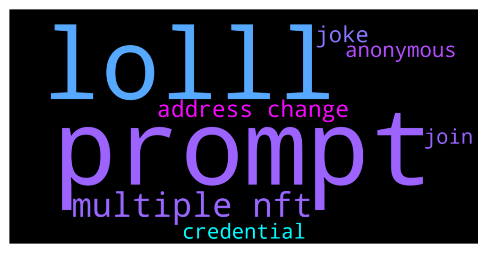

# **@Cardano**
 ## Analysis for **2021-12-13** - **2021-12-14**.

---

## 📊 **Basic Stats**

**n_messages_sent**: 168

---

---

## 🔝 **Top keywords and related messages**

1. **prompt**

    @p --- *I got this prompt above when trying to log in with the trezor device.* **--->** [TG Discussion](https://t.me/Cardano/758613)

    @p --- *Hey guys. I have some issue withdrawing and restaking ada on Yoroi. I’m using my Trezor T for my yoroi wallet and I transferred Ada into it 2 months ago, delegated it with no issue. Now I’m trying to redelegate it to a different pool and a message pops up on my Trezor, saying “change address payment credential is a path…” then when i tick the checkmark, it takes me to another prompt saying “change address staking credential is a key hash…” then to another prompt of a sum of my account minus the amount I’m trying to withdraw before taking me to the standard signing off that fails to go through. I’ve noticed the same problem on the forums in a few cases but there seems to be no definitive solution for this. Does anyone know how to fix this problem?* **--->** [TG Discussion](https://t.me/Cardano/758585)

    @p --- *O. I get this prompt when try logging in with trezor* **--->** [TG Discussion](https://t.me/Cardano/758608)

2. **lolll**

    @vidadavi --- *What its a joke ?? Lolll well f' it with this low %  i wont stake shit  !* **--->** [TG Discussion](https://t.me/Cardano/758823)

    @vidadavi --- *Lolll not in my bank but in something else that give me 34 % ... at least* **--->** [TG Discussion](https://t.me/Cardano/758827)

    @vidadavi --- *Lolll what because you dont like my comment . 🤣🤣🤣🤣* **--->** [TG Discussion](https://t.me/Cardano/758837)

3. **multiple nft**

    @p --- *I tried. But when i try to use the recovery phrase on adalite it shows that my wallet has 0 balance. I’m sure this is the only set of seedphrase i have because I only have the one cardano wallet and I only wrote down one set of it. Checked it multiple times. The balance on yoroi and cardanoscan is correct tho* **--->** [TG Discussion](https://t.me/Cardano/758603)

    @rdalio321 --- *Hi guys, I see that we can send multiple NFTs in one transaction with Nami wallet, can multiple NFTs also be sent with Yoroi wallet?* **--->** [TG Discussion](https://t.me/Cardano/758847)

4. **address change**

    @p --- *Hey guys. I have some issue withdrawing and restaking ada on Yoroi. I’m using my Trezor T for my yoroi wallet and I transferred Ada into it 2 months ago, delegated it with no issue. Now I’m trying to redelegate it to a different pool and a message pops up on my Trezor, saying “change address payment credential is a path…” then when i tick the checkmark, it takes me to another prompt saying “change address staking credential is a key hash…” then to another prompt of a sum of my account minus the amount I’m trying to withdraw before taking me to the standard signing off that fails to go through. I’ve noticed the same problem on the forums in a few cases but there seems to be no definitive solution for this. Does anyone know how to fix this problem?* **--->** [TG Discussion](https://t.me/Cardano/758585)

    @glitch04 --- *The block chain tracks transactions the snapshot checks balance on the stake address* **--->** [TG Discussion](https://t.me/Cardano/758217)

    @andrymaster --- *Hello everyone, is there any news on the cardano?  When will the trend change and our beloved will fly to the moon?* **--->** [TG Discussion](https://t.me/Cardano/758849)

5. **joke**

    @Jakez68 --- *I think you are a joke too* **--->** [TG Discussion](https://t.me/Cardano/758836)

    @vidadavi --- *What its a joke ?? Lolll well f' it with this low %  i wont stake shit  !* **--->** [TG Discussion](https://t.me/Cardano/758823)

    @vidadavi --- *Ya i know youbwere about to say that. Anyways thx for the answer   i wont stake shit at 4.5 %  itas a real joke .* **--->** [TG Discussion](https://t.me/Cardano/758831)

6. **credential**

    @p --- *Hey guys. I have some issue withdrawing and restaking ada on Yoroi. I’m using my Trezor T for my yoroi wallet and I transferred Ada into it 2 months ago, delegated it with no issue. Now I’m trying to redelegate it to a different pool and a message pops up on my Trezor, saying “change address payment credential is a path…” then when i tick the checkmark, it takes me to another prompt saying “change address staking credential is a key hash…” then to another prompt of a sum of my account minus the amount I’m trying to withdraw before taking me to the standard signing off that fails to go through. I’ve noticed the same problem on the forums in a few cases but there seems to be no definitive solution for this. Does anyone know how to fix this problem?* **--->** [TG Discussion](https://t.me/Cardano/758585)

    @Hans --- *Yoroi just reads the data of your wallet. Use same credentials as in D!* **--->** [TG Discussion](https://t.me/Cardano/758489)

7. **anonymous**

    @Bim --- *is possible send anonymous Ada? in ecosystem cardano is any project what can give me anonymous transaction?* **--->** [TG Discussion](https://t.me/Cardano/758766)

8. **join**

    @glitch04 --- *Unfortunately yes because the security on this platform is lacking which is why the join message informs you* **--->** [TG Discussion](https://t.me/Cardano/758692)

    @The_Wraith98 --- *Hey ppl it is normal that after join 5 ~ 6 presumed scammers are contacting me in private?* **--->** [TG Discussion](https://t.me/Cardano/758691)

