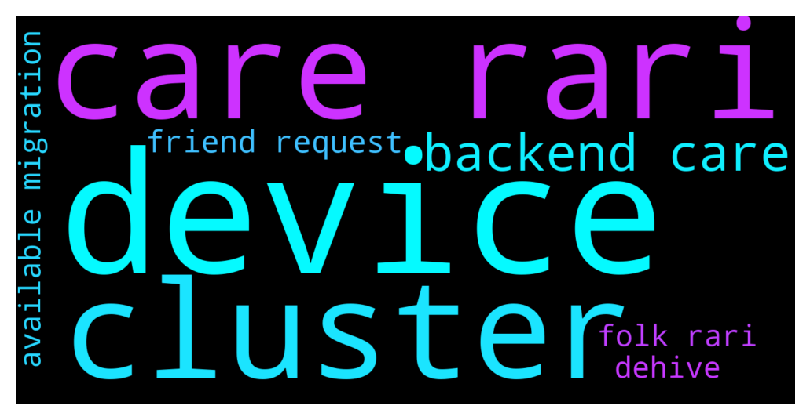

# **@OlympusTG**
 ## Analysis for **2021-12-13** - **2021-12-14**.

---

## 📊 **Basic Stats**

**n_messages_sent**: 2836

---

---

## 🔝 **Top keywords and related messages**

1. **device**

    @Poopoo --- *checklist for you: Have you entered your seed phrase anywhere or saved it in your device? Did you visit any suspicious sites and approve suspicious contracts on your wallet? Did you go to the right Olympus website/app? Have you scan your device? Did you check if there is any keylogger in your device? Did you download suspicious documents?* **--->** [TG Discussion](https://t.me/OlympusTG/120195)

    @Poopoo --- *Have you entered your seed phrase anywhere or saved it in your device? Did you visit any suspicious sites and approve suspicious contracts on your wallet? Did you go to the right Olympus website/app? Have you scanned your device for malware? Did you check if there is any keylogger in your device? Did you download suspicious documents?* **--->** [TG Discussion](https://t.me/OlympusTG/120068)

2. **care rari**

    @Poopoo --- *Olympus Migration TL;DR for the Ohmies  - Current sOHM won't see rebases anymore. will get all backdated rewards whenever you migrate. - Folks collateralised at Rari don't need to do anything. will be taken care of in the backend. - sOHM to sOHM v2 migration will become available soon. - sOHM to gOHM and wsOHM to gOHM migration is already available at https://app.olympusdao.finance/#/wrap - In no scenario will you lose rewards  The APY will show correctly on website when V2 migration is done. Current sOHM won't see rebases anymore. Ohmies will get all backdated rewards whenever you migrate.  Ohmies collateralized at Rari don't need to do anything. Everything will be taken care of in the backend.  You don’t have to unstake or do anything right now. sOHM to sOHM v2 migration will become available soon with easy step by step instructions.   sOHM: wait for migration to sOHM v2 or wrap to gOHM wsOHM:  convert to gOHM gOHM:  nothing fsOHM (Rari): nothing* **--->** [TG Discussion](https://t.me/OlympusTG/120083)

    @Hdler --- *What exactly does that mean? If I unstake from Rari, do I get sOHM or gOHM?* **--->** [TG Discussion](https://t.me/OlympusTG/120488)

    @vpetyr --- *Migration TL;DR - current sOHM won't see rebases anymore. will get all backdated rewards whenever you migrate. - folks collateralized at rari & abracadabra don't need to do anything. will be taken care of in the backend. - sOHM to sOHM v2 migration will become available within the next day or two. A follow up announcement to come re; this - sOHM to gOHM and wsOHM to gOHM migration is already available at: https://app.olympusdao.finance/#/wrap - APY remains unaffected it just isn't reflected on the website  - in no scenario will you lose rewards - unless you unstake sOHM* **--->** [TG Discussion](https://t.me/OlympusTG/118199)

    @Hdler --- *“Folks collateralised at Rari don't need to do anything. will be taken care of in the backend.” What exactly does that mean? If I unstake from Rari, do I get sOHM or gOHM?* **--->** [TG Discussion](https://t.me/OlympusTG/120498)

    @willw12 --- *After approving wrap gohm I don’t see any available sohm to wrap. Is this due to having fsohm from rari and how do I get sohm balance to appear to wrap after approving ?* **--->** [TG Discussion](https://t.me/OlympusTG/117493)

    @estudentas --- *<@&824858590006214678> if you are holding:  sOHM: wait for migration to sOHM v2 or wrap to gOHM wsOHM:  convert to gOHM gOHM:  nothing fsOHM (Rari): nothing  The website will have a migration tool that will help you migrate.* **--->** [TG Discussion](https://t.me/OlympusTG/118391)

3. **cluster**

    @animehunter_guy --- *It helps to avoid impermanent loss and when u will join the cluster, u won't pay fees for each token in the cluster, dehive does it by him. Dehive is searching dex and buying tokens himself* **--->** [TG Discussion](https://t.me/OlympusTG/120617)

    @animehunter_guy --- *Yeah, I use poly gaming cluster. Cuz 2022 will be the year of gaming and metaverse* **--->** [TG Discussion](https://t.me/OlympusTG/120611)

    @BrianWilliams55 --- *Btw guys, did someone use clusters by dehive?* **--->** [TG Discussion](https://t.me/OlympusTG/120610)

4. **backend care**

    @Poopoo --- *Olympus Migration TL;DR for the Ohmies  - Current sOHM won't see rebases anymore. will get all backdated rewards whenever you migrate. - Folks collateralised at Rari don't need to do anything. will be taken care of in the backend. - sOHM to sOHM v2 migration will become available soon. - sOHM to gOHM and wsOHM to gOHM migration is already available at https://app.olympusdao.finance/#/wrap - In no scenario will you lose rewards  The APY will show correctly on website when V2 migration is done. Current sOHM won't see rebases anymore. Ohmies will get all backdated rewards whenever you migrate.  Ohmies collateralized at Rari don't need to do anything. Everything will be taken care of in the backend.  You don’t have to unstake or do anything right now. sOHM to sOHM v2 migration will become available soon with easy step by step instructions.   sOHM: wait for migration to sOHM v2 or wrap to gOHM wsOHM:  convert to gOHM gOHM:  nothing fsOHM (Rari): nothing* **--->** [TG Discussion](https://t.me/OlympusTG/120083)

    @vpetyr --- *Migration TL;DR - current sOHM won't see rebases anymore. will get all backdated rewards whenever you migrate. - folks collateralized at rari & abracadabra don't need to do anything. will be taken care of in the backend. - sOHM to sOHM v2 migration will become available within the next day or two. A follow up announcement to come re; this - sOHM to gOHM and wsOHM to gOHM migration is already available at: https://app.olympusdao.finance/#/wrap - APY remains unaffected it just isn't reflected on the website  - in no scenario will you lose rewards - unless you unstake sOHM* **--->** [TG Discussion](https://t.me/OlympusTG/118199)

    @Hdler --- *“Folks collateralised at Rari don't need to do anything. will be taken care of in the backend.” What exactly does that mean? If I unstake from Rari, do I get sOHM or gOHM?* **--->** [TG Discussion](https://t.me/OlympusTG/120498)

    @Hdler --- *Folks collateralised at Rari don't need to do anything. will be taken care of in the backend.* **--->** [TG Discussion](https://t.me/OlympusTG/120486)

    @aaaaa1988aaaaa --- *there are plenty spambots posing as "official" in here. take care* **--->** [TG Discussion](https://t.me/OlympusTG/119772)

    @kifil_0 --- *Hey <@&824858590006214678>,   The APY will show correctly on website when V2 migration is done. Current sOHM won't see rebases anymore. Ohmies will get all backdated rewards whenever you migrate.  Ohmies collateralized at Rari don't need to do anything. Everything will be taken care of in the backend.  You don’t have to unstake or do anything right now. sOHM to sOHM v2 migration will become available soon with easy step by step instructions.* **--->** [TG Discussion](https://t.me/OlympusTG/118890)

5. **friend request**

    @shogunfx1 --- *You'd need to migrate to gOHM friend!* **--->** [TG Discussion](https://t.me/OlympusTG/118476)

    @Poopoo --- *message/send me friend request waple#1630* **--->** [TG Discussion](https://t.me/OlympusTG/120520)

    @Poopoo --- *send me friend request waple#1630* **--->** [TG Discussion](https://t.me/OlympusTG/120511)

    @Poopoo --- *sent you a friend request there, need the profile ID* **--->** [TG Discussion](https://t.me/OlympusTG/119878)

    @Poopoo --- *Not yet friend, work in progress ❤️* **--->** [TG Discussion](https://t.me/OlympusTG/118189)

    @KlimDao --- *Poopoo  pls my friend* **--->** [TG Discussion](https://t.me/OlympusTG/118925)

6. **folk rari**

    @Poopoo --- *Olympus Migration TL;DR for the Ohmies  - Current sOHM won't see rebases anymore. will get all backdated rewards whenever you migrate. - Folks collateralised at Rari don't need to do anything. will be taken care of in the backend. - sOHM to sOHM v2 migration will become available soon. - sOHM to gOHM and wsOHM to gOHM migration is already available at https://app.olympusdao.finance/#/wrap - In no scenario will you lose rewards  The APY will show correctly on website when V2 migration is done. Current sOHM won't see rebases anymore. Ohmies will get all backdated rewards whenever you migrate.  Ohmies collateralized at Rari don't need to do anything. Everything will be taken care of in the backend.  You don’t have to unstake or do anything right now. sOHM to sOHM v2 migration will become available soon with easy step by step instructions.   sOHM: wait for migration to sOHM v2 or wrap to gOHM wsOHM:  convert to gOHM gOHM:  nothing fsOHM (Rari): nothing* **--->** [TG Discussion](https://t.me/OlympusTG/120083)

    @Hdler --- *What exactly does that mean? If I unstake from Rari, do I get sOHM or gOHM?* **--->** [TG Discussion](https://t.me/OlympusTG/120488)

    @vpetyr --- *Migration TL;DR - current sOHM won't see rebases anymore. will get all backdated rewards whenever you migrate. - folks collateralized at rari & abracadabra don't need to do anything. will be taken care of in the backend. - sOHM to sOHM v2 migration will become available within the next day or two. A follow up announcement to come re; this - sOHM to gOHM and wsOHM to gOHM migration is already available at: https://app.olympusdao.finance/#/wrap - APY remains unaffected it just isn't reflected on the website  - in no scenario will you lose rewards - unless you unstake sOHM* **--->** [TG Discussion](https://t.me/OlympusTG/118199)

    @IAmMonicurr --- *Hey folks, in preparation for FOHMO4 I started a YouTube channel and my frist video is about OlympusDAO :D there's so many ultra high level TA vids out there so I wanted to vibe with intermediate/beginner levels to help bring them into the space. would love to hear any feedback from the OHMies ❤️  https://youtu.be/s6BdJVrJHr0* **--->** [TG Discussion](https://t.me/OlympusTG/117850)

    @Hdler --- *“Folks collateralised at Rari don't need to do anything. will be taken care of in the backend.” What exactly does that mean? If I unstake from Rari, do I get sOHM or gOHM?* **--->** [TG Discussion](https://t.me/OlympusTG/120498)

    @willw12 --- *After approving wrap gohm I don’t see any available sohm to wrap. Is this due to having fsohm from rari and how do I get sohm balance to appear to wrap after approving ?* **--->** [TG Discussion](https://t.me/OlympusTG/117493)

7. **available migration**

    @ghosttmeme --- *I did the migration yesterday from sOHM to gOHM. The value of my gOHM in my MM is decreasing yet OHM price is increasing. what gives?* **--->** [TG Discussion](https://t.me/OlympusTG/117452)

    @theMagicUnicorn --- *yes you are getting same amount of sohm under wrapper, so yes you can change to gohm, but as far as what the site will show, i am not sure, it may show something now, but it may update later bc it is in the middle of updating with v2 migration , so, but yes you will be fine, if you transform your sohm to gohm* **--->** [TG Discussion](https://t.me/OlympusTG/118057)

    @Paul --- *@ClearSight (or others :) ); the wrapped ohm (GOHM) will this be the staked version after the migration? Cause Im lost now. Have the GOHM and see them om my MM. But nothing on the olypusdao site. Not knowing if i get rewards or what this wrapped version is* **--->** [TG Discussion](https://t.me/OlympusTG/117482)

    @Poopoo --- *Olympus but the website is being worked on at the moment for the migration, you can double check your balance by looking up your own address through the debank website or app* **--->** [TG Discussion](https://t.me/OlympusTG/117968)

    @ankitagarwal19 --- *Hello all once I wrap my sOHM to gOHM ..do I still get staking rewards ? And is that all that is needed to complete the migration ? Thanks* **--->** [TG Discussion](https://t.me/OlympusTG/117052)

    @Ap0l1o --- *You just migrate your sOhm to a gOhm or wait for sOhm migration* **--->** [TG Discussion](https://t.me/OlympusTG/119633)

8. **dehive**

    @animehunter_guy --- *It helps to avoid impermanent loss and when u will join the cluster, u won't pay fees for each token in the cluster, dehive does it by him. Dehive is searching dex and buying tokens himself* **--->** [TG Discussion](https://t.me/OlympusTG/120617)

    @BrianWilliams55 --- *Btw guys, did someone use clusters by dehive?* **--->** [TG Discussion](https://t.me/OlympusTG/120610)

