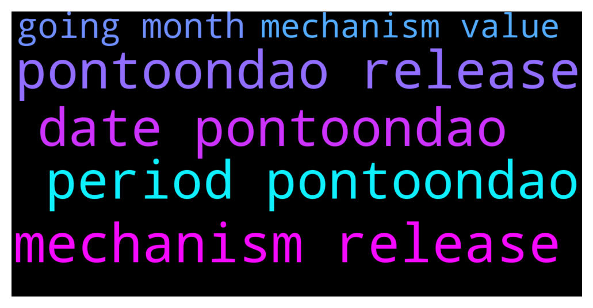

# **@ampnetapxchat**
 ## Analysis for **2021-12-09** - **2021-12-14**.

---

## 📊 **Basic Stats**

**n_messages_sent**: 34

---

---

## 🔝 **Top keywords and related messages**

1. **mechanism release**

    @PFCBLic --- *I just hope that mechanism for providing value for aapx holders will be functional and well engineered as well. We deserve it at the end of the story.* **--->** [TG Discussion](https://t.me/ampnetapxchat/35676)

    @<UNK> --- *Hey there, Q1/2022 is planned period for PontoonDAO release* **--->** [TG Discussion](https://t.me/ampnetapxchat/35668)

2. **pontoondao release**

    @maroraza --- *Hey @mislavjavor any update on this when you are launching this PontoonDAO? if no date any idea in which month its gonna come?* **--->** [TG Discussion](https://t.me/ampnetapxchat/35667)

    @<UNK> --- *Hey there, Q1/2022 is planned period for PontoonDAO release* **--->** [TG Discussion](https://t.me/ampnetapxchat/35668)

    @<UNK> --- *Glad to have you back!  more info about possible pontoonDAO token is here (last two points *)  https://t.me/ampnetapxchat/35378* **--->** [TG Discussion](https://t.me/ampnetapxchat/35542)

3. **date pontoondao**

    @maroraza --- *Hey @mislavjavor any update on this when you are launching this PontoonDAO? if no date any idea in which month its gonna come?* **--->** [TG Discussion](https://t.me/ampnetapxchat/35667)

    @<UNK> --- *Hey there, Q1/2022 is planned period for PontoonDAO release* **--->** [TG Discussion](https://t.me/ampnetapxchat/35668)

    @<UNK> --- *Glad to have you back!  more info about possible pontoonDAO token is here (last two points *)  https://t.me/ampnetapxchat/35378* **--->** [TG Discussion](https://t.me/ampnetapxchat/35542)

4. **period pontoondao**

    @maroraza --- *Hey @mislavjavor any update on this when you are launching this PontoonDAO? if no date any idea in which month its gonna come?* **--->** [TG Discussion](https://t.me/ampnetapxchat/35667)

    @<UNK> --- *Hey there, Q1/2022 is planned period for PontoonDAO release* **--->** [TG Discussion](https://t.me/ampnetapxchat/35668)

    @<UNK> --- *Glad to have you back!  more info about possible pontoonDAO token is here (last two points *)  https://t.me/ampnetapxchat/35378* **--->** [TG Discussion](https://t.me/ampnetapxchat/35542)

5. **going month**

    @sourmans --- *its gonna be a nightmare to fill taxes form if you guys dont do the freaking Etherscan price update* **--->** [TG Discussion](https://t.me/ampnetapxchat/35611)

    @maroraza --- *Hey @mislavjavor any update on this when you are launching this PontoonDAO? if no date any idea in which month its gonna come?* **--->** [TG Discussion](https://t.me/ampnetapxchat/35667)

6. **mechanism value**

    @PFCBLic --- *I just hope that mechanism for providing value for aapx holders will be functional and well engineered as well. We deserve it at the end of the story.* **--->** [TG Discussion](https://t.me/ampnetapxchat/35676)

    @mislavjavor --- *@pin_doll we have said we don't refund funds accidentaly sent to the deployer... We are willing to make an exception for you and a couple of others, but it's very low on the priority list for us. Your message was deleted because you accused us of stealing.   We have received over 1000 ETH in value during the fundraise, there is really no motive to steal 1 ETH from you or 300 USDC from some other person or 1000 USDT from a third person. The fact is, you sent the funds to the wrong address - it's our good will to refund them.   Which we will do, when we get to it - and no sooner.* **--->** [TG Discussion](https://t.me/ampnetapxchat/35637)

