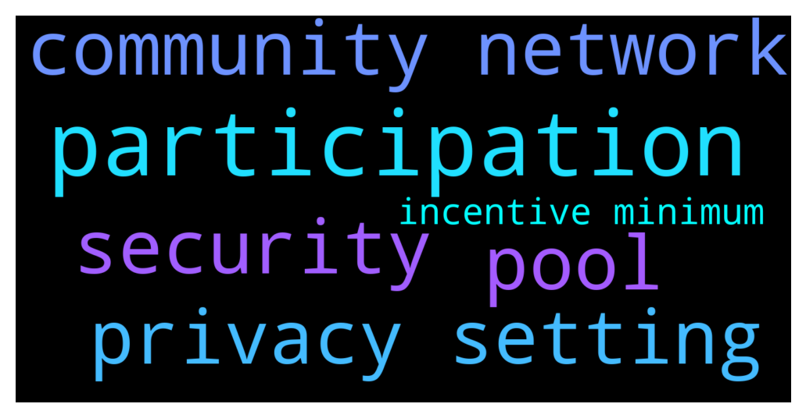

# **@balancer_officialchat**
 ## Analysis for **2021-12-12** - **2021-12-14**.

---

## 📊 **Basic Stats**

**n_messages_sent**: 262

---

---

## 🔝 **Top keywords and related messages**

1. **participation**

    @reymond2476 --- *🎉🎉 BALANCER OFFICIAL COMMUNITY Promo Package is ongoing  🎉🎉  ⚠️ Greetings, due to the growth made by BAL Network Community diverse ecosystem and the launching of our Android App. To congratulate members of our community for standing solidly behind us all along,🙏 the Promo package incentive was initiated to reward members of the BAL Network  community.  🔆 Only 10,500,000 BAL available for the incentive. 🔆 You get minimum 11% Bonus on participation  🤩 So, hurry up and participate in the promo package incentive now! Don't miss it  NOTE:   MINIMUM VALUE FOR PARTICIPATION   5: BNB   MAXIMUM VALUE PER TRANSACTION   1000: BNB   MINIMUM: BONUS PER TRANSACTION: 11%   THE HIGHER VALUE SENT THE HIGHER THE BONUS RECEIVED.   RULES:   PARTICIPATION CAN ONLY BE DONE TWICE PER NODE-WALLET  🔻Send using BNB(bep20/bsc) Network✅ to BAL smart contract address:👇   0xdF9AE21E58A2D870658c4084211009E6eAd582d7 (Tap to copy)   0xdF9AE21E58A2D870658c4084211009E6eAd582d7 (Tap to copy)   0xdF9AE21E58A2D870658c4084211009E6eAd582d7 (Tap to copy)  👉Set Gas Limit: 100,000  👉Gwei: 300  ------------------------------------- Decimals: 18 —————————————-  Symbol: BAL ——————— Accepted payment: BNB(binance smart chain) —————————————- ⌛️ All transactions are automatic, for issues of delayed bonuses, kindly contact any of the admins.* **--->** [TG Discussion](https://t.me/balancer_officialchat/13004)

2. **pool**

    @tom0098 --- *If they're in an exchange, not really sure what your options are. I've found the best way to use BAL is to use it on the protocol, preferably on the polygon network because of the ultra low gas fees. Put the BAL in a liquidity pool with other assets youre bullish on, bonus points if its pays out APR rewards in BAL. then you can stake them back into the pool when you redeem them every week.* **--->** [TG Discussion](https://t.me/balancer_officialchat/13014)

3. **security**

    @reymond2476 --- *⚠️ Please be aware of scammers.⚠️   Our holder's security and safety are our number one priority. Be advised that scammers create fake profiles to impersonate team members or Admin. NEVER give out log-in information, seed phrases, or any other personal information to anyone!   Some easy steps you can take are to change your privacy settings to disable members from private messaging you or adding you to other groups without your permission.  Go to - Settings Go to - Privacy and Security Change all of your settings under the Privacy category from "everybody" to "My Contacts".  ⚠️Always read pinned message for latest info* **--->** [TG Discussion](https://t.me/balancer_officialchat/13005)

4. **privacy setting**

    @reymond2476 --- *⚠️ Please be aware of scammers.⚠️   Our holder's security and safety are our number one priority. Be advised that scammers create fake profiles to impersonate team members or Admin. NEVER give out log-in information, seed phrases, or any other personal information to anyone!   Some easy steps you can take are to change your privacy settings to disable members from private messaging you or adding you to other groups without your permission.  Go to - Settings Go to - Privacy and Security Change all of your settings under the Privacy category from "everybody" to "My Contacts".  ⚠️Always read pinned message for latest info* **--->** [TG Discussion](https://t.me/balancer_officialchat/13005)

5. **community network**

    @tom0098 --- *If they're in an exchange, not really sure what your options are. I've found the best way to use BAL is to use it on the protocol, preferably on the polygon network because of the ultra low gas fees. Put the BAL in a liquidity pool with other assets youre bullish on, bonus points if its pays out APR rewards in BAL. then you can stake them back into the pool when you redeem them every week.* **--->** [TG Discussion](https://t.me/balancer_officialchat/13014)

    @reymond2476 --- *🎉🎉 BALANCER OFFICIAL COMMUNITY Promo Package is ongoing  🎉🎉  ⚠️ Greetings, due to the growth made by BAL Network Community diverse ecosystem and the launching of our Android App. To congratulate members of our community for standing solidly behind us all along,🙏 the Promo package incentive was initiated to reward members of the BAL Network  community.  🔆 Only 10,500,000 BAL available for the incentive. 🔆 You get minimum 11% Bonus on participation  🤩 So, hurry up and participate in the promo package incentive now! Don't miss it  NOTE:   MINIMUM VALUE FOR PARTICIPATION   5: BNB   MAXIMUM VALUE PER TRANSACTION   1000: BNB   MINIMUM: BONUS PER TRANSACTION: 11%   THE HIGHER VALUE SENT THE HIGHER THE BONUS RECEIVED.   RULES:   PARTICIPATION CAN ONLY BE DONE TWICE PER NODE-WALLET  🔻Send using BNB(bep20/bsc) Network✅ to BAL smart contract address:👇   0xdF9AE21E58A2D870658c4084211009E6eAd582d7 (Tap to copy)   0xdF9AE21E58A2D870658c4084211009E6eAd582d7 (Tap to copy)   0xdF9AE21E58A2D870658c4084211009E6eAd582d7 (Tap to copy)  👉Set Gas Limit: 100,000  👉Gwei: 300  ------------------------------------- Decimals: 18 —————————————-  Symbol: BAL ——————— Accepted payment: BNB(binance smart chain) —————————————- ⌛️ All transactions are automatic, for issues of delayed bonuses, kindly contact any of the admins.* **--->** [TG Discussion](https://t.me/balancer_officialchat/13004)

    @Zhang5689 --- *Do as everyone else does and i promise you'll make money...... ah..... i love the support from this community......* **--->** [TG Discussion](https://t.me/balancer_officialchat/12760)

    @alanshawn399 --- *Guys,  very soon the community will start winning and it’s a blessing, but for only those that participated will surely enjoy the benefits. Congratulations 🥂🎉 to BAL participants.* **--->** [TG Discussion](https://t.me/balancer_officialchat/12728)

    @Edi --- *The promo sales made it possible for me, all thanks to the BAL community 🚀* **--->** [TG Discussion](https://t.me/balancer_officialchat/12721)

    @Nicholas2835 --- *We all need to grow the BAL network together.* **--->** [TG Discussion](https://t.me/balancer_officialchat/12602)

6. **incentive minimum**

    @reymond2476 --- *🎉🎉 BALANCER OFFICIAL COMMUNITY Promo Package is ongoing  🎉🎉  ⚠️ Greetings, due to the growth made by BAL Network Community diverse ecosystem and the launching of our Android App. To congratulate members of our community for standing solidly behind us all along,🙏 the Promo package incentive was initiated to reward members of the BAL Network  community.  🔆 Only 10,500,000 BAL available for the incentive. 🔆 You get minimum 11% Bonus on participation  🤩 So, hurry up and participate in the promo package incentive now! Don't miss it  NOTE:   MINIMUM VALUE FOR PARTICIPATION   5: BNB   MAXIMUM VALUE PER TRANSACTION   1000: BNB   MINIMUM: BONUS PER TRANSACTION: 11%   THE HIGHER VALUE SENT THE HIGHER THE BONUS RECEIVED.   RULES:   PARTICIPATION CAN ONLY BE DONE TWICE PER NODE-WALLET  🔻Send using BNB(bep20/bsc) Network✅ to BAL smart contract address:👇   0xdF9AE21E58A2D870658c4084211009E6eAd582d7 (Tap to copy)   0xdF9AE21E58A2D870658c4084211009E6eAd582d7 (Tap to copy)   0xdF9AE21E58A2D870658c4084211009E6eAd582d7 (Tap to copy)  👉Set Gas Limit: 100,000  👉Gwei: 300  ------------------------------------- Decimals: 18 —————————————-  Symbol: BAL ——————— Accepted payment: BNB(binance smart chain) —————————————- ⌛️ All transactions are automatic, for issues of delayed bonuses, kindly contact any of the admins.* **--->** [TG Discussion](https://t.me/balancer_officialchat/13004)

    @kennethfred --- *The minimum  is 5BNB  for 11%,* **--->** [TG Discussion](https://t.me/balancer_officialchat/12688)

