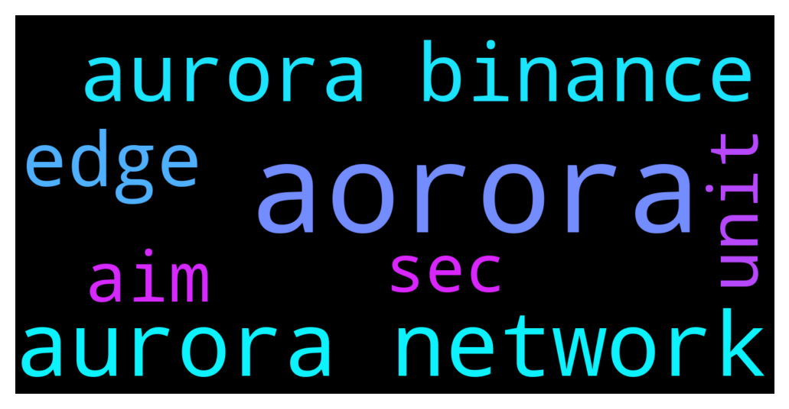

# **@cryptonear**
 ## Analysis for **2021-12-13** - **2021-12-14**.

---

## 📊 **Basic Stats**

**n_messages_sent**: 1465

---

---

## 🔝 **Top keywords and related messages**

1. **aorora**

    @angusmcmangus --- *I’ve just recently heard about Near and I’m interested in investigating my this further. However I don’t really understand how Aorora helps Near though. I understand that Aorora is built on Nears tech. However if Aorora became really popular would that actually translate into an increased Near price? Or would that only benefit Aorora? Because Aorora uses eth right for the gas?* **--->** [TG Discussion](https://t.me/cryptonear/237330)

2. **aurora network**

    @larry_lang --- *also joining Aurora channel and ask them directly could be a way to do https://t.me/auroraisnear* **--->** [TG Discussion](https://t.me/cryptonear/237691)

    @larry_lang --- *aurora doesnt charge u anything for gas  at the moment, maybe they will in the future, u should follow their channel to keep an update about it https://t.me/auroraisnear* **--->** [TG Discussion](https://t.me/cryptonear/237487)

    @cuongdcc --- *vote for Aurora support on deBridge guys: https://t.me/deBridge_Finance* **--->** [TG Discussion](https://t.me/cryptonear/235774)

    @TheGo1denBull --- *Good morning everyone. If you like storing your assets in your wallet NEAR has a unique web wallet that also has metamask capabilities when bridging to the Aurora EVM. You can create a reserved username wallet and fund it with ease. Also you can stake in available validator pools for a nice 11 percent apy. Here is a guide if you're interested.  https://medium.com/nearprotocol/a-starters-guide-to-the-near-wallet-and-staking-process-d2c8f3b61f43* **--->** [TG Discussion](https://t.me/cryptonear/236138)

    @angusmcmangus --- *Hmmm so the aim would be for aurora to not be successful in the long term as that would mean that people didn’t leave it to turn to near?  Also can you send funds directly to aurora direct from binance? As it seems from what I saw it needs to be bridged from near or eth first?* **--->** [TG Discussion](https://t.me/cryptonear/237342)

    @angusmcmangus --- *haha very funny. get most blockchains you use the native token as gas. But I thoguht I had read that aurora uses eth not near. But obviously that was wrong* **--->** [TG Discussion](https://t.me/cryptonear/237499)

3. **aurora binance**

    @larry_lang --- *also joining Aurora channel and ask them directly could be a way to do https://t.me/auroraisnear* **--->** [TG Discussion](https://t.me/cryptonear/237691)

    @larry_lang --- *aurora doesnt charge u anything for gas  at the moment, maybe they will in the future, u should follow their channel to keep an update about it https://t.me/auroraisnear* **--->** [TG Discussion](https://t.me/cryptonear/237487)

    @cuongdcc --- *vote for Aurora support on deBridge guys: https://t.me/deBridge_Finance* **--->** [TG Discussion](https://t.me/cryptonear/235774)

    @TheGo1denBull --- *Good morning everyone. If you like storing your assets in your wallet NEAR has a unique web wallet that also has metamask capabilities when bridging to the Aurora EVM. You can create a reserved username wallet and fund it with ease. Also you can stake in available validator pools for a nice 11 percent apy. Here is a guide if you're interested.  https://medium.com/nearprotocol/a-starters-guide-to-the-near-wallet-and-staking-process-d2c8f3b61f43* **--->** [TG Discussion](https://t.me/cryptonear/236138)

    @angusmcmangus --- *Hmmm so the aim would be for aurora to not be successful in the long term as that would mean that people didn’t leave it to turn to near?  Also can you send funds directly to aurora direct from binance? As it seems from what I saw it needs to be bridged from near or eth first?* **--->** [TG Discussion](https://t.me/cryptonear/237342)

    @bailey_12 --- *Haha newbie just want to know how to withdraw testnet token to binance and sell it tho* **--->** [TG Discussion](https://t.me/cryptonear/237528)

4. **edge**

    @OldieCrypto --- *It seems I can’t use Edge further after February.* **--->** [TG Discussion](https://t.me/cryptonear/237437)

    @NEARverse_xd --- *Edge, opera etc.. are chromium codebase browsers. You will get this notification on all chromium based browsers.* **--->** [TG Discussion](https://t.me/cryptonear/237507)

    @sanketCrypto --- *Hey, Everyone!  Our community is growing everyday. A lot of newcomers in here. Thus, I've made a list of all staking guides for you🙌  Feel free to contact @Ann_everstake if you get any problem   🔶Staking via NearWallet   🔶How to Stake NEAR  in Moonlet Mobile Wallet  🔶How to stake NEAR at Dokia Capital  🔶How to stake NEAR in Math Wallet  🔶How to stake NEAR with Ledger  And video guides⬇️  🔷How to buy NEAR on Binance and how to stake via Moonlet wallet  🔷How to stake Near with Near wallet  Here is more articles about Near for you👇  ▪️Near Protocol contribution to the development of the Non-Fungible Token Market  ▪️ Rainbow bridge: foundation of global crypto adoption?  ▪️What is Near   ▪️How to stake NEAR  Hope it was helpful🤞* **--->** [TG Discussion](https://t.me/cryptonear/237584)

    @Kripto_Raptor --- *it's not about your wallet, that's about the browser support i think it has to do sth with ledger connectivity* **--->** [TG Discussion](https://t.me/cryptonear/237514)

    @DEAD0x0 --- *Just an update there are no issues with wallet app it was my ledger app that got stuck* **--->** [TG Discussion](https://t.me/cryptonear/234732)

    @OldieCrypto --- *I tried Firefox it has connection problem. It said wallet connection fail. What about MS Edge? Can I use Edge after next Feruary?* **--->** [TG Discussion](https://t.me/cryptonear/237319)

5. **aim**

    @angusmcmangus --- *Hmmm so the aim would be for aurora to not be successful in the long term as that would mean that people didn’t leave it to turn to near?  Also can you send funds directly to aurora direct from binance? As it seems from what I saw it needs to be bridged from near or eth first?* **--->** [TG Discussion](https://t.me/cryptonear/237342)

    @larry_lang --- *no project were born with the aim to be unsuccessful=)))* **--->** [TG Discussion](https://t.me/cryptonear/237352)

    @larry_lang --- *1. no 1 of the aim is to make attraction from EVM to RUST, as more evm DEVs try out the Aurora network, maybe they would also wanna learn RUST and build another native Near app, 2. oh about that the bsc is forked from eth if i remember correctly, so basically we just need a erc bridge from NEAR/aurora to BSC and we are good(under construction as we 're speaking btw)* **--->** [TG Discussion](https://t.me/cryptonear/237350)

6. **unit**

    @Anon000 --- *Dear community and contributors!!   We are moving all news contributions to AstroDAO going forward. We've updated the "How to  contribute" section in the DAO Journey article below 👇🏼 Please read it and keep em' NEAR news coming 🎉⚡️🚀  https://nearweek.medium.com/first-step-in-the-nearweek-dao-journey-2b107acc323e* **--->** [TG Discussion](https://t.me/cryptonear/237436)

    @JUSTaDOLPHIN --- **we were talking about hiding balance/showing NEAR as unit on the near wallet page* **--->** [TG Discussion](https://t.me/cryptonear/237928)

    @israel_igboze --- *NEAR Support || Wallet & Staking Wallet & Staking technical support for NEAR community https://t.me/NEARSupport  Let's talk about it here* **--->** [TG Discussion](https://t.me/cryptonear/237715)

    @FritzWagner --- *https://mobile.twitter.com/CypherpunkGuild  Here a link to the privacy focused community on Near* **--->** [TG Discussion](https://t.me/cryptonear/235013)

    @NEARverse_xd --- *I am just joking with @bailey_12. I meant airdropping in community is better than login in validation link🤣* **--->** [TG Discussion](https://t.me/cryptonear/236073)

    @JUSTaDOLPHIN --- *Yea, more options would be nice as well, but just hiding the balance or showing NEAR as base unit is crucial I think* **--->** [TG Discussion](https://t.me/cryptonear/237927)

7. **sec**

    @Anon000 --- *Dear community and contributors!!   We are moving all news contributions to AstroDAO going forward. We've updated the "How to  contribute" section in the DAO Journey article below 👇🏼 Please read it and keep em' NEAR news coming 🎉⚡️🚀  https://nearweek.medium.com/first-step-in-the-nearweek-dao-journey-2b107acc323e* **--->** [TG Discussion](https://t.me/cryptonear/237436)

    @MPROFFA --- *No I am staking on other platform when I unstake I get it in 2 a 3 sec* **--->** [TG Discussion](https://t.me/cryptonear/237163)

    @MPROFFA --- *Wauw hahaha never happend before normaly take 1 or 2 sec* **--->** [TG Discussion](https://t.me/cryptonear/237157)

    @iamkemoo --- *check out the gaming section on aweseomenear: https://awesomenear.com/categories/gaming/* **--->** [TG Discussion](https://t.me/cryptonear/236349)

    @larry_lang --- *... acutally that 1 or 2 sec is a liquid unstaking solution which is difference sir* **--->** [TG Discussion](https://t.me/cryptonear/237158)

    @bailey_12 --- *Give him a sec, don’t worries* **--->** [TG Discussion](https://t.me/cryptonear/237830)

