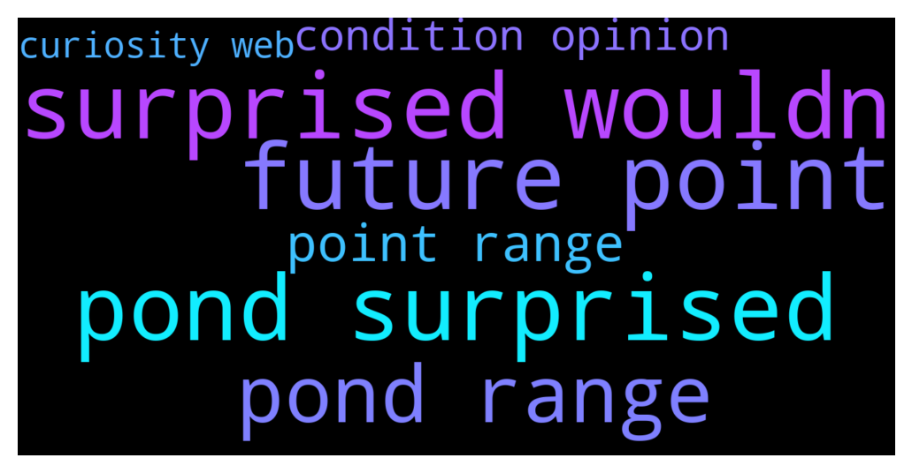

# **@defisearchpublic**
 ## Analysis for **2021-12-12** - **2021-12-14**.

---

## 📊 **Basic Stats**

**n_messages_sent**: 9

---

---

## 🔝 **Top keywords and related messages**

1. **surprised wouldn**

    @Milkyboy --- *Wouldn't be surprised if $POND hits $4-$6 range at some point in the future.  Just finished reading the whitepaper & running through the discord, @MarlinProtocol team, progress etc Impressive.  The lack of hype & marketing might seem like a bad thing but I think it's the opposite* **--->** [TG Discussion](https://t.me/defisearchpublic/240201)

2. **pond surprised**

    @Milkyboy --- *Wouldn't be surprised if $POND hits $4-$6 range at some point in the future.  Just finished reading the whitepaper & running through the discord, @MarlinProtocol team, progress etc Impressive.  The lack of hype & marketing might seem like a bad thing but I think it's the opposite* **--->** [TG Discussion](https://t.me/defisearchpublic/240201)

3. **future point**

    @CasperDeFi --- *We are live!  https://twitter.com/aag_ventures/status/1470000579460145155?s=20  --  A reminder of our pricing work for TLA:  TLA Pricing Mechanism  When an individual completes a purchase, the transaction will cause the AAG token’s price to increase. In contrast, when no purchases are initiated, prices will gradually decrease with the weight increasing.  Starting at $4.14, the price of AAG tokens will gradually decrease when no purchases occur. However, if at one point, for instance, at $3, there are large orders that have been successfully transacted, the price of the AAG token may also increase quickly. That means the price could also go above $4.14 and advance even higher if there are investors continuously buying.  In conclusion, an individual can freely purchase AAG tokens at any price they see fit, and that is the price they get. Eventually, the price will settle at a price the market as a whole finds most suitable.* **--->** [TG Discussion](https://t.me/defisearchpublic/240171)

    @Milkyboy --- *Wouldn't be surprised if $POND hits $4-$6 range at some point in the future.  Just finished reading the whitepaper & running through the discord, @MarlinProtocol team, progress etc Impressive.  The lack of hype & marketing might seem like a bad thing but I think it's the opposite* **--->** [TG Discussion](https://t.me/defisearchpublic/240201)

    @KEK --- *With the exception of intellectual and human capital, most resources will become commodities in the near future.* **--->** [TG Discussion](https://t.me/defisearchpublic/240165)

4. **pond range**

    @Milkyboy --- *Wouldn't be surprised if $POND hits $4-$6 range at some point in the future.  Just finished reading the whitepaper & running through the discord, @MarlinProtocol team, progress etc Impressive.  The lack of hype & marketing might seem like a bad thing but I think it's the opposite* **--->** [TG Discussion](https://t.me/defisearchpublic/240201)

5. **point range**

    @CasperDeFi --- *We are live!  https://twitter.com/aag_ventures/status/1470000579460145155?s=20  --  A reminder of our pricing work for TLA:  TLA Pricing Mechanism  When an individual completes a purchase, the transaction will cause the AAG token’s price to increase. In contrast, when no purchases are initiated, prices will gradually decrease with the weight increasing.  Starting at $4.14, the price of AAG tokens will gradually decrease when no purchases occur. However, if at one point, for instance, at $3, there are large orders that have been successfully transacted, the price of the AAG token may also increase quickly. That means the price could also go above $4.14 and advance even higher if there are investors continuously buying.  In conclusion, an individual can freely purchase AAG tokens at any price they see fit, and that is the price they get. Eventually, the price will settle at a price the market as a whole finds most suitable.* **--->** [TG Discussion](https://t.me/defisearchpublic/240171)

    @Milkyboy --- *Wouldn't be surprised if $POND hits $4-$6 range at some point in the future.  Just finished reading the whitepaper & running through the discord, @MarlinProtocol team, progress etc Impressive.  The lack of hype & marketing might seem like a bad thing but I think it's the opposite* **--->** [TG Discussion](https://t.me/defisearchpublic/240201)

6. **condition opinion**

    @Zelda --- *What are your opinions on the condition of web 3 development today? I started hearing less and less about it.* **--->** [TG Discussion](https://t.me/defisearchpublic/240193)

7. **curiosity web**

    @ddddweffc --- *It most certainly has the capacity to. I believe the DEIP protocol for content creation will pique the curiosity of many web developers.* **--->** [TG Discussion](https://t.me/defisearchpublic/240194)

    @Zelda --- *What are your opinions on the condition of web 3 development today? I started hearing less and less about it.* **--->** [TG Discussion](https://t.me/defisearchpublic/240193)

