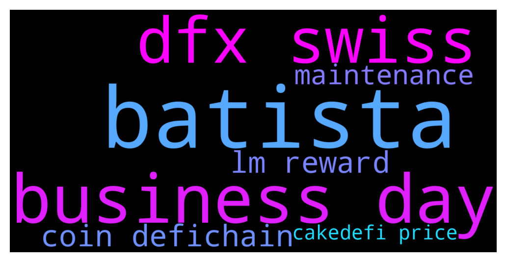

# **@CakeDeFi_EN**
 ## Analysis for **2021-12-14** - **2021-12-15**.

---

## 📊 **Basic Stats**

**n_messages_sent**: 257

---

---

## 🔝 **Top keywords and related messages**

1. **batista**

    @christina --- *Thank you all! Daniel Batista is a scammer. Not to be confused with Daniel Baptista.* **--->** [TG Discussion](https://t.me/CakeDeFi_EN/153110)

    @默默啃书小凳子~ --- *Daniel Batista yes, it a scammer* **--->** [TG Discussion](https://t.me/CakeDeFi_EN/153105)

    @Mad_Ed0815 --- *You misunderstand. Danial Batista in this group is not a scammer. You have been contacted by an impersonator...* **--->** [TG Discussion](https://t.me/CakeDeFi_EN/153108)

2. **business day**

    @christina --- *I’ve had a lot of money in the DUSD pool since day one and almost no rewards.* **--->** [TG Discussion](https://t.me/CakeDeFi_EN/153005)

    @fabioandreatta --- *It is still at 240% - it is because Cake uses a 7-day moving average and lots of Datapoints are 0 - it takes up to 7-days for it to be displayed correctly, but it is just a display thing, you actually get the same as on DeFiChain (minus 15% fee)* **--->** [TG Discussion](https://t.me/CakeDeFi_EN/153173)

    @traceyduke --- *Anyone know what’s happening with KuCoin? I’ve had dfi in there for 3 days, they say my wallet is under maintenance and I can’t transfer out* **--->** [TG Discussion](https://t.me/CakeDeFi_EN/152900)

    @Manuel --- *Hi Bernd, Ok, I will show you my way. I am „learning“ the LM with the dTSLA-DUSD Pool. There are 0.0349116 dTSLA and 39.6713039 DUSD. The APR was 350,23%. Let‘s just focus on DUSD. I thought that I Need to Break down the APR to one 12 Hour Slot so I divided the 350,23% by 730 (365 days * 2 12 Hour Slots). That would make 0,47976712% per 12 Hours. After That i just multiplied the DUSD amount with it > 0,19032987 DUSD per 12 Hours. That minus 15% of fees = 0,16178039 DUSD. That seems totally wrong. I received 0,00543378 DUSD Bit I don’t know how to calculate that correctly. There must be an huge mistake taken by me but i can’t See it.🙈* **--->** [TG Discussion](https://t.me/CakeDeFi_EN/152661)

    @DmgBautista --- *Business accounts are not yet existent, as far as I know. That feature is planned according my best information, but currently not yet rolled-out. Maybe thats why you were informed that it will take weeks (maybe the answer is already considering the time until it will be implemented)* **--->** [TG Discussion](https://t.me/CakeDeFi_EN/152706)

    @Michael_Schredl --- *Take a look at https://defiscan.live/dex, there you see the current APR - Cake takes a 7 day average* **--->** [TG Discussion](https://t.me/CakeDeFi_EN/153176)

3. **dfx swiss**

    @DmgBautista --- *I dont see a problem at all. You have several exchanges, some are working already and even without them, you can easily cash out by using DFX.swiss. The platform was up and running a couple hours after the blockchain halted a few days ago. Main issue with many in the vocal minority that immediatelly jump to say that cant cash out claiming scam and so on, is that they simply dont care enough to even know the possibilities defichain and Cake place at their disposal. Its easier to point fingers and wait for someone to magically solve their problems. Truth is, both Cake and Defichain have the best tech teams anyone could ask for, and are working around the clock to solve any issue that arises. And that was achieved. Blockchain halted, solved in hours. Cake had to reindex the nodes, done in like 4 hours, and after that, all solved. DFX.swiss online at about the same time, with off ramp possibility. Anyone could cash in an cash out through it. No KYC needed. But no one even scroll up to read the messages that mods write countless times in the majority of these situations and when doing it, only end up finding them lost in mountains of messages from that same vocal minority. Thats a problem that unfortunatelly, we and despite our good will, cannot do anything about. How do I know this? All this information is available in the pinned messages, right in the top of this chat. Anyone can read them and find all this information. But almost no one have such care unfortunatelly. Sorry if the message seems heavy, not at all and definitelly not directed at you. Just used the opportunity to express some of the hard work that the tech teams and all mods have been doing, trying their best to help the community and answer always as possible, only to be greated with mockery and sometimes disrespect from some members in the community. As you can believe, it gets everyone tired and if it wasnt the belief of many in the project and their effort to get it through turbulent waters sometimes, things could indeed deserve that. Fortunatelly, that is not the case, and the community stands here, for the community, to the community and by the community (hope no one sues me by "stealing" this  one 😅).* **--->** [TG Discussion](https://t.me/CakeDeFi_EN/153046)

    @DmgBautista --- *As said above, you can cash out since the beginning. As soon as Cake finished the reindex of their nodes, almost right after you were already able to cash out, as any other user. Whats the problem with kukoin? Its offline for maintenance. Ok, but there are alternatives. Anyone in dire need of money could and can use DFX.swiss for example. Off ramp capability without KYC. What more is needed?* **--->** [TG Discussion](https://t.me/CakeDeFi_EN/153050)

4. **coin defichain**

    @fabioandreatta --- *Yes it does! (just not on Cake)  Download the app: www.defichain.com* **--->** [TG Discussion](https://t.me/CakeDeFi_EN/152348)

    @fabioandreatta --- *For discussions & questions regarding DFI & DeFiChain:  https://t.me/defiblockchain* **--->** [TG Discussion](https://t.me/CakeDeFi_EN/152328)

    @fabioandreatta --- *It is still at 240% - it is because Cake uses a 7-day moving average and lots of Datapoints are 0 - it takes up to 7-days for it to be displayed correctly, but it is just a display thing, you actually get the same as on DeFiChain (minus 15% fee)* **--->** [TG Discussion](https://t.me/CakeDeFi_EN/153173)

    @Tim --- *As I understand it  dUSD and several other dTokens offered by Cake are bought from the defichain dex which for example have dUSD at 1.30 USD. This problem is being looked into at the moment.. and when it is solved the value of dUSD will become circa 1 USD.. which in turn will represent a loss for anyone holding dUSD who bought it in the last few weeks when the value was 1.30 USD like it is now.* **--->** [TG Discussion](https://t.me/CakeDeFi_EN/153194)

    @jezzkng --- *Hello! we have a DeFiChain group for this topics  https://t.me/defiblockchain* **--->** [TG Discussion](https://t.me/CakeDeFi_EN/152573)

    @kennyteoh90 --- *Hi, i’m new here and want to buy defichain coin. But why the defichain coin price in cakedefi show $4.79 but in CoinMarketCap show $3.9 ?* **--->** [TG Discussion](https://t.me/CakeDeFi_EN/153291)

5. **lm reward**

    @BerndMack --- *the rewards are only in DFI DUSD and TSLA payouts are only commissions of the swaps in the pool* **--->** [TG Discussion](https://t.me/CakeDeFi_EN/152684)

    @christina --- *I’ve had a lot of money in the DUSD pool since day one and almost no rewards.* **--->** [TG Discussion](https://t.me/CakeDeFi_EN/153005)

    @christina --- *There are no rewards on my transaction page. The only rewards I see are the small ones in LP page. And my assets balance overall keeps getting lower* **--->** [TG Discussion](https://t.me/CakeDeFi_EN/153009)

    @Manuel --- *Hi Bernd, Ok, I will show you my way. I am „learning“ the LM with the dTSLA-DUSD Pool. There are 0.0349116 dTSLA and 39.6713039 DUSD. The APR was 350,23%. Let‘s just focus on DUSD. I thought that I Need to Break down the APR to one 12 Hour Slot so I divided the 350,23% by 730 (365 days * 2 12 Hour Slots). That would make 0,47976712% per 12 Hours. After That i just multiplied the DUSD amount with it > 0,19032987 DUSD per 12 Hours. That minus 15% of fees = 0,16178039 DUSD. That seems totally wrong. I received 0,00543378 DUSD Bit I don’t know how to calculate that correctly. There must be an huge mistake taken by me but i can’t See it.🙈* **--->** [TG Discussion](https://t.me/CakeDeFi_EN/152661)

    @brandoncjl --- *have LM rewards been delayed today? have not received it yet* **--->** [TG Discussion](https://t.me/CakeDeFi_EN/153022)

    @Freyr Líndal --- *Can I get a clarification.  On my activity feed I can see Im earning around 0.18 Dfi in 12 hours from BTC/DFI LM  But on LM page on BTC/DFI pool it says DFI rewards is 0.28.  Also got my weekly email yesterday and it says Ive earned from BTC/DFI pool 0.023DFi.  Im confused.* **--->** [TG Discussion](https://t.me/CakeDeFi_EN/152617)

6. **maintenance**

    @fabioandreatta --- *Yeah they are still under maintenance, upgrading to new node software. My best guess is they will open up again this week* **--->** [TG Discussion](https://t.me/CakeDeFi_EN/152901)

    @traceyduke --- *Anyone know what’s happening with KuCoin? I’ve had dfi in there for 3 days, they say my wallet is under maintenance and I can’t transfer out* **--->** [TG Discussion](https://t.me/CakeDeFi_EN/152900)

    @DmgBautista --- *In which way? Some exchanges are still under maintenance.* **--->** [TG Discussion](https://t.me/CakeDeFi_EN/153028)

    @rhodium219 --- *I can confirm that latoken.com is no longer in maintenance for DFI but they do charge a 1% deposit fee which is laughable.* **--->** [TG Discussion](https://t.me/CakeDeFi_EN/152886)

    @rhodium219 --- *Why don’t you just withdraw by a different route? KuCoin have form for taking forever to take their DFI service out of maintenance after an upgrade.* **--->** [TG Discussion](https://t.me/CakeDeFi_EN/152882)

    @DmgBautista --- *Because more people are staking their rewards to get additional rewards. Many are not selling, because they font want or because some of the offramp possibilities are still undergoing maintenance. So why not stake and get additional rewards in the meantime? That's what I'm also doing 😅* **--->** [TG Discussion](https://t.me/CakeDeFi_EN/152802)

7. **cakedefi price**

    @Charlyjaja --- *How come DUSD price went down from 1.3 USD to about 1.22USD? Is it because people withrew some of their money during/after yesterday's "crash"?* **--->** [TG Discussion](https://t.me/CakeDeFi_EN/152723)

    @mumujinglin --- *@Michael_Schredl  Hi Michael, is it correct to understand in this way: 1. The de-assets on Cake DEFI are all denominated in DUSD.  2. For example the current price of dTSLA is 1115 DUSD. So if we have to covert it into fiat money, it will be 1115 * 1.25 (current DUSD price) = 1393 USD per dTSLA token. Is it correct? Thank you 🙏* **--->** [TG Discussion](https://t.me/CakeDeFi_EN/152534)

    @christina --- *I see nothing about LM rewards on my transaction page. Only swapping and deposits I did are there.  I expected my balance to fluctuate because of the price fluctuations in general, but I definitely haven’t seen rewards show up anywhere I’ve looked* **--->** [TG Discussion](https://t.me/CakeDeFi_EN/153019)

    @kennyteoh90 --- *Hi, i’m new here and want to buy defichain coin. But why the defichain coin price in cakedefi show $4.79 but in CoinMarketCap show $3.9 ?* **--->** [TG Discussion](https://t.me/CakeDeFi_EN/153291)

    @ForkHandles --- *Do you expect to see much price volatility when they are back online so to speak.* **--->** [TG Discussion](https://t.me/CakeDeFi_EN/152912)

    @iAden_94 --- *Any updates If there will be Christmas promotion on CakeDeFi ?* **--->** [TG Discussion](https://t.me/CakeDeFi_EN/153148)

