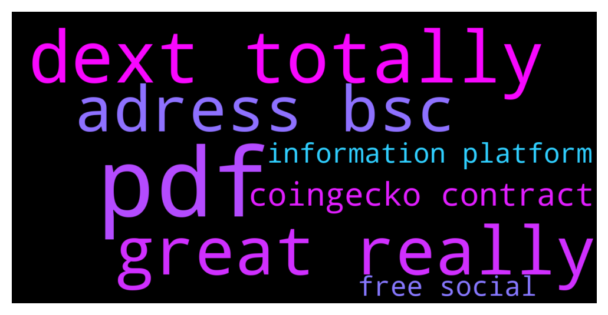

# **@DEXToolsCommunity**
 ## Analysis for **2021-12-13** - **2021-12-15**.

---

## 📊 **Basic Stats**

**n_messages_sent**: 133

---

---

## 🔝 **Top keywords and related messages**

1. **pdf**

    @CryptoSadt --- *Stanes can you take the Contract Details from Coingecko? or I can send a pdf to you...* **--->** [TG Discussion](https://t.me/DEXToolsCommunity/313525)

    @CryptoSadt --- *Dears how can I send to you the pdf with all details for 0x8cb4FDB148d87f7Ec493e69391347bDd3Ff1163f   ?* **--->** [TG Discussion](https://t.me/DEXToolsCommunity/313507)

2. **dext totally**

    @stanes --- *If you are talking about bridging your DEXT, you can by using Anyswap: https://anyswap.exchange/#/bridge We don't have a bridge integrated on Dextools.* **--->** [TG Discussion](https://t.me/DEXToolsCommunity/313344)

    @stanes --- *DEXT UNISWAP PAIR Chart and trade: https://www.dextools.io/app/uniswap/pair-explorer/0xa29fe6ef9592b5d408cca961d0fb9b1faf497d6d Contract: 0xfb7b4564402e5500db5bb6d63ae671302777c75a  DEXT PANCAKESWAP PAIR Chart and trade: https://www.dextools.io/app/pancakeswap/pair-explorer/0x4b729d5d871057f3a9c424792729217cde72410d Contract: 0xe91a8d2c584ca93c7405f15c22cdfe53c29896e3* **--->** [TG Discussion](https://t.me/DEXToolsCommunity/312890)

    @tadnyarahul --- *Instead of $, will you deduct my DEXT coin per month or it will be always 1000 in quantity and I just need to hold it to continue with subscription?* **--->** [TG Discussion](https://t.me/DEXToolsCommunity/312898)

    @stanes --- *For the monthly subscription it's 100$ paid in DEXT. So today the price of DEXT is 0.5$ then you need to send 200 DEXT. If next month when you want to renew the price is 1$ then you will have to send 100 DEXT. For the holding, it's 1k DEXT whatever the price of DEXT is. And we don't deduct anything from anyone wallet.* **--->** [TG Discussion](https://t.me/DEXToolsCommunity/312901)

    @bastardganpunk --- *About DEXT Score & Social Information for your token, please update etherscan.io or bscscan.com & update information on coinmarketcap.com and coingecko.com* **--->** [TG Discussion](https://t.me/DEXToolsCommunity/312672)

    @hmk18990 --- *1) Admins never DM you first or request for funds 2) All pairs are automatically added to DEXTools when pair created & liquidity added 3) Hot Pairs depends on a custom algorithm which is undisclosed so please don't ask about it (and no! It's not for sale) 4) DEXTools Plans 5) DEXTForce (which you need to hold at least 1K of $DEXT) 6) DEXTForce Ventures (which you need to hold at least 100K of $DEXT) 7) DEXTShare Burn It All Edition - DEXT goes deflationary 8) To Improve DEXT Score & Update Social Information for your token, please update etherscan.io or bscscan.com & update information on coinmarketcap.com and coingecko.com 9) For the news, advertisements, sponsorships please DM @guillermorodriguez78 he's the only in charge (and he'll never DM you first) 10) Add DEXTools Telegram Price Bot To Your Group 11) Always DYOR and stay away from scammers 12) New DEXTools Pairs & contracts for $DEXT:   UNI PAIR UNI CA: 0xfb7b4564402e5500db5bb6d63ae671302777c75a  PANCAKE PAIR PANCAKE CA: 0xe91a8d2c584ca93c7405f15c22cdfe53c29896e3* **--->** [TG Discussion](https://t.me/DEXToolsCommunity/312691)

3. **great really**

    @CryptoSadt --- *Great, really appreciate your help guys* **--->** [TG Discussion](https://t.me/DEXToolsCommunity/313515)

4. **adress bsc**

    @Ms4crypto --- *another question, its been about a week that i have this for bsc wallet info. Any idea why?* **--->** [TG Discussion](https://t.me/DEXToolsCommunity/312891)

    @huseyincelikorg --- *please remove my token dexpage   " Team of this token has sold at least 2.032 BNB. Be aware of this token!" alert remove, please   https://www.dextools.io/app/bsc/pair-explorer/0x0fc72d759e875c619e7af9b20495c6894d194332  mytoken contract adress : bsc on 0xd35c64b94939ff214c1af79b6966f79a9c57e5c7* **--->** [TG Discussion](https://t.me/DEXToolsCommunity/313518)

    @Ms4crypto --- *yeah, its been just about a week now that i cant see ever..all the other wallets works but bsc..i always had issue with since day one but now its just doesnt want to load at all ever* **--->** [TG Discussion](https://t.me/DEXToolsCommunity/312899)

    @stanes --- *Search with the token address then click on the filter on the right and select bsc.* **--->** [TG Discussion](https://t.me/DEXToolsCommunity/313495)

    @No.One --- *Yeah all bsc pairs and hot trends* **--->** [TG Discussion](https://t.me/DEXToolsCommunity/313334)

    @No.One --- *Hi BSC pairs again problem not load* **--->** [TG Discussion](https://t.me/DEXToolsCommunity/313315)

5. **coingecko contract**

    @CryptoSadt --- *Stanes can you take the Contract Details from Coingecko? or I can send a pdf to you...* **--->** [TG Discussion](https://t.me/DEXToolsCommunity/313525)

    @stanes --- *DEXT UNISWAP PAIR Chart and trade: https://www.dextools.io/app/uniswap/pair-explorer/0xa29fe6ef9592b5d408cca961d0fb9b1faf497d6d Contract: 0xfb7b4564402e5500db5bb6d63ae671302777c75a  DEXT PANCAKESWAP PAIR Chart and trade: https://www.dextools.io/app/pancakeswap/pair-explorer/0x4b729d5d871057f3a9c424792729217cde72410d Contract: 0xe91a8d2c584ca93c7405f15c22cdfe53c29896e3* **--->** [TG Discussion](https://t.me/DEXToolsCommunity/312890)

    @huseyincelikorg --- *please remove my token dexpage   " Team of this token has sold at least 2.032 BNB. Be aware of this token!" alert remove, please   https://www.dextools.io/app/bsc/pair-explorer/0x0fc72d759e875c619e7af9b20495c6894d194332  mytoken contract adress : bsc on 0xd35c64b94939ff214c1af79b6966f79a9c57e5c7* **--->** [TG Discussion](https://t.me/DEXToolsCommunity/313518)

    @prep_mb --- *dex tools already showing token pair and trading volumes and chart. but it only shows etherscan contract link, I wanna add social links for token info.* **--->** [TG Discussion](https://t.me/DEXToolsCommunity/312669)

    @stanes --- *It's free.  About social Information for your token, please update etherscan.io or bscscan.com or coingecko.com  We pull info from there.* **--->** [TG Discussion](https://t.me/DEXToolsCommunity/313500)

    @bastardganpunk --- *About DEXT Score & Social Information for your token, please update etherscan.io or bscscan.com & update information on coinmarketcap.com and coingecko.com* **--->** [TG Discussion](https://t.me/DEXToolsCommunity/312672)

6. **information platform**

    @JswapFinanceShona --- *Hello sir, what funds do I need to submit to show the token information on the platform page* **--->** [TG Discussion](https://t.me/DEXToolsCommunity/313499)

    @stanes --- *It's free.  About social Information for your token, please update etherscan.io or bscscan.com or coingecko.com  We pull info from there.* **--->** [TG Discussion](https://t.me/DEXToolsCommunity/313500)

    @bastardganpunk --- *as stated above, dextools fetches information from blockchain explorers and cmc and cg* **--->** [TG Discussion](https://t.me/DEXToolsCommunity/312676)

    @bastardganpunk --- *About DEXT Score & Social Information for your token, please update etherscan.io or bscscan.com & update information on coinmarketcap.com and coingecko.com* **--->** [TG Discussion](https://t.me/DEXToolsCommunity/312672)

    @hmk18990 --- *1) Admins never DM you first or request for funds 2) All pairs are automatically added to DEXTools when pair created & liquidity added 3) Hot Pairs depends on a custom algorithm which is undisclosed so please don't ask about it (and no! It's not for sale) 4) DEXTools Plans 5) DEXTForce (which you need to hold at least 1K of $DEXT) 6) DEXTForce Ventures (which you need to hold at least 100K of $DEXT) 7) DEXTShare Burn It All Edition - DEXT goes deflationary 8) To Improve DEXT Score & Update Social Information for your token, please update etherscan.io or bscscan.com & update information on coinmarketcap.com and coingecko.com 9) For the news, advertisements, sponsorships please DM @guillermorodriguez78 he's the only in charge (and he'll never DM you first) 10) Add DEXTools Telegram Price Bot To Your Group 11) Always DYOR and stay away from scammers 12) New DEXTools Pairs & contracts for $DEXT:   UNI PAIR UNI CA: 0xfb7b4564402e5500db5bb6d63ae671302777c75a  PANCAKE PAIR PANCAKE CA: 0xe91a8d2c584ca93c7405f15c22cdfe53c29896e3* **--->** [TG Discussion](https://t.me/DEXToolsCommunity/312691)

    @No.One --- *Also information of volume and etc are incorrect* **--->** [TG Discussion](https://t.me/DEXToolsCommunity/312565)

7. **free social**

    @prep_mb --- *dex tools already showing token pair and trading volumes and chart. but it only shows etherscan contract link, I wanna add social links for token info.* **--->** [TG Discussion](https://t.me/DEXToolsCommunity/312669)

    @stanes --- *It's free.  About social Information for your token, please update etherscan.io or bscscan.com or coingecko.com  We pull info from there.* **--->** [TG Discussion](https://t.me/DEXToolsCommunity/313500)

    @bastardganpunk --- *About DEXT Score & Social Information for your token, please update etherscan.io or bscscan.com & update information on coinmarketcap.com and coingecko.com* **--->** [TG Discussion](https://t.me/DEXToolsCommunity/312672)

    @hmk18990 --- *1) Admins never DM you first or request for funds 2) All pairs are automatically added to DEXTools when pair created & liquidity added 3) Hot Pairs depends on a custom algorithm which is undisclosed so please don't ask about it (and no! It's not for sale) 4) DEXTools Plans 5) DEXTForce (which you need to hold at least 1K of $DEXT) 6) DEXTForce Ventures (which you need to hold at least 100K of $DEXT) 7) DEXTShare Burn It All Edition - DEXT goes deflationary 8) To Improve DEXT Score & Update Social Information for your token, please update etherscan.io or bscscan.com & update information on coinmarketcap.com and coingecko.com 9) For the news, advertisements, sponsorships please DM @guillermorodriguez78 he's the only in charge (and he'll never DM you first) 10) Add DEXTools Telegram Price Bot To Your Group 11) Always DYOR and stay away from scammers 12) New DEXTools Pairs & contracts for $DEXT:   UNI PAIR UNI CA: 0xfb7b4564402e5500db5bb6d63ae671302777c75a  PANCAKE PAIR PANCAKE CA: 0xe91a8d2c584ca93c7405f15c22cdfe53c29896e3* **--->** [TG Discussion](https://t.me/DEXToolsCommunity/312691)

    @napascual --- *We've just removed most of the scam coins from the wallet info. Feel free to report any extra scam token* **--->** [TG Discussion](https://t.me/DEXToolsCommunity/313208)

    @napascual --- *Feel free to share the scam coin here, there are a lot of community members willing to help* **--->** [TG Discussion](https://t.me/DEXToolsCommunity/313190)

