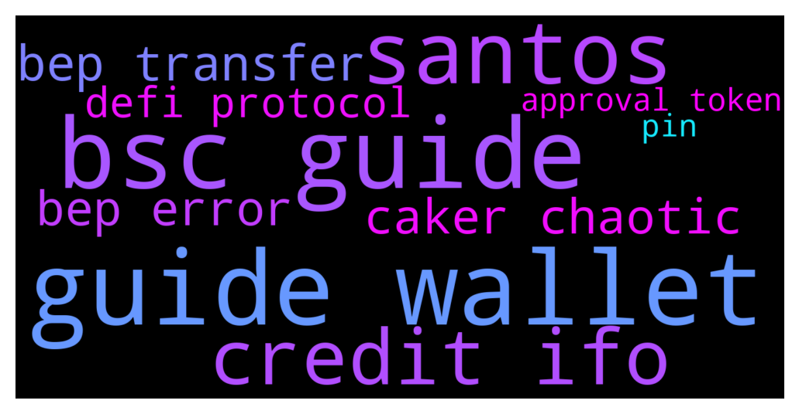

# **@PancakeSwap**
 ## Analysis for **2021-12-14** - **2021-12-15**.

---

## 📊 **Basic Stats**

**n_messages_sent**: 1203

---

---

## 🔝 **Top keywords and related messages**

1. **guide wallet**

    @RangerApos --- *1) Increase your slippage, the higher the better  2) Increase your gas (15, 350000)  3) Remove any decimals, use whole  numbers and round down (e.g. if you are trying to sell 592038493.20395, type in the amount 592038492 manually)   4) Use a different wallet (safepal, trustwallet, metamask)  5)Try lowering the amount you sell. Some coins got max transaction limit.  6)Ask the coin issuer to either lower the auto liquidity adding threshold or turn off automatic liquidity adding completely.  7)If none of the above work, you've probably bought a coin you cant sell.  Click here for help on common troubleshooting errors: https://docs.pancakeswap.finance/help/troubleshooting* **--->** [TG Discussion](https://t.me/PancakeSwap/2189623)

    @FabulousXBT --- *1) Increase your slippage, the higher the better  2) Increase your gas (15, 350000)  3) Remove any decimals, use whole  numbers and round down (e.g. if you are trying to sell 592038493.20395, type in the amount 592038492 manually)   4) Use a different wallet (safepal, trustwallet, metamask)  5)Try lowering the amount you sell. Some coins got max transaction limit.  6)Ask the coin issuer to either lower the auto liquidity adding threshold or turn off automatic liquidity adding completely.  7)If none of the above work, you've probably bought a coin you cant sell.  Click here for help on common troubleshooting errors: https://docs.pancakeswap.finance/help/troubleshooting* **--->** [TG Discussion](https://t.me/PancakeSwap/2188524)

    @Ceddi200 --- *1) Increase your slippage, the higher the better  2) Increase your gas (15, 350000)  3) Remove any decimals, use whole numbers and round down (e.g. if you are trying to sell 592038493.20395, type in the amount 592038492 manually)   4) Use a different wallet (safepal, trustwallet, metamask)  5)Try lowering the amount you sell. Some coins got max transaction limit.  6)Ask the coin issuer to either lower the auto liquidity adding threshold or turn off automatic liquidity adding completely.   🚨🚨🚨🚨🚨🚨🚨🚨🚨🚨 7)If none of the above work, you've probably bought a coin you cant sell. 🚨🚨🚨🚨🚨🚨🚨🚨🚨🚨  Here you can check whether the token you bought is a scam. Paste the smart contract address! 👇👇👇👇👇 https://honeypot.rugdoc.io/* **--->** [TG Discussion](https://t.me/PancakeSwap/2190924)

    @ravenonarock --- *Hi guys! First of all… nice to meet you all! I wanted to trade my BNB for another coin through my trust wallet. However, Pancakeswap says I don’t have any BNB. Can someone please help me out with this. It is my first time trying this platform and I am freaking out hahaha* **--->** [TG Discussion](https://t.me/PancakeSwap/2188207)

    @RangerApos --- *1) Increase your slippage, the higher the better  2) Increase your gas (15, 350000)  3) Remove any decimals, use whole numbers and round down (e.g. if you are trying to sell 592038493.20395, type in the amount 592038492 manually)   4) Use a different wallet (safepal, trustwallet, metamask)  5)Try lowering the amount you sell. Some coins got max transaction limit.  6)Ask the coin issuer to either lower the auto liquidity adding threshold or turn off automatic liquidity adding completely.   🚨🚨🚨🚨🚨🚨🚨🚨🚨🚨 7)If none of the above work, you've probably bought a coin you cant sell. 🚨🚨🚨🚨🚨🚨🚨🚨🚨🚨  Here you can check whether the token you bought is a scam. Paste the smart contract address! 👇👇👇👇👇 https://honeypot.rugdoc.io/* **--->** [TG Discussion](https://t.me/PancakeSwap/2190295)

    @CakeCompounder --- *1) Increase your slippage, the higher the better  2) Increase your gas (15, 350000)  3) Remove any decimals, use whole numbers and round down (e.g. if you are trying to sell 592038493.20395, type in the amount 592038492 manually)   4) Use a different wallet (safepal, trustwallet, metamask)  5)Try lowering the amount you sell. Some coins got max transaction limit.  6)Ask the coin issuer to either lower the auto liquidity adding threshold or turn off automatic liquidity adding completely.   🚨🚨🚨🚨🚨🚨🚨🚨🚨🚨 7)If none of the above work, you've probably bought a coin you cant sell. 🚨🚨🚨🚨🚨🚨🚨🚨🚨🚨  Here you can check whether the token you bought is a scam. Paste the smart contract address! 👇👇👇👇👇 https://honeypot.rugdoc.io/* **--->** [TG Discussion](https://t.me/PancakeSwap/2186232)

2. **bsc guide**

    @nikunjkk --- *during IFO BSC network is too much congested we cant proceed in transection last Santos IFO was bad experience of mine* **--->** [TG Discussion](https://t.me/PancakeSwap/2190333)

    @TomorrowlandForLife --- *Clearly there is something you're doing wrong  PancakeSwap Misc Guides  — How To Yield Farm On PancakeSwap — How To Trade On PancakeSwap Exchange — How To Join The Lottery On PancakeSwap — Complete Short Guide to PancakeSwap  Wallet Guides  — Metamask Wallet Guide for BSC — Ledger Wallet Guide for BSC — Trezor Wallet Guide for BSC — Math Wallet Guide for BSC — Trust Wallet Guide for BSC (Android) — Trust Wallet Guide for BSC (iOS) — SafePal Wallet Guide for Pancakeswap — SafePal Wallet Guide for BSC  Audit Report  — Pancakeswap Audit Report by CERTIK* **--->** [TG Discussion](https://t.me/PancakeSwap/2189714)

    @Rush_lover --- *Network fee on BSC is cheap, but some shit-coins take some extra fee for trading.* **--->** [TG Discussion](https://t.me/PancakeSwap/2188433)

    @Flower --- *No, it’s not auto used as far as I’m concerned but I think it should be automatically used for the IFO purchase because to unstake, commit, collect and restake whilst BSC congestion will not help anyone* **--->** [TG Discussion](https://t.me/PancakeSwap/2187981)

    @futuretomoon --- *I removed the liquadity from a token. I recieved back the tokens but not the BNB. In transaction on BSC it shows I recieved it back but I actually didn't... Can anyone please help... Scammers don't message I already know admins they are just offline now* **--->** [TG Discussion](https://t.me/PancakeSwap/2190442)

    @wantedboylt --- *Hello, how to get back coins if i had this error when tried swap? My BSC coins gone also not get other coins (coin added to metamas) Fail with error 'PancakeRouter: EXCESSIVE_INPUT_AMOUNT'* **--->** [TG Discussion](https://t.me/PancakeSwap/2191787)

3. **santos**

    @Ceddi200 --- *Eligible pairs: SANTOS/BNB, PORTO/BNB, LAZIO/BNB, SANTOS/BUSD, PORTO/BUSD, LAZIO/BUSD, CAKE/BNB and CAKE/BUSD  Active Profile  Trade in: https://pancakeswap.finance/swap* **--->** [TG Discussion](https://t.me/PancakeSwap/2187969)

    @Steforito --- *i dont get that, santos is already launched and listed in so many exchanges* **--->** [TG Discussion](https://t.me/PancakeSwap/2190816)

    @HAITIENLK --- *On that day, there was only a few minutes before the binance list because of the time difference. and santos list at the same time pancake and binance bro* **--->** [TG Discussion](https://t.me/PancakeSwap/2190819)

    @Steforito --- *okey, but santos still was a lunched token like 10 days ago. will the IFO host prelanched tokens in the future?? like a lunchpad* **--->** [TG Discussion](https://t.me/PancakeSwap/2190823)

    @nikunjkk --- *during IFO BSC network is too much congested we cant proceed in transection last Santos IFO was bad experience of mine* **--->** [TG Discussion](https://t.me/PancakeSwap/2190333)

    @Frankjankjink --- *I don't understand how the trading works  The traded cake/Santos and my cake reduced  Apart from the normal bnb gas fee charged for trading, is there any other charges in the competition after trading?* **--->** [TG Discussion](https://t.me/PancakeSwap/2187961)

4. **credit ifo**

    @Ceddi200 --- *Learn more about IFO 3.0 and IFO CAKE Pool: https://medium.com/pancakeswap/initial-farm-offering-ifo-3-0-ifo-staking-pool-622d8bd356f1* **--->** [TG Discussion](https://t.me/PancakeSwap/2190923)

    @CryptoJack2018 --- *🛍️🥞 The new IFO CAKE Pool is now LIVE!   👉 Stake your CAKE now to secure your entry for the upcoming $DPT IFO! https://pancakeswap.finance/ifo  👉 Learn more about IFO 3.0 and IFO CAKE Pool: https://medium.com/pancakeswap/initial-farm-offering-ifo-3-0-ifo-staking-pool-622d8bd356f1 ———  ℹ️ The upcoming calculation period starts at block 13467950 (approx 12:30 UTC), your IFO credit (average pool balance) will start updating after we pass the start block.* **--->** [TG Discussion](https://t.me/PancakeSwap/2188634)

    @GBcrypto10 --- *Yeah I was unclear on that from reading the page, but wanted to clarify. The rewards are coming in at a higher rate on the IFO pool currently, and it cant hurt to stack IFO credits, but I dont wanna commit to participating in the upcoming IFO... so hoping the CAKE I staked in IFO pool isnt auto used for this IFO* **--->** [TG Discussion](https://t.me/PancakeSwap/2187963)

    @TomorrowlandForLife --- *no, it's not like that When IFO finishes IFO Pool finishes too and when there is a New IFO, a New IFO Pool is gonna be made* **--->** [TG Discussion](https://t.me/PancakeSwap/2191574)

    @ajj2882 --- *yes but after this IFO doesn't the new calculation period begin, so basically you have to keep it in there until next ifo announced?  Another admin yesterday said that.* **--->** [TG Discussion](https://t.me/PancakeSwap/2191569)

    @Frankjankjink --- *7days is too small for the IFO staking. Chefs should make it 14 or 21days staking. By so doing, it's only the true supporters of cake will be able to stake for long* **--->** [TG Discussion](https://t.me/PancakeSwap/2186246)

5. **bep transfer**

    @wisestcoder --- *When I stake cake，I got error:Fail with error 'BEP20: transfer amount exceeds allowance'* **--->** [TG Discussion](https://t.me/PancakeSwap/2191852)

    @TomorrowlandForLife --- *you did a transfer 4hs ago to this wallet 0x97469e6cb9a89bebcbc69b33086de8884452f324* **--->** [TG Discussion](https://t.me/PancakeSwap/2191971)

    @cciddi --- *I want to buy zugacoin BEP20 (SZCB) in pancakeswap. I have connected pancakeswap to my trust wallet but I didn't see SZCB to buy* **--->** [TG Discussion](https://t.me/PancakeSwap/2190438)

    @CKtips74_x --- *Guys I just swapped bep20 via pancakeswap. It was successful but I can't find my tokens. What should I do?* **--->** [TG Discussion](https://t.me/PancakeSwap/2191154)

    @Ceddi200 --- *This is bep2 address. Pancakeswap only works with bep20 smartchain network* **--->** [TG Discussion](https://t.me/PancakeSwap/2190186)

    @wisestcoder --- *When I stake cake，I got error:Fail with error 'BEP20: transfer amount exceeds allowance' I am sure on bep20 network* **--->** [TG Discussion](https://t.me/PancakeSwap/2191868)

6. **caker chaotic**

    @Flower --- *Chaotic Cakers is the worst team to be in despite this team having the most members, probably poor and unsavvy investors* **--->** [TG Discussion](https://t.me/PancakeSwap/2187967)

    @Akinsquare2010 --- *⚔️🏆 14 hours into the #PancakeSwap Binance Fan Token Trading Battle:  · Over $16.3M volume has been logged. · Fearsome Flippers are currently in the lead. · Chaotic Cakers are right behind Syrup Storm.  💪 Check out the event page and fight for your team: https://pancakeswap.finance/competition* **--->** [TG Discussion](https://t.me/PancakeSwap/2188403)

    @Shinnanigans --- *Cmon chaotic cakers, let's do this and flip the scoreboard on the other teams heads* **--->** [TG Discussion](https://t.me/PancakeSwap/2190815)

    @EmekaUdokwu --- *Please how do i change my team? Those chaotic cakes are not it at all.* **--->** [TG Discussion](https://t.me/PancakeSwap/2191119)

    @Flower --- *If you’re in a weak or losing team like Chaotic Cakers, then thing twice before getting involved in the trading competition* **--->** [TG Discussion](https://t.me/PancakeSwap/2188064)

    @himlady --- *We made the first telegram room in Korea. I hope many Korean cakers  will be participated in this brand new community, 대한민국가즈아~  https://t.me/PancakeSwap_Korea* **--->** [TG Discussion](https://t.me/PancakeSwap/2187211)

7. **bep error**

    @RangerApos --- *1) Increase your slippage, the higher the better  2) Increase your gas (15, 350000)  3) Remove any decimals, use whole  numbers and round down (e.g. if you are trying to sell 592038493.20395, type in the amount 592038492 manually)   4) Use a different wallet (safepal, trustwallet, metamask)  5)Try lowering the amount you sell. Some coins got max transaction limit.  6)Ask the coin issuer to either lower the auto liquidity adding threshold or turn off automatic liquidity adding completely.  7)If none of the above work, you've probably bought a coin you cant sell.  Click here for help on common troubleshooting errors: https://docs.pancakeswap.finance/help/troubleshooting* **--->** [TG Discussion](https://t.me/PancakeSwap/2189623)

    @FabulousXBT --- *1) Increase your slippage, the higher the better  2) Increase your gas (15, 350000)  3) Remove any decimals, use whole  numbers and round down (e.g. if you are trying to sell 592038493.20395, type in the amount 592038492 manually)   4) Use a different wallet (safepal, trustwallet, metamask)  5)Try lowering the amount you sell. Some coins got max transaction limit.  6)Ask the coin issuer to either lower the auto liquidity adding threshold or turn off automatic liquidity adding completely.  7)If none of the above work, you've probably bought a coin you cant sell.  Click here for help on common troubleshooting errors: https://docs.pancakeswap.finance/help/troubleshooting* **--->** [TG Discussion](https://t.me/PancakeSwap/2188524)

    @wantedboylt --- *Any more info about Fail with error 'PancakeRouter: EXCESSIVE_INPUT_AMOUNT* **--->** [TG Discussion](https://t.me/PancakeSwap/2191806)

    @wantedboylt --- *Hello, how to get back coins if i had this error when tried swap? Fail with error 'PancakeRouter: EXCESSIVE_INPUT_AMOUNT'* **--->** [TG Discussion](https://t.me/PancakeSwap/2191757)

    @wisestcoder --- *When I stake cake，I got error:Fail with error 'BEP20: transfer amount exceeds allowance'* **--->** [TG Discussion](https://t.me/PancakeSwap/2191852)

    @HAITIENLK --- *open wallet app and enter link on dapp/browser to enter. read more https://t.me/PancakeSwap/2191633 . (the error usually occurs when you open the browser, enter the link and connect to the wallet., do the opposite)* **--->** [TG Discussion](https://t.me/PancakeSwap/2191641)

8. **defi protocol**

    @SecuestPcs --- *Did you keep your 12 words (seed phrase) on paper or did you keep them online? (Pc, phone photos, notes page, etc.)  - have you entered any link and entered these 12 words, for the purpose of connecting a wallet  - Do you have a virus program? you may have somehow infected your pc or phone  - Can you share the link of Pancakeswap you entered to trade? On the computer, go to the time you made a transaction from the past and take a screenshot at,,if you are entering from the phone, take ss from the phone. No one can access your wallets without those 12 secret words, no real protocol will ask you for seeds. if you haven't done the transaction, open a new wallet and transfer your assets there.* **--->** [TG Discussion](https://t.me/PancakeSwap/2191994)

    @Jeffs_3 --- *You need to stake that to participate in upcoming IFO’s. The part of the share you can buy on the IFO will depend on the amount and time that you are staking in this pool. The pool itself roughly has the same APR as the auto cake pool, slightly lower APR because the compound function is a little less frequent. It is basically part of the new 3.0 IFO protocol from pancake.* **--->** [TG Discussion](https://t.me/PancakeSwap/2189559)

    @Ceddi200 --- *Sounds like your wallets been compromised. Nothing anyone can do if that's the case. Becareful searching defi protocols on google - fake site ads Never put your seed to anywhere in any website - only scam websites ask seed Never connect your same wallet to all defi protocols Never back up your seeds to a device, only write it on a paper and keep it secure. Never give your seeds to anyone, it’s yours only.* **--->** [TG Discussion](https://t.me/PancakeSwap/2190191)

    @Aosh1ma --- *Becareful searching defi protocols on google - fake site ads  Never put your seed to anywhere in any website - only scam websites ask seed   Never connect your same wallet to all defi protocols  Never back up your seeds to a device, only write it on a paper and keep it secure.  Never give your seeds to anyone, it’s yours only.* **--->** [TG Discussion](https://t.me/PancakeSwap/2191730)

    @SecuestPcs --- *Becareful searching defi protocols on google - fake site ads  Never put your seed to anywhere in any website - only scam websites ask seed   Never connect your same wallet to all defi protocols  Never back up your seeds to a device, only write it on a paper and keep it secure.  Never give your seeds to anyone, it’s yours only.* **--->** [TG Discussion](https://t.me/PancakeSwap/2190370)

    @bahadirkinali --- *Hello there, I have a question about slippage tolerance.   The protocol does not allow to set more than a certain amount of slippage. Like %60 or sth. What is the reason for that? Is it something related to technical or is it only thing to protect the user. thank you in advance.* **--->** [TG Discussion](https://t.me/PancakeSwap/2187401)

9. **approval token**

    @Ceddi200 --- *1) Increase your slippage, the higher the better  2) Increase your gas (15, 350000)  3) Remove any decimals, use whole numbers and round down (e.g. if you are trying to sell 592038493.20395, type in the amount 592038492 manually)   4) Use a different wallet (safepal, trustwallet, metamask)  5)Try lowering the amount you sell. Some coins got max transaction limit.  6)Ask the coin issuer to either lower the auto liquidity adding threshold or turn off automatic liquidity adding completely.   🚨🚨🚨🚨🚨🚨🚨🚨🚨🚨 7)If none of the above work, you've probably bought a coin you cant sell. 🚨🚨🚨🚨🚨🚨🚨🚨🚨🚨  Here you can check whether the token you bought is a scam. Paste the smart contract address! 👇👇👇👇👇 https://honeypot.rugdoc.io/* **--->** [TG Discussion](https://t.me/PancakeSwap/2190924)

    @RangerApos --- *1) Increase your slippage, the higher the better  2) Increase your gas (15, 350000)  3) Remove any decimals, use whole numbers and round down (e.g. if you are trying to sell 592038493.20395, type in the amount 592038492 manually)   4) Use a different wallet (safepal, trustwallet, metamask)  5)Try lowering the amount you sell. Some coins got max transaction limit.  6)Ask the coin issuer to either lower the auto liquidity adding threshold or turn off automatic liquidity adding completely.   🚨🚨🚨🚨🚨🚨🚨🚨🚨🚨 7)If none of the above work, you've probably bought a coin you cant sell. 🚨🚨🚨🚨🚨🚨🚨🚨🚨🚨  Here you can check whether the token you bought is a scam. Paste the smart contract address! 👇👇👇👇👇 https://honeypot.rugdoc.io/* **--->** [TG Discussion](https://t.me/PancakeSwap/2190295)

    @CakeCompounder --- *1) Increase your slippage, the higher the better  2) Increase your gas (15, 350000)  3) Remove any decimals, use whole numbers and round down (e.g. if you are trying to sell 592038493.20395, type in the amount 592038492 manually)   4) Use a different wallet (safepal, trustwallet, metamask)  5)Try lowering the amount you sell. Some coins got max transaction limit.  6)Ask the coin issuer to either lower the auto liquidity adding threshold or turn off automatic liquidity adding completely.   🚨🚨🚨🚨🚨🚨🚨🚨🚨🚨 7)If none of the above work, you've probably bought a coin you cant sell. 🚨🚨🚨🚨🚨🚨🚨🚨🚨🚨  Here you can check whether the token you bought is a scam. Paste the smart contract address! 👇👇👇👇👇 https://honeypot.rugdoc.io/* **--->** [TG Discussion](https://t.me/PancakeSwap/2186232)

    @TomorrowlandForLife --- *1) Increase your slippage, the higher the better  2) Increase your gas (15, 350000)  3) Remove any decimals, use whole numbers and round down (e.g. if you are trying to sell 592038493.20395, type in the amount 592038492 manually)   4) Use a different wallet (safepal, trustwallet, metamask)  5)Try lowering the amount you sell. Some coins got max transaction limit.  6)Ask the coin issuer to either lower the auto liquidity adding threshold or turn off automatic liquidity adding completely.   🚨🚨🚨🚨🚨🚨🚨🚨🚨🚨 7)If none of the above work, you've probably bought a coin you cant sell. 🚨🚨🚨🚨🚨🚨🚨🚨🚨🚨  Here you can check whether the token you bought is a scam. Paste the smart contract address! 👇👇👇👇👇 https://honeypot.rugdoc.io/* **--->** [TG Discussion](https://t.me/PancakeSwap/2191766)

    @Steforito --- *okey, but santos still was a lunched token like 10 days ago. will the IFO host prelanched tokens in the future?? like a lunchpad* **--->** [TG Discussion](https://t.me/PancakeSwap/2190823)

    @TomorrowlandForLife --- *49,9% is the max This is not a PCS issue sir, is one of the tokens you want to trade* **--->** [TG Discussion](https://t.me/PancakeSwap/2187504)

10. **pin**

    @HAITIENLK --- *check pin message bro. stake IFO pool will be announced soon.* **--->** [TG Discussion](https://t.me/PancakeSwap/2187312)

    @Mikemaglue --- *Thanks man... all opinions welcome... so I'm about 80% cake in compounding pool... and 20% cake in IFO credits pool...  maybe just do this first one and see how it goes... opinions welcome... cheers* **--->** [TG Discussion](https://t.me/PancakeSwap/2188057)

    @OSMI777 --- *Buena pinta tiene cake* **--->** [TG Discussion](https://t.me/PancakeSwap/2189074)

    @CakeCompounder --- *PancakeSwap Social Media Accounts :  PancakeSwap Official Twitter PancakeSwap Official Medium  @PancakeSwap : Global TG Group (English) @PancakeSwapAnn : PancakeSwap Announcements (English) @PancakeSwapWhales : PancakeSwap Whales TG  Local Communities  @PancakeSwapIndonesia : PancakeSwap Indonesian TG @PancakeSwap_CN : PancakeSwap Chinese TG @PancakeSwapVN : PancakeSwap Vietnamese TG @PancakeSwapES : PancakeSwap Spanish TG @pancakeswap_ru : PancakeSwap Russian TG @pancakeswapturkiye : PancakeSwap Turkish TG @pancakeswapfr :  PancakeSwap French TG @pancakeswap_ita : PancakeSwap Italian TG @pancakeswapjp : PancakeSwap Japanese TG @PancakeSwapPortuguese : PancakeSwap Portuguese TG @PancakeSwap_DE : PancakeSwap German TG @Pancakeswap_Ph : PancakeSwap Filipino TG @PancakeSwapGeorgia : PancakeSwap Georgia TG* **--->** [TG Discussion](https://t.me/PancakeSwap/2186133)

    @HAITIENLK --- *you have IFO credit (ticket) to submit cake when ifo is live 21/12. please read more on pin message* **--->** [TG Discussion](https://t.me/PancakeSwap/2191614)

    @HAITIENLK --- *check pin message pls. you can stake for ifo now* **--->** [TG Discussion](https://t.me/PancakeSwap/2191661)

